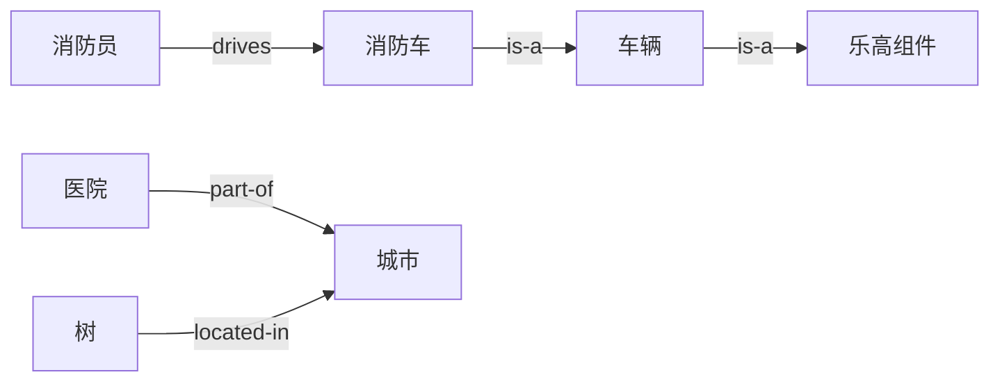
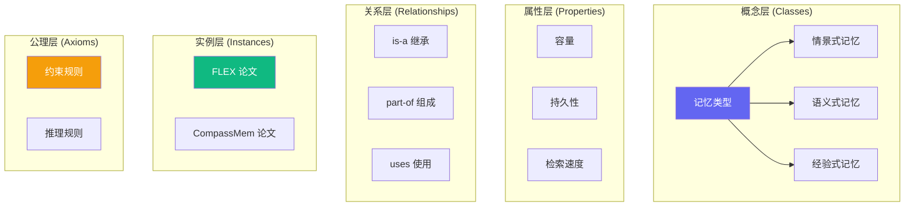
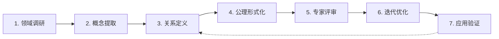

# 本体论入门：给复杂世界画一张地图

> 🗺️ **本体论不是高深哲学，而是人类理解世界的本能方式**

---

## 🌍 从一个故事开始

### 场景：外星人第一次来地球

想象一个外星人 👽 第一次来到地球，它看到：

```
一只金毛犬在公园里追网球
```

外星人很困惑，它的大脑里没有这些概念：
- 什么是"狗"？
- 什么是"公园"？
- 为什么"追"？
- "网球"是什么？

**为了理解这个世界，外星人需要做什么？**

---

### 第一步：分类 (Categorization)

外星人开始观察和分类：

```
🔴 红色的、会跳的东西 → 它叫"球"
🟡 黄色的、有四条腿的、会叫的 → 它叫"狗"
🟢 绿色的、有草的、有树的 → 它叫"公园"
```

**这就是本体论的起点：给事物分类，赋予名称。**

---

### 第二步：建立关系 (Relationships)

外星人继续发现规律：

```
"金毛" 是一种 "狗"
"狗" 是一种 "动物"
"动物" 生活在 "公园"
"狗" 会 "追" "球"
```

**这就是本体论的核心：建立概念之间的关系。**

---

### 第三步：总结规则 (Rules)

外星人进一步抽象出规则：

```
规则 1: 所有的"狗"都是"动物"
规则 2: "动物"可以"移动"
规则 3: "狗"通常会"追""球"
规则 4: "公园"是"公共空间"
```

**这就是本体论的升华：从具体到抽象，形成可推理的规则。**

---

## 🎯 什么是本体论？

### 一句话定义

> **本体论 (Ontology) 是对某个领域中"有哪些东西"以及"它们之间有什么关系"的正式描述。**

### 词源小故事

```
Ontology = Ont + logy
           │     │
           │     └─ 学说、研究
           └─ 存在、是

字面意思："研究存在的学说"
```

**听起来很哲学？其实很实用！**

---

### 日常生活中的本体论

你每天都在用本体论思维，只是没意识到：

| 场景 | 本体论思维 |
|------|-----------|
| 📱 整理手机相册 | 按"人物/地点/事件"分类 |
| 🛒 超市购物 | 按"水果/蔬菜/肉类"分区 |
| 📚 图书馆找书 | 按"文学/科学/历史"分类 |
| 🎵 音乐播放列表 | 按"流行/古典/摇滚"分类 |

**本体论就是人类组织知识的本能方式！**

---

## 🧩 本体论的五个核心概念

让我们用**乐高积木**来理解本体论。

```
想象你在拼一套乐高城市套装 🏙️
```

### 1️⃣ 概念 (Concepts / Classes)

> **"有哪些类型的积木？"**

```
🟦 基础砖块
🚗 车辆
🏠 建筑
👤 人偶
🌳 植物
```

**概念 = 事物的类别**

在 Agent Memory 领域：
```
🧠 记忆类型
📐 记忆结构
⚙️ 记忆操作
🔧 记忆载体
```

---

### 2️⃣ 属性 (Properties)

> **"每种积木有什么特征？"**

```
🟦 基础砖块:
   - 颜色：红/蓝/绿/黄
   - 尺寸：2×2, 4×4, 2×6
   - 材质：塑料

🚗 车辆:
   - 类型：汽车/飞机/船
   - 颜色：多种
   - 是否有轮子：是/否
```

**属性 = 描述事物的特征**

在 Agent Memory 领域：
```
记忆容量：数值 (如 1000 个向量)
检索速度：毫秒级
是否支持遗忘：是/否
```

---

### 3️⃣ 关系 (Relationships)

> **"积木之间如何连接？"**



**关系 = 概念之间的连接方式**

#### 常见关系类型

| 关系 | 符号 | 例子 | 含义 |
|------|------|------|------|
| **继承** | is-a | 金毛 is-a 狗 | "是一种" |
| **组成** | part-of | 轮子 part-of 汽车 | "是...的一部分" |
| **实例** | instance-of | 我的宠物 instance-of 狗 | "是...的一个例子" |
| **关联** | related-to | 医生 related-to 医院 | "与...相关" |

---

### 4️⃣ 实例 (Instances / Individuals)

> **"具体的某一个积木是什么？"**

```
概念：狗
实例：我家的小白、邻居家的阿黄、公园里的金毛

概念：论文
实例：FLEX 论文、CompassMem 论文、MAGMA 论文
```

**实例 = 具体的个体对象**

---

### 5️⃣ 公理 (Axioms)

> **"拼搭时必须遵守的规则"**

```
规则 1: 每辆车必须有轮子 (除非是船)
规则 2: 人偶不能放在封闭空间内 (会窒息)
规则 3: 建筑必须有地基
规则 4: 红色砖块和蓝色砖块可以拼接
```

**公理 = 必须满足的约束条件**

在 Agent Memory 领域：
```
公理 1: 每个记忆系统必须支持至少一种检索操作
公理 2: 工作记忆和长期记忆不能是同一个东西
公理 3: 如果 A 是 B 的子类，B 是 C 的子类，则 A 是 C 的子类
```

---

## 🎨 可视化：本体论的完整图景



---

## 💡 为什么需要本体论？

### 问题场景：没有本体论会怎样？

#### 场景 1：图书馆没有分类系统

```
📚 10 万本书堆在一起，没有任何分类

你："我想找一本关于人工智能的书"
管理员："好的，请自己慢慢找..."

😱 灾难！
```

#### 场景 2：医院没有病历系统

```
🏥 每个医生用自己的方式记录病情

医生 A:"病人有高血压"
医生 B:"患者 BP 偏高"
医生 C:"BP elevated observed"

🤯 混乱！无法交流！
```

#### 场景 3：AI 研究没有统一术语

```
🤖 研究者讨论"记忆"

研究者 A:"我说的是短期缓存"
研究者 B:"我以为你说的是长期存储"
研究者 C:"我理解的是注意力机制"

😵 鸡同鸭讲！
```

---

### 本体论解决的三大问题

| 问题 | 描述 | 本体论方案 |
|------|------|-----------|
| 🗣️ **术语混乱** | 同一概念不同叫法 | 统一定义和命名 |
| 🔗 **关系隐含** | 知识散乱无关联 | 显式建立关系 |
| 🧠 **难以推理** | 无法自动推导新知 | 形式化支持推理 |

---

## 🚀 本体论的超能力

### 超能力 1：共同语言 (Common Vocabulary)

**之前**：
```
研究者 A: "工作记忆"
研究者 B: "短期缓存"  
研究者 C: "注意力缓冲区"

三人其实在说同一个东西！❌
```

**之后**：
```
工作记忆 (Working Memory)
  定义：智能体在当前任务中主动维护的临时信息
  上位概念：记忆类型
  区分于：短期记忆、长期记忆

现在大家都知道在说什么！✅
```

---

### 超能力 2：自动推理 (Automated Reasoning)

**已知事实**：
```
事实 1: 所有"经验式记忆"都支持"增量更新"
事实 2: FLEX 使用"经验式记忆"
```

**自动推理**：
```
结论: FLEX 支持"增量更新" ✅

（系统自动推导，无需人工标注）
```

---

### 超能力 3：多维检索 (Multi-dimensional Search)

**传统搜索**：
```
搜索："记忆 图结构"
结果：1000 篇，需要人工筛选 ❌
```

**本体论搜索**：
```
查询：找出所有满足以下条件的论文
  - 记忆结构 = 图式
  - 模式识别 = 自进化
  - 发表年份 = 2025-2026
  
结果：5 篇，精准匹配 ✅
```

---

### 超能力 4：发现知识空白 (Gap Identification)

**可视化领域版图**：
```
记忆类型分布：
  ✅ 情景式：████████████████████ 25 篇
  ✅ 语义式：██████████████ 18 篇
  ✅ 经验式：████████████ 15 篇
  ❌ 程序式：███ 3 篇  ← 研究空白！

记忆结构分布：
  ✅ 向量式：██████████████████████ 30 篇
  ✅ 图式：███████████████ 20 篇
  ❌ 层次化：████ 5 篇  ← 研究空白！
```

**研究者**："哇！程序式记忆和层次化结构是蓝海！" 🎯

---

## 🏗️ 本体论 vs 其他知识组织方式

### 对比表

| 方式 | 结构化 | 可推理 | 可共享 | 适合场景 |
|------|--------|--------|--------|---------|
| **本体论** | ⭐⭐⭐⭐⭐ | ⭐⭐⭐⭐⭐ | ⭐⭐⭐⭐⭐ | 领域建模、知识图谱 |
| 分类法 (树状) | ⭐⭐⭐ | ⭐⭐ | ⭐⭐⭐ | 简单分类、目录 |
| 关键词 | ⭐ | ❌ | ⭐⭐ | 快速检索 |
| 标签 (Tags) | ⭐ | ❌ | ⭐⭐ | 社交标注 |
| 知识图谱 | ⭐⭐⭐⭐⭐ | ⭐⭐⭐⭐⭐ | ⭐⭐⭐⭐⭐ | 大规模知识系统 |

> 💡 **知识图谱 = 本体论 (骨架) + 实例数据 (血肉)**

---

### 形象比喻

```
分类法 (Taxonomy)     本体论 (Ontology)      知识图谱 (Knowledge Graph)
     │                      │                       │
     ▼                      ▼                       ▼
   树状图                多维网络              超大规模网络
     │                      │                       │
   只能                   可以                   可以
   上下查找              多方向查找            多方向 + 推理
     │                      │                       │
   家谱图                城市地图              全球交通网络
```

---

## 🎓 经典案例：本体论改变世界

### 案例 1：Gene Ontology (GO) 🧬

**领域**：生物学基因功能

**问题**：
```
1990 年代，不同实验室用不同术语描述基因功能
"细胞分裂" vs "有丝分裂" vs "cell division"
研究者无法有效交流！
```

**解决方案**：
```
1998 年，Gene Ontology 联盟成立
建立统一的基因功能本体
```

**成果**：
- 📊 40,000+ 概念
- 🌍 全球生物学家都在用
- 📈 50,000+ 论文引用
- 💊 加速药物研发

---

### 案例 2：SNOMED CT 🏥

**领域**：医学临床术语

**问题**：
```
不同医院用不同代码记录病情
"高血压" = ICD-9:401 vs SNOMED:38341003
无法跨医院共享病历！
```

**解决方案**：
```
建立统一的医学术语本体
```

**成果**：
- 📊 350,000+ 医学概念
- 🌍 50+ 国家采用
- 🏥 电子病历系统标准
- 💉 拯救生命

---

### 案例 3：DBpedia / Wikidata 🌐

**领域**：通用知识

**问题**：
```
Wikipedia 有海量知识，但是非结构化的文本
计算机无法理解"奥巴马是美国总统"这样的信息
```

**解决方案**：
```
从 Wikipedia 提取结构化知识
建立通用领域本体
```

**成果**：
- 📊 数百万实体
- 🔗 链接开放数据 (LOD) 核心
- 🤖 AI 训练数据源
- 🌍 多语言支持

---

## 🧭 如何构建领域本体？

### 七步法 (The 7-Step Method)



---

### 步骤 1：领域调研 📚

**目标**：理解领域全貌

**方法**：
```
1. 阅读核心论文 (50-100 篇)
2. 采访领域专家 (3-5 人)
3. 收集高频术语
4. 识别核心问题
```

**产出**：
- 术语列表 (100+ 个)
- 核心问题清单
- 关键论文列表

---

### 步骤 2：概念提取 🔍

**目标**：从术语中提炼概念

**方法**：
```
1. 合并同义词 (如"工作记忆"="短期缓存")
2. 去除冗余概念
3. 形成层次结构
4. 定义每个概念
```

**示例**：
```
原始术语：工作记忆、短期缓存、注意力缓冲区、WM
      ↓ 合并
统一概念：工作记忆 (Working Memory)
定义：智能体在当前任务中主动维护的临时信息
上位概念：记忆类型
下位概念：无
```

---

### 步骤 3：关系定义 🔗

**目标**：建立概念间的连接

**方法**：
```
1. 识别继承关系 (is-a)
2. 识别组成关系 (part-of)
3. 识别关联关系 (related-to)
4. 绘制关系图
```

**示例**：
```
情景式记忆 is-a 记忆类型
海马体 part-of 记忆系统
检索 related-to 存储
```

---

### 步骤 4：公理形式化 📐

**目标**：定义约束和推理规则

**方法**：
```
1. 列出领域约束
2. 形式化为逻辑规则
3. 验证一致性
```

**示例**：
```
公理 1: 每个记忆系统必须至少支持一种检索操作
公理 2: 工作记忆不能同时是长期记忆
公理 3: 如果 A is-a B 且 B is-a C，则 A is-a C
```

---

### 步骤 5：专家评审 👨‍🏫

**目标**：确保本体质量

**方法**：
```
1. 邀请 3-5 位领域专家
2. 审查概念定义
3. 检查关系完整性
4. 收集反馈意见
```

**关键问题**：
- 有没有遗漏重要概念？
- 定义是否准确？
- 关系是否合理？

---

### 步骤 6：迭代优化 🔄

**目标**：持续改进

**方法**：
```
1. 根据反馈修改
2. 添加新概念
3. 调整关系
4. 保持向后兼容
```

**原则**：
- 小步迭代
- 版本管理
- 变更日志

---

### 步骤 7：应用验证 ✅

**目标**：检验实用性

**方法**：
```
1. 用本体标注实际数据
2. 开发查询和检索功能
3. 收集用户反馈
4. 持续优化
```

**成功标准**：
- 用户觉得有用
- 能够支持推理
- 可以跨系统共享

---

## 🛠️ 本体论工具推荐

### 编辑工具

| 工具 | 类型 | 特点 |
|------|------|------|
| **Protégé** | 桌面应用 | 最流行，功能强大 |
| **WebProtégé** | 在线 | 协作友好，免安装 |
| **TopBraid** | 商业 | 企业级功能 |

### 学习资源

| 资源 | 类型 | 链接 |
|------|------|------|
| **Ontology 101** | 教程 | 经典入门 |
| **W3C OWL 指南** | 标准 | 官方文档 |
| **Handbook on Ontologies** | 书籍 | 权威参考 |

---

## 🚀 本体论的未来

### 与大模型结合 🤖

```
传统本体论          +         大语言模型
    │                       │
    ▼                       ▼
结构化、可推理         灵活、泛化强
    │                       │
    └──────────┬────────────┘
               ▼
      神经符号系统 (Neuro-Symbolic)
```

**应用方向**：
- 🎯 本体引导的 RAG 检索
- 💬 基于本体的提示工程
- 🧠 本体增强的推理能力

---

### 动态本体 🌱

**传统本体**：
```
人工构建 → 发布 → 静态不变
问题：无法跟上领域发展
```

**动态本体**：
```
自动学习 → 持续演化 → 自我更新
方法：从新论文中自动提取概念和关系
```

**示例**：
```
新论文发表 → 系统自动识别新概念 → 建议添加到本体 → 专家审核 → 本体更新
```

---

## 💡 总结：本体论的本质

### 一句话总结

> **本体论是给复杂世界画一张地图，让我们能够：**
> - 🗣️ **用共同语言交流**
> - 🧠 **理解事物的本质**
> - 🔗 **发现隐藏的关系**
> - 🚀 **自动推理新知识**

---

### 核心要点回顾

| 概念 | 一句话 |
|------|--------|
| **什么是本体论** | 对领域中"有什么"和"有什么关系"的正式描述 |
| **五个核心** | 概念、属性、关系、实例、公理 |
| **三大价值** | 共同语言、自动推理、发现空白 |
| **构建方法** | 七步法：调研→提取→定义→形式化→评审→优化→验证 |

---

### 最后的思考

**本体论不是目的，而是手段。**

它的价值不在于构建一个完美的理论体系，而在于：
- 帮助我们**更好地理解领域**
- 让知识**更容易被复用**
- 使机器**能够理解和推理**

正如地图不是领土本身，但没有地图，我们会迷路。

---

<div align="center">

**🗺️ 现在你有了地图，开始探索吧！**

[📄 返回本体目录](./) · [🧠 查看 7 维度模型](AGENT_MEMORY_ONTOLOGY.md) · [📚 浏览论文](../papers/)

</div>
