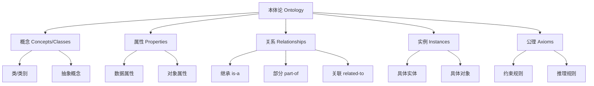
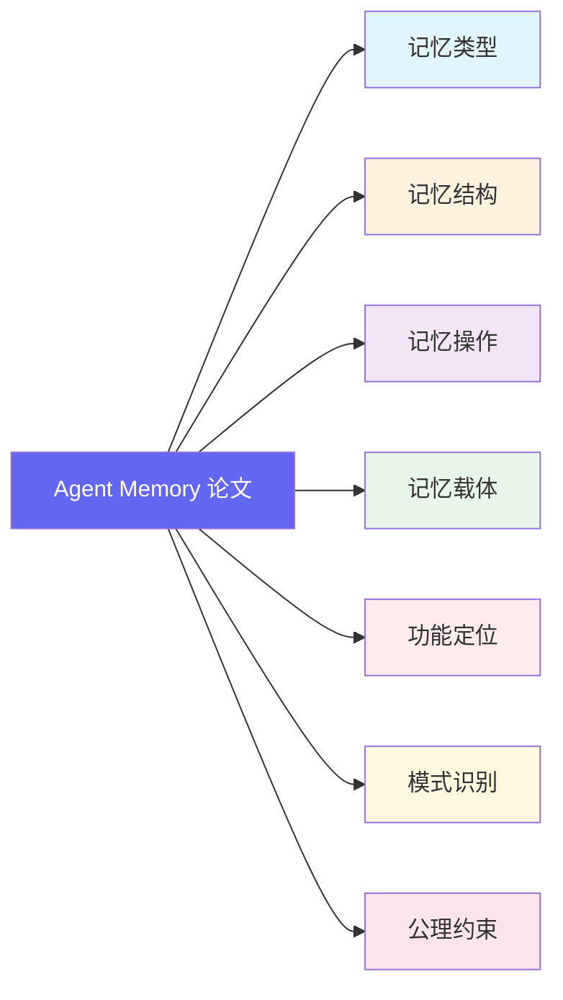
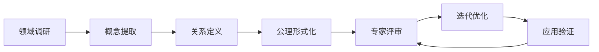

# 本体论入门：为什么它是领域建模的最佳工具

> 🧠 **理解本体论，掌握知识组织的底层逻辑**

---

## 📖 什么是本体论 (Ontology)？

### 词源与定义

**本体论 (Ontology)** 一词源自希腊语：
- **ὄν (ón)** = 存在、是
- **λόγος (lógos)** = 学说、研究

**哲学定义**：研究"存在"的本质及其分类的哲学分支。

**计算机科学定义**：
> **本体论是对特定领域中概念、实体及其关系的正式表示和规范化描述。**

---

## 🏗️ 本体论的核心组成



### 1️⃣ 概念 (Concepts / Classes)

领域中的**核心类别**或**抽象集合**。

**示例 (Agent Memory 领域)**：
- `记忆类型`
- `记忆结构`
- `记忆操作`
- `智能体`
- `检索机制`

### 2️⃣ 属性 (Properties)

描述概念或实例的**特征**。

**示例**：
- `记忆容量` (数值属性)
- `检索速度` (数值属性)
- `是否可遗忘` (布尔属性)
- `创建时间` (时间属性)

### 3️⃣ 关系 (Relationships)

概念之间的**关联方式**。

| 关系类型 | 符号 | 示例 |
|---------|------|------|
| 继承 | is-a | `情景记忆` **is-a** `记忆类型` |
| 部分 | part-of | `检索模块` **part-of** `记忆系统` |
| 实例 | instance-of | `FLEX 论文` **instance-of** `经验式记忆研究` |
| 关联 | related-to | `检索` **related-to** `存储` |

### 4️⃣ 实例 (Instances / Individuals)

概念的**具体对象**。

**示例**：
- `FLEX 论文` 是 `经验式记忆` 的实例
- `CompassMem` 是 `图式结构` 的实例

### 5️⃣ 公理 (Axioms)

领域的**基本约束和推理规则**。

**示例**：
- "每个记忆系统必须至少支持一种检索操作"
- "工作记忆不能同时是长期记忆"
- "如果 A is-a B 且 B is-a C，则 A is-a C"

---

## 🎯 为什么本体论适合领域建模？

### 优势对比

| 传统方式 | 本体论方式 |
|---------|-----------|
| ❌ 松散的概念列表 | ✅ 结构化的概念网络 |
| ❌ 隐含的关系 | ✅ 显式的关系定义 |
| ❌ 歧义的术语 | ✅ 精确的语义定义 |
| ❌ 难以推理 | ✅ 支持自动推理 |
| ❌ 难以复用 | ✅ 标准化，可共享 |

---

### 1️⃣ **提供共同语言 (Common Vocabulary)**

本体论为领域专家建立**统一的术语体系**，消除歧义。

**问题场景**：
> 研究者 A 说"工作记忆"，研究者 B 理解为"短期缓存"，但实际指的是"注意力机制"。

**本体论解决**：
```
工作记忆 (Working Memory)
  定义：智能体在当前任务中主动维护的临时信息
  上位概念：记忆类型
  相关概念：注意力、上下文窗口
  区分于：短期记忆 (Short-term Memory)
```

---

### 2️⃣ **显式化隐含知识 (Explicit Knowledge)**

将领域专家的**隐性知识**转化为**显式结构**。

**示例**：
```
隐性知识："检索增强方法通常用外部数据库"

本体论表示：
  [检索增强 RAG] --uses--> [外部数据库]
  [检索增强 RAG] --is-a--> [模式识别]
```

---

### 3️⃣ **支持自动推理 (Automated Reasoning)**

基于本体论可以进行**逻辑推理**，发现新知识。

**推理示例**：
```
已知：
  规则 1: 所有"经验式记忆"都支持"增量更新"
  规则 2: FLEX 使用"经验式记忆"

推理：
  → FLEX 支持"增量更新"
```

---

### 4️⃣ **促进知识复用 (Knowledge Reuse)**

本体论是**标准化的**，可以被不同系统复用。

**复用场景**：
- 不同研究团队使用同一本体标注论文
- 跨项目的知识图谱可以合并
- 机器学习模型可以学习本体嵌入

---

### 5️⃣ **支持多维检索 (Multi-dimensional Search)**

基于本体的标注支持**复杂的查询和筛选**。

**查询示例**：
```sparql
# 找出所有使用图结构且支持自进化的论文
SELECT ?paper WHERE {
  ?paper ontology:memoryStructure ontology:Graph .
  ?paper ontology:pattern ontology:SelfEvolving .
}
```

---

### 6️⃣ **发现知识空白 (Gap Identification)**

通过本体论可以**可视化领域版图**，发现研究空白。

**示例分析**：
```
记忆类型分布：
  ✅ 情景式：25 篇
  ✅ 语义式：18 篇
  ✅ 经验式：15 篇
  ❌ 程序式：3 篇  ← 研究空白！

记忆结构分布：
  ✅ 向量式：30 篇
  ✅ 图式：20 篇
  ❌ 层次化：5 篇  ← 研究空白！
```

---

## 🧩 本体论在 Agent Memory 领域的应用

### 我们的 7 维度本体模型



### 标注示例：FLEX 论文

```json
{
  "paper": "FLEX (2025)",
  "ontology_annotation": {
    "记忆类型": ["经验式", "程序式"],
    "记忆结构": ["层次化", "图式"],
    "记忆操作": ["形成", "进化", "检索"],
    "记忆载体": ["Token 级", "外部数据库"],
    "功能定位": ["学习", "推理"],
    "模式识别": ["经验驱动", "自进化"],
    "公理约束": ["稳定性 - 可塑性", "泛化性"]
  }
}
```

### 通过本体论发现的洞见

**分析 49 篇论文后**：

| 发现 | 说明 |
|------|------|
| 🔥 **经验式记忆**是 2025-2026 热点 | 15 篇论文聚焦 |
| 📈 **图式结构**增长最快 | 从 2024 年 5 篇→2026 年 18 篇 |
| ⚠️ **程序式记忆**研究不足 | 仅 3 篇，潜在空白 |
| 🎯 **自进化模式**是高评分特征 | 平均评分 4.6 vs 整体 4.2 |

---

## 🛠️ 如何构建领域本体？

### 构建流程



### 1. 领域调研
- 阅读核心论文 (50-100 篇)
- 识别高频术语
- 收集团队行话

### 2. 概念提取
- 提取候选概念 (100+ 个)
- 去重和合并
- 形成概念层次

### 3. 关系定义
- 定义继承关系 (is-a)
- 定义组成关系 (part-of)
- 定义关联关系 (related-to)

### 4. 公理形式化
- 形式化约束规则
- 定义推理规则
- 验证一致性

### 5. 专家评审
- 领域专家审查
- 发现遗漏和错误
- 收集反馈

### 6. 迭代优化
- 根据反馈修改
- 扩展新概念
- 保持向后兼容

### 7. 应用验证
- 实际标注论文
- 检验可用性
- 持续改进

---

## 📊 本体论 vs 其他知识组织方式

| 方式 | 结构化 | 可推理 | 可共享 | 适合场景 |
|------|--------|--------|--------|---------|
| **本体论** | ⭐⭐⭐⭐⭐ | ⭐⭐⭐⭐⭐ | ⭐⭐⭐⭐⭐ | 领域建模、知识图谱 |
| 分类法 (Taxonomy) | ⭐⭐⭐ | ⭐⭐ | ⭐⭐⭐ | 简单分类、目录 |
| 关键词 (Keywords) | ⭐ | ❌ | ⭐⭐ | 快速检索 |
| 标签 (Tags) | ⭐ | ❌ | ⭐⭐ | 社交标注 |
| 知识图谱 | ⭐⭐⭐⭐⭐ | ⭐⭐⭐⭐⭐ | ⭐⭐⭐⭐⭐ | 大规模知识系统 |

> 💡 **知识图谱 = 本体论 + 实例数据**

---

## 🎓 本体论的经典案例

### 1. Gene Ontology (GO)
- **领域**：生物学基因功能
- **规模**：40,000+ 概念
- **影响**：生物学研究标准工具
- **引用**：50,000+ 论文

### 2. SNOMED CT
- **领域**：医学临床术语
- **规模**：350,000+ 概念
- **应用**：全球电子病历系统

### 3. DBpedia / YAGO
- **领域**：通用知识
- **规模**：数百万实体
- **来源**：Wikipedia 结构化

### 4. Agent Memory Ontology (本仓库)
- **领域**：智能体记忆
- **规模**：120+ 概念 (v1.0)
- **目标**：领域研究标准标注

---

## 🚀 本体论的未来

### 与大模型结合

```
传统本体论          +         大语言模型
    ↓                           ↓
结构化、可推理              灵活、泛化强
    ↓                           ↓
        = 神经符号系统 (Neuro-Symbolic)
```

**应用方向**：
- 本体引导的 RAG 检索
- 基于本体的提示工程
- 本体增强的推理能力

### 动态本体

- **传统**：静态、人工维护
- **未来**：动态、自动演化
- **示例**：根据新论文自动扩展本体概念

---

## 📚 学习资源

### 入门
- [Ontology 101](https://protege.stanford.edu/publications/ontology_development/ontology101.pdf) - 经典教程
- [W3C OWL 指南](https://www.w3.org/TR/owl2-overview/) - 本体语言标准

### 工具
- [Protégé](https://protege.stanford.edu/) - 本体编辑工具
- [WebProtege](https://webprotege.stanford.edu/) - 在线版本

### 进阶
- [Handbook on Ontologies](https://link.springer.com/book/10.1007/978-3-540-92673-3) - 权威手册
- [Ontology Engineering](https://www.morganclaypool.com/doi/10.2200/S00694ED1V01Y201601AIM033) - 工程实践

---

## 💡 总结

### 本体论的核心价值

| 维度 | 价值 |
|------|------|
| 🎯 **认知** | 理解领域的本质结构 |
| 🗣️ **沟通** | 建立共同语言，消除歧义 |
| 🧮 **计算** | 支持自动推理和查询 |
| 🔄 **复用** | 标准化，可跨系统共享 |
| 📊 **分析** | 发现知识空白和趋势 |

### 为什么选择本体论？

> **"本体论不是目的，而是理解复杂领域的透镜。"**

在 Agent Memory 这个快速发展的领域，本体论帮助我们：
1. **理清概念** - 什么是记忆？有哪些类型？
2. **建立联系** - 不同方法之间的关系是什么？
3. **发现模式** - 哪些设计选择经常一起出现？
4. **预测趋势** - 领域正在向哪个方向发展？

---

<div align="center">

**🗺️ 本体论是探索知识版图的地图和罗盘**

[📄 返回本体目录](./) · [🧠 查看 7 维度模型](AGENT_MEMORY_ONTOLOGY.md) · [📚 浏览论文](../papers/)

</div>
