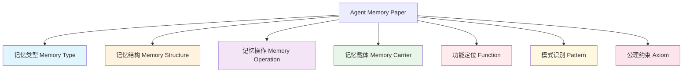

# Agent Memory Ontology v1.2

**版本**: v1.2 (2026-03-19)  
**更新**: 基于第 1 批次 10 篇论文分析优化  
**变更**: 新增 2 个操作、3 个模式、1 个公理

## 🧠 本体论概述

本本体模型用于系统化标注和分析**智能体记忆 (Agent Memory)** 领域的研究论文。

### 设计原则

1. **正交性** - 各维度相互独立，避免重叠
2. **完备性** - 覆盖领域核心概念
3. **可扩展** - 支持新概念动态添加
4. **可计算** - 机器可读，支持推理

---

## 📐 7 维度本体模型



---

## 1️⃣ 记忆类型 (Memory Type)

记忆的本质分类，回答"**是什么类型的记忆**"

| 类型 | 英文 | 说明 | 代表论文 |
|------|------|------|---------|
| 情景式 | Episodic | 具体事件/经历的记忆 | CompassMem, MemGPT |
| 程序式 | Procedural | 技能/操作程序的记忆 | Memp |
| 语义式 | Semantic | 事实/概念知识的记忆 | MemoryBank |
| 经验式 | Experiential | 交互中积累的经验 | FLEX, ELL |
| 工作式 | Working | 短期任务相关记忆 | MemTool |
| 长期式 | Long-term | 持久化存储的记忆 | HippoRAG |

---

## 2️⃣ 记忆结构 (Memory Structure)

记忆的组织形式，回答"**如何组织记忆**"

| 结构 | 英文 | 说明 | 优势 |
|------|------|------|------|
| 向量式 | Vector | 嵌入向量表示 | 高效相似度检索 |
| 图式 | Graph | 节点 - 边关系网络 | 捕捉复杂关联 |
| 层次化 | Hierarchical | 多层抽象结构 | 支持不同粒度 |
| 序列式 | Sequential | 时间顺序排列 | 保留时序信息 |
| 混合式 | Hybrid | 多种结构组合 | 灵活性高 |
| 键值式 | Key-Value | 离散键值对 | 精确检索 |

---

## 3️⃣ 记忆操作 (Memory Operation)

记忆系统的核心操作，回答"**对记忆做什么**"

| 操作 | 英文 | 说明 | 关键技术 | 代表论文 |
|------|------|------|------|---------|
| **编码** | Encoding | 将信息转化为记忆 | 向量化/结构化 | MemoryBank |
| **存储** | Storage | 持久化保存 | 数据库/文件系统 | MemGPT |
| **检索** | Retrieval | 按需提取记忆 | 相似度搜索/图遍历 | HippoRAG |
| **更新** | Update | 修改现有记忆 | 增量学习/覆盖 | O-Mem |
| **遗忘** | Forgetting | 主动删除记忆 | 遗忘曲线/重要性筛选 | MOOM |
| **整合** | Consolidation | 记忆重组优化 | 聚类/摘要 | Memoria |
| **反思** | Reflection | 基于记忆的元认知 | 自我评估/规划 | Reflexion |
| **形成** | Formation | 从交互中产生新经验 | 经验蒸馏 | **FLEX** |
| **进化** | Evolution | 经验库的自我完善 | 选择性合并 | **FLEX**, MemEvolve |
| **蒸馏** | Distillation | 从具体经验抽象通用规则 | 模式提取 | **FLEX**, DreamGym |

---

## 4️⃣ 记忆载体 (Memory Carrier)

记忆的物理/逻辑载体，回答"**记忆存储在哪里**"

| 载体 | 英文 | 说明 | 示例 |
|------|------|------|------|
| Token 级 | Token-level | LLM 上下文窗口 | 对话历史 |
| 隐藏状态 | Hidden State | 模型内部表示 | RNN/LSTM 状态 |
| 参数级 | Parametric | 模型权重本身 | 微调后的模型 |
| 外部数据库 | External DB | 独立存储系统 | 向量数据库 |
| 文件系统 | File System | 文件形式存储 | JSON/文本文件 |
| 混合载体 | Hybrid | 多种载体组合 | 上下文 + 外部 DB |

---

## 5️⃣ 功能定位 (Function)

记忆在智能体中的角色，回答"**记忆用来做什么**"

| 功能 | 英文 | 说明 | 应用场景 |
|------|------|------|---------|
| 规划 | Planning | 支持任务规划 | 长期任务分解 |
| 推理 | Reasoning | 支持逻辑推理 | 多跳问答 |
| 对话 | Dialogue | 支持连贯对话 | 个性化助手 |
| 学习 | Learning | 支持持续学习 | 技能积累 |
| 决策 | Decision | 支持决策制定 | 游戏/机器人 |
| 生成 | Generation | 支持内容生成 | 写作/创作 |

---

## 6️⃣ 模式识别 (Pattern)

设计范式识别，回答"**采用什么设计模式**"

| 模式 | 英文 | 说明 | 代表工作 | 关键特征 |
|------|------|------|---------|---------|
| **检索增强** | RAG | 检索 + 生成 | 标准 RAG 架构 | 静态知识库 |
| **反思** | Reflection | 自我反思改进 | Reflexion | 单轮自我评估 |
| **自进化** | Self-evolving | 系统自主进化 | ReasoningBank | 持续积累 |
| **经验驱动** | Experience-driven | 基于经验学习 | **FLEX**, DreamGym | 成功/失败对比 |
| **前向学习** | Forward-learning | 无需梯度的学习 | **FLEX** | 仅前向传播 |
| **Actor-Critic** | Actor-Critic | 探索 + 评估协作 | **FLEX** | 双代理模式 |
| **Meta-MDP** | Meta-MDP | 双层优化框架 | **FLEX** | 元级控制 |
| **经验继承** | Experience-inheritance | 跨模型知识迁移 | **FLEX** | 即插即用 |
| **多智能体** | Multi-agent | 多智能体协作 | RCR-Router | 角色分工 |
| **模块化** | Modular | 功能模块分离 | Nemosine | 解耦设计 |
| **OS 启发** | OS-inspired | 操作系统式设计 | MemGPT, EverMemOS | 虚拟内存管理 |

---

## 7️⃣ 公理约束 (Axiom)

底层原则约束，回答"**遵循什么基本原则**"

| 公理 | 英文 | 说明 | 可验证判据 | 代表论文 |
|------|------|------|-----------|---------|
| **稳定性 - 可塑性** | Stability-Plasticity | 保持旧知 vs 学习新知 | 无灾难性遗忘 + 新知识整合 | **FLEX**, O-Mem |
| **泛化性** | Generalization | 从具体到一般 | 跨模型/跨任务迁移有效 | **FLEX** (+6.7~16.7%) |
| **缩放性** | Scaling | 性能随规模可预测提升 | 经验库规模→性能幂律关系 | **FLEX** |
| **效率** | Efficiency | 计算/存储效率 | token 使用/推理时间优化 | MemTool, MOOM |
| **可解释性** | Interpretability | 记忆可理解 | 显式文本/可视化 | FLEX, MemGPT |
| **一致性** | Consistency | 记忆间无矛盾 | 冲突检测/解决机制 | Memoria |
| **时序性** | Temporality | 时间关系保持 | 时序推理正确 | CompassMem |

---

## 📊 本体使用示例

### 论文标注示例 (FLEX)

```json
{
  "paper_id": "2511.06449",
  "title": "Continuous Agent Evolution via Forward Learning from Experience",
  "ontology": {
    "memory_type": ["Experiential", "Procedural"],
    "memory_structure": ["Hierarchical", "Graph"],
    "memory_operation": ["Formation", "Evolution", "Retrieval"],
    "memory_carrier": ["Token-level", "External DB"],
    "function": ["Learning", "Reasoning"],
    "patterns": ["Experience-driven", "Self-evolving"],
    "axioms": ["Stability-Plasticity", "Generalization"]
  }
}
```

### 本体查询示例

```sparql
# 查询所有使用图结构的论文
SELECT ?paper WHERE {
  ?paper ontology:memoryStructure ontology:Graph .
}

# 查询支持自进化模式的论文
SELECT ?paper WHERE {
  ?paper ontology:pattern ontology:SelfEvolving .
}
```

---

## 🔄 本体演进

| 版本 | 日期 | 变更 |
|------|------|------|
| v1.0 | 2026-03-19 | 初始版本，7 维度模型 |
| ... | ... | ... |

### 演进原则

1. **向后兼容** - 新增概念不破坏旧标注
2. **社区驱动** - 基于论文分析需求扩展
3. **文档化** - 每次变更记录日志

---

## 📚 参考文献

- [Memory in the Age of AI Agents (Survey)](../papers/2025/12_2025-12_MemorySurvey/)
- [HippoRAG: Neurobiologically Inspired Long-Term Memory](../papers/2024/05_2024-05_HippoRAG/)
- [MemGPT: Towards LLMs as Operating Systems](../papers/2023/10_2023-10_MemGPT/)

---

<div align="center">

**本体论是探索记忆领域版图的语言**

[📄 返回主页](../README.md)

</div>
