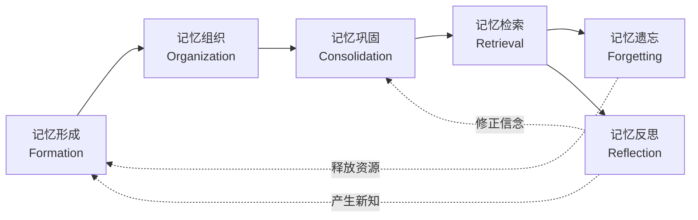

# Agent Memory 领域本体论 v1.1

## 一、本体论核心基础

Agent Memory 本体论旨在为 Agent Memory 领域建立一个统一的概念框架。该框架采用"三维正交分类 + 类层级"双轨架构：三维正交分类提供概念的坐标空间，类层级提供概念的语义归属。两者正交共存，确保每个概念既有明确的语义定位，又可在多维空间中被精确定位。

### 1.1 三维正交分类

每个记忆概念由三个维度的坐标唯一确定。三个维度相互正交——同一概念可在不同维度上同时拥有坐标值。

**载体维度（Carrier）** 定义记忆的物质承载形式：

| 载体类型 | 说明 | 典型实例 |
|----------|------|----------|
| Token-level（标记级） | 以文本令牌为载体的短期记忆 | 上下文窗口、Prompt 序列、滑动窗口 |
| Parametric（参数） | 以模型权重为载体的内化记忆 | LoRA 适配器、微调参数、MLP 记忆模块 |
| External（外部） | 以外部存储为载体的持久记忆 | 向量数据库、知识图谱、Memory Bank |
| Latent（隐式） | 以隐式表示为载体的记忆 | 隐状态、潜在表征、注意力模式 |

**功能维度（Function）** 定义记忆的认知功能定位：

| 功能类型 | 认知定位 | 典型实例 |
|----------|----------|----------|
| Factual（事实） | 离散客观信息 | 用户偏好、世界常识、结构化事实 |
| Semantic（语义） | 概念关联与知识网络 | 知识图谱、语义锚点、概念层级 |
| Episodic（情景） | 交互事件与时间线索 | 对话历史、交互轨迹、事件图 |
| Procedural（程序） | 可执行技能与操作流程 | 工具调用序列、API 技能、SOP |
| Experiential（经验） | 成功/失败轨迹与迁移知识 | 跨域经验、反馈诊断、启发式策略 |
| Working（工作） | 即时认知工作区 | 动态上下文、活跃推理链 |
| Reflection（反思） | 元认知与自我觉察 | 反思经验、演化信念、自我模型 |

**动态维度（Dynamic）** 定义记忆的生命周期操作：

| 操作类型 | 生命周期阶段 | 典型实例 |
|----------|----------|----------|
| Formation（形成） | 记忆创建与编码 | MEM_WRITE、门控写入、惊喜度编码 |
| Retrieval（检索） | 信息召回与匹配 | 语义检索、相似度匹配、层次检索 |
| Evolution（演化） | 知识更新与整合 | Memory Update、知识融合、增量编辑 |
| Forgetting（遗忘） | 低价值记忆淘汰 | 时间衰减、LFU 淘汰、记忆修剪 |
| Reflection（反思） | 元层次评估与重构 | 反思生成、夜间自评、洞察提取 |
| Association（关联） | 跨记忆关联建立 | 上下文集成、关系感知链接 |

### 1.2 顶层核心类（8 个）

本体论的类层级以 8 个顶层类为根节点，覆盖 Agent Memory 系统的完整语义空间：

| 顶层类 | 核心定位 | 职责范围 |
|--------|---------|---------|
| Agent | 记忆主体 | 记忆的拥有者与使用者，执行记忆操作 |
| Memory | 记忆载体 | 记忆的承载实体（含参数/外部/Token 等形式） |
| MemorySystem | 记忆管理架构 | 记忆的组织、协调与调度基础设施 |
| MemoryEvent | 记忆触发源 | 引发记忆操作的内部或外部事件 |
| MemoryOperation | 记忆操作行为 | 对记忆执行的写入、检索、更新、遗忘等操作 |
| Context | 记忆关联场景 | 记忆操作发生的环境与上下文约束 |
| Entity | 记忆关联对象 | 记忆内容涉及的对象与关系 |
| Policy | 记忆操作规则 | 控制记忆行为的安全策略与访问规则 |

### 1.3 核心原则

- **语义唯一性**：每个概念在模型中具有唯一的语义标识，同名概念必须归并
- **正交独立性**：三个维度相互独立——载体变化不改变功能，功能变化不改变载体
- **层级清晰性**：类→子类层级与三维分类正交共存，概念可同时具有类归属和坐标值
- **工程适配性**：概念设计兼顾理论完整性与工程可实现性，避免纯理论构造
- **可扩展性**：新增概念可归入现有维度或触发维度扩展，模型保持开放
- **闭环完整性**：记忆生命周期形成闭环（形成→组织→巩固→检索→遗忘→反思→形成）

---

## 二、核心公理体系

公理是本体论中不可再分的断言，构成领域模型的推理基础。以下公理从 Agent Memory 领域的结构性规律中归纳得出。

### 2.1 存在公理

- **载体必要性**：每个记忆实例必须占据至少一个载体维度位置（Token-level/Parametric/External/Latent），不存在无载体的记忆
- **事件依赖性**：没有无来源的记忆——每条记忆必须关联至少一个 MemoryEvent（用户输入、系统输出、环境信号等）
- **多维共存**：一个记忆实例可同时具有多个维度的坐标值（如 External 载体 + Factual 功能 + Retrieval 操作）

### 2.2 操作公理

- **索引约束**：任何 MemoryRetrieval 操作必须有对应的 Index 结构支撑，无索引即无法检索
- **遗忘不可逆**：MemoryForgetting 操作不产生可恢复的记忆副本，遗忘是单向的信息损失过程
- **反思增量性**：MemoryReflection 操作必然产生至少一个新增概念实例——反思不只是回顾，而是知识生成
- **操作闭合性**：所有 MemoryOperation 的输入和输出均在本体论定义的类空间内，不存在域外操作

### 2.3 质量公理

- **质量三元组**：记忆质量是新鲜度（Freshness）、一致性（Consistency）与置信度（Confidence）的函数，三者缺一不可
- **属性非独立**：质量维度作为 Memory 的属性而非独立类存在——质量内生于记忆实例
- **时效衰减律**：记忆的新鲜度随时间单调递减，除非通过检索或巩固操作刷新

### 2.4 安全公理

- **风险正比律**：记忆检索深度与隐私泄露风险正相关——检索越深，暴露越多
- **攻击面差异**：格式化检索（基于关键词/模板）比语义检索更易受提示词操纵攻击
- **隔离必要性**：敏感记忆操作必须在安全沙箱中执行，防止记忆内容被未授权访问

### 2.5 演进公理

- **使用强化律**：记忆随使用而强化——accessCount 增加导致 importance 增加，频繁访问的记忆更持久
- **时间衰减律**：记忆随时间而衰减——长期未访问的记忆 importance 递减，直至触发遗忘
- **最小扰动原则**：记忆编辑（如 Knowledge Editing）应遵循最小权重变更原则，避免灾难性遗忘
- **一致性优先**：当新旧记忆冲突时，系统应优先维护全局一致性而非局部精确性

---

## 三、概念分布总览

本领域本体论共收录 **1092** 个唯一概念，分布在三维分类体系的 33 个子类别中。以下展示各维度的概念分布——完整概念枚举见 [lexicon.json](./lexicon.json)。

### 3.1 形式维度 (Forms) — 322 个概念

| 子类 | 数量 | 占比 | 代表结构 |
|------|------|------|----------|
| Memory Storage | 78 | 24% | Memory Stream, 混合记忆架构, Hierarchical Memory Storage |
| Other Structure | 115 | 36% | 各种实现相关的辅助结构 |
| Graph/Tree Structure | 44 | 14% | 知识三元组, Directed Weighted Graph, Hierarchical Aggregate Tree |
| Context Window | 23 | 7% | 滑动窗口上下文, Prompt Context, Token Sequence |
| Index Structure | 16 | 5% | Vector Index, FAISS, Self-Generated Graph Index |
| Architecture/Framework | 14 | 4% | 分层交互系统, Agent Foundation Model |
| Network Layer/State | 12 | 4% | Finite State Machine, Shared State Space |
| Vector/Embedding | 11 | 3% | Patch Embedding, Vector Database Storage |
| Buffer/Pool | 9 | 3% | Replay Buffer, Experience Pool, STM Buffer |

形式维度中，Memory Storage（24%）和 Other Structure（36%）占主导，说明领域仍在探索多样化的结构化表示方式。

### 3.2 功能维度 (Functions) — 325 个概念

| 子类 | 数量 | 占比 | 认知定位 |
|------|------|------|----------|
| Other Memory Type | 233 | 72% | 领域专用记忆类型（用户画像、对话记忆等） |
| Long-Term Memory | 16 | 5% | 跨会话持久存储 |
| Semantic Memory | 13 | 4% | 概念关联与知识网络 |
| Episodic Memory | 9 | 3% | 交互事件与时间线索 |
| Procedural Memory | 9 | 3% | 可执行技能与操作流程 |
| Experiential Memory | 8 | 3% | 成功/失败轨迹经验 |
| Short-Term Memory | 8 | 3% | 近期操作与感知保留 |
| Working Memory | 7 | 2% | 即时认知工作区 |
| Parametric Memory | 7 | 2% | 权重嵌入的知识 |
| Factual Memory | 5 | 2% | 离散客观信息 |
| Sensory Memory | 4 | 1% | 原始感知瞬时保留 |
| Retrieval Memory | 4 | 1% | 检索增强记忆 |
| Reflection Memory | 2 | <1% | 元认知与自我觉察 |

功能维度中，Other Memory Type（72%）占绝对多数，反映领域在通用记忆类型之上涌现了大量场景化、领域化的记忆子类。

### 3.3 动态维度 (Dynamics) — 445 个概念

| 子类 | 数量 | 占比 | 生命周期阶段 |
|------|------|------|----------|
| Other Operation | 228 | 51% | 各种实现相关的辅助操作 |
| Retrieval | 79 | 18% | 记忆召回（领域最密集的操作） |
| Summarization | 33 | 7% | 信息压缩与知识提取 |
| Evolution (Update) | 42 | 9% | 知识更新与整合 |
| Reflection | 15 | 3% | 元层次评估与重构 |
| Formation (Store/Write) | 16 | 4% | 记忆创建与编码 |
| Forgetting | 10 | 2% | 低价值记忆淘汰 |
| Association | 8 | 2% | 跨记忆关联建立 |
| Scoring/Ranking | 6 | 1% | 价值评估与排序 |
| Learning | 6 | 1% | 参数化知识协同进化 |
| Deduplication | 2 | <1% | 语义去重 |

动态维度中，Retrieval（18%）和 Other Operation（51%）占据主导——检索是 Agent Memory 系统中最受关注的操作类型，而大量"其他操作"反映了领域在操作语义上尚未收敛。

---

## 四、记忆架构模式

对 322 种记忆结构与 319 种记忆载体的聚类分析表明，Agent Memory 系统在实践中收敛为 **五种主导架构范式**。每种范式代表一组协同的载体选择、组织策略与操作模式。

### 4.1 外部检索架构（External Retrieval Architecture）

以 **向量数据库**（Vector Database / FAISS / ChromaDB）与 **图数据库**（Graph Database）为核心载体，将记忆持久化于模型之外，通过语义检索或图遍历注入推理上下文。该范式涵盖 Vector Index、Knowledge Graph、Memory Bank 等数十种结构变体，对应三维分类中的 External 载体维度，以 Factual 与 Semantic 功能为主，支撑 Retrieval、Summarization、Evolution 等动态操作。这是当前 Agent Memory 中最主流的架构模式，代表论文数量最多。

### 4.2 上下文窗口架构（Context Window Architecture）

以 **LLM 上下文窗口**（Context Window / Token Sequence / Prompt Context）为唯一载体，记忆以原始文本、摘要或压缩令牌的形式驻留于模型输入上下文内。该范式包含滑动窗口、优先级修剪、Token-based Context 等结构，属于 Token-level 载体维度，天然支持 Working 与 Episodic 功能，其动态特征集中于 Formation（写入上下文）与 Forgetting（上下文溢出/压缩）。随着上下文窗口的不断扩大，该范式的重要性持续上升。

### 4.3 参数化架构（Parametric Architecture）

将记忆编码入 **模型参数**（Model Weights / LoRA Adapters / Hyper-network Parameters / MLP Memory Module），通过微调、持续学习或模型编辑实现知识内化。该范式对应 Parametric 载体维度，涵盖 Fine-tuned Parameter Space、Perturbation Vector、Test-Time Updatable Weight Matrix 等结构。功能上偏向 Factual 与 Procedural 记忆，动态操作包括 Learning（SFT/RL）、Evolution（参数更新）与 Forgetting（权重衰减）。参数化架构的优势在于零推理延迟，但更新成本高且可解释性弱。

### 4.4 图结构架构（Graph-Based Architecture）

以 **图/树结构**（Knowledge Graph / Memory Graph / Hierarchical Tree / Scene Graph / Event Graph）为核心组织形式，将记忆建模为实体-关系网络。该范式包含 44 种图/树结构变体，载体可为 External（外部图数据库）或 Latent（隐式图表示），功能上覆盖 Factual、Semantic、Episodic 三大类，动态操作以 Association（关联链接）、Reflection（反思合成）和 Evolution（图更新）为特征。图结构的优势在于显式关系推理与可编辑性，是知识密集型场景的首选。

### 4.5 混合多层架构（Hybrid Multi-Tier Architecture）

组合两种以上载体维度，构建 **分层记忆系统**（Hierarchical Memory Architecture / Hybrid Memory Architecture / Three-layer Memory System / Dual-module Memory Framework）。该范式典型模式为：短期 Token-level 记忆（上下文窗口）+ 中期 External 记忆（向量/图数据库）+ 长期 Parametric 记忆（微调参数），辅以中央记忆控制器（Memory Orchestrator）协调各层间的 Formation、Retrieval、Consolidation 与 Forgetting 流程。混合架构对应 Agent Memory 本体中 MemorySystem 类，代表了从单一记忆机制向系统化记忆工程的演进方向。

### 架构范式总结

| 架构范式 | 主要载体维度 | 典型功能 | 代表结构类型 | 论文覆盖量 |
|---------|-------------|---------|-------------|-----------|
| 外部检索架构 | External | Factual, Semantic | 向量数据库, 知识图谱, Memory Bank | ~65 |
| 上下文窗口架构 | Token-level | Working, Episodic | Context Window, Prompt Context, Token Sequence | ~35 |
| 参数化架构 | Parametric | Factual, Procedural | LoRA, 模型权重, Hyper-network | ~15 |
| 图结构架构 | External / Latent | Factual, Semantic, Episodic | 知识图谱, 记忆图, 层次树 | ~45 |
| 混合多层架构 | 多载体组合 | 全功能覆盖 | 分层系统, 双模块框架, 混合索引 | ~25 |

---

## 五、记忆功能范式

基于 325 个记忆功能概念的系统分析，Agent 记忆的功能定位可归纳为五大核心范式。这些范式与三维分类体系中的功能维度正交映射，共同构成智能体记忆的完整功能图谱。

### 5.1 陈述性记忆 (Declarative Memory) — 智能体所知

陈述性记忆承载智能体对世界的事实性认知，回答"智能体知道什么"。它包含三个子类型：**事实记忆**存储离散的客观信息（用户偏好、世界常识、结构化事实）；**语义记忆**组织概念间的关联网络（知识图谱、语义锚点、概念层级）；**情景记忆**记录具体的交互事件与时间线索（对话历史、交互轨迹、事件图）。三者形成从原子事实到语义网络再到情景叙事的递进结构，对应 Function 维度的 Factual / Semantic / Episodic 坐标。

### 5.2 程序与经验记忆 (Procedural & Experiential Memory) — 智能体所能

此类记忆编码"智能体如何做"的知识。**程序记忆**存储可执行的技能与操作流程（工具调用序列、API 技能、SOP 编码知识），具有可重复调用、模块化组合的特征。**经验记忆**记录过往任务中的成功/失败轨迹、跨域迁移经验和反馈诊断，为策略选择提供启发式指导。两者协同工作：程序记忆提供"怎么做"的脚本，经验记忆提供"何时用"的判断，对应 Function 维度的 Procedural / Experiential。

### 5.3 工作记忆 (Working Memory) — 智能体所思

工作记忆是智能体当前的认知工作区，承载即时任务处理所需的活跃信息。它包括**工作记忆**本身（动态上下文工作区、活跃推理链）、**短期记忆**（近期操作历史、短期感知保留）以及**感官记忆**（原始感知输入的瞬时保留）。工作记忆容量受限、更新频繁，是感知输入与长期存储之间的缓冲地带，对应 Function 维度的 Working 坐标，与 Dynamic 维度的 Retrieval / Formation 操作紧密耦合。

### 5.4 长期记忆 (Long-Term Memory) — 智能体所记

长期记忆提供跨会话、跨时间的持久存储能力。它不是独立的功能类型，而是**时间维度的存储策略**——上述陈述性、程序性、经验性内容经巩固后均可进入长期存储。概念变体体现了不同的时间敏感性（时间敏感长期记忆、终生交互记忆）、不同的巩固机制（长期语义巩固、神经生物学启发机制）和不同的持久性级别（中期记忆、持久记忆）。Parametric Memory（参数化记忆）作为特殊子类，将知识固化于模型权重中，与非参数化的外部长期记忆形成互补。

### 5.5 反思与元记忆 (Reflective & Meta-Memory) — 智能体所学

反思记忆使智能体具备对自身认知过程的觉察能力。它通过对过往交互的反思合成（Reflective Synthesis、推理困境检测）产生新的洞察，包括**反思经验**（对自身推理过程的元认知）、**演化信念**（对自我能力与限制的动态评估）以及**自我模型**（Creed、能力清单等元描述）。这是唯一能产生增量知识的函数范式——其他范式存储和检索已有信息，反思范式则生成全新内容，对应 Function 维度的 Reflection 坐标。

### 5.6 功能范式交互关系

五大范式并非孤立存在，而是通过记忆生命周期操作形成闭环：

```
感官输入 ──▶ 工作记忆 ──▶ 陈述性/程序性/经验记忆
  │              │                    │
  │              ▼                    ▼
  │         (短期遗忘)          (巩固/编码)
  │              │                    │
  │              │                    ▼
  │              │              长期记忆 ◀── 参数化记忆
  │              │                    │
  │              │               (检索激活)
  │              ▼                    │
  │         反思记忆 ─────────────────┘
  │              │
  │         (元认知更新)
  └──────────────┘  (反馈调节注意与编码策略)
```

| 源范式 | 目标范式 | 驱动操作 | 语义流向 |
|--------|---------|---------|---------|
| 感官/短期 | 工作记忆 | 注意选择、上下文组装 | 原始输入 → 活跃表征 |
| 工作记忆 | 陈述性/程序/经验 | 编码、摘要、结构化 | 活跃表征 → 持久知识 |
| 陈述性/程序/经验 | 长期记忆 | 巩固、索引、压缩 | 持久知识 → 长期存储 |
| 长期记忆 | 工作记忆 | 语义/情景检索 | 长期存储 → 活跃上下文 |
| 所有范式 | 反思记忆 | 反思合成、元认知评估 | 经验 → 新洞察 |
| 反思记忆 | 所有范式 | 策略更新、信念修正 | 新洞察 → 认知调节 |

---

## 六、记忆生命周期

基于 445 个记忆操作概念的语义聚类，Agent 记忆的生命周期可归纳为六个阶段，形成一个持续演化的闭环。



### 6.1 记忆形成（Formation）

外部信号或内部事件触发新记忆的创建。系统通过感知过滤（Perceive/Filter）筛选输入内容，经编码（Encoding）后写入相应的记忆载体。关键操作包括直接写入（MEM_WRITE、Add、Insertion）、门控写入（Gated Write/Update）、惊喜度驱动编码（Surprise-Driven Encoding）以及快速路径摄取（Fast Path Ingestion）。形成阶段的质量约束由新鲜度阈值和载体容量决定；形成后的记忆进入组织阶段，接受结构化处理。

### 6.2 记忆组织（Organization）

原始记忆内容被转化为结构化的知识表示。系统执行摘要压缩（Summarization、Context Compression）、实体关系提取（Entity-Relation Extraction）、索引构建（Index Building）、事件分段（Event Segmentation）和语义去重（Semantic Deduplication）。组织过程将碎片化内容聚合成层次化结构（树、图、向量索引），并建立跨记忆的关联关系。质量由信息密度和结构一致性衡量；组织完成的记忆进入巩固阶段。

### 6.3 记忆巩固（Consolidation）

记忆通过整合、更新和强化获得持久性。系统执行记忆更新（Memory Update）、知识融合（Knowledge Fusion）、冲突消解（Conflict Resolution）、增量编辑（Incremental Delta Update）和轨迹同化（Trajectory Assimilation）。巩固阶段遵循演进公理：频繁访问的记忆被强化，矛盾信息通过一致性约束进行编辑。质量由置信度和一致性评估；巩固后的记忆可供检索，也可被反思阶段回溯修正。

### 6.4 记忆检索（Retrieval）

在任务驱动下从记忆库中召回相关信息。这是操作概念最密集的阶段，涵盖语义检索（Semantic Retrieval）、相似度匹配（Similarity-based Retrieval）、层次检索（Hierarchical Retrieval）、混合检索（Hybrid Retrieval）、图遍历检索（Graph Traversal）和上下文感知检索（Context-aware Retrieval）等多种策略。检索质量由召回率、精确度和延迟共同衡量；检索结果既服务于当前任务执行，也触发遗忘评估和反思生成。

### 6.5 记忆遗忘（Forgetting）

低价值或过时记忆被有计划地淘汰。系统执行时间衰减（Time-based Decay、Forgetting Curve Decay）、记忆修剪（Memory Pruning）、LFU 淘汰（LFU Eviction）、基于效用的删除（Utility-based Deletion）和状态回滚（State Rollback）。遗忘并非完全被动——竞争性抑制（Competitive-Inhibitory Forgetting）和选择性遗忘（Selective Forgetting）机制使系统能够主动清理干扰信息。遗忘释放的载体资源可被新记忆复用。

### 6.6 记忆反思（Reflection）

系统对自身记忆进行元层次的评估与重构。操作包括反思生成（Reflection Generation）、夜间自评（Nightly Self-Critique）、洞察提取（Insight Extraction）、轨迹反思（Trajectory Reflection）和失败感知反思（Failure-aware Reflection）。反思产生新的事实或程序性知识，回写至形成阶段；同时识别并修正错误的信念，触发巩固阶段的更新。

### 6.7 跨阶段关注（Cross-Cutting Concerns）

以下机制贯穿多个生命周期阶段：

- **重要性评分与排序（Scoring & Ranking）**：重要性评分影响形成阶段的写入决策、巩固阶段的保留策略和遗忘阶段的淘汰阈值。个性化 PageRank、距离加权评分和动态重要性过滤在不同阶段以统一的价值函数运作。
- **学习机制（Learning）**：持续预训练（Continual Pre-training）、后训练对齐（Post-training Alignment）和约束生成（Constrained Generation）跨越全生命周期，使记忆系统的参数化知识与非参数化记忆协同进化。
- **安全与策略（Policy & Safety）**：隐私分级访问控制、检索深度限制和格式化检索防护贯穿所有操作阶段，确保记忆行为符合安全公理。

---

## 七、记忆安全与治理

Agent Memory 系统的安全与治理涵盖五个核心维度，确保记忆在全生命周期中的可靠性、可控性与可审计性。这些治理约束是从本体概念的分类关系（is-a / part-of / related-to）与验证公理中归纳得出的跨切面关注点。

### 7.1 治理维度

**隐私与安全 (Privacy & Security)**：记忆检索深度与泄露量正相关，基于格式的检索比语义检索更易受提示词操纵。治理策略包括访问控制策略 (Access Control Policy)、PII 加密存储、检索深度限制、安全沙箱隔离，以及对抗性攻击防御 (Adversarial Defense)。影响核心类：**Policy**（安全策略定义）、**Memory**（被保护载体）、**MemoryOperation**（受控操作）、**Agent**（操作主体）。

**一致性与冲突解决 (Consistency & Conflict Resolution)**：外部检索记忆与内部参数知识可能发生冲突；全量重写会导致上下文坍塌 (Context Collapse)；事实 (Observation) 与推断 (Belief) 必须严格区分。治理机制包括软提示调制 (Soft Prompt Modulation)、增量更新 (Incremental Update)、语义去重、基于时间权重的冲突仲裁、以及正交参数更新约束 (Null-Space Constraint)。影响核心类：**Memory**（冲突载体）、**MemoryOperation**（解决手段）、**Context**（一致性场景）、**Entity**（事实/推断区分）。

**质量评估 (Quality Assessment)**：记忆质量是新鲜度 (Freshness)、一致性 (Consistency) 与置信度 (Confidence) 的函数。验证指标包括检索准确率 (F1/F2)、困惑度变化 (PPL)、下游任务成功率、记忆质量评分 (Q-value)、以及遗忘率边界 (<0.05)。治理机制包括动态重要性评分、检索-精炼验证 (Retrieve-Refine Verification)、以及基于用户反馈的质量修正。影响核心类：**Memory**（质量承载）、**MemoryOperation**（评估/修正）、**MemoryEvent**（质量触发源）、**Agent**（评估执行者）。

**演化约束 (Evolution Constraints)**：记忆编辑需遵循最小扰动原则 (Minimal Perturbation)，避免灾难性遗忘；自我演进代码必须在沙箱中执行；关键进化节点需保留人工干预机制；实证有益性 (Empirical Beneficence) 替代理论最优证明。治理策略包括变更审计轨迹 (Audit Trail)、回滚能力、版本快照、以及多路径并行探索避免局部最优。影响核心类：**MemoryOperation**（变更操作）、**Policy**（约束规则）、**MemorySystem**（演进平台）、**MemoryEvent**（演化触发）。

**结构完整性 (Structural Integrity)**：索引与存储分离架构要求索引一致性验证；图谱结构需保证引用有效性 (Reference Validity)；记忆节点需支持多对多映射 (Many-to-Many Mapping) 以捕捉信息多义性；孤儿节点需通过垃圾回收机制检测与清理。影响核心类：**MemorySystem**（结构管理）、**Memory**（结构载体）、**Context**（引用关系）、**Entity**（节点有效性）。

### 7.2 治理框架总览

| 治理维度 | 核心机制 | 影响核心类 | 验证方式 |
|---------|---------|-----------|---------|
| 隐私与安全 | 访问控制、检索深度限制、沙箱隔离、对抗防御 | Policy, Memory, MemoryOperation, Agent | EN/CER 泄露量化、攻击成功率测试 |
| 一致性与冲突解决 | 软提示调制、增量更新、正交约束、事实/推断分离 | Memory, MemoryOperation, Context, Entity | 冲突场景 QA 准确率、上下文一致性指标 (CS/DER) |
| 质量评估 | 动态评分、检索-精炼验证、反馈修正、遗忘边界 | Memory, MemoryOperation, MemoryEvent, Agent | 检索 F1/F2、PPL 变化、下游任务成功率 |
| 演化约束 | 最小扰动、沙箱执行、审计轨迹、实证验证 | MemoryOperation, Policy, MemorySystem, MemoryEvent | 局部性指标、编辑成功率、性能退化率 |
| 结构完整性 | 引用校验、孤儿检测、多对多映射支持、索引一致性 | MemorySystem, Memory, Context, Entity | 图谱完整性检查、索引命中率、孤立节点计数 |

---

## 八、未来演进方向

Agent Memory 领域正处于从**工程探索**向**系统化学科**演化的关键阶段。

**短期（2025-2026）：基础设施标准化**——统一检索接口以减少工程碎片化，建立质量评估基准（新鲜度/一致性/置信度），完善检索增强场景下的隐私防御，扩展多模态记忆载体支持。

**中期（2027-2028）：认知能力深化**——实现自动化反思与信念更新循环，建立跨 Agent 记忆共享协议，开发记忆演化可观测工具链，标准化记忆-决策因果链路分析。

**长期（2029+）：理论体系建立**——探索记忆自组织结构与涌现智能，建立 Agent Memory 形式化验证体系，实现跨模态记忆迁移与泛化，定义 Agent Memory 伦理与安全框架。
