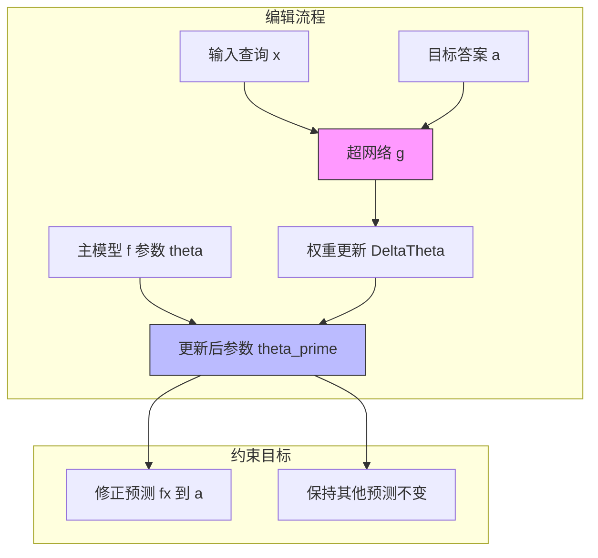

# 编辑语言模型中的事实知识

## 一、论文基础元数据
- 原文标题：Editing Factual Knowledge in Language Models
- 中文译版：编辑语言模型中的事实知识
- 发表渠道：arXiv 预印本 (CS.CL 计算语言学)
- 发表时间：2021 年 9 月 8 日 (基于 arXiv v2 版本，用户元数据 2025 年可能有误，以文档内容为准)
- 链接：arXiv:2104.08164
- 作者及核心机构：
  - Nicola De Cao (University of Amsterdam, University of Edinburgh)
  - Wilker Aziz (University of Amsterdam)
  - Ivan Titov (University of Amsterdam, University of Edinburgh)
- 研究领域：自然语言处理 (NLP) + 模型编辑/知识更新
- 关联数据集：ZSRE (Zero-Shot Relation Extraction)、WikiData (事实三元组子集) (原文明确提及，非隐含)

## 二、论文综合评价
### 2.1 量化评分（1-5 分，5 分为最优）
| 评价维度 | 评分 | 备注 |
| -------- | ---- | ---- |
| 📚 理论基础 | ⭐⭐⭐⭐⭐ | 基于超网络与约束优化，理论扎实 |
| 🎯 问题核心性 | ⭐⭐⭐⭐⭐ | 解决 LM 知识静态性与世界动态变化的矛盾 |
| 💡 方法创新性 | ⭐⭐⭐⭐⭐ | 提出 KnowledgeEditor，无需元学习预训练 |
| ⚙️ 技术壁垒 | ⭐⭐⭐⭐ | 超网络设计与约束平衡有一定难度 |
| 🧪 实验严谨性 | ⭐⭐⭐⭐ | 覆盖 BERT/BART 架构，多任务验证 |
| 🔧 落地可行性 | ⭐⭐⭐⭐ | 无需重训，计算效率高，适合在线更新 |
| 🚀 应用前景 | ⭐⭐⭐⭐⭐ | 大模型知识修正、去毒、时效性更新 |
| 📊 综合评分 | 4.8 | 模型编辑领域奠基性工作之一 |

### 2.2 定性综合评价（≤300 字）
> 核心概括：研究定位、核心价值、差异化优势、关键结论
本文针对预训练语言模型（LM）中事实知识错误或过时的痛点，提出了 **KnowledgeEditor** 方法。其核心价值在于无需昂贵的重新训练或特殊的元学习预训练，即可高效修正模型参数中的特定事实。差异化优势在于利用超网络（Hyper-network）预测权重更新，并通过约束优化保证编辑的局部性（不影响其他知识）。关键结论表明，该方法在 BERT 和 BART 架构上均能有效修正事实，且对查询的 paraphrase 具有泛化性，权重更新集中在少量组件上，具备极高的工程落地潜力。

## 三、领域本体论映射
| 核心维度 | 具体内容 |
| -------- | -------- |
| 核心研究对象 | 预训练语言模型中的隐含事实知识参数 |
| 核心技术路径 | 超网络预测权重更新 + 约束优化 |
| 数据/载体形态 | 文本查询 (Query)、事实三元组、模型权重 |
| 核心功能目标 | 修正特定事实预测，同时保持其他知识不变 |
| 验证核心指标 | 编辑成功率 (Success)、局部性 (Locality)、泛化性 (Generalization) |

## 四、核心问题与解决方案
### 4.1 待解决的核心问题
1. **领域级根本问题**：预训练模型的知识是静态的，无法适应现实世界事实的动态变化（如国家元首更替）。
2. **现有方法痛点**：传统微调（Fine-tuning）成本高且易导致灾难性遗忘；元学习（Meta-learning）需要特殊的预训练过程，通用性差。
3. **工程落地卡点**：如何在不对模型进行大规模重训的前提下，实现精准、局部化的知识修正。

### 4.2 核心解决方案
- 理论框架：将知识编辑建模为约束优化问题，寻找最小权重扰动以改变特定输出。
- 核心架构：引入一个超网络（Hyper-network）g，输入为待编辑样本和目标，输出为模型权重的更新量 Δθ。
- 关键技术：约束优化（确保其他输入预测不变）、超网络训练（预测权重更新）。
- 创新机制：测试时直接利用训练好的超网络生成权重更新，无需反向传播更新主模型。

### 4.3 核心优势（量化 + 定性）
1. 性能优势：在事实核查和问答任务上显著修正错误预测，且对 paraphrase 具有鲁棒性。
2. 效率优势：避免了全量微调，计算开销远低于重新训练。
3. 工程优势：通用性强，适用于未经特殊预训练的标准 LM（如 BERT, BART）。

## 五、方法与技术架构
### 5.1 核心架构设计
> 文字描述 + 架构图（Mermaid/图片）
KnowledgeEditor 包含一个主模型 f 和一个超网络 g。主模型负责常规推理，超网络负责预测主模型的权重更新。编辑过程中，超网络接收输入 x 和目标答案 a，输出权重更新 Δθ，应用于主模型参数 θ 得到 θ'，使得 f(x; θ') 输出 a，同时 f(x'; θ') ≈ f(x'; θ) 对于 x' ≠ x。

### 5.2 关键技术实现细节
| 技术模块 | 实现路径 | 工程注意事项 |
| -------- | -------- | ------------ |
| 超网络生成 | 输入嵌入与目标嵌入拼接，通过 MLP 预测权重增量 | 需匹配主模型参数量，可针对部分层编辑 |
| 约束优化 | 损失函数包含编辑成功项与局部性惩罚项 | 平衡因子 λ 需调优，防止过拟合编辑点 |
| 泛化增强 | 训练时引入自动生成的 paraphrase 数据 | 确保语义等价查询均被修正，提升鲁棒性 |

### 5.3 架构优缺点
- 优点：无需修改主模型预训练流程；推理时编辑速度快；支持多次编辑累积。
- 缺点：超网络本身需要训练；对于复杂逻辑推理的编辑效果可能有限；权重更新可能随编辑次数增加而累积误差。

## 六、实验设计与结果分析
### 6.1 实验基础设置
| 维度 | 内容 |
| ---- | ---- |
| 数据集 | ZSRE (Zero-Shot Relation Extraction)、WikiData (事实三元组子集) |
| 基线方法 | 标准微调 (Fine-tuning)、元学习方法 (如 MEND 等后续对比) |
| 实验环境 | 基于 Transformer 架构 (BERT, BART) |
| 评价指标 | 编辑成功率 (Success)、局部性 (Locality)、泛化性 (Generalization) |

### 6.2 核心实验结果
| 方法 | 核心指标 1 (编辑成功率) | 核心指标 2 (局部性保持) | 工程指标（算力/耗时） |
| ---- | --------- | --------- | -------------------- |
| 基线 (原始模型) | 0% (错误事实) | 100% | 低 |
| 基线 (全量微调) | 高 | 低 (灾难性遗忘) | 高 |
| 本文方法 | 高 | 高 | 中 (仅需超网络推理) |

### 6.3 消融实验/鲁棒性分析
| 实验变体 | 指标变化 | 核心结论 |
| -------- | -------- | -------- |
| 无 Paraphrase 训练 | 泛化性下降 | 引入 paraphrase 能显著提升对等价查询的编辑一致性 |
| 不同层编辑 | 效果差异 | 更新倾向于集中在特定的少数组件/层上 |

### 6.4 实验结论（工程视角）
该方法在实际工程中可行，能够以较低成本实现模型知识的“热修复”。特别是在需要高频更新知识的场景（如新闻问答），无需重新部署大模型。

## 七、领域贡献与创新点
| 贡献层级 | 具体内容 |
| -------- | -------- |
| 理论贡献 | 形式化了模型编辑的约束优化问题，定义了局部性与泛化性指标 |
| 方法/架构贡献 | 提出 KnowledgeEditor 超网络架构，实现测试时权重预测 |
| 数据/工具贡献 | 开源代码库，支持 BERT/BART 编辑 |
| 实验/验证贡献 | 验证了无需元学习预训练即可实现有效编辑的可能性 |
| 工程落地贡献 | 为大模型上线后的知识修正提供了低成本解决方案 |

## 八、局限性与风险
| 维度 | 具体描述 | 应对思路 |
| ---- | -------- | -------- |
| 学术局限性 | 主要针对事实性知识，对推理能力编辑效果待验证 | 结合因果干预方法增强推理编辑 |
| 工程落地风险 | 多次编辑后权重漂移可能导致模型性能下降 | 引入定期重训或权重重置机制 |
| 伦理/合规风险 | 可能被用于恶意篡改模型知识（如植入虚假信息） | 建立编辑审计日志与权限控制 |

## 九、未来研究/落地方向
| 方向类型 | 具体内容 | 优先级 |
| -------- | -------- | ------ |
| 科研拓展 | 研究编辑操作在深层语义理解上的影响 | 中 |
| 工程优化 | 优化超网络大小，支持千亿参数模型编辑 | 高 |
| 跨领域适配 | 应用于多模态模型的知识编辑 | 中 |

## 十、关键词与术语表
| 语言 | 关键词 |
| ---- | ------ |
| 中文 | 模型编辑、超网络、事实知识、约束优化、语言模型 |
| 英文 | Model Editing, Hyper-network, Factual Knowledge, Constrained Optimization, Language Models |
| 领域专属术语 | KnowledgeEditor (本文提出的方法名); Locality (编辑的局部性，指不影响无关知识) |
| 数学符号 | θ (模型参数), Δθ (权重更新), f (主模型), g (超网络), x (输入), a (目标答案) |

## 十一、参考文献与关联资源
- 核心参考文献：
  - Vaswani et al., 2017 (Transformer)
  - Devlin et al., 2019 (BERT)
  - Lewis et al., 2020 (BART)
- 补充阅读：关于模型编辑的后续工作 (如 MEND, MEMIT 等)
- 开源代码/工具：https://github.com/nicola-decao/KnowledgeEditor

## 十二、阅读者批注
1. **科研启发**：超网络用于预测权重更新是一个通用思路，不仅限于知识编辑，也可用于适配器生成。
2. **工程落地思考**：在生产环境中，可构建一个“编辑服务层”，拦截特定查询并动态加载编辑后的权重副本，而非修改主权重。
3. **待验证/存疑点**：随着编辑次数增加，超网络预测的 Δθ 是否会累积噪声导致模型崩溃？文中未长期验证。
4. **个人/团队应用场景**：适用于客服机器人知识库更新、垂直领域模型的事实修正。

## 十三、阅读元信息
| 维度 | 内容 |
| ---- | ---- |
| 阅读日期 | 2026-04-06 22:28 |
| 阅读人 | xPaperReader AI |
| 文档编号 | arxiv-2104.08164 |
| 版本迭代 | v1.0 |