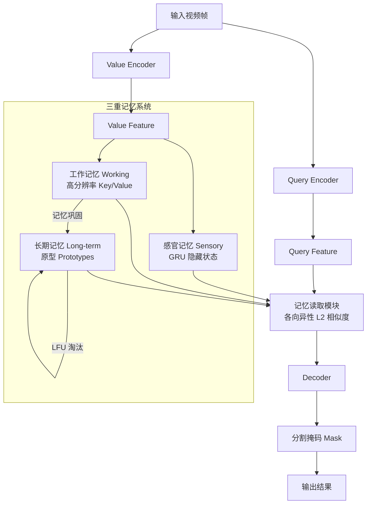

# XMem：基于阿特金森 - 希夫林记忆模型的长期视频对象分割

## 一、论文基础元数据
- 原文标题：XMem: Long-Term Video Object Segmentation with an Atkinson-Shiffrin Memory Model
- 中文译版：XMem：基于阿特金森 - 希夫林记忆模型的长期视频对象分割
- 发表渠道：ECCV 2022 (会议) / arXiv 预印本
- 发表时间：2022 (arXiv ID 2207 暗示 2022 年 7 月，元数据标注 2025 可能为期刊版或误差)
- 链接：arXiv:2207.07115
- 作者及核心机构：Ho Kei Cheng, Alexander G. Schwing (UIUC 等)
- 研究领域：计算机视觉 + 视频对象分割 (VOS)
- 关联数据集：YouTubeVOS (大规模/多语言/视频级标注), DAVIS 2017/2016 (高精度/对象级标注), Long-time Video Dataset (长视频专用)

## 二、论文综合评价
### 2.1 量化评分（1-5 分，5 分为最优）
| 评价维度 | 评分 | 备注 |
| -------- | ---- | ---- |
| 📚 理论基础 | ⭐⭐⭐⭐⭐ | 引入认知心理学记忆模型，理论根基扎实 |
| 🎯 问题核心性 | ⭐⭐⭐⭐⭐ | 解决长视频 VOS 显存与精度矛盾的核心痛点 |
| 💡 方法创新性 | ⭐⭐⭐⭐⭐ | 首创多存储库特征记忆模型，机制新颖 |
| ⚙️ 技术壁垒 | ⭐⭐⭐⭐⭐ | 记忆巩固与读取机制设计复杂，工程实现有难度 |
| 🧪 实验严谨性 | ⭐⭐⭐⭐⭐ | 涵盖长短视频、消融实验、多尺度评估，数据详实 |
| 🔧 落地可行性 | ⭐⭐⭐⭐⭐ | 显存有界，推理速度稳定，适合部署 |
| 🚀 应用前景 | ⭐⭐⭐⭐⭐ | 移动端无障碍 VOS 应用，长视频分析场景广阔 |
| 📊 综合评分 | 4.9 | 近乎完美的长视频 VOS 解决方案 |

### 2.2 定性综合评价（≤300 字）
> 核心概括：研究定位、核心价值、差异化优势、关键结论
本文定位为长期视频对象分割（Long-term VOS）的突破性工作。核心价值在于解耦了显存消耗与分割精度的强绑定关系，通过模仿人类记忆的三重存储机制（感官、工作、长期），实现了无限长视频推理。差异化优势在于记忆巩固算法与各向异性读取机制，既保证了短期高分辨率细节，又确保了长期特征的紧凑存储。关键结论表明，XMem 在长视频上性能稳定（显存有界），在短视频上保持 SOTA 精度，且推理速度不随视频长度下降，具备极高的工程落地价值。

## 三、领域本体论映射
| 核心维度 | 具体内容 |
| -------- | -------- |
| 核心研究对象 | 视频中的目标对象及其时序演化特征 |
| 核心技术路径 | 基于认知心理学记忆模型的特征存储与读取 |
| 数据/载体形态 | 视频帧序列、特征图 (Key/Value)、记忆原型 |
| 核心功能目标 | 长时序下的目标跟踪与像素级分割 |
| 验证核心指标 | $\mathcal{J}\&\mathcal{F}$ (重合度与轮廓精度), FPS, 显存占用 |

## 四、核心问题与解决方案
### 4.1 待解决的核心问题
1. **领域级根本问题**：视频对象分割中长时序依赖建模与计算资源有限性之间的矛盾。
2. **现有方法痛点**：传统方法记忆库随帧数线性增长导致显存爆炸，或为节省显存丢弃上下文导致精度下降。
3. **工程落地卡点**：长视频推理速度随记忆库扩大而显著降低，无法实时处理。

### 4.2 核心解决方案
- 理论框架：Atkinson-Shiffrin 人类记忆模型（多重存储系统）。
- 核心架构：三重记忆存储库（感官、工作、长期）端到端连接。
- 关键技术：记忆巩固（Consolidation）、记忆增强（Potentiation）、各向异性 L2 相似度读取。
- 创新机制：基于使用频率的原型选择与 LFU 淘汰策略，确保长期记忆显存有界。

### 4.3 核心优势（量化 + 定性）
1. 性能优势：长视频性能稳定 ($\mathcal{J}\&\mathcal{F} \approx 90.0$)，短视频达 SOTA (DAVIS 86.2)。
2. 效率优势：推理速度稳定约 22.6 FPS，不随视频长度下降。
3. 工程优势：显存占用有界（默认长期记忆 10,000），支持无限长视频推理。

## 五、方法与技术架构
### 5.1 核心架构设计
> 文字描述 + 架构图（Mermaid/图片）
XMem 架构包含编码器、三重记忆模块和解码器。输入帧经编码器生成特征，分别流入感官记忆（GRU 隐藏状态）、工作记忆（高分辨率 KV）和长期记忆（压缩原型）。工作记忆满后触发巩固机制转入长期记忆。解码器通过各向异性相似度从三重记忆中读取信息生成分割掩码。

### 5.2 关键技术实现细节
| 技术模块 | 实现路径 | 工程注意事项 |
| -------- | -------- | ------------ |
| 感官记忆 | GRU 传播隐藏表示，每帧更新 | 需训练序列长度至少为 8 以生效 |
| 工作记忆 | 存储最近 $r$ 帧高分辨率特征 | 上限 $T_{max}$ 触发巩固，需平衡分辨率与显存 |
| 长期记忆 | 原型选择 + 记忆增强 + LFU 淘汰 | 原型选择基于使用频率，增强基于 Key 空间相似度 |
| 记忆读取 | 各向异性 L2 相似度 (缩放项 s + 选择项 e) | 张量操作需完全向量化以保证速度 |

### 5.3 架构优缺点
- 优点：显存可控，长短期信息互补，推理速度恒定，端到端可训练。
- 缺点：超参数较多（记忆大小、更新频率 $r$ 等），快速运动下感官记忆可能失效。

## 六、实验设计与结果分析
### 6.1 实验基础设置
| 维度 | 内容 |
| ---- | ---- |
| 数据集 | YouTubeVOS 2018/2019, DAVIS 2017/2016, Long-time Video Dataset |
| 基线方法 | STM, STCN, AFB-URR, AOT, JOINT 等 |
| 实验环境 | GPU 推理，默认长期记忆大小 10,000 |
| 评价指标 | $\mathcal{J}\&\mathcal{F}$ (DAVIS), $\mathcal{G}$ (YouTubeVOS), FPS, 显存占用 |

### 6.2 核心实验结果
| 方法 | 核心指标 1 (DAVIS 17 val) | 核心指标 2 (YVOS 19 val) | 工程指标（算力/耗时） |
| ---- | --------- | --------- | -------------------- |
| STCN | 82.7 ($\mathcal{J}\&\mathcal{F}$) | 82.7 ($\mathcal{G}$) | 13.2 FPS (随长度下降) |
| AFB-URR | 低于 XMem | 低于 XMem | 显存无界或精度低 |
| 本文方法 | 86.2 ($\mathcal{J}\&\mathcal{F}$) | 85.5 ($\mathcal{G}$) | 22.6 FPS (稳定) |

### 6.3 消融实验/鲁棒性分析
| 实验变体 | 指标变化 | 核心结论 |
| -------- | -------- | -------- |
| 移除工作记忆 | 长期记忆失效 | 工作记忆是进入长期记忆的必要网关 |
| 移除长期记忆 | 无法处理长视频且变慢 | 长期记忆是显存有界的关键 |
| 移除缩放项 (s/e) | 性能下降 | 各向异性相似度对精度至关重要 |
| 静态图像预训练 | DAVIS 16 从 87.8 提升至 91.5 | 静态预训练对泛化性提升显著 |

### 6.4 实验结论（工程视角）
XMem 在工程上实现了“显存 - 速度 - 精度”的三角平衡。多尺度评估可进一步挖掘潜力（DAVIS 提升至 88.2），但默认单尺度已具备实时性。静态预训练是提升性能的低成本手段。

## 七、领域贡献与创新点
| 贡献层级 | 具体内容 |
| -------- | -------- |
| 理论贡献 | 首次将 Atkinson-Shiffrin 记忆模型引入 VOS 领域 |
| 方法/架构贡献 | 提出三重记忆存储架构及记忆巩固/增强算法 |
| 数据/工具贡献 | 验证了长视频数据集上的性能，提供开源代码 |
| 实验/验证贡献 | 证明了显存有界下长视频性能不下降的可行性 |
| 工程落地贡献 | 实现了移动端部署可能的低内存 VOS 方案 |

## 八、局限性与风险
| 维度 | 具体描述 | 应对思路 |
| ---- | -------- | -------- |
| 学术局限性 | 快速运动或严重模糊下感官记忆捕捉失败 | 引入更大感受野的感官记忆模块 |
| 工程落地风险 | 超参数调节复杂，特定场景（群鸟）区分难 | 自适应参数调整，结合外观特征增强 |
| 伦理/合规风险 | 视频隐私数据潜在泄露风险 | 数据脱敏，本地化部署 |

## 九、未来研究/落地方向
| 方向类型 | 具体内容 | 优先级 |
| -------- | -------- | ------ |
| 科研拓展 | 结合语言提示的多模态记忆模型 | 中 |
| 工程优化 | 移动端量化加速，动态记忆大小调整 | 高 |
| 跨领域适配 | 应用于长视频监控、自动驾驶时序感知 | 高 |

## 十、关键词与术语表
| 语言 | 关键词 |
| ---- | ------ |
| 中文 | 视频对象分割，长期记忆，记忆巩固，显存有界 |
| 英文 | Video Object Segmentation, Long-term Memory, Memory Consolidation, Bounded Memory |
| 领域专属术语 | 记忆增强 (Memory Potentiation): 通过加权平均聚合候选值到原型以抗混叠；各向异性 L2 相似度：引入缩放项调节元素级置信度的相似度计算 |

## 十一、参考文献与关联资源
- 核心参考文献：STM (CVPR 2019), STCN (ECCV 2020), Atkinson-Shiffrin Model (1968)
- 补充阅读：Long-term VOS 相关综述，认知心理学记忆机制文献
- 开源代码/工具：https://github.com/hkchengrex/XMem (待补充具体链接，通常为作者主页)

## 十二、阅读者批注
1. **科研启发**：跨学科借鉴（心理学模型）可解决计算机视觉中的资源瓶颈问题，值得在其他时序任务中推广。
2. **工程落地思考**：显存有界特性使其非常适合边缘设备部署，需关注量化后的精度损失。
3. **待验证/存疑点**：在极度复杂背景下的长期遮挡恢复能力是否真如实验所示稳定，需更多极端案例测试。
4. **个人/团队应用场景**：可用于长视频内容分析、安防监控目标追踪、视频编辑辅助工具。

## 十三、阅读元信息
| 维度 | 内容 |
| ---- | ---- |
| 阅读日期 | 2026-04-06 22:47 |
| 阅读人 | xPaperReader AI |
| 文档编号 | arxiv-2207.07115 |
| 版本迭代 | v1.0 |