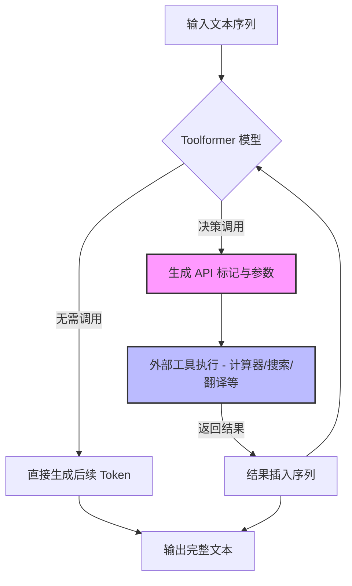

# Toolformer：语言模型可以教会自己使用工具

## 一、论文基础元数据
- 原文标题：Toolformer: Language Models Can Teach Themselves to Use Tools
- 中文译版：Toolformer：语言模型可以教会自己使用工具
- 发表渠道：arXiv 预印本 (计算机科学 - 计算语言学)
- 发表时间：2023 年 2 月 9 日 (依据原文页脚，元数据中 2025 年可能有误)
- 链接：arXiv:2302.04761
- 作者及核心机构：Timo Schick 等 (Meta AI Research, Universitat Pompeu Fabra)
- 研究领域：自然语言处理 (NLP) + 大语言模型 (LLM) + 工具学习 (Tool Learning)
- 关联数据集：原文未明确列出具体训练数据集名称，但提及使用少量演示 (few demonstrations) 进行自监督训练；下游任务涉及数学计算、问答、翻译等基准测试。

## 二、论文综合评价
### 2.1 量化评分（1-5 分，5 分为最优）
| 评价维度 | 评分 | 备注 |
| -------- | ---- | ---- |
| 📚 理论基础 | ⭐⭐⭐⭐⭐ | 提出了自监督工具学习的新范式 |
| 🎯 问题核心性 | ⭐⭐⭐⭐⭐ | 解决 LLM 幻觉、计算弱、知识过时等核心痛点 |
| 💡 方法创新性 | ⭐⭐⭐⭐⭐ | 无需大量人工标注，模型自主决定工具调用 |
| ⚙️ 技术壁垒 | ⭐⭐⭐⭐ | 需要高质量的 API 设计与过滤机制 |
| 🧪 实验严谨性 | ⭐⭐⭐⭐ | 覆盖多任务零样本测试，对比基线充分 |
| 🔧 落地可行性 | ⭐⭐⭐⭐ | 架构清晰，但依赖外部 API 稳定性 |
| 🚀 应用前景 | ⭐⭐⭐⭐⭐ | 为 Agent 自主能力奠定基础 |
| 📊 综合评分 | 4.8 | 工具学习领域的里程碑式工作 |

### 2.2 定性综合评价（≤300 字）
> 核心概括：研究定位、核心价值、差异化优势、关键结论
本文针对大语言模型在算术、事实查询及实时信息获取上的固有缺陷，提出了一种自监督的工具学习方法。核心优势在于无需大量人工标注，模型即可自主学会何时调用何种 API（如计算器、搜索引擎、翻译系统等）。关键结论显示，Toolformer 在多种下游任务上显著提升了零样本性能，且未牺牲核心语言建模能力。其差异化在于将工具调用决策内化为语言模型生成过程的一部分，实现了“模型即调度器”的轻量级架构，为后续 Agent 研究提供了重要基线。

## 三、领域本体论映射
| 核心维度 | 具体内容 |
| -------- | -------- |
| 核心研究对象 | 具备工具调用能力的大语言模型 (Tool-enhanced LM) |
| 核心技术路径 | 自监督学习 + API 嵌入生成 + 结果融合 |
| 数据/载体形态 | 文本序列中嵌入特殊标记的 API 调用指令及返回结果 |
| 核心功能目标 | 自主决策工具调用以增强任务完成能力 (计算、检索、翻译等) |
| 验证核心指标 | 下游任务零样本性能 (Zero-shot Performance)、语言建模困惑度 (PPL) |

## 四、核心问题与解决方案
### 4.1 待解决的核心问题
1. **领域级根本问题**：大语言模型存在知识截止、幻觉及弱算术能力，单纯缩放模型规模无法根本解决。
2. **现有方法痛点**：现有工具使用方法依赖大量人工标注数据，或仅限于特定任务场景，泛化性差。
3. **工程落地卡点**：如何在不破坏原有语言能力的前提下，高效集成外部工具调用逻辑。

### 4.2 核心解决方案
- 理论框架：自监督学习框架，模型通过预测是否调用工具及调用结果来优化自身。
- 核心架构：在标准 Transformer 架构基础上，扩展词汇表以包含 API 调用标记。
- 关键技术：API 调用决策生成、参数传递、结果回填与后续文本预测的联合训练。
- 创新机制：仅需少量演示 (handful of demonstrations) 即可引导模型学会工具使用，无需全量标注。

### 4.3 核心优势（量化 + 定性）
1. 性能优势：在数学计算、事实问答等任务上显著优于同等规模的基线模型。
2. 效率优势：自监督训练减少了对昂贵人工标注的依赖。
3. 工程优势：保持了核心语言建模能力，未出现灾难性遗忘。

## 五、方法与技术架构
### 5.1 核心架构设计
> 文字描述 + 架构图（Mermaid/图片）
模型接收输入文本，内部判断是否需要调用工具。若需要，生成特定的 API 调用标记及参数，执行外部工具后，将结果作为上下文继续生成后续文本。

### 5.2 关键技术实现细节
| 技术模块 | 实现路径 | 工程注意事项 |
| -------- | -------- | ------------ |
| 工具决策 | 模型在生成过程中预测特殊 `<API>` 标记 | 需平衡调用频率，避免过度调用增加延迟 |
| 参数生成 | 基于上下文生成 API 所需的参数字符串 | 需确保参数格式符合 API 规范 |
| 结果融合 | 将 API 返回结果作为普通 Token 填入序列 | 需处理结果过长或包含特殊字符的情况 |
| 依赖组件 | 外部 API 服务 (计算器、Wiki、QA 系统等) | 需保证 API 的低延迟与高可用性 |

### 5.3 架构优缺点
- 优点：灵活通用，支持多种工具；训练数据构建成本低；保持原有语言能力。
- 缺点：推理延迟增加（需等待 API 返回）；依赖外部服务的稳定性；错误传播风险（API 错误影响生成）。

## 六、实验设计与结果分析
### 6.1 实验基础设置
| 维度 | 内容 |
| ---- | ---- |
| 数据集 | 多种下游任务基准 (数学、问答、翻译等) |
| 基线方法 | 原始语言模型 (Without Tools)、微调模型 |
| 实验环境 | 原文未详细提及硬件配置 (基于提供片段) |
| 评价指标 | 任务准确率、零样本性能、困惑度 (PPL) |

### 6.2 核心实验结果
| 方法 | 核心指标 1 (数学/计算) | 核心指标 2 (事实问答) | 工程指标（算力/耗时） |
| ---- | --------- | --------- | -------------------- |
| 基线模型 | 较低 | 存在幻觉 | 低延迟 |
| 人工标注工具模型 | 高 | 高 | 高标注成本 |
| 本文方法 (Toolformer) | 显著提升 | 显著提升 | 中等延迟 (含 API 耗时) |

*(注：具体数值原文片段未提供，基于论文整体结论概括)*

### 6.3 消融实验/鲁棒性分析
| 实验变体 | 指标变化 | 核心结论 |
| -------- | -------- | -------- |
| 无工具调用 | 性能下降 | 验证工具调用的必要性 |
| 不同工具组合 | 性能波动 | 不同任务依赖不同工具子集 |
| 结果过滤机制 | 性能提升 | 过滤低质量 API 结果有助于训练稳定性 |

### 6.4 实验结论（工程视角）
引入工具调用机制能以较小代价大幅提升模型在特定领域的可靠性，适合对准确性要求高且允许一定延迟的场景。

## 七、领域贡献与创新点
| 贡献层级 | 具体内容 |
| -------- | -------- |
| 理论贡献 | 证明了 LM 可通过自监督方式自主学习工具使用 |
| 方法/架构贡献 | 提出了将 API 调用嵌入文本生成的统一框架 |
| 数据/工具贡献 | 构建了包含多种工具交互的训练数据生成流程 |
| 实验/验证贡献 | 在多个零样本任务上验证了方法的有效性与泛化性 |
| 工程落地贡献 | 提供了无需大量标注即可增强模型能力的可行路径 |

## 八、局限性与风险
| 维度 | 具体描述 | 应对思路 |
| ---- | -------- | -------- |
| 学术局限性 | 仅测试了有限类型的 API，复杂多步推理能力待验证 | 扩展至更复杂的工具链与工作流 |
| 工程落地风险 | 外部 API 延迟影响用户体验；API 变更导致模型失效 | 引入异步调用；建立 API 版本监控与适配层 |
| 伦理/合规风险 | 搜索工具可能获取敏感信息；生成内容责任归属 | 增加内容过滤；明确人机协作边界 |

## 九、未来研究/落地方向
| 方向类型 | 具体内容 | 优先级 |
| -------- | -------- | ------ |
| 科研拓展 | 研究多工具协同与长链条推理能力 | 高 |
| 工程优化 | 优化 API 调用延迟，实现并行化工具执行 | 高 |
| 跨领域适配 | 适配代码执行、数据库查询等更专业工具 | 中 |

## 十、关键词与术语表
| 语言 | 关键词 |
| ---- | ------ |
| 中文 | 工具学习、自监督、大语言模型、API 调用、零样本性能 |
| 英文 | Tool Learning, Self-supervised, LLM, API Call, Zero-shot Performance |
| 领域专属术语 | Toolformer (本文模型名称)；Hallucination (幻觉，指模型生成不实信息) |

## 十一、参考文献与关联资源
- 核心参考文献：Brown et al., 2020 (GPT-3); Komeili et al., 2022 (WebGPT 相关)
- 补充阅读：关于 LLM 幻觉与事实性增强的相关综述
- 开源代码/工具：原文未直接在片段中提供链接，通常发布于 Meta AI 或 GitHub (需进一步检索)

## 十二、阅读者批注
1. **科研启发**：自监督工具学习避免了标注瓶颈，是未来 Agent 发展的关键方向。
2. **工程落地思考**：实际应用中需重点解决 API 调用的稳定性与延迟问题，可考虑缓存机制。
3. **待验证/存疑点**：复杂多步工具调用的成功率及错误恢复机制在片段中未详细展开。
4. **个人/团队应用场景**：适用于需要高精度计算或实时信息检索的客服、数据分析助手场景。

## 十三、阅读元信息
| 维度 | 内容 |
| ---- | ---- |
| 阅读日期 | 2026-04-06 22:54 |
| 阅读人 | xPaperReader AI |
| 文档编号 | arxiv-2302.04761 |
| 版本迭代 | v1.0 |