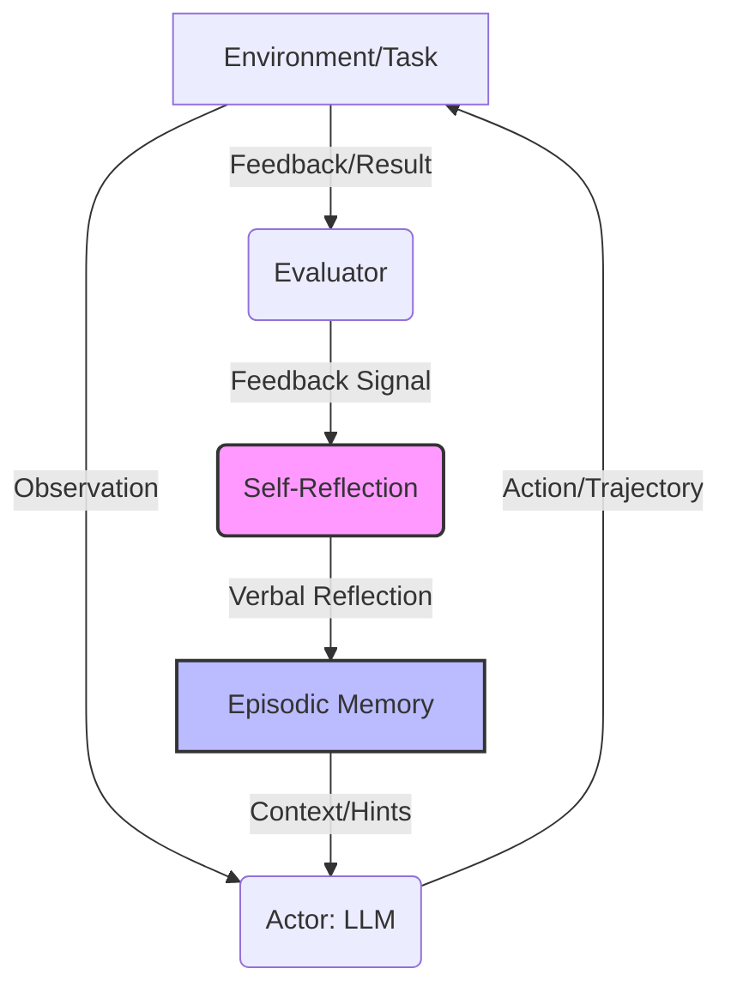

# 反射：带有言语强化学习的语言代理

## 一、论文基础元数据
- 原文标题：Reflexion: Language Agents with Verbal Reinforcement Learning
- 中文译版：反射：带有言语强化学习的语言代理
- 发表渠道：预印本 (arXiv)
- 发表时间：2023 (基于 arXiv ID 2303 推断，输入元数据标注 2025 可能存在偏差)
- 链接：https://arxiv.org/abs/2303.11366
- 作者及核心机构：Noah Shinn, Federico Cassano, Edward Berman, Ashwin Gopinath, Karthik Narasimhan, Shunyu Yao (机构信息原文未明确提及，标记为待补充)
- 研究领域：人工智能 (一级) + 大语言模型代理/强化学习 (二级)
- 关联数据集：
    - AlfWorld (决策任务，134 任务)
    - HotPotQA (推理任务)
    - HumanEval (编程任务，Python)
    - LeetcodeHardGym (编程任务，19 种语言 40 题，本文发布)
    - MBPP (编程任务，Python)

## 二、论文综合评价
### 2.1 量化评分（1-5 分，5 分为最优）
| 评价维度 | 评分 | 备注 |
| -------- | ---- | ---- |
| 📚 理论基础 | ⭐⭐⭐⭐ | 基于强化学习思想，但通过文本反馈实现，理论新颖 |
| 🎯 问题核心性 | ⭐⭐⭐⭐⭐ | 解决 LLM Agent 试错学习中反馈利用不足的核心痛点 |
| 💡 方法创新性 | ⭐⭐⭐⭐⭐ | 提出言语强化学习范式，无需微调权重 |
| ⚙️ 技术壁垒 | ⭐⭐⭐⭐ | 依赖强基座模型的涌现能力，实现门槛适中 |
| 🧪 实验严谨性 | ⭐⭐⭐⭐⭐ | 覆盖决策、推理、编程三大任务，对比基线充分 |
| 🔧 落地可行性 | ⭐⭐⭐⭐⭐ | 无需训练，仅需 Prompt 工程，易于部署 |
| 🚀 应用前景 | ⭐⭐⭐⭐⭐ | 适用于所有需要迭代优化的 Agent 场景 |
| 📊 综合评分 | 4.8 | 极具影响力的 Agent 优化框架 |

### 2.2 定性综合评价（≤300 字）
> 核心概括：研究定位、核心价值、差异化优势、关键结论
本文定位为一种无需微调模型权重的强化学习范式。核心价值在于通过**言语强化学习 (Verbal RL)** 将环境反馈转化为文本反思，指导 Agent 改进。差异化优势在于轻量级优化，仅通过 Prompt 和上下文学习实现策略优化，避免了传统 RL 的高成本。关键结论显示，Reflexion 在决策 (AlfWorld)、推理 (HotPotQA) 和编程 (HumanEval) 任务上均显著优于强基线 (如 ReAct, GPT-4)，证明了自反思机制在少样本学习复杂任务中的有效性，但效果依赖基座模型强度。

## 三、领域本体论映射
| 核心维度 | 具体内容 |
| -------- | -------- |
| 核心研究对象 | 大语言模型驱动的智能代理 (LLM Agents) |
| 核心技术路径 | 言语强化学习 (Verbal Reinforcement Learning) |
| 数据/载体形态 | 自然语言文本 (轨迹、反思、反馈) |
| 核心功能目标 | 通过自我反思从错误中学习，提升任务成功率 |
| 验证核心指标 | 任务完成率 (Success Rate)、Pass@1、准确率 (Accuracy) |

## 四、核心问题与解决方案
### 4.1 待解决的核心问题
1. **领域级根本问题**：LLM Agent 在试错学习中难以有效利用反馈信号进行策略更新。
2. **现有方法痛点**：传统 RL 需要大量计算和梯度下降微调；普通 Prompt 工程缺乏长期记忆和深度反思机制。
3. **工程落地卡点**：高昂的微调成本与模型权重更新带来的部署复杂性。

### 4.2 核心解决方案
- 理论框架：言语强化学习 (Verbal RL)，将奖励信号转化为自然语言反思。
- 核心架构：包含 Actor (执行者)、Evaluator (评估者)、Self-Reflection (反思者)、Memory (记忆) 四个组件。
- 关键技术：情景记忆 (Episodic Memory)、自我提示 (Self-hints)、文本反思生成。
- 创新机制：将失败轨迹提炼为自我提示存入长期记忆，指导后续尝试，实现“吃一堑长一智”。

### 4.3 核心优势（量化+定性）
1. 性能优势：AlfWorld 任务相比 ReAct 绝对提升 22%；HumanEval Pass@1 达 91% (超越 GPT-4 基线 80%)。
2. 效率优势：无需微调模型权重，仅通过推理阶段优化，计算成本低。
3. 工程优势：可解释性强，提供可诊断的决策改进路径；兼容 CoT 和 ReAct 等主流框架。

## 五、方法与技术架构
### 5.1 核心架构设计
Reflexion 框架形成闭环迭代：代理执行任务 → 环境/评估者反馈 → 生成反思 → 更新记忆 → 下一轮利用记忆优化决策。

### 5.2 关键技术实现细节
| 技术模块 | 实现路径 | 工程注意事项 |
| -------- | -------- | ------------ |
| Actor (执行者) | 基于 LLM，根据状态观察和记忆生成动作 (支持 ReAct, CoT) | 需控制上下文窗口长度，避免记忆过多导致遗忘 |
| Evaluator (评估者) | 评估轨迹质量，提供反馈 (精确匹配、启发式规则、LLM 自评) | 反馈信号需准确，假阳性反馈会导致过早停止优化 |
| Self-Reflection (反思者) | 基于失败轨迹和反馈，生成自然语言总结及改进建议 | 依赖基座模型的自我评估能力，弱模型可能无效 |
| Memory (记忆) | 存储短期轨迹和长期反思经验 (滑动窗口限制最近 1-3 条) | 需设计检索机制，确保相关反思被准确调用 |

### 5.3 架构优缺点
- 优点：无需训练、可解释性强、通用性好 (兼容多种推理框架)、显著提升复杂任务性能。
- 缺点：依赖强基座模型 (弱模型无效)、探索能力不足 (易陷局部最优)、受限于上下文窗口。

## 六、实验设计与结果分析
### 6.1 实验基础设置
| 维度 | 内容 |
| ---- | ---- |
| 数据集 | AlfWorld, HotPotQA, HumanEval, MBPP, LeetcodeHardGym |
| 基线方法 | ReAct, CoT, GPT-4 (Zero-shot/Few-shot), STarchat-beta |
| 实验环境 | 待补充 (通常基于 API 调用或本地推理集群) |
| 评价指标 | 任务完成率、Pass@1、准确率、迭代次数 |

### 6.2 核心实验结果
| 方法 | 核心指标 1 (AlfWorld 完成率) | 核心指标 2 (HumanEval Pass@1) | 工程指标（算力/耗时） |
| ---- | --------- | --------- | -------------------- |
| ReAct 基线 | 约 70% (推算) | 待补充 | 低 |
| GPT-4 基线 | 待补充 | 80.1% | 低 |
| 本文方法 (Reflexion) | 134/134 (100% 近似) | 91.0% | 中 (多次迭代推理) |

### 6.3 消融实验/鲁棒性分析
| 实验变体 | 指标变化 | 核心结论 |
| -------- | -------- | -------- |
| 仅 Episodic 记忆 (无反思) | 性能下降 8% | 证明“反思”环节比单纯记忆更有效 |
| 弱模型 (starchat-beta) | 无提升 (0.26 → 0.26) | 自我修正能力是强模型的涌现特性 |
| 强模型 (GPT-4/3.5) | 显著提升 (如 0.68 → 0.80) | 框架兼容性强，依赖基座能力阈值 |

### 6.4 实验结论（工程视角）
Reflexion 在代码生成、任务规划及推理任务上确立了新的 SOTA 标准。但性能上限受限于环境反馈（如测试用例）的准确性（MBPP 假阳性率高导致表现稍差）。工程落地时需确保评估器的可靠性，避免假阳性导致过早提交无效方案。

## 七、领域贡献与创新点
| 贡献层级 | 具体内容 |
| -------- | -------- |
| 理论贡献 | 确立了通过语言反馈而非权重更新来优化 LLM Agent 的路径 (言语强化学习) |
| 方法/架构贡献 | 提出 Reflexion 框架，整合自我反思与情景记忆机制 |
| 数据/工具贡献 | 发布 LeetcodeHardGym 基准 (19 种语言 40 道高难度题) |
| 实验/验证贡献 | 实证了自反思机制在少样本学习复杂任务中的有效性及模型能力阈值 |
| 工程落地贡献 | 提供了无需微调即可显著提升 Agent 性能的可解释性方案 |

## 八、局限性与风险
| 维度 | 具体描述 | 应对思路 |
| ---- | -------- | -------- |
| 学术局限性 | 探索能力不足，难以跳出局部最优 (如 WebShop 任务) | 结合更高级的搜索策略或多样性采样 |
| 工程落地风险 | 依赖自评估能力，弱模型无效；受限于上下文窗口 | 选型强基座模型；设计记忆压缩或检索机制 |
| 伦理/合规风险 | 代理自主决策可能产生不可控行为 | 增加人类反馈回路 (Human-in-the-loop) 监控 |

## 九、未来研究/落地方向
| 方向类型 | 具体内容 | 优先级 |
| -------- | -------- | ------ |
| 科研拓展 | 融合传统 RL 技术 (自然语言价值学习、离线策略探索) | 高 |
| 工程优化 | 优化记忆结构，突破上下文窗口限制 | 高 |
| 跨领域适配 | 适配需要高探索性的任务 (如电商导航、复杂游戏) | 中 |

## 十、关键词与术语表
| 语言 | 关键词 |
| ---- | ------ |
| 中文 | 言语强化学习、自我反思、情景记忆、语言代理、少样本学习 |
| 英文 | Verbal Reinforcement Learning, Self-Reflection, Episodic Memory, Language Agents, Few-shot Learning |
| 领域专属术语 | **Verbal RL**: 通过文本反馈而非数值奖励进行优化；**Episodic Memory**: 存储过往轨迹和反思经验的长期记忆模块 |

## 十一、参考文献与关联资源
- 核心参考文献：待补充 (原文未在输入中列出具体引用列表)
- 补充阅读：ReAct, Chain of Thought (CoT) 相关论文
- 开源代码/工具：待补充 (通常托管于 GitHub，具体链接原文未提供)

## 十二、阅读者批注
1. **科研启发**：反思机制是提升 LLM 推理能力的关键，未来可研究如何自动化生成更高质量的反思提示。
2. **工程落地思考**：在实际应用中，需权衡迭代次数带来的延迟成本与性能提升收益；评估器的准确性至关重要。
3. **待验证/存疑点**：在超长上下文任务中，滑动窗口记忆是否会导致关键早期经验丢失？需进一步验证。
4. **个人/团队应用场景**：适用于代码自动修复、复杂任务规划助手、自动化测试生成等场景。

## 十三、阅读元信息
| 维度 | 内容 |
| ---- | ---- |
| 阅读日期 | 2026-04-06 23:03 |
| 阅读人 | xPaperReader AI |
| 文档编号 | arxiv-2303.11366 |
| 版本迭代 | v1.0 |