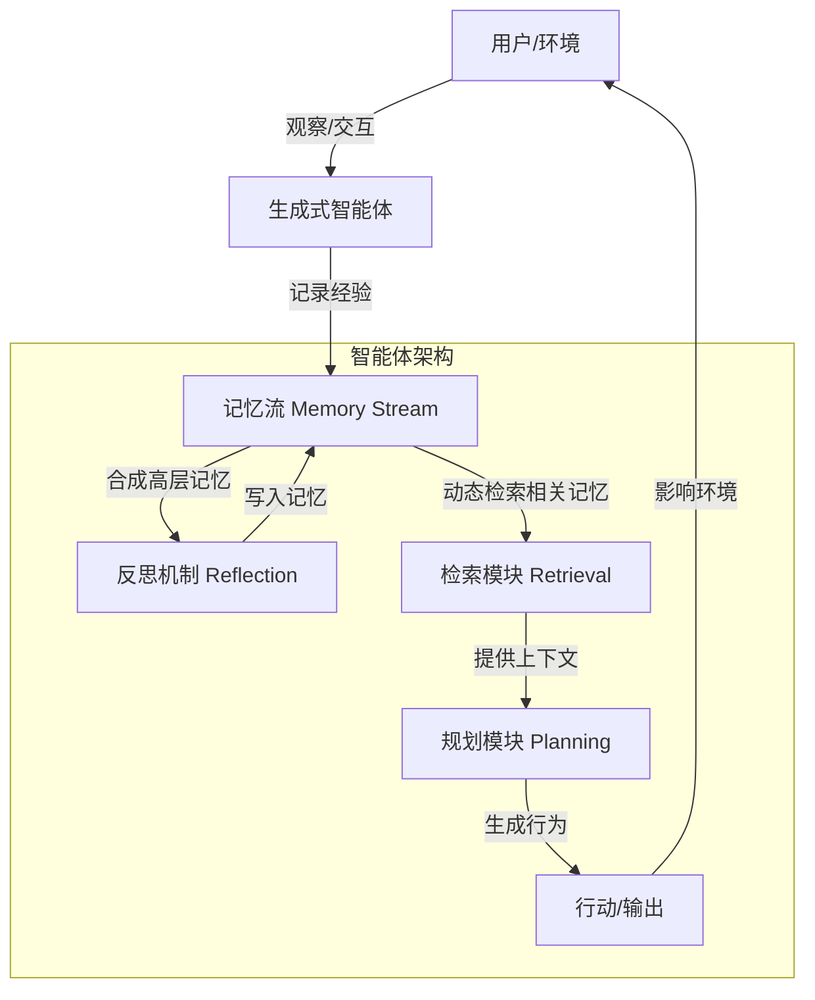

# 生成式智能体：人类行为的交互式模拟

## 一、论文基础元数据
- 原文标题：Generative Agents: Interactive Simulacra of Human Behavior
- 中文译版：生成式智能体：人类行为的交互式模拟
- 发表渠道：UIST '23 (ACM Symposium on User Interface Software and Technology) [顶级会议]
- 发表时间：2023 年 10 月 29 日 -11 月 1 日 (根据版权页信息)
- 链接：arXiv:2304.03442 / DOI: https://doi.org/10.1145/3586183.3606763
- 作者及核心机构：Joon Sung Park 等 (Stanford University, Google Research, Google DeepMind)
- 研究领域：人机交互 (HCI) + 自然语言处理 (NLP) / 多智能体系统
- 关联数据集：待补充 (原文片段未明确具体数据集名称，提及构建了 25 个智能体的沙盒环境)

## 二、论文综合评价
### 2.1 量化评分（1-5 分，5 分为最优）
| 评价维度 | 评分 | 备注 |
| -------- | ---- | ---- |
| 📚 理论基础 | ⭐⭐⭐⭐⭐ | 结合 LLM 与认知架构，理论基础扎实 |
| 🎯 问题核心性 | ⭐⭐⭐⭐⭐ | 解决 LLM 代理长期一致性与记忆问题 |
| 💡 方法创新性 | ⭐⭐⭐⭐⭐ | 提出记忆流、反思、检索机制 |
| ⚙️ 技术壁垒 | ⭐⭐⭐⭐ | 依赖大模型能力，工程实现复杂度中等 |
| 🧪 实验严谨性 | ⭐⭐⭐⭐ | 摘要提及消融实验，具体数据需见全文 |
| 🔧 落地可行性 | ⭐⭐⭐⭐ | 已在沙盒环境中实例化，具备应用潜力 |
| 🚀 应用前景 | ⭐⭐⭐⭐⭐ | 游戏、社交模拟、沟通排练等场景广阔 |
| 📊 综合评分 | 4.8 | 记忆-反思-规划三机制驱动的生成式智能体，社交模拟领域的奠基性工作 |

### 2.2 定性综合评价（≤300 字）
> 核心概括：本研究提出“生成式智能体”架构，旨在创建可信的人类行为模拟代理。核心价值在于通过扩展大语言模型（LLM），使其具备记忆、反思和规划能力，从而产生连贯且涌现的社会行为。差异化优势在于将自然语言作为记忆存储介质，实现了智能体间的自主交互（如组织派对）。关键结论表明，该架构能产生可信的个体及群体行为，且记忆、规划、反思组件对行为可信度至关重要。

## 三、领域本体论映射
| 核心维度 | 具体内容 |
| -------- | -------- |
| 核心研究对象 | 生成式智能体 (Generative Agents) |
| 核心技术路径 | LLM + 记忆流 (Memory Stream) + 反思 (Reflection) + 检索 (Retrieval) |
| 数据/载体形态 | 自然语言记录的经验、沙盒环境状态 |
| 核心功能目标 | 模拟可信的人类行为及社会互动 |
| 验证核心指标 | 行为可信度 (Believability)、 emergent social behaviors (涌现社会行为) |

## 四、核心问题与解决方案
### 4.1 待解决的核心问题
1. **领域级根本问题**：如何使计算代理模拟可信且连贯的人类行为，支持长期交互？
2. **现有方法痛点**：传统代理缺乏长期记忆，行为不一致；纯 LLM 对话缺乏上下文连续性与自主规划能力。
3. **工程落地卡点**：如何在动态环境中高效存储、检索并合成代理的经验以指导行动？

### 4.2 核心解决方案
- 理论框架：认知架构与大语言模型融合。
- 核心架构：记忆流架构（记录经验）、反思机制（合成高层记忆）、动态检索（指导行为）。
- 关键技术：自然语言记忆存储、基于相关性的记忆检索、LLM 驱动的行为规划。
- 创新机制：将代理经验完全以自然语言记录，并通过 LLM 进行反思总结，形成更高阶的认知。

### 4.3 核心优势（量化 + 定性）
1. 性能优势：能够自主协调复杂社会活动（如摘要提到的情人节派对组织）。
2. 效率优势：利用自然语言作为通用接口，简化了状态表示。
3. 工程优势：架构模块化（观察、规划、反思），支持消融验证各组件贡献。

## 五、方法与技术架构
### 5.1 核心架构设计
> 基于摘要描述，架构包含记忆存储、反思合成与动态检索规划。

### 5.2 关键技术实现细节
| 技术模块 | 实现路径 | 工程注意事项 |
| -------- | -------- | ------------ |
| 记忆流 | 使用自然语言存储完整经验记录 | 需控制记忆长度，避免上下文溢出 |
| 反思机制 | 定期合成记忆生成高层反思 | 需定义触发反思的频率或条件 |
| 检索模块 | 基于相关性动态检索记忆 | 检索效率与相关性评分机制是关键 |
| 依赖组件 | 大语言模型 (LLM) | 模型成本与响应延迟需优化 |

### 5.3 架构优缺点
- 优点：行为具有长期一致性，支持涌现社会行为，易于通过自然语言干预。
- 缺点：依赖 LLM 推理成本较高，长周期记忆管理可能面临噪声积累（原文未详细展开，基于架构推断）。

## 六、实验设计与结果分析
### 6.1 实验基础设置
| 维度 | 内容 |
| ---- | ---- |
| 数据集 | 自建沙盒环境 (类似 The Sims)，25 个智能体 |
| 基线方法 | 原文未提及具体基线名称 (待补充) |
| 实验环境 | 交互式沙盒环境 |
| 评价指标 | 行为可信度、社会行为涌现情况 |

### 6.2 核心实验结果
| 方法 | 核心指标 1 (可信度) | 核心指标 2 (社会协调) | 工程指标（算力/耗时） |
| ---- | --------- | --------- | -------------------- |
| 基线 1 | 原文未提供具体数据 | 原文未提供具体数据 | 原文未提供具体数据 |
| 基线 2 | 原文未提供具体数据 | 原文未提供具体数据 | 原文未提供具体数据 |
| 本文方法 | 产生可信行为 (定性) | 成功组织派对 (定性) | 原文未提供具体数据 |

*注：提供的论文片段仅包含摘要描述，无具体量化表格数据。*

### 6.3 消融实验/鲁棒性分析
| 实验变体 | 指标变化 | 核心结论 |
| -------- | -------- | -------- |
| 无观察组件 | 可信度下降 | 观察对行为可信度至关重要 |
| 无规划组件 | 可信度下降 | 规划对行为可信度至关重要 |
| 无反思组件 | 可信度下降 | 反思对行为可信度至关重要 |

*注：基于摘要中 "We demonstrate through ablation..." 描述提取，具体数值待补充。*

### 6.4 实验结论（工程视角）
架构中的观察、规划和反思组件缺一不可，共同保证了代理行为的可信度。系统能够支持多智能体间的复杂协作。

## 七、领域贡献与创新点
| 贡献层级 | 具体内容 |
| -------- | -------- |
| 理论贡献 | 提出了融合 LLM 与认知架构的可信行为模拟理论 |
| 方法/架构贡献 | 设计了包含记忆流、反思和检索的生成式智能体架构 |
| 数据/工具贡献 | 构建了包含 25 个智能体的交互式沙盒环境实例 |
| 实验/验证贡献 | 验证了代理在社交协调（如派对）中的涌现行为能力 |
| 工程落地贡献 | 提供了实现可信人机交互系统的架构模式 |

## 八、局限性与风险
| 维度 | 具体描述 | 应对思路 |
| ---- | -------- | -------- |
| 学术局限性 | 原文片段未明确提及 (待补充) | 需阅读全文讨论章节 |
| 工程落地风险 | LLM 调用成本高，延迟可能影响实时交互 | 优化模型大小或缓存机制 |
| 伦理/合规风险 | 模拟人类行为可能涉及欺骗或误导风险 | 需明确标识代理身份，制定伦理规范 |

## 九、未来研究/落地方向
| 方向类型 | 具体内容 | 优先级 |
| -------- | -------- | ------ |
| 科研拓展 | 探索更复杂的社会动态模拟 | 高 |
| 工程优化 | 降低记忆检索与 LLM 推理延迟 | 高 |
| 跨领域适配 | 应用于教育排练、心理治疗辅助等 | 中 |

## 十、关键词与术语表
| 语言 | 关键词 |
| ---- | ------ |
| 中文 | 生成式智能体、人机交互、大语言模型、记忆流、反思 |
| 英文 | Generative Agents, Human-AI Interaction, Large Language Models, Memory Stream, Reflection |
| 领域专属术语 | Generative Agents (生成式智能体): 能够模拟可信人类行为的计算软件代理 |

## 十一、参考文献与关联资源
- 核心参考文献：原文片段未列出具体参考文献列表 (待补充)
- 补充阅读：UIST '23 会议相关论文集
- 开源代码/工具：待补充 (原文片段未提供链接)

## 十二、阅读者批注
1. **科研启发**：将自然语言作为记忆存储介质是一个关键创新，简化了状态表示，使得反思和检索更加灵活。
2. **工程落地思考**：在实际应用中，需重点优化记忆检索的效率，避免随着时间推移记忆库过大导致检索延迟。
3. **待验证/存疑点**：具体消融实验的量化数据未在片段中展示，需确认各组件的具体贡献比例。
4. **个人/团队应用场景**：可尝试应用于 NPC 行为生成或虚拟社交社区构建。

## 十三、阅读元信息
| 维度 | 内容 |
| ---- | ---- |
| 阅读日期 | 2026-04-06 23:10 |
| 阅读人 | xPaperReader AI |
| 文档编号 | arxiv-2304.03442 |
| 版本迭代 | v1.0 |