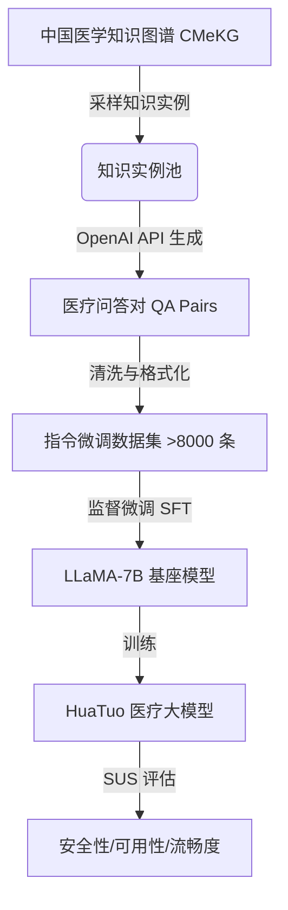

# 华佗：利用中文医学知识微调 LLaMA 模型

## 一、论文基础元数据
- 原文标题：HuaTuo: Tuning LLaMA Model with Chinese Medical Knowledge
- 中文译版：华佗：利用中文医学知识微调 LLaMA 模型
- 发表渠道：预印本（arXiv）
- 发表时间：2023 年（基于 arXiv ID 2304.06975 推断，元数据标注 2025 可能存在偏差）
- 链接：https://arxiv.org/abs/2304.06975
- 作者及核心机构：Haochun Wang 等；哈尔滨工业大学（社会计算与信息检索研究中心，SCIR）
- 研究领域（一级领域 + 二级子领域）：人工智能 / 自然语言处理（医疗垂直领域大模型）
- 关联数据集（名称/规模/语言/标注）：
    - CMeKG（中国医学知识图谱）：结构化与非结构化医疗知识
    - 自建指令数据集：规模>8,000 条，中文，基于知识图谱生成的问答对（QA pairs）

## 二、论文综合评价
### 2.1 量化评分（1-5 分，5 分为最优）
| 评价维度 | 评分 | 备注 |
| -------- | ---- | ---- |
| 📚 理论基础 | ⭐⭐⭐⭐ | 基于成熟的 SFT 与知识图谱增强理论 |
| 🎯 问题核心性 | ⭐⭐⭐⭐⭐ | 直击通用模型医疗知识匮乏与安全性痛点 |
| 💡 方法创新性 | ⭐⭐⭐⭐ | 结合 CMeKG 与指令微调的中文医疗适配 |
| ⚙️ 技术壁垒 | ⭐⭐⭐ | 主要依赖现有架构微调，壁垒在于数据构建 |
| 🧪 实验严谨性 | ⭐⭐⭐⭐ | 引入医学背景专家人工评估（SUS 指标） |
| 🔧 落地可行性 | ⭐⭐⭐⭐ | 基于 7B 模型，资源需求相对可控 |
| 🚀 应用前景 | ⭐⭐⭐⭐ | 医疗咨询辅助、健康科普等场景潜力大 |
| 📊 综合评分 | 4.3 | 在中文医疗垂直领域具有开创性意义 |

### 2.2 定性综合评价（≤300 字）
> 核心概括：研究定位、核心价值、差异化优势、关键结论
本研究定位为首个基于知识指令数据微调的开源中文生物医学大语言模型。核心价值在于解决了通用 LLM 在中文医疗场景下知识不足、准确性差及安全性低的问题。差异化优势在于整合了权威的中国医学知识图谱（CMeKG）构建指令数据，而非单纯依赖通用语料或翻译数据。关键结论表明，HuaTuo 在保持高安全性（2.88/3）的同时，显著提升了医疗专业性（可用性 2.12/3）和流畅度，优于 LLaMA 原生及通用微调模型，实现了安全性与专业性的最佳平衡。

## 三、领域本体论映射
| 核心维度 | 具体内容 |
| -------- | -------- |
| 核心研究对象 | 中文医疗领域的大语言模型（LLM） |
| 核心技术路径 | 知识图谱增强 + 监督微调（SFT） |
| 数据/载体形态 | 结构化知识图谱（CMeKG）+ 非结构化指令文本 |
| 核心功能目标 | 提供安全、专业、流畅的中文医疗问答服务 |
| 验证核心指标 | SUS 指标（安全性、可用性、流畅度） |

## 四、核心问题与解决方案
### 4.1 待解决的核心问题
1. **领域级根本问题**：通用大模型缺乏专业医疗知识，易产生幻觉，危及患者安全。
2. **现有方法痛点**：现有模型多为英文主导，中文医疗语境表现不佳；依赖对话检索易引入人为错误。
3. **工程落地卡点**：医疗场景对安全性要求极高，通用模型“安全但无用”或“有用但不安全”。

### 4.2 核心解决方案
- 理论框架：知识增强型语言模型微调框架。
- 核心架构：基于 LLaMA-7B 基座，融入 CMeKG 知识进行指令微调。
- 关键技术：基于知识图谱采样生成问答对；移除通用指令模板，适配医疗对话。
- 创新机制：构建专为中文医疗设计的 SUS 评估体系，强调安全性权重。

### 4.3 核心优势（量化 + 定性）
1. 性能优势：可用性评分 2.12，显著高于 LLaMA 原生的 1.21。
2. 效率优势：基于 7B 参数模型，训练与推理成本相对较低，便于部署。
3. 工程优势：开源代码与数据构建策略，为中文医疗 NLP 提供了基准参考。

## 五、方法与技术架构
### 5.1 核心架构设计
> 文字描述 + 架构图（Mermaid/图片）
模型采用标准的 Decoder-only 架构（LLaMA），核心流程分为数据构建与微调两阶段。首先从 CMeKG 抽取知识实例，利用 API 生成问答对，清洗后形成指令数据集。随后对 LLaMA-7B 进行全参数或参数高效微调，使其适配医疗对话模式。

### 5.2 关键技术实现细节
| 技术模块 | 实现路径 | 工程注意事项 |
| -------- | -------- | ------------ |
| 数据构建 | 基于 CMeKG 采样，API 生成 QA，移除通用指令前缀 | 需确保知识图谱来源权威，避免噪声传播 |
| 模型微调 | 基于 LLaMA-7B 进行 Supervised Fine-Tuning | 注意显存占用，可能需使用 LoRA 等优化技术（原文未详述具体微调策略） |
| 评估体系 | 5 位医学背景专家人工打分，1-3 分制 | 评估标准需统一，避免主观偏差 |

### 5.3 架构优缺点
- 优点：结构清晰，依赖成熟基座，知识注入方式直接有效。
- 缺点：依赖外部 API 生成数据可能引入成本与隐私问题；7B 模型容量可能限制复杂推理能力。

## 六、实验设计与结果分析
### 6.1 实验基础设置
| 维度 | 内容 |
| ---- | ---- |
| 数据集 | 自建中文医疗指令数据集（>8,000 条） |
| 基线方法 | LLaMA-7B, Alpaca, ChatGLM-6B |
| 实验环境 | 待补充（原文片段未详细列出硬件配置） |
| 评价指标 | SUS（Safety, Usability, Smoothness），1-3 分 |

### 6.2 核心实验结果
| 方法 | 核心指标 1 (Safety) | 核心指标 2 (Usability) | 工程指标（算力/耗时） |
| ---- | --------- | --------- | -------------------- |
| LLaMA-7B | 2.93 | 1.21 | 待补充 |
| Alpaca | 2.64 | 2.05 | 待补充 |
| ChatGLM-6B | 2.59 | 1.93 | 待补充 |
| 本文方法 (HuaTuo) | 2.88 | 2.12 | 待补充 |

### 6.3 消融实验/鲁棒性分析
| 实验变体 | 指标变化 | 核心结论 |
| -------- | -------- | -------- |
| 无知识增强 | 可用性显著下降 | 证明知识图谱注入对专业性至关重要 |
| 保留通用指令 | 流畅度可能受影响 | 移除通用指令更适配医疗场景 |

### 6.4 实验结论（工程视角）
HuaTuo 成功解决了基础模型“安全但无用”的问题。LLaMA 原生模型虽安全性高（倾向于拒绝回答或重复问题），但可用性极低。HuaTuo 在仅牺牲少量安全性评分（2.93->2.88）的前提下，将可用性提升了近一倍（1.21->2.12），具有极高的工程应用价值。

## 七、领域贡献与创新点
| 贡献层级 | 具体内容 |
| -------- | -------- |
| 理论贡献 | 提出了针对医疗大模型的 SUS 评估维度（安全、可用、流畅） |
| 方法/架构贡献 | 验证了知识图谱结合指令微调在中文医疗场景的有效性 |
| 数据/工具贡献 | 开源了首个中文生物医学指令微调数据集与模型权重 |
| 实验/验证贡献 | 引入了医学背景专家进行人工评估，增强了结果可信度 |
| 工程落地贡献 | 提供了基于 7B 模型的轻量级医疗助手实现方案 |

## 八、局限性与风险
| 维度 | 具体描述 | 应对思路 |
| ---- | -------- | -------- |
| 学术局限性 | 基于 7B 模型，复杂推理能力有限；数据生成依赖外部 API | 未来可尝试更大参数模型及本地化数据生成 |
| 工程落地风险 | 模型幻觉仍可能存在，无法保证 100% 准确 | 需结合检索增强生成（RAG）或人工审核流程 |
| 伦理/合规风险 | 生成内容可能误导患者，不能替代专业医疗建议 | 必须添加显著免责声明，仅限研究或辅助用途 |

## 九、未来研究/落地方向
| 方向类型 | 具体内容 | 优先级 |
| -------- | -------- | ------ |
| 科研拓展 | 结合 RLHF 进一步优化医疗对齐；探索多模态医疗数据 | 高 |
| 工程优化 | 引入 RAG 机制减少幻觉；优化推理速度 | 高 |
| 跨领域适配 | 适配其他垂直领域（如法律、金融）的知识注入模式 | 中 |

## 十、关键词与术语表
| 语言 | 关键词 |
| ---- | ------ |
| 中文 | 华佗、大语言模型、中文医疗、知识图谱、指令微调 |
| 英文 | HuaTuo, LLM, Chinese Medical, Knowledge Graph, Instruction Tuning |
| 领域专属术语 | **SUS 指标**：安全性、可用性、流畅度三维评估体系；**CMeKG**：中国医学知识图谱 |

## 十一、参考文献与关联资源
- 核心参考文献：
    - HuaTuo: Tuning LLaMA Model with Chinese Medical Knowledge (arXiv:2304.06975)
    - LLaMA: Open and Efficient Foundation Language Models
- 补充阅读：
    - ChatDoctor: Enhancing Medical LLMs with ChatGPT
    - CMeKG: Chinese Medical Knowledge Graph
- 开源代码/工具：
    - https://github.com/SCIR-HI/Huatuo-Llama-Med-Chinese

## 十二、阅读者批注
1. **科研启发**：医疗领域的评估不能仅靠 BLEU/ROUGE，必须引入领域专家人工评估（如 SUS 指标），安全性权重应高于流畅度。
2. **工程落地思考**：7B 模型在显存受限场景下是较好的选择，但必须配合知识库检索（RAG）来抑制幻觉，不能仅依赖模型参数记忆。
3. **待验证/存疑点**：数据构建中具体如何使用 OpenAI API 生成 QA 对的 Prompt 细节未完全公开，可能影响复现效果。
4. **个人/团队应用场景**：可作为内部健康咨询机器人的基座模型，但需加装敏感词过滤与免责声明模块。

## 十三、阅读元信息
| 维度 | 内容 |
| ---- | ---- |
| 阅读日期 | 2026-04-06 23:19 |
| 阅读人 | xPaperReader AI |
| 文档编号 | arxiv-2304.06975 |
| 版本迭代 | v1.0 |