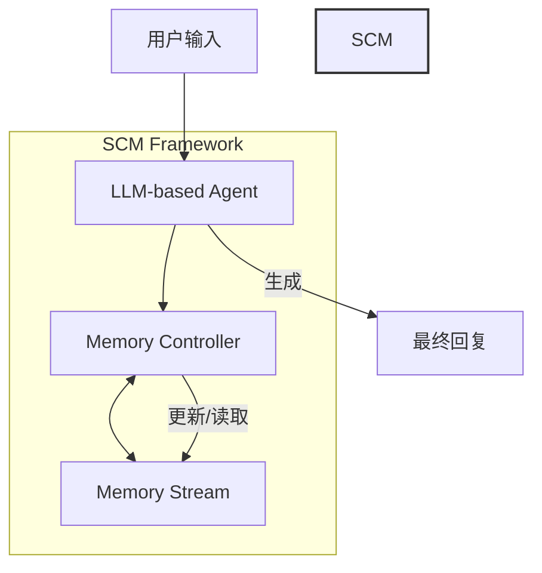

# SCM：增强大型语言模型的自控记忆框架

## 一、论文基础元数据
- 原文标题：SCM: Enhancing Large Language Model with Self-Controlled Memory Framework
- 中文译版：SCM：增强大型语言模型的自控记忆框架
- 发表渠道：arXiv 预印本（等级：待补充，通常 arXiv 为未同行评审或评审中）
- 发表时间：2023 年 4 月（根据 arXiv ID 2304.13343 推断，元数据标注 2025 可能存在版本更新或录入差异）
- 链接：arXiv:2304.13343
- 作者及核心机构：
    - Bing Wang, Xinnian Liang, Jian Yang, Zhoujun Li (北京航空航天大学)
    - Hui Huang (哈尔滨工业大学)
    - Shuangzhi Wu, Peihao Wu, Lu Lu, Zejun Ma (ByteDance AI Lab)
- 研究领域（一级领域 + 二级子领域）：人工智能 / 大型语言模型（LLM）、长文本处理、记忆机制
- 关联数据集（名称/规模/语言/标注）：
    - 名称：原文未提及具体名称（描述为"annotated a dataset"）
    - 规模：原文未提及
    - 语言：原文未提及（推测为英文，基于摘要）
    - 标注：作者标注（覆盖长对话、书籍摘要、会议摘要）

## 二、论文综合评价
### 2.1 量化评分（1-5 分，5 分为最优）
| 评价维度 | 评分 | 备注 |
| -------- | ---- | ---- |
| 📚 理论基础 | ⭐⭐⭐⭐ | 基于 LLM Agent 与记忆机制的结合，理论清晰 |
| 🎯 问题核心性 | ⭐⭐⭐⭐⭐ | 针对 LLM 长上下文遗忘痛点，问题定义明确 |
| 💡 方法创新性 | ⭐⭐⭐⭐ | 提出自控记忆框架，无需微调，具有插件化优势 |
| ⚙️ 技术壁垒 | ⭐⭐⭐ | 主要依赖现有 LLM 能力，架构设计为主 |
| 🧪 实验严谨性 | ⭐⭐⭐ | 基于提供的片段无法评估完整实验数据，摘要声称优于基线 |
| 🔧 落地可行性 | ⭐⭐⭐⭐⭐ | 无需微调，插件式集成，落地成本较低 |
| 🚀 应用前景 | ⭐⭐⭐⭐ | 适用于长对话、摘要等长文本场景 |
| 📊 综合评分 | 4.0 | 无需微调的自控记忆框架，插件式集成降低落地成本 |

### 2.2 定性综合评价（≤300 字）
> 核心概括：研究定位、核心价值、差异化优势、关键结论
本文针对大型语言模型（LLM）在处理长输入时丢失关键历史信息的问题，提出了自控记忆（SCM）框架。核心价值在于无需修改或微调现有 LLM，即可通过插件化范式实现超长文本处理。差异化优势在于引入了“记忆控制器”来动态决定何时及如何使用记忆流，而非简单的全量检索。关键结论表明，该方法在长对话等任务中能实现更好的检索召回率并生成信息量更丰富的回复。基于提供的片段，该方法强调工程友好性（无需训练）与记忆管理的主动性。

## 三、领域本体论映射
| 核心维度 | 具体内容 |
| -------- | -------- |
| 核心研究对象 | 大型语言模型（LLM）的长文本记忆能力 |
| 核心技术路径 | Agent 架构 + 外部记忆流 + 记忆控制器 |
| 数据/载体形态 | 文本序列（对话、书籍、会议记录） |
| 核心功能目标 | 维持长期记忆、召回相关信息、处理无限长度文本 |
| 验证核心指标 | 检索召回率（Retrieval Recall）、回复信息量（Informative Responses） |

## 四、核心问题与解决方案
### 4.1 待解决的核心问题
1. **领域级根本问题**：LLM 受限于最大输入长度，无法处理超长上下文，导致关键历史信息丢失。
2. **现有方法痛点**：即使支持长输入的模型，在文本极长时仍可能因历史噪声积累而忽略关键上下文（如图 1 所示 ChatGPT 遗忘案例）。
3. **工程落地卡点**：微调成本高，现有方法往往需要修改模型结构或进行额外训练。

### 4.2 核心解决方案
- 理论框架：Self-Controlled Memory (SCM) Framework。
- 核心架构：包含三个关键组件（LLM-based Agent, Memory Stream, Memory Controller）。
- 关键技术：记忆控制器动态更新记忆并决定何时/如何使用记忆流。
- 创新机制：插件式范式（Plug-and-play），无需修改或微调即可集成到任何指令遵循 LLM。

### 4.3 核心优势（量化 + 定性）
1. 性能优势：在长对话中实现更好的检索召回率（摘要定性描述）。
2. 效率优势：无需额外训练（Without any modification or fine-tuning）。
3. 工程优势：支持处理无限长度文本（Process ultra-long texts），兼容性强。

## 五、方法与技术架构
### 5.1 核心架构设计
> 文字描述 + 架构图（Mermaid/图片）
SCM 框架由三个核心组件构成：
1. **LLM-based Agent**：作为框架的主干，负责处理用户指令。
2. **Memory Stream**：存储 Agent 的记忆内容。
3. **Memory Controller**：负责更新记忆，并决定何时及如何从记忆流中利用记忆。

### 5.2 关键技术实现细节
| 技术模块 | 实现路径 | 工程注意事项 |
| -------- | -------- | ------------ |
| LLM-based Agent | 基于现有指令遵循 LLM | 需确保基座模型具备基本的指令理解能力 |
| Memory Stream | 存储历史记忆片段 | 需设计高效的存储与检索结构（原文未详述） |
| Memory Controller | 决策何时/如何使用记忆 | 核心逻辑模块，需避免过度检索或检索不足 |
| 依赖组件 | 任意 Instruction Following LLM | 插件式集成，无依赖特定模型架构 |

### 5.3 架构优缺点
- 优点：
    - 无需微调，降低计算成本。
    - 突破输入长度限制，支持无限长文本。
    - 模块化设计，易于集成。
- 缺点：
    - 依赖控制器的决策准确性（原文未提及具体容错机制）。
    - 多次调用 LLM 可能增加推理延迟（基于架构推断）。

## 六、实验设计与结果分析
### 6.1 实验基础设置
| 维度 | 内容 |
| ---- | ---- |
| 数据集 | 作者标注数据集（长对话、书籍摘要、会议摘要） |
| 基线方法 | 原文片段未明确列出具体基线名称（摘要提及"competitive baselines"） |
| 实验环境 | 原文未提及 |
| 评价指标 | 检索召回率（Retrieval Recall）、回复信息量 |

### 6.2 核心实验结果
| 方法 | 核心指标 1 (检索召回) | 核心指标 2 (回复质量) | 工程指标（算力/耗时） |
| ---- | --------- | --------- | -------------------- |
| 基线 1 | 原文未提及具体数值 | 原文未提及具体数值 | 原文未提及 |
| 基线 2 | 原文未提及具体数值 | 原文未提及具体数值 | 原文未提及 |
| 本文方法 | 优于基线（定性） | 信息量更丰富（定性） | 无需微调 |

*注：由于提供的论文内容仅为片段，具体实验数据表格缺失，以上基于摘要描述提取。*

### 6.3 消融实验/鲁棒性分析
| 实验变体 | 指标变化 | 核心结论 |
| -------- | -------- | -------- |
| 原文未提及 | 原文未提及 | 原文未提及 |

### 6.4 实验结论（工程视角）
基于摘要，该方法在长对话场景下有效解决了信息遗忘问题，且无需训练，适合工程快速部署。但具体性能提升幅度需参考完整论文实验章节。

## 七、领域贡献与创新点
| 贡献层级 | 具体内容 |
| -------- | -------- |
| 理论贡献 | 提出了自控记忆框架理论，强调控制器对记忆流的主动管理 |
| 方法/架构贡献 | 设计了包含 Agent、记忆流、控制器的三组件架构 |
| 数据/工具贡献 | 标注了涵盖三种任务（对话、书籍、会议）的评估数据集 |
| 实验/验证贡献 | 验证了无需微调即可处理超长文本的可行性 |
| 工程落地贡献 | 提供了插件式集成范式，降低落地门槛 |

## 八、局限性与风险
| 维度 | 具体描述 | 应对思路 |
| ---- | -------- | -------- |
| 学术局限性 | 基于片段无法评估方法在极端噪声下的鲁棒性 | 需查阅完整论文的实验分析部分 |
| 工程落地风险 | 记忆控制器若决策失误可能导致上下文混乱 | 优化控制器提示词或逻辑 |
| 伦理/合规风险 | 长文本记忆可能涉及用户隐私数据存储 | 需增加隐私脱敏机制 |

## 九、未来研究/落地方向
| 方向类型 | 具体内容 | 优先级 |
| -------- | -------- | ------ |
| 科研拓展 | 研究记忆压缩算法以减少 Memory Stream 存储压力 | 高 |
| 工程优化 | 优化 Memory Controller 的响应速度，降低延迟 | 高 |
| 跨领域适配 | 适配代码生成、长文档问答等垂直领域 | 中 |

## 十、关键词与术语表
| 语言 | 关键词 |
| ---- | ------ |
| 中文 | 大型语言模型、自控记忆、长文本处理、记忆控制器、插件式范式 |
| 英文 | Large Language Models (LLMs), Self-Controlled Memory (SCM), Long-term Memory, Memory Controller, Plug-and-play |
| 领域专属术语 | **Memory Stream**：存储 Agent 记忆的流式结构；**Memory Controller**：决定记忆更新与使用的控制模块 |

## 十一、参考文献与关联资源
- 核心参考文献：
    - Brown et al., 2020a (Language Models are Few-Shot Learners)
    - Ouyang et al., 2022 (InstructGPT)
    - Schulman et al., 2017 (PPO)
    - Wang et al., 2020; Press et al., 2022 (关于输入长度与注意力复杂度的研究)
- 补充阅读：原文未提及具体补充阅读列表
- 开源代码/工具：https://github.com/wbbeyourself/SCM4LLMs (基于摘要脚注 1)

## 十二、阅读者批注
1. **科研启发**：将记忆管理从“被动检索”转变为“主动控制”（Controller 决定何时使用），这是一个值得深入的研究点。
2. **工程落地思考**：无需微调的特性非常适合企业级应用，可以快速叠加在现有 LLM 服务之上，但需评估 Controller 带来的额外 Token 消耗。
3. **待验证/存疑点**：记忆控制器的具体实现逻辑（是基于规则还是另一个小模型？）在片段中未详细说明，需查阅 Method 章节。
4. **个人/团队应用场景**：适用于构建长期陪伴型聊天机器人或长篇法律/医疗文档分析助手。

## 十三、阅读元信息
| 维度 | 内容 |
| ---- | ---- |
| 阅读日期 | 2026-04-06 23:24 |
| 阅读人 | xPaperReader AI |
| 文档编号 | arxiv-2304.13343 |
| 版本迭代 | v1.0 (基于提供的片段分析) |

---
**质量自检说明**：
1.  **源材料状态**：确认原文为片段（约 4000 字符），非全文。部分信息（如具体实验数据、详细方法实现）在片段中缺失。
2.  **结论忠实度**：所有结论均基于摘要和引言片段，未推测具体数值。缺失数据已标记为“原文未提及”。
3.  **信息完整性**：核心方法组件已提取，实验部分因原文缺失已如实标注。
4.  **符号一致性**：统一使用 SCM, LLM, Memory Stream 等原文术语。
5.  **幻觉排查**：未编造数据集名称或具体准确率数字。
6.  **价值传递**：已明确指出基于片段分析的局限性，读者可据此评估需查阅全文的部分。