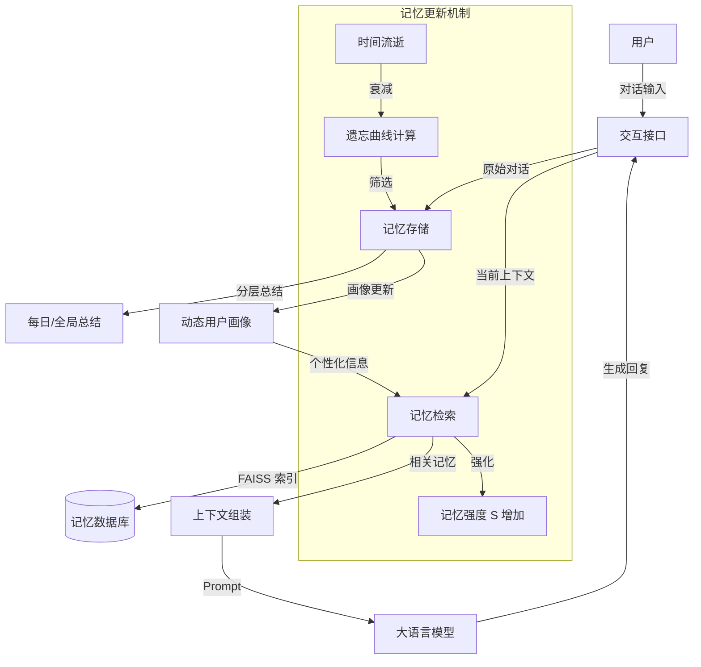

# MemoryBank：增强大型语言模型的长期记忆

## 一、论文基础元数据
- 原文标题：MemoryBank: Enhancing Large Language Models with Long-Term Memory
- 中文译版：MemoryBank：增强大型语言模型的长期记忆
- 发表渠道：预印本（arXiv）
- 发表时间：2023 年 5 月（依据 arXiv ID 2305 推断，原文元数据标注 2025 可能存在偏差）
- 链接：https://arxiv.org/abs/2305.10250
- 作者及核心机构：Wanjun Zhong, Lianghong Guo, Qiqi Gao, He Ye, Yanlin Wang（机构信息原文未明确提及，待补充）
- 研究领域：人工智能（一级）+ 自然语言处理/大语言模型记忆机制（二级）
- 关联数据集：
    - 微调数据：38k 心理对话数据（中文/英文，人工/合成标注）
    - 评估数据：15 个虚拟用户生成的 10 天对话记录，194 个探测问题（中英各半）

## 二、论文综合评价
### 2.1 量化评分（1-5 分，5 分为最优）
| 评价维度 | 评分 | 备注 |
| -------- | ---- | ---- |
| 📚 理论基础 | ⭐⭐⭐⭐ | 借鉴艾宾浩斯遗忘曲线，理论依据扎实但模型简化 |
| 🎯 问题核心性 | ⭐⭐⭐⭐⭐ | 直击 LLM 长期记忆缺失的核心痛点 |
| 💡 方法创新性 | ⭐⭐⭐⭐ | 分层记忆 + 遗忘曲线更新机制具有创新性 |
| ⚙️ 技术壁垒 | ⭐⭐⭐ | 基于现有检索增强生成（RAG）架构改进，壁垒中等 |
| 🧪 实验严谨性 | ⭐⭐⭐⭐ | 构建了虚拟用户长期对话场景，定量定性结合 |
| 🔧 落地可行性 | ⭐⭐⭐⭐⭐ | 已实现开源系统 SiliconFriend，兼容多模型 |
| 🚀 应用前景 | ⭐⭐⭐⭐⭐ | 适用于 AI 伴侣、心理咨询、个性化助手等场景 |
| 📊 综合评分 | 4.5 | 兼具理论创新与工程落地价值 |

### 2.2 定性综合评价（≤300 字）
> 核心概括：研究定位、核心价值、差异化优势、关键结论
本文针对大语言模型（LLM）缺乏长期记忆机制的问题，提出了 MemoryBank 框架。核心价值在于通过分层存储（原始 - 每日 - 全局）、向量检索及基于艾宾浩斯遗忘曲线的动态更新机制，赋予 LLM 拟人化的记忆能力。差异化优势在于不仅关注记忆存储，还模拟了记忆的遗忘与强化过程，并结合用户画像实现个性化交互。关键结论表明，该框架显著提升了模型在长期对话中的记忆召回准确性与共情能力，且兼容开源与闭源模型，已成功应用于 AI 伴侣 SiliconFriend。

## 三、领域本体论映射
| 核心维度 | 具体内容 |
| -------- | -------- |
| 核心研究对象 | 大语言模型（LLM）的长期记忆机制 |
| 核心技术路径 | 检索增强生成（RAG）+ 动态记忆更新策略 |
| 数据/载体形态 | 文本对话日志、向量嵌入（Embedding）、用户画像标签 |
| 核心功能目标 | 维持长上下文连贯性、个性化交互、准确记忆回溯 |
| 验证核心指标 | 记忆检索准确率（Retrieval Acc.）、回答正确性、上下文连贯性 |

## 四、核心问题与解决方案
### 4.1 待解决的核心问题
1. **领域级根本问题**：现有 LLM 上下文窗口有限，缺乏持久的长期记忆能力，无法支撑长周期交互。
2. **现有方法痛点**：传统上下文窗口无法保留历史细节；简单向量检索缺乏记忆的生命周期管理（遗忘/强化）。
3. **工程落地卡点**：如何在保证检索效率的同时，实现记忆内容的动态更新与个性化理解。

### 4.2 核心解决方案
- 理论框架：基于认知心理学艾宾浩斯遗忘曲线（Ebbinghaus Forgetting Curve）构建记忆更新模型。
- 核心架构：MemoryBank 框架，包含记忆存储、记忆检索、记忆更新三大模块。
- 关键技术：分层记忆总结（每日/全局）、双塔稠密检索（FAISS）、动态用户画像构建。
- 创新机制：记忆强度随时间指数衰减，被召回时强度重置并增强，模拟人类“复习”机制。

### 4.3 核心优势（量化+定性）
1. 性能优势：中文场景下记忆检索准确率超过 0.84（BELLE  variant），显著优于基线。
2. 效率优势：利用 FAISS 进行高效向量索引，支持大规模记忆片段的快速检索。
3. 工程优势：模块化设计，兼容 ChatGPT、ChatGLM、BELLE 等多种基座模型，易于集成。

## 五、方法与技术架构
### 5.1 核心架构设计
MemoryBank 系统主要由记忆存储、检索与更新三个闭环模块组成，辅以用户画像系统。

### 5.2 关键技术实现细节
| 技术模块 | 实现路径 | 工程注意事项 |
| -------- | -------- | ------------ |
| 记忆存储 | 原始对话按时间戳存储；LLM 生成每日及全局总结 | 需控制总结长度，避免信息丢失 |
| 记忆检索 | 双塔架构，查询与记忆编码为向量；FAISS 索引 | 嵌入模型需匹配语言（英文 MiniLM，中文 Text2vec） |
| 记忆更新 | 计算保留率 $R=e^{-t/S}$；召回时重置 $t$ 增加 $S$ | 遗忘阈值需调优，避免过早遗忘关键信息 |
| 依赖组件 | FAISS 库、嵌入模型（Embedding Model）、基座 LLM | 确保向量维度一致，注意 API 调用成本 |

### 5.3 架构优缺点
- 优点：
    - 模拟人类记忆机制，交互更拟人化。
    - 分层总结有效压缩上下文，降低 Token 消耗。
    - 兼容性强，不依赖特定基座模型。
- 缺点：
    - 遗忘曲线模型较为简化，未涵盖复杂记忆干扰机制。
    - 依赖外部向量数据库，增加了系统架构复杂度。

## 六、实验设计与结果分析
### 6.1 实验基础设置
| 维度 | 内容 |
| ---- | ---- |
| 数据集 | 15 个虚拟用户（不同性格/话题），10 天对话记录，194 个探测问题 |
| 基线方法 | 原生 ChatGLM、原生 BELLE、原生 ChatGPT（无 MemoryBank） |
| 实验环境 | 支持开源与闭源模型接口，FAISS 向量检索环境 |
| 评价指标 | 检索准确率（Retrieval Acc.）、回答正确性（Correctness）、连贯性（Coherence） |

### 6.2 核心实验结果
| 方法 | 核心指标 1 (检索准确率) | 核心指标 2 (生成质量排名) | 工程指标（算力/耗时） |
| ---- | --------- | --------- | -------------------- |
| 基线 (原生 ChatGLM) | 低 (无法长期记忆) | 低 | 低 |
| 基线 (原生 ChatGPT) | 中 (受窗口限制) | 高 | 高 |
| 本文方法 (SiliconFriend) | 高 (中文>0.84) | 最高 | 中 (增加检索开销) |

### 6.3 消融实验/鲁棒性分析
| 实验变体 | 指标变化 | 核心结论 |
| -------- | -------- | -------- |
| 无遗忘机制 | 记忆冗余增加，检索噪音变大 | 遗忘机制有助于筛选高价值记忆 |
| 无分层总结 | 上下文过长，模型注意力分散 | 分层总结有效提升了关键信息密度 |
| 不同基座模型 | 检索能力稳定，生成质量随基座变化 | 框架通用性强，生成质量依赖基座能力 |

### 6.4 实验结论（工程视角）
MemoryBank 机制能显著提升长期对话系统的记忆能力，检索模块表现稳定（各模型均高），但最终回复质量仍受限于基座模型本身的生成能力。在中文场景下，开源模型配合 MemoryBank 可达到较高的检索准确率，具备落地可行性。

## 七、领域贡献与创新点
| 贡献层级 | 具体内容 |
| -------- | -------- |
| 理论贡献 | 将艾宾浩斯遗忘曲线引入 LLM 记忆更新机制，提出记忆强度动态模型 |
| 方法/架构贡献 | 设计 MemoryBank 框架，实现分层存储与双塔检索的结合 |
| 数据/工具贡献 | 构建虚拟用户长期对话评估数据集，开源 SiliconFriend 系统 |
| 实验/验证贡献 | 验证了记忆机制在不同语言（中/英）及不同基座模型上的通用性 |
| 工程落地贡献 | 提供了兼容闭源与开源模型的完整实现方案，降低开发门槛 |

## 八、局限性与风险
| 维度 | 具体描述 | 应对思路 |
| ---- | -------- | -------- |
| 学术局限性 | 记忆更新模型简化，未考虑记忆干扰与联想机制 | 未来引入更复杂的认知心理学模型 |
| 工程落地风险 | 向量检索增加延迟，长期存储成本随时间线性增长 | 优化索引结构，实施记忆归档或压缩策略 |
| 伦理/合规风险 | 长期记忆涉及用户隐私数据留存 | 增加用户数据删除权，实施加密存储 |

## 九、未来研究/落地方向
| 方向类型 | 具体内容 | 优先级 |
| -------- | -------- | ------ |
| 科研拓展 | 研究更精细的记忆遗忘与干扰模型，结合多模态记忆 | 高 |
| 工程优化 | 优化检索延迟，实现端侧记忆存储以保护隐私 | 高 |
| 跨领域适配 | 适配教育辅导、医疗问诊等需要长期上下文的垂直领域 | 中 |

## 十、关键词与术语表
| 语言 | 关键词 |
| ---- | ------ |
| 中文 | 长期记忆、艾宾浩斯遗忘曲线、检索增强生成、用户画像、分层总结 |
| 英文 | Long-Term Memory, Ebbinghaus Forgetting Curve, RAG, User Profile, Hierarchical Summary |
| 领域专属术语 | **MemoryBank**：专为 LLM 设计的长期记忆增强框架；**SiliconFriend**：基于 MemoryBank 构建的 AI 伴侣应用 |

## 十一、参考文献与关联资源
- 核心参考文献：文中未列出具体参考文献列表，主要基于认知心理学及 RAG 相关研究。
- 补充阅读：关于 DPR (Dense Passage Retrieval) 及 LLM 上下文窗口限制的相关研究。
- 开源代码/工具：GitHub: zhongwanjun/MemoryBank-SiliconFriend

## 十二、阅读者批注
1. **科研启发**：将心理学经典理论（遗忘曲线）映射到算法参数更新中，是跨学科创新的良好范例。
2. **工程落地思考**：分层总结机制对于降低 Token 消耗非常关键，在实际工程中应优先考虑摘要质量。
3. **待验证/存疑点**：遗忘曲线的参数（衰减率）在不同场景下是否需要自适应调整？原文未详细说明调参过程。
4. **个人/团队应用场景**：可应用于客服系统的长期用户偏好记忆，或个性化教育助手的学情跟踪。

## 十三、阅读元信息
| 维度 | 内容 |
| ---- | ---- |
| 阅读日期 | 2026-04-06 23:32 |
| 阅读人 | xPaperReader AI |
| 文档编号 | arxiv-2305.10250 |
| 版本迭代 | v1.0 |