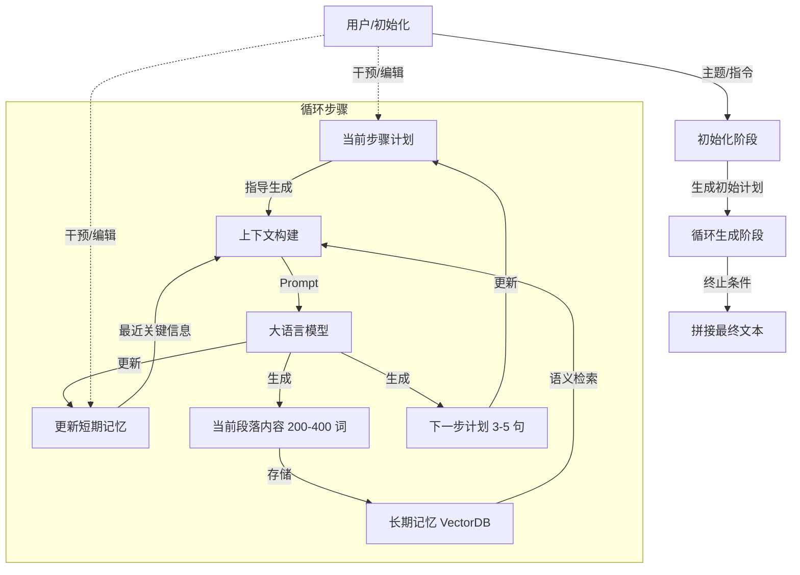

# RecurrentGPT: 交互式生成（任意）长文本

## 一、论文基础元数据
- 原文标题：RecurrentGPT: Interactive Generation of (Arbitrarily) Long Text
- 中文译版：RecurrentGPT: 交互式生成（任意）长文本
- 发表渠道：预印本（arXiv）
- 发表时间：2023（依据 arXiv ID 2305 推断，元数据标注 2025 可能存在偏差）
- 链接：arXiv:2305.13304
- 作者及核心机构：Wangchunshu Zhou, Yuchen Eleanor Jiang, Peng Cui, Tiannan Wang, Zhenxin Xiao, Yifan Hou, Ryan Cotterell, Mrinmaya Sachan（具体机构原文未详述，标记为待补充）
- 研究领域（一级领域 + 二级子领域）：人工智能 / 自然语言处理（长文本生成、人机交互）
- 关联数据集（名称/规模/语言/标注）：自建数据集（6 种小说体裁，每类 20 本，每本 3 名标注者，英文）

## 二、论文综合评价
### 2.1 量化评分（1-5 分，5 分为最优）
| 评价维度 | 评分 | 备注 |
| -------- | ---- | ---- |
| 📚 理论基础 | ⭐⭐⭐⭐ | 基于 RNN 思想迁移至 Prompt 工程，理论扎实 |
| 🎯 问题核心性 | ⭐⭐⭐⭐⭐ | 直击 LLM 长上下文窗口限制痛点 |
| 💡 方法创新性 | ⭐⭐⭐⭐⭐ | 无需训练，通过提示工程模拟循环机制，创新性强 |
| ⚙️ 技术壁垒 | ⭐⭐⭐ | 主要依赖 Prompt 设计与外部存储，架构门槛较低 |
| 🧪 实验严谨性 | ⭐⭐⭐⭐ | 多维度基线对比与人工评估，但评估长度受限 |
| 🔧 落地可行性 | ⭐⭐⭐⭐⭐ | 兼容闭源模型，无需微调，极易部署 |
| 🚀 应用前景 | ⭐⭐⭐⭐⭐ | 写作助手、互动游戏等场景潜力巨大 |
| 📊 综合评分 | 4.5 | 兼具创新性与实用性 |

### 2.2 定性综合评价（≤300 字）
> 核心概括：研究定位、核心价值、差异化优势、关键结论
RecurrentGPT 定位为解决闭源大语言模型（LLM）长文本生成连贯性与长度限制问题的交互式框架。其核心价值在于无需修改模型架构或训练，仅通过提示工程模拟 RNN 循环机制，结合外部向量数据库实现无限长度生成。差异化优势在于高度的可解释性与可控性（记忆与计划均为自然语言），支持人机协作。关键结论表明，该方法在有趣性与连贯性上显著优于滑动窗口及层级生成基线，且随底座模型能力提升效果更佳，标志着 AI 写作从“局部建议”向“交互式长文本生成”的范式转变。

## 三、领域本体论映射
| 核心维度 | 具体内容 |
| -------- | -------- |
| 核心研究对象 | 长文本生成过程中的连贯性维持与长度扩展 |
| 核心技术路径 | 提示工程（Prompt Engineering）+ 外部记忆机制（VectorDB） |
| 数据/载体形态 | 自然语言文本（内容、计划、记忆摘要） |
| 核心功能目标 | 实现任意长度文本生成，支持自主生成与人机协作 |
| 验证核心指标 | 人工配对比较胜率（有趣性、连贯性） |

## 四、核心问题与解决方案
### 4.1 待解决的核心问题
1. **领域级根本问题**：Transformer 架构的固定上下文窗口限制了长文本生成能力，导致长程遗忘。
2. **现有方法痛点**：架构修改无法应用于闭源模型；层级生成方法灵活性差且受限于预设计划；现有助手缺乏长程连贯性。
3. **工程落地卡点**：如何在不调用模型权重的前提下，突破显存与上下文长度限制。

### 4.2 核心解决方案
- 理论框架：利用提示工程在现有 LLM 之上模拟 RNN/LSTM 的循环计算机制。
- 核心架构：循环生成框架，包含内容生成、计划生成、记忆更新三个核心环节。
- 关键技术：语言化构建块（输入/输出均为自然语言）、长短期记忆机制（向量检索 + 摘要总结）。
- 创新机制：将计算状态显式化为自然语言（计划与记忆），实现人类可干预的循环计算。

### 4.3 核心优势（量化 + 定性）
1. 性能优势：在有趣性和连贯性上显著优于基线（配对比较胜率大多在 60%-90% 以上，科幻类有趣性高达 94.7%）。
2. 效率优势：无需训练，直接适配现有 API，部署成本低。
3. 工程优势：理论上可生成无限长度文本，支持用户直接编辑记忆和计划，可控性强。

## 五、方法与技术架构
### 5.1 核心架构设计
> 文字描述：RecurrentGPT 采用循环工作流。初始化主题后，进入循环步骤：每一步利用短期记忆（最近关键信息）和长期记忆（向量检索历史内容）以及当前计划，生成当前段落内容、下一步计划，并更新短期记忆摘要。所有状态均以自然语言存储。

### 5.2 关键技术实现细节
| 技术模块 | 实现路径 | 工程注意事项 |
| -------- | -------- | ------------ |
| 长期记忆 | 基于 VectorDB 存储所有历史内容，通过语义检索召回相关段落 | 需平衡检索精度与噪声，避免无关信息干扰生成 |
| 短期记忆 | 总结最近时间步的关键信息（10-20 句），放入 Prompt 中由 LLM 更新 | 摘要需精简，避免占用过多上下文窗口 |
| 计划生成 | 每步生成 3-5 句下一步大纲，支持用户选择或自定义 | 计划需具备灵活性，允许动态调整以纠正剧情偏差 |
| 内容生成 | 每步生成 200-400 词段落，基于计划与记忆 | 需控制生成长度以保证节奏，避免单步过长导致遗忘 |

### 5.3 架构优缺点
- 优点：突破上下文窗口限制；状态可解释、可编辑；兼容闭源模型；支持人机协作。
- 缺点：依赖多次 API 调用，延迟较高；依赖强底座模型，小模型效果待验证；检索可能引入噪声。

## 六、实验设计与结果分析
### 6.1 实验基础设置
| 维度 | 内容 |
| ---- | ---- |
| 数据集 | 6 种小说类型（科幻、浪漫、奇幻、恐怖、悬疑、惊悚），每类 20 本 |
| 基线方法 | Rolling-ChatGPT（滑动窗口）、RE3（分层大纲）、DOC（大纲控制） |
| 实验环境 | 基于 ChatGPT/GPT-4 API，文本长度 3000-6000 词 |
| 评价指标 | 人工成对比较（有趣性 Interesting、连贯性 Coherent） |

### 6.2 核心实验结果
| 方法 | 核心指标 1（有趣性胜率） | 核心指标 2（连贯性胜率） | 工程指标（算力/耗时） |
| ---- | --------- | --------- | -------------------- |
| 基线 1 (Rolling-ChatGPT) | 低（例：科幻 7.8%） | 低 | 低（单次调用） |
| 基线 2 (RE3/DOC) | 中 | 中 | 中（多步生成） |
| 本文方法 (RecurrentGPT) | 高（例：科幻 94.7%） | 高（60%-90%+） | 高（循环多步调用） |

### 6.3 消融实验/鲁棒性分析
| 实验变体 | 指标变化 | 核心结论 |
| -------- | -------- | -------- |
| 移除短期记忆 | 连贯性显著下降 | 验证了循环计算机制对长文本逻辑维持的重要性 |
| 移除长期记忆 | 连贯性显著下降 | 验证了外部存储对长程信息保留的必要性 |
| 底座模型 (GPT-4 vs ChatGPT) | 性能大幅提升（例：奇幻有趣性 71.7% vs 27.1%） | 方法具备随底层 LLM 能力提升而扩展的潜力 |

### 6.4 实验结论（工程视角）
RecurrentGPT 通过循环计算机制有效解决了长文本生成中的连贯性与长度限制问题。虽然增加了 API 调用次数，但显著提升了生成质量。在更强底座模型（GPT-4）支持下性能可进一步大幅提升，适合对质量要求高、对延迟不敏感的创作场景。

## 七、领域贡献与创新点
| 贡献层级 | 具体内容 |
| -------- | -------- |
| 理论贡献 | 证明了将认知科学和深度学习（如 RNN 设计）思想迁移至 LLM 长文本生成的可行性 |
| 方法/架构贡献 | 提出无需训练、基于提示的循环生成框架，模拟 RNN 递归机制 |
| 数据/工具贡献 | 构建了多体裁长文本生成评估集（待补充开源信息） |
| 实验/验证贡献 | 通过大规模用户研究验证了交互式长文本生成的有效性 |
| 工程落地贡献 | 提出了"AI 即内容”（AI as Content）的新概念，支持互动小说等应用 |

## 八、局限性与风险
| 维度 | 具体描述 | 应对思路 |
| ---- | -------- | -------- |
| 学术局限性 | 实际评估文本限制在 5000 词以内，超长文本评估困难 | 开发自动化评估指标或分段落评估方法 |
| 工程落地风险 | 依赖强大的骨干 LLM，小模型效果待验证；多次调用导致延迟高 | 优化检索策略，尝试蒸馏小模型适配该框架 |
| 伦理/合规风险 | 可能生成有害内容，需促进负责任的使用 | 增加内容过滤层，加强用户引导与审核机制 |

## 九、未来研究/落地方向
| 方向类型 | 具体内容 | 优先级 |
| -------- | -------- | ------ |
| 科研拓展 | 探索更高效的记忆压缩与检索机制，减少上下文冗余 | 高 |
| 工程优化 | 优化 API 调用延迟，实现流式生成与记忆更新的并行化 | 高 |
| 跨领域适配 | 将该框架适配至代码生成、长文档总结等非虚构领域 | 中 |

## 十、关键词与术语表
| 语言 | 关键词 |
| ---- | ------ |
| 中文 | 循环生成、长文本、提示工程、外部记忆、人机协作 |
| 英文 | Recurrent Generation, Long Text, Prompt Engineering, External Memory, Human-AI Collaboration |
| 领域专属术语 | **长期记忆（Long-term Memory）**：基于 VectorDB 存储的历史内容；**短期记忆（Short-term Memory）**：最近时间步的关键信息摘要；**AI as Content**：AI 直接作为互动内容提供给消费者 |

## 十一、参考文献与关联资源
- 核心参考文献：RE3 (Planning based generation), DOC (Outline controlled generation)
- 补充阅读：Transformer 上下文限制相关研究，RNN/LSTM 基础理论
- 开源代码/工具：待补充（原文未明确提供链接，需查阅 arXiv 页面）

## 十二、阅读者批注
1. **科研启发**：将经典深度学习架构（RNN）的思想通过 Prompt 复现于 LLM 之上，是一种低成本且高效的架构创新思路，可迁移至其他任务。
2. **工程落地思考**：虽然增加了调用成本，但对于付费写作工具或游戏内容生成，质量提升带来的价值远超算力成本。需重点优化检索延迟。
3. **待验证/存疑点**：在极端长度（如 10 万字以上）下，向量检索的噪声累积是否会导致剧情崩坏？小模型（如 7B）是否具备足够的指令遵循能力来维持循环？
4. **个人/团队应用场景**：可应用于互动叙事游戏开发、辅助长篇小说创作、自动化报告生成等场景。

## 十三、阅读元信息
| 维度 | 内容 |
| ---- | ---- |
| 阅读日期 | 2026-04-06 23:39 |
| 阅读人 | xPaperReader AI |
| 文档编号 | arxiv-2305.13304 |
| 版本迭代 | v1.0 |