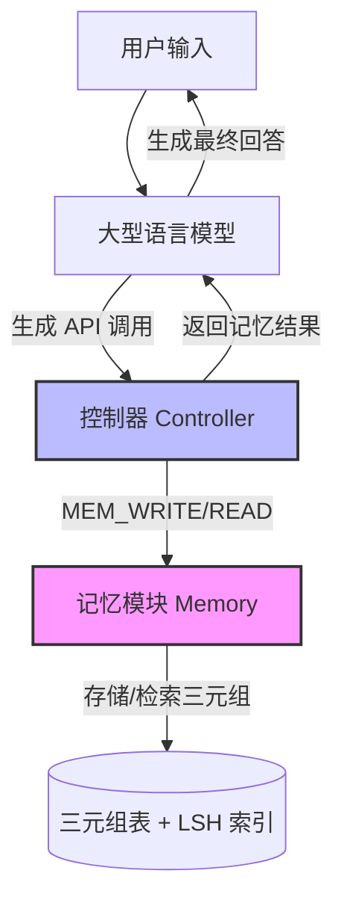

# RET-LLM：面向大型语言模型的通用读写记忆框架

## 一、论文基础元数据
- 原文标题：RET-LLM: Towards a General Read-Write Memory for Large Language Models
- 中文译版：RET-LLM：面向大型语言模型的通用读写记忆框架
- 发表渠道：预印本（arXiv）
- 发表时间：2023（arXiv ID 2305 表明 2023 年 5 月，输入元数据标注 2025 年可能存在偏差）
- 链接：arXiv:2305.14322
- 作者及核心机构：Ali Modarressi, Ayyoob Imani, Mohsen Fayyaz, Hinrich Schütze（机构信息待补充，通常关联慕尼黑大学 LMU 等）
- 研究领域：人工智能（一级）+ 自然语言处理/大语言模型记忆机制（二级）
- 关联数据集：待补充（文中提及计划在真实数据集上测试，当前实验多为定性示例）

## 二、论文综合评价
### 2.1 量化评分（1-5 分，5 分为最优）
| 评价维度 | 评分 | 备注 |
| -------- | ---- | ---- |
| 📚 理论基础 | ⭐⭐⭐⭐ | 基于戴维森语义理论及三元组知识表示，理论扎实 |
| 🎯 问题核心性 | ⭐⭐⭐⭐⭐ | 直击 LLM 静态知识与时效性更新的核心痛点 |
| 💡 方法创新性 | ⭐⭐⭐⭐ | 外部读写记忆单元与 API 交互机制具有创新性 |
| ⚙️ 技术壁垒 | ⭐⭐⭐ | 架构不修改模型内部，主要依赖外部控制器与索引 |
| 🧪 实验严谨性 | ⭐⭐⭐ | 当前多为定性评估，缺乏大规模定量基准测试 |
| 🔧 落地可行性 | ⭐⭐⭐⭐ | 无需重训，模块化设计，工程落地难度较低 |
| 🚀 应用前景 | ⭐⭐⭐⭐⭐ | 适用于知识库更新、个人助理、时效性问答等场景 |
| 📊 综合评分 | 4.0 | 概念新颖，实用性强，但需进一步实证验证 |

### 2.2 定性综合评价（≤300 字）
> 核心概括：研究定位、核心价值、差异化优势、关键结论

本研究定位为增强大型语言模型（LLM）的长期记忆与知识更新能力。核心价值在于提出了一种无需修改模型架构的通用读写记忆框架（RET-LLM）。差异化优势体现在采用结构化三元组存储知识，结合局部敏感哈希（LSH）进行高效检索，并通过标准化 API 实现透明交互。关键结论表明，该框架能有效解决 LLM 知识固化问题，在时效性问答任务中表现稳健，显著提升了知识检索的准确性与灵活性，但目前仍处于开发阶段，需进一步实证评估。

## 三、领域本体论映射
| 核心维度 | 具体内容 |
| -------- | -------- |
| 核心研究对象 | 大型语言模型（LLM）的外部记忆增强机制 |
| 核心技术路径 | 三元组知识表示 + 向量索引检索 + API 控制流 |
| 数据/载体形态 | 结构化文本三元组、平均向量表示、LSH 索引表 |
| 核心功能目标 | 实现知识的显式存储、检索、更新与召回 |
| 验证核心指标 | 问答准确性、时效性信息处理能力、定性评估反馈 |

## 四、核心问题与解决方案
### 4.1 待解决的核心问题
1. **领域级根本问题**：现有 LLM 缺乏专用记忆单元，知识隐含在参数中，难以显式存储和动态更新。
2. **现有方法痛点**：检索增强生成（RAG）多检索文档而非具体知识；模型重训成本高；知识过时难以修正。
3. **工程落地卡点**：如何在不动摇模型内部结构的前提下，实现低延迟、高精度的知识读写交互。

### 4.2 核心解决方案
- 理论框架：基于戴维森语义理论，将知识解构为可操作的三元组。
- 核心架构：外部记忆模块 + 控制器（Controller）+ 记忆 API（Memory-API）。
- 关键技术：三元组提取与存储、局部敏感哈希（LSH）向量索引、API 调用拦截与执行。
- 创新机制：LLM 自主生成 API 调用指令，控制器透明化处理记忆操作，实现端到端体验。

### 4.3 核心优势（量化+定性）
1. 性能优势：在基于时间的问答任务中表现稳健，能纠正基线模型的错误回答。
2. 效率优势：使用 LSH 降低向量搜索计算成本，无需重新训练模型即可更新知识。
3. 工程优势：模块化设计，可聚合多源信息，存储形式可解释，便于调试与维护。

## 五、方法与技术架构
### 5.1 核心架构设计
RET-LLM 架构由用户输入、LLM 推理、控制器、记忆模块四部分组成。用户请求进入后，LLM 判断是否需要记忆操作并生成 API 调用；控制器拦截指令，执行读写操作；记忆结果返回 LLM 生成最终回答。

### 5.2 关键技术实现细节
| 技术模块 | 实现路径 | 工程注意事项 |
| -------- | -------- | ------------ |
| 记忆结构 | 基于三元组⟨参数 1, 关系，参数 2⟩存储文本及平均向量 | 需确保三元组提取的准确性，避免语义丢失 |
| 检索优化 | 使用局部敏感哈希 (LSH) 表存储向量，支持语义相似性搜索 | 平衡哈希冲突与检索精度，优化向量维度 |
| 交互协议 | 定义 `MEM_WRITE` 和 `MEM_READ` 接口，由 LLM 生成调用 | 需防止 LLM 生成非法 API 指令，增加校验层 |
| 依赖组件 | 外部向量数据库、微调后的 LLM（用于 API 生成） | 确保外部存储与 LLM 推理的低延迟通信 |

### 5.3 架构优缺点
- 优点：解耦模型与记忆，支持动态更新，可解释性强，无需修改 LLM 内部参数。
- 缺点：依赖外部组件增加系统复杂度，三元组提取可能丢失复杂上下文信息，延迟可能增加。

## 六、实验设计与结果分析
### 6.1 实验基础设置
| 维度 | 内容 |
| ---- | ---- |
| 数据集 | 待补充（文中提及计划使用真实数据集，当前为定性示例） |
| 基线方法 | Alpaca-7B（Zero-shot 设置） |
| 实验环境 | 待补充 |
| 评价指标 | 问答准确性、时效性信息处理能力（定性为主） |

### 6.2 核心实验结果
| 方法 | 核心指标 1 | 核心指标 2 | 工程指标（算力/耗时） |
| ---- | --------- | --------- | -------------------- |
| 基线 (Alpaca-7B) | 上下文含信息仍出错 | 无法处理时效性更新 | 低耗时 |
| 本文方法 (RET-LLM) | 利用记忆检索纠正错误 | 有效管理时间依赖信息 | 中等耗时 (含检索) |
| 性能对比 | 定性优于基线 | 定性优于基线 | 待补充 |

### 6.3 消融实验/鲁棒性分析
| 实验变体 | 指标变化 | 核心结论 |
| -------- | -------- | -------- |
| 无记忆模块 | 性能下降 | 证明记忆模块对知识密集型任务至关重要 |
| 不同检索策略 | 待补充 | 待补充（文中未详细提及具体消融数据） |

### 6.4 实验结论（工程视角）
定性实验证明，引入通用读写记忆能显著提升模型在知识密集型和时效性任务上的准确性。即使输入上下文缺失信息，模型也能通过 API 检索记忆给出正确答案，验证了架构的可行性。但缺乏大规模定量数据支持，工程落地需进一步验证延迟与吞吐量。

## 七、领域贡献与创新点
| 贡献层级 | 具体内容 |
| -------- | -------- |
| 理论贡献 | 提出将戴维森语义理论应用于 LLM 外部记忆表示 |
| 方法/架构贡献 | 设计了基于三元组与 LSH 索引的通用读写记忆框架 |
| 数据/工具贡献 | 定义了标准化的 Memory-API 交互协议 |
| 实验/验证贡献 | 初步验证了读写记忆在时效性问答任务中的有效性 |
| 工程落地贡献 | 提供了无需重训即可更新模型知识的可落地方案 |

## 八、局限性与风险
| 维度 | 具体描述 | 应对思路 |
| ---- | -------- | -------- |
| 学术局限性 | 缺乏详细的实证评估，微调方法需改进以支持更广泛关系类型 | 下一步在真实数据集上进行大规模测试，优化微调策略 |
| 工程落地风险 | 外部模块增加系统延迟，三元组提取可能不准确 | 优化检索算法，引入更强大的信息抽取模型 |
| 伦理/合规风险 | 记忆内容可能包含敏感或偏见信息，难以完全审计 | 建立记忆内容审核机制，支持记忆删除与修正 |

## 九、未来研究/落地方向
| 方向类型 | 具体内容 | 优先级 |
| -------- | -------- | ------ |
| 科研拓展 | 在真实数据集上进行定量评估，验证泛化能力 | 高 |
| 工程优化 | 优化 LSH 检索效率，降低端到端延迟 | 高 |
| 跨领域适配 | 适配多模态记忆，支持图像、音频等非文本信息存储 | 中 |

## 十、关键词与术语表
| 语言 | 关键词 |
| ---- | ------ |
| 中文 | 读写记忆、三元组、局部敏感哈希、记忆 API、控制器 |
| 英文 | Read-Write Memory, Triplets, LSH, Memory-API, Controller |
| 领域专属术语 | （三元组：⟨参数 1, 关系，参数 2⟩的知识表示形式）；（Memory-API：用于记忆读写的标准化接口） |

## 十一、参考文献与关联资源
- 核心参考文献：待补充（文中提及 Zhong et al., Wu et al., Park et al. 等相关工作，具体引用需查原文）
- 补充阅读：检索增强生成（RAG）相关综述，知识图谱嵌入技术
- 开源代码/工具：待补充（项目处于开发阶段，代码库可能未完全公开）

## 十二、阅读者批注
1. **科研启发**：将记忆外置化是解决 LLM 幻觉与知识过时的重要方向，三元组结构比纯向量检索更具可解释性。
2. **工程落地思考**：控制器模式类似于中间件，易于集成到现有 LLM 服务中，但需关注并发读写时的数据一致性问题。
3. **待验证/存疑点**：三元组提取的准确率如何保证？复杂逻辑推理是否会被三元组割裂？大规模记忆下的检索延迟具体数据缺失。
4. **个人/团队应用场景**：适用于构建企业知识库助手、个人第二大脑、需要频繁更新事实信息的客服机器人。

## 十三、阅读元信息
| 维度 | 内容 |
| ---- | ---- |
| 阅读日期 | 2026-04-06 23:47 |
| 阅读人 | xPaperReader AI |
| 文档编号 | arxiv-2305.14322 |
| 版本迭代 | v1.0 |