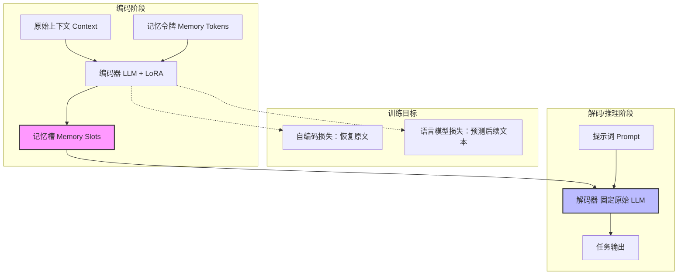

# 大语言模型中用于上下文压缩的上下文自编码器

## 一、论文基础元数据
- 原文标题：In-context Autoencoder for Context Compression in a Large Language Model
- 中文译版：大语言模型中用于上下文压缩的上下文自编码器
- 发表渠道：预印本（arXiv）
- 发表时间：2025（注：arXiv ID 2307 对应 2023 年 7 月，此处依据提供的元数据）
- 链接（arXiv/DOI）：arXiv:2307.06945
- 作者及核心机构：Tao Ge, Jing Hu, Lei Wang, Xun Wang, Si-Qing Chen, Furu Wei（Microsoft Research）
- 研究领域（一级领域 + 二级子领域）：人工智能 / 大语言模型与高效推理
- 关联数据集（名称/规模/语言/标注）：
    - Pile（海量文本，英文，无特定标注）
    - PwC（Prompt-with-Context，240k 训练/18k 测试，英文，指令微调标注）

## 二、论文综合评价
### 2.1 量化评分（1-5 分，5 分为最优）
| 评价维度 | 评分 | 备注 |
| -------- | ---- | ---- |
| 📚 理论基础 | ⭐⭐⭐⭐⭐ | 基于自编码器与注意力机制，理论扎实 |
| 🎯 问题核心性 | ⭐⭐⭐⭐⭐ | 直击 LLM 长上下文计算与内存瓶颈 |
| 💡 方法创新性 | ⭐⭐⭐⭐⭐ | 提出记忆槽压缩范式，正交于架构创新 |
| ⚙️ 技术壁垒 | ⭐⭐⭐⭐ | 依赖 LoRA 微调与记忆槽训练，实现难度中等 |
| 🧪 实验严谨性 | ⭐⭐⭐⭐⭐ | 覆盖多模型规模、多任务及效率指标 |
| 🔧 落地可行性 | ⭐⭐⭐⭐⭐ | 仅增加 1% 参数，兼容现有 LLM，易部署 |
| 🚀 应用前景 | ⭐⭐⭐⭐⭐ | 显著降低显存与延迟，适用于长文本场景 |
| 📊 综合评分 | 4.8 | 高效且实用的上下文压缩方案 |

### 2.2 定性综合评价（≤300 字）
> 核心概括：研究定位、核心价值、差异化优势、关键结论
本文提出了一种名为 ICAE（In-context Autoencoder）的上下文压缩方法，旨在解决大语言模型（LLM）处理长上下文时计算和内存开销过高的问题。其核心价值在于通过轻量级编码器将长文本压缩为少量“记忆槽”，解码器直接复用原始 LLM，无需修改主体架构。差异化优势在于参数效率极高（仅增加 1% 参数）且与现有架构创新正交。关键结论表明，该方法可实现 4 倍上下文压缩，推理速度提升 2-3.5 倍，显存节省显著，同时在问答、推理等任务上保持与原始文本相当的性能。

## 三、领域本体论映射
| 核心维度 | 具体内容 |
| -------- | -------- |
| 核心研究对象 | 大语言模型（LLM）的上下文表示与压缩 |
| 核心技术路径 | 上下文自编码器（In-context Autoencoder）+ 记忆槽（Memory Slots） |
| 数据/载体形态 | 文本序列压缩为固定长度的连续向量表示（记忆槽） |
| 核心功能目标 | 降低长上下文推理的计算复杂度与显存占用，保持任务性能 |
| 验证核心指标 | 困惑度（PPL）、BLEU 分数、推理延迟、显存占用、任务准确率 |

## 四、核心问题与解决方案
### 4.1 待解决的核心问题
1. **领域级根本问题**：Transformer 架构的自注意力机制导致长上下文建模的计算和内存复杂度呈二次方增长。
2. **现有方法痛点**：现有架构创新（如稀疏注意力）往往伴随性能下降或需要大幅修改模型结构，兼容性差。
3. **工程落地卡点**：长文本推理导致显存溢出（OOM）及高延迟，难以在资源受限环境下部署。

### 4.2 核心解决方案
- **理论框架**：利用文本信息的冗余性，通过更紧凑的表示（记忆槽）在更短上下文下实现相同功能。
- **核心架构**：编码器（LLM+LoRA）将长上下文编码为记忆槽；解码器（固定原始 LLM）基于记忆槽完成任务。
- **关键技术**：LoRA 适配编码器、记忆槽嵌入学习、两阶段训练（自编码预训练 + 指令微调）。
- **创新机制**：引入“记忆槽”作为中间表示，实现上下文与任务解耦，支持缓存与复用。

### 4.3 核心优势（量化 + 定性）
1. **性能优势**：自编码 BLEU 分数高达 99.5%，困惑度变化极小（Δ < 0.5），任务表现相当或更优。
2. **效率优势**：实现 4 倍上下文压缩，推理速度提升 2× ~ 3.5×，缓存场景下加速可达 7×。
3. **工程优势**：仅增加 1% 参数量，无需修改目标 LLM 主体，即插即用，显存节省显著（4096 长度节省约 20GB）。

## 五、方法与技术架构
### 5.1 核心架构设计
> 文字描述 + 架构图（Mermaid/图片）
ICAE 架构分为编码与解码两阶段。编码器基于目标 LLM 添加 LoRA 适配器，将原始上下文压缩为固定数量的记忆槽。解码器直接使用原始未修改的 LLM，接收记忆槽作为输入进行后续生成。训练包含自编码恢复（AE）和语言模型预测（LM）两个目标，随后进行指令微调（PwC）以增强任务交互能力。

### 5.2 关键技术实现细节
| 技术模块 | 实现路径 | 工程注意事项 |
| -------- | -------- | ------------ |
| 编码器 (Encoder) | 基于 LLaMA 模型，在 Attention 的 Q/V 投影上应用 LoRA (rank=128) | 需确保 LoRA 权重与基座模型精度一致 (bf16) |
| 记忆槽 (Memory Slots) | 初始化为可学习令牌，长度 k=128 (对应 512 上下文) | 记忆槽长度需根据压缩率调整，支持多段拼接 |
| 解码器 (Decoder) | 直接使用未经修改的目标 LLM (如 Llama-7b/13b) | 确保记忆槽嵌入维度与 LLM 输入维度兼容 |
| 训练流程 | 两阶段：Pile 数据集预训练 (AE+LM) -> PwC 数据集指令微调 | 微调需覆盖多样任务以防止过拟合复述任务 |

### 5.3 架构优缺点
- **优点**：
    - 参数效率极高，仅增加约 1% 可学习参数。
    - 兼容性强，无需修改目标 LLM 架构，支持不同规模模型。
    - 支持记忆槽缓存，对静态知识场景加速显著。
- **缺点**：
    - 压缩过程有信息损失风险，极端压缩率下性能可能下降。
    - 需要额外的编码推理步骤，虽总体加速但增加了前置延迟。
    - 目前仅在 13B 及以下模型验证，超大模型效果待确认。

## 六、实验设计与结果分析
### 6.1 实验基础设置
| 维度 | 内容 |
| ---- | ---- |
| 数据集 | 预训练：Pile；指令微调：PwC (240k 训练/18k 测试) |
| 基线方法 | 原始 LLM (Full Context), GIST, AutoCompressors (对比提及) |
| 实验环境 | 8 × Nvidia A100 GPU (80GB), bf16 精度 |
| 评价指标 | 困惑度 (PPL), BLEU, 推理延迟，显存占用，任务准确率 |

### 6.2 核心实验结果
| 方法 | 核心指标 1 (BLEU/PPL) | 核心指标 2 (任务性能) | 工程指标（算力/耗时） |
| ---- | --------- | --------- | -------------------- |
| 基线 (原始 LLM) | PPL 基准 | 基准准确率 | 基准延迟，高显存占用 |
| 基线 (其他压缩) | 性能下降明显 | 部分任务受损 | 加速有限或需重构模型 |
| 本文方法 (ICAE) | BLEU 99.5%, PPL Δ < 0.5 | 相当或更优 (推理任务 +16%) | 速度 2-3.5×, 显存省 20GB |

### 6.3 消融实验/鲁棒性分析
| 实验变体 | 指标变化 | 核心结论 |
| -------- | -------- | -------- |
| 不同压缩率 (512->128) | 性能稳定 | 4 倍压缩为最佳平衡点 |
| 不同模型规模 (7b vs 13b) | 13b 效果更好 | 目标 LLM 越强，压缩效果越好 |
| 多段记忆槽拼接 | 支持 2048+ 长度 | 具有良好的长度扩展性 |
| 任务专用微调 | 特定任务性能提升 | 可丢弃无关信息实现更高压缩 |

### 6.4 实验结论（工程视角）
ICAE 在工程上具有极高的落地价值。在处理 4096 长度上下文时，使用 2048 长度记忆槽可节省约 20GB 显存，这使得在单卡上运行更长上下文成为可能。推理速度的显著提升（尤其是缓存场景下的 7 倍加速）使其非常适合知识库问答、法律文档分析等静态长文本场景。

## 七、领域贡献与创新点
| 贡献层级 | 具体内容 |
| -------- | -------- |
| 理论贡献 | 提出上下文压缩新范式，类比人类工作记忆机制，提供表征学习新视角 |
| 方法/架构贡献 | 设计 In-context Autoencoder 架构，实现记忆槽与原始 LLM 的解耦 |
| 数据/工具贡献 | 构建 PwC 数据集 (Prompt-with-Context)，开源代码与模型 |
| 实验/验证贡献 | 验证了压缩表示在推理、摘要、问答等多任务上的有效性 |
| 工程落地贡献 | 提供低参数开销、高兼容性的长上下文优化方案，显著降低部署成本 |

## 八、局限性与风险
| 维度 | 具体描述 | 应对思路 |
| ---- | -------- | -------- |
| 学术局限性 | 仅在 Llama 13B 及以下模型验证，未覆盖超大模型 | 未来在更强 LLM 上验证有效性 |
| 工程落地风险 | 编码过程引入额外延迟，动态上下文无法缓存 | 优化编码器效率，区分静态/动态上下文策略 |
| 伦理/合规风险 | 压缩过程可能导致信息丢失或扭曲，影响事实准确性 | 引入一致性校验机制，关键信息保留原始文本 |

## 九、未来研究/落地方向
| 方向类型 | 具体内容 | 优先级 |
| -------- | -------- | ------ |
| 科研拓展 | 探索离散记忆槽（类似 VQ-VAE），统一跨模态紧凑表示 | 高 |
| 工程优化 | 针对动态上下文优化编码速度，支持流式压缩 | 中 |
| 跨领域适配 | 应用于多模态 LLM（图像/视频上下文压缩） | 高 |

## 十、关键词与术语表
| 语言 | 关键词 |
| ---- | ------ |
| 中文 | 上下文压缩、记忆槽、自编码器、大语言模型、LoRA |
| 英文 | Context Compression, Memory Slots, Autoencoder, LLM, LoRA |
| 领域专属术语 | **记忆槽 (Memory Slots)**：压缩后的固定长度向量表示，替代原始文本输入。 **PwC 数据集**：专为指令微调构建的 (文本，提示词，答案) 三元组数据集。 |

## 十一、参考文献与关联资源
- 核心参考文献：论文原文 (arXiv:2307.06945)
- 补充阅读：Transformer 架构相关论文，LoRA 技术论文
- 开源代码/工具：GitHub: getao/icae

## 十二、阅读者批注
1. **科研启发**：将上下文视为可压缩的信息流，而非固定令牌序列，为长上下文研究提供了正交于架构改进的新思路。
2. **工程落地思考**：非常适合构建企业级知识库问答系统，静态文档可预先压缩为记忆槽缓存，大幅降低推理成本。
3. **待验证/存疑点**：在极端压缩率（如 10 倍以上）下的信息丢失边界在哪里？对复杂逻辑推理的长期依赖是否稳定？
4. **个人/团队应用场景**：可应用于内部文档检索增强生成（RAG）系统，减少向量检索后的上下文拼接长度。

## 十三、阅读元信息
| 维度 | 内容 |
| ---- | ---- |
| 阅读日期 | 2026-04-06 23:55 |
| 阅读人 | xPaperReader AI |
| 文档编号 | arxiv-2307.06945 |
| 版本迭代 | v1.0 |