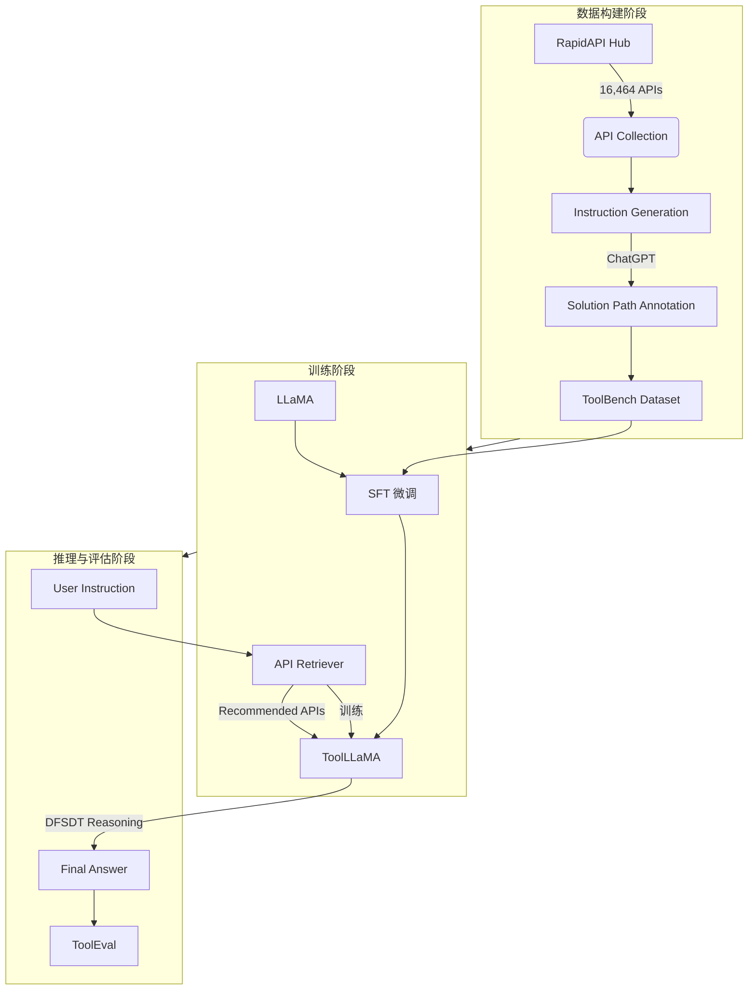

# ToolLLM：助力大型语言模型掌握 16000+ 真实世界 API

## 一、论文基础元数据
- 原文标题：ToolLLM: Facilitating Large Language Models to Master 16000+ Real-world APIs
- 中文译版：ToolLLM：助力大型语言模型掌握 16000+ 真实世界 API
- 发表渠道：预印本 (arXiv)
- 发表时间：2023 年 10 月 3 日 (根据文档页脚 arXiv:2307.16789v2)
- 链接：https://github.com/OpenBMB/ToolBench (代码库), arXiv:2307.16789
- 作者及核心机构：Yujia Qin 等 (清华大学、ModelBest、中国人民大学、耶鲁大学、腾讯微信 AI、知乎等)
- 研究领域：人工智能 (一级) + 大语言模型/工具学习 (二级)
- 关联数据集：ToolBench (指令微调数据集), APIBench (分布外工具使用数据集)

## 二、论文综合评价
### 2.1 量化评分（1-5 分，5 分为最优）
| 评价维度 | 评分 | 备注 |
| -------- | ---- | ---- |
| 📚 理论基础 | ⭐⭐⭐⭐ | 基于指令微调与搜索算法的结合 |
| 🎯 问题核心性 | ⭐⭐⭐⭐⭐ | 解决开源模型工具使用能力弱的核心痛点 |
| 💡 方法创新性 | ⭐⭐⭐⭐ | 提出 DFSDT 算法及自动化数据构建流程 |
| ⚙️ 技术壁垒 | ⭐⭐⭐⭐ | 涉及大规模 API 收集与自动化标注 |
| 🧪 实验严谨性 | ⭐⭐⭐ | 原文片段未提供详细数据，基于摘要描述评分 |
| 🔧 落地可行性 | ⭐⭐⭐⭐⭐ | 提供开源代码、模型及 Demo |
| 🚀 应用前景 | ⭐⭐⭐⭐⭐ | 赋能开源模型实现复杂任务自动化 |
| 📊 综合评分 | 4.3 | 具有显著的工程与学术价值 |

### 2.2 定性综合评价（≤300 字）
> 核心概括：研究定位、核心价值、差异化优势、关键结论
本文针对开源大语言模型（如 LLaMA）在工具使用（API 调用）能力上显著弱于闭源模型（如 ChatGPT）的问题，提出了 ToolLLM 框架。核心价值在于构建了包含 16000+ 真实 API 的指令微调数据集 ToolBench，并设计了基于深度优先搜索的决策树算法（DFSDT）以增强推理能力。差异化优势在于全自动化的数据构建流程及配套的自动评估工具 ToolEval。关键结论显示，微调后的 ToolLLaMA 在执行复杂指令及泛化到未见 API 方面表现卓越，性能可比肩 ChatGPT，且在分布外数据集 APIBench 上展现出强大的零样本泛化能力。

## 三、领域本体论映射
| 核心维度 | 具体内容 |
| -------- | -------- |
| 核心研究对象 | 开源大型语言模型（如 LLaMA）的工具使用能力 |
| 核心技术路径 | 指令微调 (SFT) + 深度优先搜索决策树 (DFSDT) + API 检索 |
| 数据/载体形态 | 文本指令、RESTful API 文档、API 调用链 (Solution Path) |
| 核心功能目标 | 使模型能够理解指令并正确调用外部 API 完成任务 |
| 验证核心指标 | 指令执行成功率、泛化能力、与 ChatGPT 的性能对比 (具体数值原文片段未提供) |

## 四、核心问题与解决方案
### 4.1 待解决的核心问题
1. **领域级根本问题**：开源 LLM 缺乏与外部工具（API）交互的能力，限制了其在复杂任务中的实用性。
2. **现有方法痛点**：当前指令微调主要关注基本语言任务，忽视工具使用领域；闭源模型能力强但不可控/成本高。
3. **工程落地卡点**：缺乏大规模、高质量的真实世界 API 指令微调数据集及有效的评估标准。

### 4.2 核心解决方案
- 理论框架：ToolLLM 通用工具使用框架（涵盖数据构建、模型训练、评估）。
- 核心架构：数据构建 (ToolBench) -> 模型微调 (ToolLLaMA) + API 检索 -> 推理与评估 (ToolEval)。
- 关键技术：基于 ChatGPT 的自动化数据构建、深度优先搜索决策树 (DFSDT) 算法、神经 API 检索器。
- 创新机制：利用 ChatGPT 生成指令并搜索有效的 API 调用链作为标注；引入搜索算法扩展推理空间。

### 4.3 核心优势（量化 + 定性）
1. 性能优势：ToolLLaMA 性能可比肩 ChatGPT (摘要声称，具体数据待补充)。
2. 效率优势：自动化数据构建流程，覆盖 16,464 个真实 API，49 个类别。
3. 工程优势：开源代码、训练模型及 Demo，提供完整的 ToolEval 自动评估器。

## 五、方法与技术架构
### 5.1 核心架构设计
> 文字描述 + 架构图（Mermaid/图片）
架构分为数据构建、训练与推理三个阶段。首先从 RapidAPI 收集 API，利用 ChatGPT 生成指令并标注解决方案路径构建 ToolBench 数据集。随后微调 LLaMA 得到 ToolLLaMA，并配备神经 API 检索器。推理时，检索器推荐 API，模型结合 DFSDT 算法生成最终答案，并通过 ToolEval 评估。

### 5.2 关键技术实现细节
| 技术模块 | 实现路径 | 工程注意事项 |
| -------- | -------- | ------------ |
| 数据构建 | 三阶段：API 收集 -> 指令生成 -> 解决方案路径标注 (均利用 ChatGPT) | 需确保 API 文档解析准确性，避免幻觉标注 |
| 推理算法 | 深度优先搜索决策树 (DFSDT) | 需平衡搜索深度与推理耗时，防止无限递归 |
| API 检索 | 神经 API 检索器 (Neural API Retriever) | 需处理 API 语义匹配，推荐相关 API 子集 |
| 评估系统 | ToolEval 自动评估器 | 需定义明确的成功标准 (如 API 返回状态码) |

### 5.3 架构优缺点
- 优点：全流程自动化程度高，覆盖真实世界 API 规模大，支持单工具及多工具场景。
- 缺点：依赖 ChatGPT 进行数据构建（成本与可用性），搜索算法可能增加推理延迟。

## 六、实验设计与结果分析
### 6.1 实验基础设置
| 维度 | 内容 |
| ---- | ---- |
| 数据集 | ToolBench (训练/评估), APIBench (分布外零样本评估) |
| 基线方法 | LLaMA (原始), ChatGPT (闭源 SOTA) |
| 实验环境 | 原文片段未明确提及具体硬件配置 |
| 评价指标 | 指令执行成功率、泛化能力 (具体指标名称原文未详细列出) |

### 6.2 核心实验结果
| 方法 | 核心指标 1 (执行能力) | 核心指标 2 (泛化能力) | 工程指标（算力/耗时） |
| ---- | --------- | --------- | -------------------- |
| 基线 1 (LLaMA) | 原文未提供具体数值 | 原文未提供具体数值 | 原文未提供具体数值 |
| 基线 2 (ChatGPT) | 原文未提供具体数值 (作为对标) | 原文未提供具体数值 | 原文未提供具体数值 |
| 本文方法 (ToolLLaMA) | 原文未提供具体数值 (声称可比肩 ChatGPT) | 原文未提供具体数值 (声称强零样本泛化) | 原文未提供具体数值 |

*注：提供的论文片段仅包含摘要与引言，未包含实验章节的具体数据表格，此处如实留白。*

### 6.3 消融实验/鲁棒性分析
| 实验变体 | 指标变化 | 核心结论 |
| -------- | -------- | -------- |
| 原文未提供 | 原文未提供 | 原文未提供 |

### 6.4 实验结论（工程视角）
基于摘要描述，ToolLLaMA 在工程上具备落地潜力，能够处理复杂指令并泛化到未见 API，但具体性能增益比例需查阅完整论文实验章节。

## 七、领域贡献与创新点
| 贡献层级 | 具体内容 |
| -------- | -------- |
| 理论贡献 | 提出了基于搜索决策树增强 LLM 推理能力的工具使用框架 |
| 方法/架构贡献 | 设计了 ToolLLM 全流程框架 (数据 - 训练 - 评估) |
| 数据/工具贡献 | 发布 ToolBench 数据集 (16000+ API) 及 ToolEval 评估器 |
| 实验/验证贡献 | 验证了开源模型在工具使用上可达闭源模型水平 |
| 工程落地贡献 | 开源代码、模型及 Demo，降低工具学习门槛 |

## 八、局限性与风险
| 维度 | 具体描述 | 应对思路 |
| ---- | -------- | -------- |
| 学术局限性 | 数据构建依赖 ChatGPT，可能存在偏差传递 | 引入人工校验或多模型交叉验证 |
| 工程落地风险 | 真实 API 可能变动或失效，影响模型稳定性 | 建立 API 健康检查机制，定期更新数据集 |
| 伦理/合规风险 | 自动调用 API 可能涉及用户隐私或权限问题 | 增加权限验证层，限制敏感 API 调用 |

## 九、未来研究/落地方向
| 方向类型 | 具体内容 | 优先级 |
| -------- | -------- | ------ |
| 科研拓展 | 研究不依赖闭源模型的数据构建方法 | 高 |
| 工程优化 | 优化 DFSDT 搜索算法以降低推理延迟 | 高 |
| 跨领域适配 | 将框架适配到特定垂直领域 (如金融、医疗 API) | 中 |

## 十、关键词与术语表
| 语言 | 关键词 |
| ---- | ------ |
| 中文 | 工具学习、指令微调、深度优先搜索、API 检索、自动评估 |
| 英文 | Tool Learning, Instruction Tuning, DFSDT, API Retriever, ToolEval |
| 领域专属术语 | **ToolBench**: 本文构建的工具使用指令微调数据集   **DFSDT**: Depth-First Search-based Decision Tree，基于深度优先搜索的决策树算法 |

## 十一、参考文献与关联资源
- 核心参考文献：文中提及 LLaMA (Touvron et al., 2023a), ChatGPT (OpenAI), Tool Learning (Qin et al., 2023b) 等。
- 补充阅读：建议查阅完整 arXiv 论文以获取实验细节。
- 开源代码/工具：https://github.com/OpenBMB/ToolBench

## 十二、阅读者批注
1. **科研启发**：利用强模型（ChatGPT）生成数据训练弱模型（LLaMA）的蒸馏思路在工具学习领域非常有效。
2. **工程落地思考**：API 的时效性是关键挑战，实际部署时需考虑 API 版本管理。
3. **待验证/存疑点**：摘要中声称“可比肩 ChatGPT"，需查看完整论文中的具体对比数据以确认差距。
4. **个人/团队应用场景**：可尝试利用 ToolBench 数据集微调内部模型，用于自动化运维或数据查询任务。

## 十三、阅读元信息
| 维度 | 内容 |
| ---- | ---- |
| 阅读日期 | 2026-04-07 00:01 |
| 阅读人 | xPaperReader AI |
| 文档编号 | arxiv-2307.16789 |
| 版本迭代 | v1.0 |