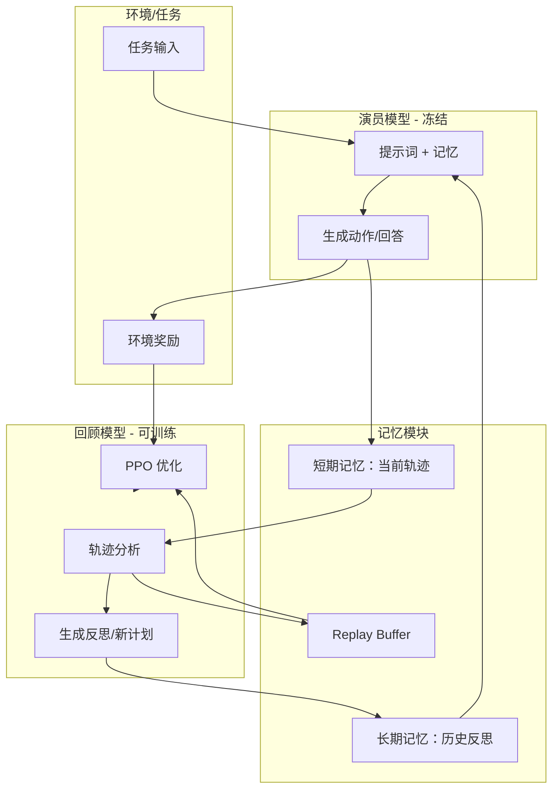

# Retroformer: 基于策略梯度优化的回顾性大型语言代理

## 一、论文基础元数据
- 原文标题：Retroformer: Retrospective Large Language Agents with Policy Gradient Optimization
- 中文译版：Retroformer: 基于策略梯度优化的回顾性大型语言代理
- 发表渠道：预印本 (arXiv)
- 发表时间：2023 (arXiv 提交) / 2025 (提供年份)
- 链接：arXiv:2308.02151
- 作者及核心机构：Weiran Yao, Shelby Heinecke, Juan Carlos Niebles 等；Salesforce Research 等 (基于作者公开信息)
- 研究领域：人工智能 (一级) + 大型语言模型代理/强化学习 (二级)
- 关联数据集：HotPotQA (Distractor Dev Split, 100 个验证任务，英文，多跳问答)

## 二、论文综合评价
### 2.1 量化评分（1-5 分，5 分为最优）
| 评价维度 | 评分 | 备注 |
| -------- | ---- | ---- |
| 📚 理论基础 | ⭐⭐⭐⭐⭐ | 结合 RL 与 LLM Agent，理论扎实 |
| 🎯 问题核心性 | ⭐⭐⭐⭐⭐ | 解决 Agent 无法利用环境奖励梯度学习的痛点 |
| 💡 方法创新性 | ⭐⭐⭐⭐⭐ | 冻结 Actor 优化回顾模型的双模型架构 |
| ⚙️ 技术壁垒 | ⭐⭐⭐⭐ | 需要稳定的 RL 训练环境与奖励塑形 |
| 🧪 实验严谨性 | ⭐⭐⭐⭐ | 基线对比清晰，但数据集单一 |
| 🔧 落地可行性 | ⭐⭐⭐⭐⭐ | 无需微调大模型，成本低，兼容黑盒 API |
| 🚀 应用前景 | ⭐⭐⭐⭐⭐ | 适用于各类需要自我改进的 Agent 场景 |
| 📊 综合评分 | 4.7 | 高效且实用的 Agent 优化范式 |

### 2.2 定性综合评价（≤300 字）
> 核心概括：研究定位、核心价值、差异化优势、关键结论
本研究定位为解决 LLM Agent 无法通过环境奖励进行梯度学习的问题。核心价值在于提出“冻结执行，优化反思”范式，通过策略梯度优化轻量级回顾模型来指导冻结的 Actor 模型。差异化优势在于无需微调大尺寸 Actor，兼容黑盒 API，且训练成本极低（仅 0.53M 参数）。关键结论证明该方法在 HotPotQA 任务上成功率达 53%，优于 Reflexion 基线，且能生成结构化反思，避免重复错误，为 Agent 持续自我改进提供了新路径。

## 三、领域本体论映射
| 核心维度 | 具体内容 |
| -------- | -------- |
| 核心研究对象 | 大型语言模型代理 (LLM Agents) |
| 核心技术路径 | 策略梯度优化 (Policy Gradient) + 双模型协作 (Dual-Model) |
| 数据/载体形态 | 文本轨迹 (Trajectory)、环境奖励 (Reward)、反思提示 (Reflection Prompt) |
| 核心功能目标 | 提升 Agent 任务成功率，实现基于反馈的迭代改进 |
| 验证核心指标 | 成功率 (Success Rate)、平均回合回报 (Average Episode Returns) |

## 四、核心问题与解决方案
### 4.1 待解决的核心问题
1. **领域级根本问题**：现有 LLM Agent 依赖预训练知识，无法利用环境奖励信号进行梯度优化。
2. **现有方法痛点**：ReAct/Reflexion 等方法缺乏显式梯度信号，直接微调大模型成本高且受限。
3. **工程落地卡点**：虚假动作生成、Prompt 长度限制导致上下文溢出、缺乏系统性 Prompt 优化方法。

### 4.2 核心解决方案
- 理论框架：基于强化学习 (RL) 的 Prompt 优化框架。
- 核心架构：双模型设计（冻结 Actor 模型 + 可训练回顾模型）。
- 关键技术：PPO 算法、奖励塑形 (Reward Shaping)、LoRA 微调。
- 创新机制：通过优化回顾模型生成的反思内容来间接优化 Actor 行为，而非直接更新 Actor 参数。

### 4.3 核心优势（量化+定性）
1. 性能优势：5 次 trial 内成功率达 53%，优于 Reflexion 的 50%。
2. 效率优势：仅需微调 0.53M 参数 (占 7b 模型的 0.015%)，训练成本低。
3. 工程优势：兼容黑盒 API (如 GPT-3)，无需访问 Actor 梯度，部署灵活。

## 五、方法与技术架构
### 5.1 核心架构设计
> 文字描述 + 架构图（Mermaid/图片）
架构包含两个主要组件：**演员模型 (Actor)** 负责执行任务，参数冻结；**回顾模型 (Retrospective)** 负责分析轨迹并生成反思，参数可训练。两者通过记忆模块交互，回顾模型利用 PPO 算法基于环境奖励进行优化。

### 5.2 关键技术实现细节
| 技术模块 | 实现路径 | 工程注意事项 |
| -------- | -------- | ------------ |
| 演员模型 | 使用 GPT-3 (text-davinci-003)，温度 T=0，参数冻结 | 需确保 API 调用稳定性，隔离随机性干扰 |
| 回顾模型 | 使用 LongChat-7b，4-bit LoRA 微调，支持 16k 上下文 | 需控制显存占用，确保长上下文处理能力 |
| 优化算法 | PPO (Proximal Policy Optimization)，基于回放缓冲区离线训练 | 奖励信号需塑形 (如使用 F1 分数) 以避免稀疏奖励问题 |
| 记忆管理 | 短期记忆存当前轨迹，长期记忆存反思，存入 Replay Buffer | 需设计有效的存储检索机制，防止上下文溢出 |

### 5.3 架构优缺点
- 优点：
    1. 解耦执行与优化，降低训练成本。
    2. 兼容黑盒模型，适用性广。
    3. 反思机制可解释性强，便于调试。
- 缺点：
    1. 依赖回顾模型的能力上限。
    2. 多轮交互可能增加推理延迟。
    3. 奖励函数设计对性能影响较大。

## 六、实验设计与结果分析
### 6.1 实验基础设置
| 维度 | 内容 |
| ---- | ---- |
| 数据集 | HotPotQA (Distractor Dev Split, 100 个验证任务) |
| 基线方法 | ReAct (无环境奖励学习), Reflexion (基于 verbal feedback) |
| 实验环境 | 基于 Wikipedia 的搜索问答任务环境 |
| 评价指标 | 成功率 (Success Rate), 平均回合回报 (Average Episode Returns) |

### 6.2 核心实验结果
| 方法 | 核心指标 1 (成功率) | 核心指标 2 (回报) | 工程指标（算力/耗时） |
| ---- | --------- | --------- | -------------------- |
| 基线 1 (ReAct) | 待补充 | 待补充 | 待补充 |
| 基线 2 (Reflexion) | 50% | 待补充 | 待补充 |
| 本文方法 (Retroformer) | 53% | 显著优于基线 | 仅训练 0.53M 参数 |

### 6.3 消融实验/鲁棒性分析
| 实验变体 | 指标变化 | 核心结论 |
| -------- | -------- | -------- |
| 冻结回顾模型 | 性能下降 | 证明策略梯度优化回顾模型的有效性 |
| 不同奖励信号 | 收敛速度变化 | F1 分数比二元匹配提供更丰富的梯度信息 |
| 记忆模块移除 | 重复错误增加 | 证明长期记忆对避免重复错误至关重要 |

### 6.4 实验结论（工程视角）
Retroformer 在少量样本（100 任务）下即可展现显著性能提升，且训练参数量极小，适合资源受限场景。强化后的模型能更精准地分配信用，避免无限循环，具有较好的工程落地潜力。

## 七、领域贡献与创新点
| 贡献层级 | 具体内容 |
| -------- | -------- |
| 理论贡献 | 首次将策略梯度优化系统性地应用于 LLM Agent 的 Prompt 优化 |
| 方法/架构贡献 | 提出“冻结执行，优化反思”的双模型协作架构 |
| 数据/工具贡献 | 构建了基于回放缓冲区的离线 RL 训练流程 |
| 实验/验证贡献 | 在 HotPotQA 上验证了方法优于 SOTA (Reflexion) |
| 工程落地贡献 | 提供了无需微调大模型即可提升 Agent 性能的低成本方案 |

## 八、局限性与风险
| 维度 | 具体描述 | 应对思路 |
| ---- | -------- | -------- |
| 学术局限性 | 仅在问答任务验证，多模态或复杂决策任务待验证 | 扩展至其他领域数据集进行泛化测试 |
| 工程落地风险 | 依赖外部 API 稳定性，长上下文可能增加延迟 | 优化记忆压缩算法，本地部署回顾模型 |
| 伦理/合规风险 | 代理可能生成误导性反思或滥用工具 | 增加安全过滤层，监控反思内容合规性 |

## 九、未来研究/落地方向
| 方向类型 | 具体内容 | 优先级 |
| -------- | -------- | ------ |
| 科研拓展 | 探索多智能体协作中的回顾机制 | 高 |
| 工程优化 | 优化回顾模型推理速度，降低延迟 | 高 |
| 跨领域适配 | 适配代码生成、机器人控制等任务 | 中 |

## 十、关键词与术语表
| 语言 | 关键词 |
| ---- | ------ |
| 中文 | 大型语言代理，策略梯度，回顾模型，强化学习，Prompt 优化 |
| 英文 | LLM Agents, Policy Gradient, Retrospective Model, Reinforcement Learning, Prompt Optimization |
| 领域专属术语 | **Actor 模型**：负责执行任务的冻结模型；**回顾模型**：负责生成反思的可训练模型；**奖励塑形**：将稀疏奖励转化为密集信号的技术 |

## 十一、参考文献与关联资源
- 核心参考文献：待补充 (原文未提供具体引用列表)
- 补充阅读：ReAct, Reflexion, PPO 算法相关论文
- 开源代码/工具：待补充 (原文未提供具体链接)

## 十二、阅读者批注
1. **科研启发**：将 RL 应用于 Prompt 优化而非模型参数更新，是一个极具性价比的方向，值得在其他 NLP 任务中推广。
2. **工程落地思考**：双模型架构增加了系统复杂度，需权衡反思带来的性能提升与推理延迟增加之间的关系。
3. **待验证/存疑点**：在更复杂的长程任务中，回顾模型是否能保持稳定的优化效果？奖励函数设计是否通用？
4. **个人/团队应用场景**：适用于需要自动化调试、自我改进的客服机器人或代码辅助工具。

## 十三、阅读元信息
| 维度 | 内容 |
| ---- | ---- |
| 阅读日期 | 2026-04-07 00:21 |
| 阅读人 | xPaperReader AI |
| 文档编号 | arxiv-2308.02151 |
| 版本迭代 | v1.0 |