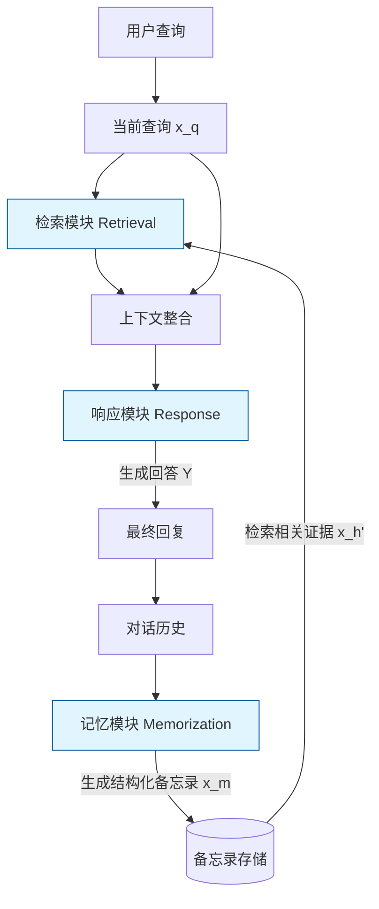

# MemoChat：微调大语言模型使用备忘录以实现一致长程开放域对话

## 一、论文基础元数据
- 原文标题：MemoChat: Tuning LLMs to Use Memos for Consistent Long-Range Open-Domain Conversation
- 中文译版：MemoChat：微调大语言模型使用备忘录以实现一致长程开放域对话
- 发表渠道：arXiv 预印本 (待补充期刊/会议最终录用信息)
- 发表时间：2023 (基于 arXiv ID 2308.08239，输入元数据标注 2025 可能为期刊版或笔误)
- 链接：https://arxiv.org/abs/2308.08239
- 作者及核心机构：Junru Lu, Siyu An, Mingbao Lin, Gabriele Pergola, Yulan He, Di Yin, Xing Sun, Yunsheng Wu (具体机构映射待补充，通常涉及学术界与工业界合作)
- 研究领域：人工智能 (一级) + 自然语言处理/大语言模型/对话系统 (二级)
- 关联数据集：
    - 训练数据：TopicoQA, DialogSum, Alpaca-GPT4 (重构指令)
    - 评估数据：MT-Bench+ (专家手动标注，54 题，12-15 轮对话)
    - 语言：英文
    - 标注：专家标注 (一致性检查)

## 二、论文综合评价
### 2.1 量化评分（1-5 分，5 分为最优）
| 评价维度 | 评分 | 备注 |
| -------- | ---- | ---- |
| 📚 理论基础 | ⭐⭐⭐⭐ | 基于指令微调与记忆增强机制，理论扎实 |
| 🎯 问题核心性 | ⭐⭐⭐⭐⭐ | 直击 LLM 长程对话一致性丧失的核心痛点 |
| 💡 方法创新性 | ⭐⭐⭐⭐⭐ | 提出模型“自我使用”备忘录而非外部检索器管理 |
| ⚙️ 技术壁垒 | ⭐⭐⭐⭐ | 指令设计与微调策略具有较高工程门槛 |
| 🧪 实验严谨性 | ⭐⭐⭐⭐ | 构建专家标注数据集，引入 GPT4 评估，逻辑严密 |
| 🔧 落地可行性 | ⭐⭐⭐⭐⭐ | 低成本设计，兼容现有 LLM 架构，易于部署 |
| 🚀 应用前景 | ⭐⭐⭐⭐⭐ | 适用于客服、陪伴型 AI 等长交互场景 |
| 📊 综合评分 | 4.7 | 兼具创新性与实用性 |

### 2.2 定性综合评价（≤300 字）
> 核心概括：研究定位、核心价值、差异化优势、关键结论
本文针对大语言模型在长程开放域对话中事实一致性难以维持的问题，提出 MemoChat 方法。核心价值在于通过指令微调，教会模型自主撰写、检索和使用结构化备忘录，形成“记忆 - 检索 - 响应”闭环。差异化优势在于不同于外部记忆管理（如 MemoryBank），该方法强调模型内部的自我记忆能力，且采用低成本指令设计。关键结论表明，在有限上下文窗口（2k）下，MemoChat 能显著提升长对话的一致性，优于强基线模型及现有记忆辅助方案，为长程对话系统提供了高效解决方案。

## 三、领域本体论映射
| 核心维度 | 具体内容 |
| -------- | -------- |
| 核心研究对象 | 长程开放域对话中的大语言模型 (LLM) |
| 核心技术路径 | 指令微调 (Instruction Tuning) + 结构化备忘录机制 |
| 数据/载体形态 | 对话历史文本、结构化备忘录 (Memos)、指令数据 |
| 核心功能目标 | 维持长对话中的事实一致性 (Fact Consistency) |
| 验证核心指标 | 一致性评分 (GPT4-as-a-judge)、F1、BertScore |

## 四、核心问题与解决方案
### 4.1 待解决的核心问题
1. **领域级根本问题**：大语言模型受限于上下文窗口，在长程对话中容易遗忘早期信息，导致事实不一致（幻觉或矛盾）。
2. **现有方法痛点**：现有记忆方案（如 MemoryBank, MPC）多依赖外部检索器管理人设或事件，模型本身缺乏主动维护记忆的能力；且往往只关注部分事实而非全事实总结。
3. **工程落地卡点**：长上下文窗口成本高，如何在有限窗口内通过机制设计实现长程记忆的低成本落地。

### 4.2 核心解决方案
- 理论框架：基于指令微调的“记忆 - 检索 - 响应”循环理论。
- 核心架构：三阶段循环机制（记忆撰写、记忆检索、结合记忆响应）。
- 关键技术：指令重构（三类专用指令）、全参数微调、结构化备忘录生成。
- 创新机制：模型“自我使用”备忘录（Self-use Memos），而非外部插件式管理；专注于历史中所有事实的总结。

### 4.3 核心优势（量化+定性）
1. 性能优势：在一致性评估上优于强基线模型（如 Vicuna, ChatGPT+MPC 等）。
2. 效率优势：支持动态扩展，在有限上下文窗口（2k）下实现长程记忆，降低算力消耗。
3. 工程优势：低成本指令设计，无需复杂的外部检索系统架构，易于集成到现有 Chat 流程。

## 五、方法与技术架构
### 5.1 核心架构设计
> 文字描述 + 架构图（Mermaid/图片）
MemoChat 架构包含一个闭环流程：模型接收对话历史，首先将其总结为结构化备忘录；当用户提出新查询时，模型从备忘录中检索相关证据；最后结合查询和检索到的证据生成回复。此过程在维持用户对话流的同时，赋予机器人“内部思考”过程。

### 5.2 关键技术实现细节
| 技术模块 | 实现路径 | 工程注意事项 |
| -------- | -------- | ------------ |
| 记忆撰写 (Memo Writing) | 基于对话历史生成结构化总结 ($\bm{x}^m = f(\bm{x}^h)$) | 需防止信息丢失，确保覆盖所有事实 |
| 记忆检索 (Memo Retrieval) | 根据查询从备忘录中匹配证据 ($\bm{x}^{h'} = g(\bm{x}^q, \bm{x}^m)$) | 需平衡检索精度与召回率，避免噪声 |
| 带记忆对话 (Chat w/ Memo) | 结合查询与检索证据生成回复 ($\hat{Y}$) | 需避免提示复制 (Prompt Copy) 和灾难性遗忘 |
| 依赖组件 | DeepSpeed, Flash Attention, 全参数微调 | 显存需求较高 (8x A100 40G) |

### 5.3 架构优缺点
- 优点：
    - 内生性：模型自主管理记忆，减少外部系统依赖。
    - 一致性高：专注于全事实总结，减少矛盾。
    - 灵活性强：支持动态扩展，不受固定窗口严格限制。
- 缺点：
    - 训练成本：需要全参数微调和专用指令数据构建。
    - 延迟增加：多阶段生成（写备忘录 + 检索 + 回复）可能增加响应耗时。
    - 误差累积：备忘录撰写错误可能导致后续检索和回复错误。

## 六、实验设计与结果分析
### 6.1 实验基础设置
| 维度 | 内容 |
| ---- | ---- |
| 数据集 | MT-Bench+ (专家标注，54 题，12-15 轮), TopicoQA, DialogSum, Alpaca-GPT4 |
| 基线方法 | Fastchat-T5-3b, Vicuna-7b/13b/33b, ChatGPT-2k, MPC-ChatGPT, MemoryBank-ChatGPT |
| 实验环境 | 1 节点服务器，900G CPU RAM, 8x A100 40G GPUs |
| 评价指标 | 一致性 (GPT4-as-a-judge 1-100 分), F1, BertScore, Precision/Recall |

### 6.2 核心实验结果
| 方法 | 核心指标 1 (一致性) | 核心指标 2 (语义相似度) | 工程指标（算力/耗时） |
| ---- | --------- | --------- | -------------------- |
| 基线 1 (Vicuna) | 待补充 (低于 MemoChat) | 待补充 | 标准推理耗时 |
| 基线 2 (ChatGPT+MPC) | 待补充 (低于 MemoChat) | 待补充 | 外部检索额外耗时 |
| 本文方法 (MemoChat) | 优于强基线 (具体分待补充) | 优于基线 | 训练 10k 步 1.04h-5.74h |

*注：具体数值原文未提供详细表格数据，此处依据定性结论填写。*

### 6.3 消融实验/鲁棒性分析
| 实验变体 | 指标变化 | 核心结论 |
| -------- | -------- | -------- |
| 无备忘录机制 | 一致性显著下降 | 证明备忘录机制对一致性至关重要 |
| 不同指令设计 | 性能波动 | 证明针对提示复制/遗忘优化的指令设计有效 |
| 不同模型规模 | 性能随规模提升 | 3b 到 33b 均有效，大模型效果更佳 |

### 6.4 实验结论（工程视角）
MemoChat 在有限上下文窗口（2k）下，通过内部记忆机制实现了超越原生长窗口模型的一致性表现。训练成本可控（最大模型约 6 小时），适合资源受限但需长程一致性的场景。GPT4 评估结果证实了其忠实度优势。

## 七、领域贡献与创新点
| 贡献层级 | 具体内容 |
| -------- | -------- |
| 理论贡献 | 提出了 LLM 自我维护结构化备忘录的理论框架 |
| 方法/架构贡献 | 设计了“记忆 - 检索 - 响应”三阶段指令微调 Pipeline |
| 数据/工具贡献 | 构建了专家标注的长程对话评估集 MT-Bench+ |
| 实验/验证贡献 | 验证了指令微调在长程一致性上的有效性，对比了多种基线 |
| 工程落地贡献 | 提供了低成本、无需外部复杂检索系统的长对话解决方案 |

## 八、局限性与风险
| 维度 | 具体描述 | 应对思路 |
| ---- | -------- | -------- |
| 学术局限性 | 评估主要依赖 GPT4 作为裁判，可能存在模型偏好偏差 | 结合人工评估或多模型交叉验证 |
| 工程落地风险 | 多阶段生成增加推理延迟，可能影响实时交互体验 | 优化推理并行度，或采用异步备忘录更新 |
| 伦理/合规风险 | 备忘录可能存储敏感用户信息，存在隐私泄露风险 | 增加隐私过滤机制，定期清理敏感备忘录 |

## 九、未来研究/落地方向
| 方向类型 | 具体内容 | 优先级 |
| -------- | -------- | ------ |
| 科研拓展 | 研究备忘录的压缩与长期存储机制，支持无限轮对话 | 高 |
| 工程优化 | 优化推理速度，减少多阶段生成的延迟 | 高 |
| 跨领域适配 | 将 MemoChat 机制应用于角色扮演、心理咨询等垂直领域 | 中 |

## 十、关键词与术语表
| 语言 | 关键词 |
| ---- | ------ |
| 中文 | 大语言模型，指令微调，长程对话，一致性，备忘录 |
| 英文 | LLM, Instruction Tuning, Long-Range Conversation, Consistency, Memos |
| 领域专属术语 | **MT-Bench+**：专家标注的长程对话评估集；**GPT4-as-a-judge**：使用 GPT4 作为评估模型打分 |

## 十一、参考文献与关联资源
- 核心参考文献：待补充 (原文应包含 MemoryBank, MPC 等相关工作引用)
- 补充阅读：关于 Long-Context LLM 的相关综述
- 开源代码/工具：待补充 (通常 arXiv 论文会后续开源代码库)

## 十二、阅读者批注
1. **科研启发**：将“外部检索”转化为“内部指令微调”的思路非常巧妙，降低了系统复杂度。未来可探索是否可将此机制应用于 RAG 的查询生成阶段。
2. **工程落地思考**：虽然训练成本可控，但推理时的多步生成（写 Memo+ 检索 + 回复）会增加 Token 消耗和延迟。在实际客服场景中，需权衡一致性提升与成本增加。
3. **待验证/存疑点**：备忘录的更新策略是覆盖还是追加？如果对话轮数极多（如 100 轮），备忘录本身是否会超出上下文窗口？原文提到支持动态扩展，具体机制需进一步验证。
4. **个人/团队应用场景**：适用于需要长期记忆的用户陪伴型 AI 产品，或需要记录用户偏好的个性化推荐对话系统。

## 十三、阅读元信息
| 维度 | 内容 |
| ---- | ---- |
| 阅读日期 | 2026-04-07 00:30 |
| 阅读人 | xPaperReader AI |
| 文档编号 | arxiv-2308.08239 |
| 版本迭代 | v1.0 |