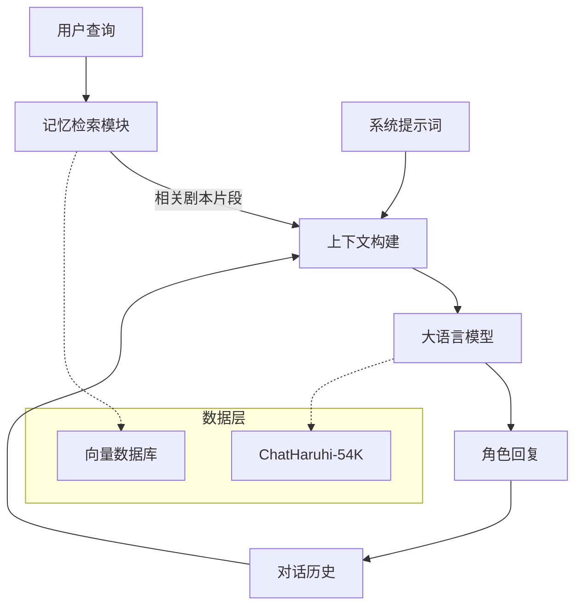

# ChatHaruhi：通过大语言模型在现实中复活动漫角色

## 一、论文基础元数据
- 原文标题：ChatHaruhi: Reviving Anime Character in Reality via Large Language Model
- 中文译版：ChatHaruhi：通过大语言模型在现实中复活动漫角色
- 发表渠道：预印本（arXiv）
- 发表时间：2023 年 8 月（基于 arXiv ID 2308 推断，元数据标注 2025 可能存在偏差）
- 链接：https://arxiv.org/abs/2308.09597
- 作者及核心机构：Cheng Li 等（DataWhale 社区、Luotuo 开源社区、商汤、清华、浙大等）
- 研究领域：自然语言处理（NLP）+ 大语言模型应用（LLM Application）
- 关联数据集：ChatHaruhi-54K（54,726 条对话，32 个角色，中英文混合，人工 + 自动标注）

## 二、论文综合评价
### 2.1 量化评分（1-5 分，5 分为最优）
| 评价维度 | 评分 | 备注 |
| -------- | ---- | ---- |
| 📚 理论基础 | ⭐⭐⭐ | 基于现有 LLM 能力组合，理论创新有限 |
| 🎯 问题核心性 | ⭐⭐⭐⭐ | 解决了角色扮演中的一致性与记忆问题 |
| 💡 方法创新性 | ⭐⭐⭐ | 提示词 + 检索 + 微调的组合策略 |
| ⚙️ 技术壁垒 | ⭐⭐⭐ | 工程实现为主，算法复杂度适中 |
| 🧪 实验严谨性 | ⭐⭐⭐ | 定性分析充分，定量结果待补充 |
| 🔧 落地可行性 | ⭐⭐⭐⭐⭐ | 开源代码完善，社区驱动，易于复现 |
| 🚀 应用前景 | ⭐⭐⭐⭐ | 娱乐、教育、心理陪伴等场景广阔 |
| 📊 综合评分 | 3.7 | 工程实践价值高于理论突破 |

### 2.2 定性综合评价（≤300 字）
> 核心概括：本研究定位为大语言模型的角色扮演应用工程实践。核心价值在于构建了高质量的 ChatHaruhi-54K 数据集，并提出了一套结合系统提示词、记忆检索与模型微调的完整解决方案。差异化优势在于社区驱动的开发模式与跨语言检索能力。关键结论表明，“完整提示词 + 微调”能显著增强模型的角色一致性，但长期记忆与定量评估仍需后续迭代。

## 三、领域本体论映射
| 核心维度 | 具体内容 |
| -------- | -------- |
| 核心研究对象 | 虚构角色（动漫、影视、小说）的语言风格与行为逻辑 |
| 核心技术路径 | 上下文学习（ICL）+ 检索增强生成（RAG）+ 监督微调（SFT） |
| 数据/载体形态 | 剧本对话文本、向量数据库、微调后的权重文件 |
| 核心功能目标 | 实现高保真度的角色沉浸式对话体验 |
| 验证核心指标 | 角色一致性（余弦相似度）、对话质量（人类/自动评估） |

## 四、核心问题与解决方案
### 4.1 待解决的核心问题
1. **领域级根本问题**：通用大语言模型缺乏特定角色的背景知识与性格特征，难以维持长期一致的角色扮演。
2. **现有方法痛点**：仅靠提示词（Prompt）容易遗忘设定；仅靠微调容易过拟合且丧失通用能力；上下文窗口限制导致长剧情记忆丢失。
3. **工程落地卡点**：高质量角色对话数据稀缺；跨语言角色检索困难；本地模型部署成本高。

### 4.2 核心解决方案
- 理论框架：结合检索增强生成（RAG）与监督微调（SFT）的混合架构。
- 核心架构：用户查询 -> 向量检索 -> 构建上下文（记忆 + 提示词） -> LLM 生成。
- 关键技术：改进的系统提示词（鼓励复用原著台词）、基于嵌入的记忆检索、数据增强（剧本分割与模拟对话生成）。
- 创新机制：针对 RLHF 模型不重复内容的倾向，在 Prompt 中显式允许复用原著台词；跨语言蒸馏检索（Luotuo-Bert）。

### 4.3 核心优势（量化+定性）
1. 性能优势：微调后的本地模型（ChatGLM2-6B）在角色一致性上接近商用模型水平。
2. 效率优势：检索机制限制了上下文长度（1500 tokens），降低了推理成本。
3. 工程优势：开源数据集与模型权重，支持多种后端切换，社区协作迭代快。

## 五、方法与技术架构
### 5.1 核心架构设计
系统采用分层处理架构，首先通过检索模块获取相关剧情记忆，随后与系统提示词、对话历史拼接，输入至语言模型生成回复。

### 5.2 关键技术实现细节
| 技术模块 | 实现路径 | 工程注意事项 |
| -------- | -------- | ------------ |
| 系统提示词 | 定义身份、性格、鼓励复用原著台词 | 需针对 RLHF 模型调整重复惩罚策略 |
| 记忆检索 | 使用 Embedding 模型（Ada-002/Luotuo）检索 Top-K 片段 | 限制检索内容在 1500 tokens 内，避免溢出 |
| 数据增强 | 利用 ChatGPT/Claude 生成模拟问题，分割剧本对话 | 需清洗噪声，确保三元组质量 |
| 模型微调 | 基于 ChatGLM2-6B 进行 SFT，3 epochs | 需平衡原始对话与模拟对话的比例 |

### 5.3 架构优缺点
- 优点：模块化设计，易于替换模型后端；检索机制有效缓解上下文限制；数据集开源贡献大。
- 缺点：检索依赖向量数据库，增加系统复杂度；长期记忆仍受限于窗口大小；定量评估体系尚不完善。

## 六、实验设计与结果分析
### 6.1 实验基础设置
| 维度 | 内容 |
| ---- | ---- |
| 数据集 | ChatHaruhi-54K（27 个角色用于评估，排除原神系列） |
| 基线方法 | ChatGPT（仅提示词）、ChatGLM2（仅提示词）、ChatGLM2（微调） |
| 实验环境 | 4 张 A100 GPU，本地部署 |
| 评价指标 | 余弦相似度（角色一致性）、人工评估（对话质量） |

### 6.2 核心实验结果
| 方法 | 核心指标 1（角色一致性） | 核心指标 2（对话质量） | 工程指标（算力/耗时） |
| ---- | --------- | --------- | -------------------- |
| ChatGPT + 提示词 | 高（定性） | 高 | 依赖 API，耗时低 |
| ChatGLM2 + 提示词 | 中 | 中 | 本地部署，耗时中 |
| 本文方法（微调 + 提示词） | 高（内化提示词） | 高 | 4xA100 训练，推理快 |
| *注：具体定量数值原文标注为“正在进行中”* | 待补充 | 待补充 | 待补充 |

### 6.3 消融实验/鲁棒性分析
| 实验变体 | 指标变化 | 核心结论 |
| -------- | -------- | -------- |
| Model-A（仅原始对话微调） | 效果较好 | 原始数据质量关键 |
| Model-B（全量数据微调） | 效果更优 | 模拟数据有助于泛化 |
| 无检索机制 | 角色一致性下降 | 记忆检索对背景知识至关重要 |

### 6.4 实验结论（工程视角）
微调能有效帮助本地模型内化提示词信息，减少对长上下文的依赖；检索机制是维持角色背景一致性的必要组件；当前定量评估体系尚需完善，定性结果已验证可行性。

## 七、领域贡献与创新点
| 贡献层级 | 具体内容 |
| -------- | -------- |
| 理论贡献 | 验证了 RAG 与 SFT 结合在角色扮演任务中的有效性 |
| 方法/架构贡献 | 提出了针对角色复用的提示词优化策略与记忆检索限制机制 |
| 数据/工具贡献 | 开源 ChatHaruhi-54K 数据集及处理工具链 |
| 实验/验证贡献 | 建立了基于嵌入相似度的角色一致性自动评估方法 |
| 工程落地贡献 | 提供了可复现的开源代码与多模型后端支持 |

## 八、局限性与风险
| 维度 | 具体描述 | 应对思路 |
| ---- | -------- | -------- |
| 学术局限性 | 定量评估结果未完成，用户研究缺失 | 后续版本补充详细评估报告与用户反馈 |
| 工程落地风险 | 长期记忆编码不足，上下文窗口限制 | 研究长期记忆总结机制，优化向量检索策略 |
| 伦理/合规风险 | 角色版权潜在风险，生成内容不可控 | 引入宪法式约束，过滤敏感内容，遵守版权规范 |

## 九、未来研究/落地方向
| 方向类型 | 具体内容 | 优先级 |
| -------- | -------- | ------ |
| 科研拓展 | 长期记忆编码与总结机制研究 | 高 |
| 工程优化 | 重构为 API 形式，简化调用流程（v2.0） | 高 |
| 跨领域适配 | 适配更多语言与文化背景的角色 | 中 |

## 十、关键词与术语表
| 语言 | 关键词 |
| ---- | ------ |
| 中文 | 角色扮演、大语言模型、检索增强生成、微调、数据集 |
| 英文 | Role-Playing, LLM, RAG, Fine-tuning, Dataset |
| 领域专属术语 | 系统提示词（System Prompt）：定义模型行为与身份的指令；记忆检索（Memory Retrieval）：基于向量相似度获取相关上下文的技术 |

## 十一、参考文献与关联资源
- 核心参考文献：待补充（原文主要引用基础 LLM 相关文献）
- 补充阅读：ChatGLM2 技术报告，LangChain 相关文档
- 开源代码/工具：GitHub (LC1332/Chat-Haruhi-Suzumiyah), HuggingFace 模型库

## 十二、阅读者批注
1. **科研启发**：数据增强策略（利用大模型生成模拟对话）可有效解决特定领域数据稀缺问题，值得在其他垂直任务中借鉴。
2. **工程落地思考**：社区驱动模式加速了项目迭代，但需建立更严格的质量控制机制以确保数据一致性。
3. **待验证/存疑点**：定量评估的具体指标计算方法未完全公开，需等待后续版本验证其可靠性。
4. **个人/团队应用场景**：可应用于客服个性化、教育助手拟人化、游戏 NPC 交互等场景。

## 十三、阅读元信息
| 维度 | 内容 |
| ---- | ---- |
| 阅读日期 | 2026-04-07 00:39 |
| 阅读人 | xPaperReader AI |
| 文档编号 | arxiv-2308.09597 |
| 版本迭代 | v1.0 |