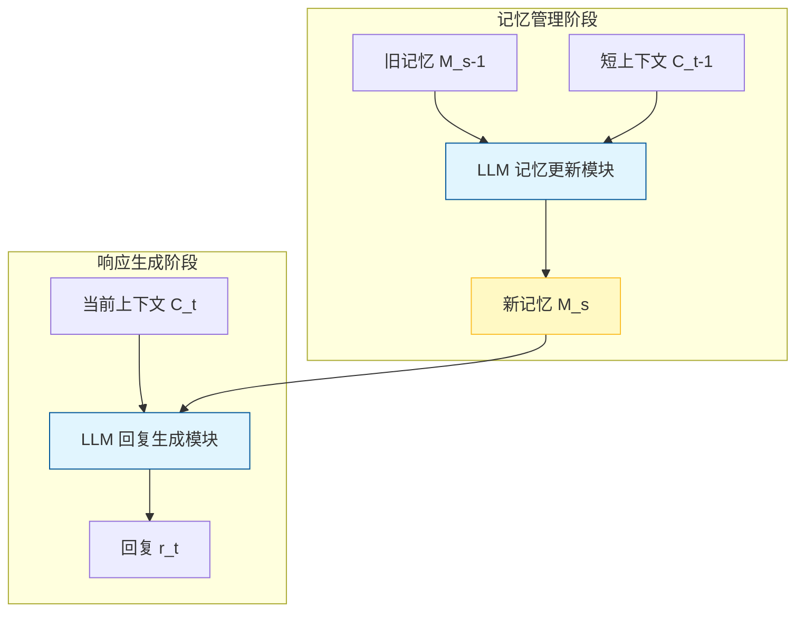

# 递归摘要实现大语言模型长期对话记忆

## 一、论文基础元数据
- 原文标题：Recursively Summarizing Enables Long-Term Dialogue Memory in Large Language Models
- 中文译版：递归摘要实现大语言模型长期对话记忆
- 发表渠道：预印本（arXiv）
- 发表时间：2023-08（基于 arXiv ID 2308 推断）/ 2025（输入元数据标注）
- 链接：arXiv:2308.15022
- 作者及核心机构：Qingyue Wang, Yanhe Fu, Yanan Cao, Shuai Wang, Zhiliang Tian, Liang Ding（机构信息原文未提及，待补充）
- 研究领域：自然语言处理（一级）+ 对话系统与记忆机制（二级）
- 关联数据集：Multi-Session Chat (MSC) / 最大的人工长对话数据集 / 英语 / 人工标注记忆

## 二、论文综合评价
### 2.1 量化评分（1-5 分，5 分为最优）
| 评价维度 | 评分 | 备注 |
| -------- | ---- | ---- |
| 📚 理论基础 | ⭐⭐⭐⭐ | 基于 In-Context Learning 与摘要生成理论 |
| 🎯 问题核心性 | ⭐⭐⭐⭐⭐ | 直击 LLM 长上下文遗忘痛点 |
| 💡 方法创新性 | ⭐⭐⭐⭐ | 递归摘要机制巧妙，无需额外训练 |
| ⚙️ 技术壁垒 | ⭐⭐⭐ | 依赖现有 LLM 能力，实现门槛较低 |
| 🧪 实验严谨性 | ⭐⭐⭐⭐ | 多基线对比，多模型验证，但缺人工评估 |
| 🔧 落地可行性 | ⭐⭐⭐⭐ | 无需微调，但需考虑 API 成本 |
| 🚀 应用前景 | ⭐⭐⭐⭐⭐ | 适用于所有需要长记忆的对话场景 |
| 📊 综合评分 | 4.3 | 轻量级解决方案，性价比高 |

### 2.2 定性综合评价（≤300 字）
> 核心概括：本研究定位为解决大语言模型在长程对话中的记忆遗忘问题。核心价值在于提出了一种无需额外训练或检索工具的“递归摘要记忆”机制，将记忆管理转化为文本生成任务。差异化优势在于生成的记忆比人工标注的黄金记忆更流畅、更易被模型利用，且具备极强的少样本学习能力（One-shot 显著提升性能）。关键结论表明，该方法在长会话后期表现优于全上下文输入及人工记忆基线，有效突破了上下文窗口限制，但需警惕递归过程中可能产生的幻觉与误差累积风险。

## 三、领域本体论映射
| 核心维度 | 具体内容 |
| -------- | -------- |
| 核心研究对象 | 长程开放域对话系统中的记忆保持机制 |
| 核心技术路径 | 递归摘要（Recursively Summarizing）+ In-Context Learning |
| 数据/载体形态 | 多会话文本对话记录、文本化记忆摘要 |
| 核心功能目标 | 在超出上下文窗口限制下维持对话一致性与长期信息召回 |
| 验证核心指标 | BLEU, F1, DISTINCT, 记忆准确率 (Mem_F1/Prec./Recall) |

## 四、核心问题与解决方案
### 4.1 待解决的核心问题
1. **领域级根本问题**：大语言模型在长程对话中难以保持长期记忆，导致回复不一致或遗忘早期关键信息。
2. **现有方法痛点**：检索增强方法难以有效存储/检索大量话语；传统记忆增强方法依赖人工定制模块或大量标注数据。
3. **工程落地卡点**：上下文窗口限制（Context Window Limit）导致无法输入全部历史对话；全上下文输入易导致模型关注局部信息。

### 4.2 核心解决方案
- 理论框架：将记忆管理视为序列生成任务，利用 LLM 自身能力维护记忆状态。
- 核心架构：双角色架构（记忆管理 + 响应生成）。
- 关键技术：递归更新记忆状态（$M_{s} = LLM(C_{t-1}, M_{s-1}, P_{m})$）。
- 创新机制：利用递归摘要压缩历史信息，无需额外检索器或微调，支持 One-shot 增强。

### 4.3 核心优势（量化+定性）
1. 性能优势：在 Session 4 & 5 后期会话中，F1 及 BLEU 指标优于全上下文及黄金记忆基线。
2. 效率优势：无需训练额外模块，直接调用 API 即可实现；记忆占用空间远小于全上下文。
3. 工程优势：生成的记忆比人工标注更连贯，更适合作为 Prompt 被 LLM 理解；具备跨模型鲁棒性。

## 五、方法与技术架构
### 5.1 核心架构设计
> 文字描述：系统分为记忆更新与回复生成两个阶段。在每个会话结束时，模型结合旧记忆与新上下文生成更新后的记忆摘要；在生成回复时，模型结合当前上下文与最新记忆进行推理。

### 5.2 关键技术实现细节
| 技术模块 | 实现路径 | 工程注意事项 |
| -------- | -------- | ------------ |
| 记忆更新模块 | 输入旧记忆 + 上一轮上下文 + 提示词 $P_m$，输出更新摘要 | 需设计提示词防止信息丢失，控制摘要长度 |
| 回复生成模块 | 输入当前上下文 + 最新记忆 + 提示词 $P_r$，输出回复 | 确保记忆优先权，避免被当前上下文淹没 |
| 依赖组件 | 预训练大语言模型（如 ChatGPT, text-davinci-003） | 需考虑 API 调用成本与延迟 |

### 5.3 架构优缺点
- 优点：无需微调，实现简单；生成的记忆连贯性好；有效突破上下文长度限制。
- 缺点：存在幻觉风险；递归过程可能导致误差累积；依赖 API 成本较高。

## 六、实验设计与结果分析
### 6.1 实验基础设置
| 维度 | 内容 |
| ---- | ---- |
| 数据集 | Multi-Session Chat (MSC) |
| 基线方法 | All Context, Part Context, Gold Memory |
| 实验环境 | ChatGPT (gpt-3.5-turbo), text-davinci-003 |
| 评价指标 | BLEU-1/2, F1, DISTINCT-1/2, 记忆准确率 (Prec./Recall/Mem_F1) |

### 6.2 核心实验结果
| 方法 | 核心指标 1 (Session 5 F1) | 核心指标 2 (Mem_F1 One-shot) | 工程指标（算力/耗时） |
| ---- | --------- | --------- | -------------------- |
| 基线 1 (All Context) | 15.84 | - | 高（上下文长） |
| 基线 2 (Gold Memory) | 16.36 | - | 中（需人工标注） |
| 本文方法 (Predicted) | 16.25 | 57.06% (Session 4) | 中（额外摘要生成） |

*注：文中指出本文方法在 BLEU 和 DISTINCT 上优于 Gold Memory，且后期会话表现最佳。*

### 6.3 消融实验/鲁棒性分析
| 实验变体 | 指标变化 | 核心结论 |
| -------- | -------- | -------- |
| Zero-shot vs One-shot | Mem_F1 从~29% 升至~57% | 上下文学习能显著提升记忆预测精度 |
| ChatGPT vs text-davinci | 性能均显著改进 | 方法具备跨模型鲁棒性，不依赖特定模型 |
| 早期会话 vs 后期会话 | 后期会话记忆评估分数更高 | 模型生成长文本能力有助于匹配评估指标 |

### 6.4 实验结论（工程视角）
自动生成的递归摘要记忆在长程对话管理中可行且有效，尤其在后期会话中优于人工标注记忆。但需权衡 API 调用成本，并注意记忆更新过程中的信息保真度。

## 七、领域贡献与创新点
| 贡献层级 | 具体内容 |
| -------- | -------- |
| 理论贡献 | 验证了将记忆管理转化为文本生成任务的可行性 |
| 方法/架构贡献 | 提出递归摘要记忆机制，无需额外检索器或微调 |
| 数据/工具贡献 | 在 MSC 数据集上验证了生成记忆优于黄金记忆 |
| 实验/验证贡献 | 证明了 One-shot 上下文学习对记忆任务的显著增强作用 |
| 工程落地贡献 | 提供了一种轻量级突破上下文窗口限制的思路 |

## 八、局限性与风险
| 维度 | 具体描述 | 应对思路 |
| ---- | -------- | -------- |
| 学术局限性 | 仅使用自动评估指标，缺乏人工评估对话质量 | 后续引入人类偏好评估（Human Preference） |
| 工程落地风险 | 递归摘要可能导致误差累积与幻觉（Hallucination） | 研究记忆压缩保真度，引入验证机制 |
| 伦理/合规风险 | 未明确提及，但涉及用户对话数据记忆存储 | 需符合数据隐私保护法规，支持记忆遗忘 |

## 九、未来研究/落地方向
| 方向类型 | 具体内容 | 优先级 |
| -------- | -------- | ------ |
| 科研拓展 | 探索该方法在故事生成等其他长上下文任务中的效果 | 中 |
| 工程优化 | 使用本地监督微调模型替代昂贵在线 API 执行摘要 | 高 |
| 跨领域适配 | 研究如何减少记忆生成中的幻觉与误差累积 | 高 |

## 十、关键词与术语表
| 语言 | 关键词 |
| ---- | ------ |
| 中文 | 递归摘要、长期对话记忆、大语言模型、上下文学习、记忆管理 |
| 英文 | Recursively Summarizing, Long-Term Dialogue Memory, LLM, In-Context Learning, Memory Management |
| 领域专属术语 | **黄金记忆 (Gold Memory)**：人工标注的记忆片段；**递归摘要 (Recursive Summarizing)**：结合旧记忆与新上下文生成更新记忆的策略 |

## 十一、参考文献与关联资源
- 核心参考文献：待补充（原文未提供具体参考文献列表）
- 补充阅读：Multi-Session Chat (MSC) 数据集相关论文
- 开源代码/工具：待补充（原文未提及代码开源情况）

## 十二、阅读者批注
1. **科研启发**：记忆管理不必局限于检索数据库，利用 LLM 自身的生成能力进行有损压缩（摘要）可能更符合 LLM 的理解模式。
2. **工程落地思考**：在实际应用中，需设计“记忆校验”环节，防止错误记忆污染后续对话；成本优化是关键，可尝试用小模型做摘要，大模型做回复。
3. **待验证/存疑点**：递归摘要的误差累积效应在超过 10 轮会话后是否会导致记忆完全失真？原文实验仅覆盖 5 个会话。
4. **个人/团队应用场景**：适用于个人助理、心理咨询机器人等需要长期记住用户偏好和历史的场景。

## 十三、阅读元信息
| 维度 | 内容 |
| ---- | ---- |
| 阅读日期 | 2026-04-07 00:48 |
| 阅读人 | xPaperReader AI |
| 文档编号 | arxiv-2308.15022 |
| 版本迭代 | v1.0 |