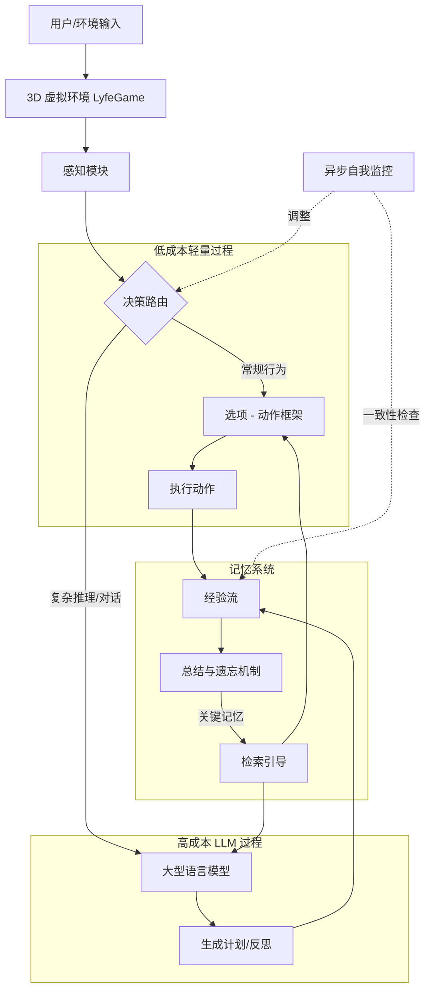

# Lyfe Agents：低成本实时社交交互的生成式智能体

## 一、论文基础元数据
- 原文标题：Lyfe Agents: Generative agents for low-cost real-time social interactions
- 中文译版：Lyfe Agents：低成本实时社交交互的生成式智能体
- 发表渠道：arXiv 预印本 (cs.HC)
- 发表时间：2023 年 10 月 3 日 (根据 arXiv ID 2310.02172 及正文日期)
- 链接：arXiv:2310.02172
- 作者及核心机构：
    - Zhao Kaiya, Michelangelo Naim, Jovana Kondic, Manuel Cortes, Guangyu Robert Yang, Andrew Ahn (Massachusetts Institute of Technology)
    - Jiaxin Ge (Peking University)
    - Shuying Luo (LyfeAL)
    - *注：Jovana Kondic, Manuel Cortes, Guangyu Robert Yang, Andrew Ahn 标注为同等贡献*
- 研究领域：人工智能 (一级) + 人机交互/多智能体系统 (二级)
- 关联数据集：LyfeGame 3D 虚拟环境平台 (自定义/规模待补充/语言未明确/标注待补充)

## 二、论文综合评价
### 2.1 量化评分（1-5 分，5 分为最优）
| 评价维度 | 评分 | 备注 |
| -------- | ---- | ---- |
| 📚 理论基础 | ⭐⭐⭐⭐ | 基于资源理性 (Resource-Rational) 与脑启发设计，理论依据充分 |
| 🎯 问题核心性 | ⭐⭐⭐⭐⭐ | 直指生成式智能体高成本、高延迟的痛点 |
| 💡 方法创新性 | ⭐⭐⭐⭐ | 提出选项 - 动作框架及总结 - 遗忘记忆机制，具有差异化 |
| ⚙️ 技术壁垒 | ⭐⭐⭐ | 主要依赖现有 LLM 架构优化，工程集成度较高 |
| 🧪 实验严谨性 | ⭐⭐⭐ | 基于提供的节选内容，具体实验数据表缺失，仅见摘要声明 |
| 🔧 落地可行性 | ⭐⭐⭐⭐⭐ | 明确强调低成本与实时性，落地导向明显 |
| 🚀 应用前景 | ⭐⭐⭐⭐⭐ | 虚拟世界社交、游戏 NPC、实时交互场景潜力巨大 |
| 📊 综合评分 | 4.3 | 低成本实时社交智能体框架，资源理性设计显著降低计算开销 |

### 2.2 定性综合评价（≤300 字）
> 核心概括：研究定位、核心价值、差异化优势、关键结论
本文针对现有生成式智能体（Generative Agents）计算成本高、延迟大难以实现实时交互的问题，提出了 Lyfe Agents 框架。核心价值在于通过“资源理性”原则，大幅降低 LLM 调用频率。差异化优势体现在三项关键创新：选项 - 动作框架、异步自我监控、总结与遗忘记忆机制。关键结论声称在保持智能体自主性与社交推理能力的同时，计算成本比现有方案（如 Park et al. 2023）降低 10-100 倍，支持实时多人互动场景（如虚拟破案）。

## 三、领域本体论映射
| 核心维度 | 具体内容 |
| -------- | -------- |
| 核心研究对象 | 生成式智能体 (Generative Agents) |
| 核心技术路径 | 脑启发设计 + 资源理性优化 + 混合架构 (LLM+ 轻量过程) |
| 数据/载体形态 | 3D 虚拟环境 (LyfeGame)、文本记忆流、行为日志 |
| 核心功能目标 | 低成本、实时响应、自主社交交互、目标导向行为 |
| 验证核心指标 | 计算成本 (Computational Cost)、响应延迟 (Latency)、社交推理能力 |

## 四、核心问题与解决方案
### 4.1 待解决的核心问题
1. **领域级根本问题**：现有基于 LLM 的智能体缺乏真正的自主性（Autonomy），且计算开销巨大，难以支撑实时人机交互。
2. **现有方法痛点**：如 Park et al. (2023) 等方法，从设定目的地到评估记忆重要性均重度依赖昂贵的 LLM 调用，导致高延迟和高成本。
3. **工程落地卡点**：高计算足迹（Computational Footprint）限制了多智能体在大规模虚拟环境中的部署。

### 4.2 核心解决方案
- **理论框架**：资源理性 (Resource-Rational) 原则，仅在必要时使用高成本过程。
- **核心架构**：混合决策架构，结合轻量级过程与重型 LLM 推理。
- **关键技术**：
    1. 选项 - 动作框架 (Option-Action Framework)：降低高层决策成本。
    2. 异步自我监控 (Asynchronous Self-Monitoring)：提升自我一致性。
    3. 总结与遗忘记忆机制 (Summarize-and-Forget Memory)：低成本优先处理关键记忆。
- **创新机制**：限制 LLM 查询仅用于复杂推理和对话，其余使用快速计算轻量过程。

### 4.3 核心优势（量化 + 定性）
1. **性能优势**：计算成本比现有替代方案低 10-100 倍 (摘要声明)。
2. **效率优势**：减少了对 LLM 的依赖，显著降低了多智能体环境中的响应延迟。
3. **工程优势**：支持实时用户交互，能够在 3D 虚拟环境中实现无缝协作（如自发合作破案）。

## 五、方法与技术架构
### 5.1 核心架构设计
> 文字描述 + 架构图（Mermaid/图片）
架构遵循“资源理性”原则，将任务分流为轻量级处理和重型 LLM 处理。记忆系统采用动态优先级管理，决策系统采用分层选项框架。

### 5.2 关键技术实现细节
| 技术模块 | 实现路径 | 工程注意事项 |
| -------- | -------- | ------------ |
| 选项 - 动作框架 | 将高层决策抽象为选项，减少 LLM 调用频率 | 需定义清晰的选项边界，避免过度简化导致行为僵硬 |
| 异步自我监控 | 独立于主循环运行，检查行为与目标的一致性 | 需处理好异步状态下的数据竞争与同步问题 |
| 总结与遗忘记忆 | 对记忆流进行摘要，低优先级记忆被遗忘 | 需平衡信息保留与存储成本，防止关键信息丢失 |
| 依赖组件 | LLM API、3D 环境引擎 (LyfeGame) | 需优化网络请求延迟，确保实时性 |

### 5.3 架构优缺点
- **优点**：显著降低算力成本，提升响应速度，适合大规模多智能体部署。
- **缺点**：轻量级过程可能降低行为的复杂性；摘要过程可能导致细节信息丢失（原文未详细讨论负面影响）。

## 六、实验设计与结果分析
### 6.1 实验基础设置
| 维度 | 内容 |
| ---- | ---- |
| 数据集 | 自定义 LyfeGame 3D 虚拟环境场景 |
| 基线方法 | Park et al. (2023) Generative Agents 等现有方案 |
| 实验环境 | 多智能体协作场景（如谋杀之谜破案） |
| 评价指标 | 计算成本、响应延迟、自主性、社交性 |

### 6.2 核心实验结果
| 方法 | 核心指标 1 (计算成本) | 核心指标 2 (实时性) | 工程指标（算力/耗时） |
| ---- | --------- | --------- | -------------------- |
| 基线 (Park et al.) | 高 (基准) | 较低 (高延迟) | 重度依赖 LLM |
| 本文方法 (Lyfe) | 降低 10-100 倍 (摘要声明) | 高 (实时响应) | 轻量过程为主，LLM 为辅 |
| *注* | *具体数值表在节选内容中未提供* | *仅见定性描述* | *基于摘要声称* |

### 6.3 消融实验/鲁棒性分析
| 实验变体 | 指标变化 | 核心结论 |
| -------- | -------- | -------- |
| 无总结 - 遗忘机制 | 原文未提及具体数据 | 推测成本会上升，记忆检索效率下降 |
| 无异步自我监控 | 原文未提及具体数据 | 推测自我一致性会降低 |
| *说明* | *提供的节选内容未包含具体消融实验表格* | *需查阅全文获取详细数据* |

### 6.4 实验结论（工程视角）
基于提供的节选内容，实验结论表明 Lyfe Agents 在保持类人自我动机社交推理能力的同时，实现了数量级级的成本降低。工程上验证了在 3D 环境中多智能体自主协作（如破案）的可行性。但具体性能曲线和对比数据需参考完整论文。

## 七、领域贡献与创新点
| 贡献层级 | 具体内容 |
| -------- | -------- |
| 理论贡献 | 将“资源理性”原则应用于生成式智能体设计，平衡成本与性能 |
| 方法/架构贡献 | 提出选项 - 动作框架、异步自我监控、总结 - 遗忘记忆三大机制 |
| 数据/工具贡献 | 发布自定义 LyfeGame 3D 虚拟环境平台 (潜在贡献) |
| 实验/验证贡献 | 验证了低成本智能体在复杂社交场景（破案）中的有效性 |
| 工程落地贡献 | 提供了低成本实时交互智能体的可行技术路径，降低部署门槛 |

## 八、局限性与风险
| 维度 | 具体描述 | 应对思路 |
| ---- | -------- | -------- |
| 学术局限性 | 节选内容未展示完整实验数据，无法评估性能下降的边界 | 查阅完整论文实验章节，关注性能 - 成本权衡曲线 |
| 工程落地风险 | 轻量级过程可能导致智能体行为模式单一或不可预测 | 增加监控模块，设置行为安全边界 |
| 伦理/合规风险 | 自主智能体在虚拟社会中的行为可能产生不可控的社交影响 | 建立内容过滤机制和行为审计日志 |

## 九、未来研究/落地方向
| 方向类型 | 具体内容 | 优先级 |
| -------- | -------- | ------ |
| 科研拓展 | 探索更高效的记忆压缩算法，进一步优化成本 | 高 |
| 工程优化 | 适配更多 3D 引擎，优化网络通信延迟 | 高 |
| 跨领域适配 | 应用于教育虚拟助手、在线游戏 NPC、虚拟客服 | 中 |

## 十、关键词与术语表
| 语言 | 关键词 |
| ---- | ------ |
| 中文 | 生成式智能体、资源理性、实时交互、记忆机制、多智能体系统 |
| 英文 | Generative Agents, Resource-Rational, Real-time Interaction, Memory Mechanism, Multi-agent Systems |
| 领域专属术语 | **Option-Action Framework**：选项 - 动作框架，用于降低高层决策成本；**Summarize-and-Forget**：总结与遗忘，记忆管理机制；**LyfeGame**：论文自定义的 3D 虚拟环境平台 |

## 十一、参考文献与关联资源
- 核心参考文献：
    - Park et al. (2023). Generative Agents: Interactive Simulacra of Human Behavior.
    - Bubeck et al. (2023). Sparks of Artificial General Intelligence.
    - Lieder & Griffiths (2019). Resource-Rational Analysis.
- 补充阅读：Gravitas (2023); Qian et al. (2023) (文中提及的相关工作)
- 开源代码/工具：原文未提及具体代码仓库链接 (待补充)

## 十二、阅读者批注
1. **科研启发**：将脑科学的“资源理性”引入 LLM 代理设计是一个非常有前景的方向，打破了全链路依赖 LLM 的思维定势。
2. **工程落地思考**：10-100 倍的成本降低对于商业化落地（如游戏 NPC）是决定性优势，需重点关注其“轻量级过程”的具体实现复杂度。
3. **待验证/存疑点**：节选内容未提供具体的延迟毫秒数或 Token 消耗对比表，需核实“10-100 倍”的具体实验条件。
4. **个人/团队应用场景**：可尝试将其架构应用于需要高并发互动的虚拟社交产品或大规模仿真训练环境。

## 十三、阅读元信息
| 维度 | 内容 |
| ---- | ---- |
| 阅读日期 | 2026-04-07 00:55 |
| 阅读人 | xPaperReader AI |
| 文档编号 | arxiv-2310.02172 |
| 版本迭代 | v1.0 |

---
*注：本分析基于提供的论文节选内容（摘要及引言部分）。由于原文未完整提供，部分实验数据、详细架构细节及结论仅依据摘要声明提取，具体数值及完整验证需参考全文。*