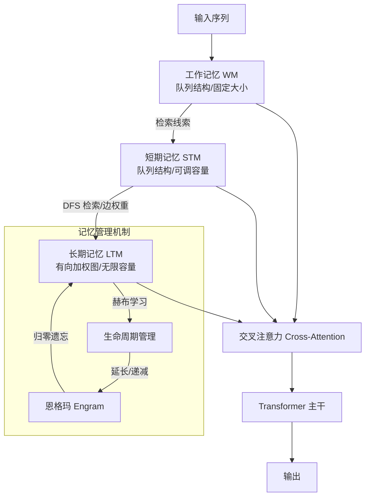

# Memoria：通过人类启发式记忆架构解决命运性遗忘问题

## 一、论文基础元数据
- 原文标题：Memoria: Resolving Fateful Forgetting Problem through Human-Inspired Memory Architecture
- 中文译版：Memoria：通过人类启发式记忆架构解决命运性遗忘问题
- 发表渠道：arXiv 预印本
- 发表时间：2023 (arXiv ID 2310 暗示)，元数据标注 2025
- 链接：arXiv: 2310.03052
- 作者及核心机构：Sangjun Park, JinYeong Bak (机构待补充)
- 研究领域：人工智能 / 自然语言处理（长序列建模）
- 关联数据集：
    - Wikitext-103 (语言建模)
    - PG-19 (语言建模)
    - Enwik8 (字符级语言建模)
    - Hyperpartisan (文本分类)
    - 排序任务数据集 (未具体命名)

## 二、论文综合评价
### 2.1 量化评分（1-5 分，5 分为最优）
| 评价维度 | 评分 | 备注 |
| -------- | ---- | ---- |
| 📚 理论基础 | ⭐⭐⭐⭐⭐ | 深度结合认知心理学（多存储模型、赫布理论） |
| 🎯 问题核心性 | ⭐⭐⭐⭐⭐ | 直击 Transformer 长序列“命运性遗忘”痛点 |
| 💡 方法创新性 | ⭐⭐⭐⭐⭐ | 引入恩格玛（Engram）与生命周期机制 |
| ⚙️ 技术壁垒 | ⭐⭐⭐⭐ | 图结构记忆维护与检索有一定实现复杂度 |
| 🧪 实验严谨性 | ⭐⭐⭐⭐⭐ | 多任务、多数据集、含效率与消融分析 |
| 🔧 落地可行性 | ⭐⭐⭐⭐ | 兼容 GPT/BERT，但推理速度有待优化 |
| 🚀 应用前景 | ⭐⭐⭐⭐⭐ | 长上下文理解、代理记忆、个性化模型 |
| 📊 综合评分 | 4.7 | 理论与实验均表现优异 |

### 2.2 定性综合评价（≤300 字）
> 核心概括：研究定位、核心价值、差异化优势、关键结论

本研究定位为解决神经网络长序列处理中的“命运性遗忘”问题。核心价值在于提出了一种受人类记忆系统启发的通用记忆模块 **Memoria**，包含工作记忆 (WM)、短期记忆 (STM) 和长期记忆 (LTM)。差异化优势在于引入了**恩格玛 (Engram)** 作为记忆最小单位，并赋予其**生命周期**，通过赫布学习原则实现选择性保留与基于线索的激活。关键结论显示，Memoria 在语言建模、文本分类及排序任务上均优于 Transformer-XL 等基线，且在机器记忆中复现了首因效应、近因效应等人类心理学特征，具备显著的长程依赖捕捉能力与显存效率优势。

## 三、领域本体论映射
| 核心维度 | 具体内容 |
| -------- | -------- |
| 核心研究对象 | 神经网络中的长程依赖与记忆遗忘机制 |
| 核心技术路径 | 外部记忆模块 + 人类认知心理学模型 (多存储模型) |
| 数据/载体形态 | 文本序列 (Token/Character)，记忆以恩格玛 (Engram) 图结构存储 |
| 核心功能目标 | 实现无限容量下的选择性记忆保留与高效检索 |
| 验证核心指标 | Perplexity (PPL), Accuracy, F1, 推理时间，显存占用 |

## 四、核心问题与解决方案
### 4.1 待解决的核心问题
1. **领域级根本问题**：现有 Transformer 及外部记忆模型受限于固定记忆容量和近期优先策略，导致重要信息随时间步必然被遗忘（命运性遗忘）。
2. **现有方法痛点**：难以预测信息的长期重要性，无法在无限信息流中实现基于重要性的选择性保留。
3. **工程落地卡点**：长序列推理时的显存占用过高，检索效率随记忆库增长而下降。

### 4.2 核心解决方案
- 理论框架：基于人类多存储记忆模型 (Multi-Store Model) 与搜索联想记忆模型 (SAM)。
- 核心架构：三级记忆结构 (WM, STM, LTM) + 恩格玛 (Engram) 单元。
- 关键技术：赫布学习 (Hebbian Learning) 驱动的生命周期管理、基于图的 LTM 检索 (DFS)。
- 创新机制：记忆单元拥有“生命周期”，被检索则延长，否则递减归零（遗忘），实现动态重要性评估。

### 4.3 核心优势（量化 + 定性）
1. 性能优势：在 Wikitext-103 等数据集上 Perplexity 全面领先基线；文本分类准确率最高达 96.62%。
2. 效率优势：显存占用 (612.94 MB) 显著优于 Compressive Transformer (740.00 MB)。
3. 工程优势：兼容自回归 (GPT) 与掩码 (BERT) 架构，支持从头训练与微调。

## 五、方法与技术架构
### 5.1 核心架构设计
Memoria 作为外部模块集成于 Transformer 中。输入首先存入工作记忆 (WM)，WM 作为线索检索短期记忆 (STM)，STM 进一步通过图结构检索长期记忆 (LTM)。激活的记忆通过交叉注意力机制融入模型计算。

### 5.2 关键技术实现细节
| 技术模块 | 实现路径 | 工程注意事项 |
| -------- | -------- | ------------ |
| 恩格玛 (Engram) | 记忆最小单位，包含内容、创建时间、生命周期 | 需高效存储生命周期状态，避免显存溢出 |
| 生命周期管理 | 基于赫布学习，被检索则延长，随时间递减 | 需定期清理归零节点，防止图无限膨胀 |
| 长期记忆检索 | 基于 STM 线索，在 LTM 图中进行 DFS 搜索 | 搜索深度需限制 (如深度 10)，控制耗时 |
| 记忆融合 | 通过交叉注意力机制将激活记忆融入隐藏状态 | 需调整注意力掩码，确保因果性 (自回归任务) |

### 5.3 架构优缺点
- 优点：
    - 模拟人类记忆机制，具备心理学可解释性（首因/近因效应）。
    - 显存效率较高，支持无限长上下文理论容量。
    - 通用性强，适配多种 Transformer 变体。
- 缺点：
    - 推理速度中等 (44.21s)，慢于 Transformer-XL (21.23s)。
    - 图结构维护在纯 Python/PyTorch 下效率有优化空间。
    - 长期积累用户数据可能引发隐私合规风险。

## 六、实验设计与结果分析
### 6.1 实验基础设置
| 维度 | 内容 |
| ---- | ---- |
| 数据集 | Wikitext-103, PG-19, Enwik8 (LM); Hyperpartisan (分类) |
| 基线方法 | Transformer-XL, Compressive Transformer, ∞-former, Longformer, Bigbird |
| 实验环境 | PyTorch, GPU (具体型号待补充), 周期性记忆重置 (每 500/1500 步) |
| 评价指标 | Perplexity (PPL), Bits per Character (bpc), Accuracy, F1, 时间，显存 |

### 6.2 核心实验结果
| 方法 | 核心指标 1 (PPL/bpc) | 核心指标 2 (Acc/F1) | 工程指标（算力/耗时） |
| ---- | --------- | --------- | -------------------- |
| Transformer-XL | 31.459 (WT103) | 待补充 | 21.23s / 525.74 MB |
| Compressive Transformer | 待补充 | 待补充 | 25.57s / 740.00 MB |
| ∞-former | 待补充 | 待补充 | 54.15s / 676.12 MB |
| 本文方法 (Memoria) | 30.007 (WT103) / 18.986 (GPT-2 微调) | 96.62% / 96.51 (Hyperpartisan) | 44.21s / 612.94 MB |

### 6.3 消融实验/鲁棒性分析
| 实验变体 | 指标变化 | 核心结论 |
| -------- | -------- | -------- |
| 仅 WM | 短序列表现好，长序列下降 | WM 主导短序列处理 |
| WM + STM + LTM | 长序列性能显著提升 | STM 和 LTM 在长序列中互补作用显著 |
| 超参数敏感性 | 性能波动不大 | 模型对寿命、搜索深度等参数具有鲁棒性 |
| 记忆年龄分析 | 检索记忆平均年龄随步骤增加 | 证明模型有效利用了长期记忆，非仅关注近期 |

### 6.4 实验结论（工程视角）
Memoria 在显存效率上具有竞争优势，虽推理速度中等，但通过系统级优化（硬件卸载、数据结构、底层语言）有望进一步提升性能。周期性记忆重置策略是训练稳定性的关键细节。

## 七、领域贡献与创新点
| 贡献层级 | 具体内容 |
| -------- | -------- |
| 理论贡献 | 将认知心理学理论（赫布学习、多存储模型）形式化为神经网络模块 |
| 方法/架构贡献 | 提出三级记忆架构与恩格玛生命周期机制，解决命运性遗忘 |
| 数据/工具贡献 | 验证了机器记忆可复现人类心理学效应（首因/近因/时间邻近） |
| 实验/验证贡献 | 在排序、LM、分类多任务上验证了长程依赖捕捉能力 |
| 工程落地贡献 | 提供了兼容 GPT/BERT 的通用记忆模块实现方案 |

## 八、局限性与风险
| 维度 | 具体描述 | 应对思路 |
| ---- | -------- | -------- |
| 学术局限性 | 当前模型与人类记忆机制仍存在差异（如缺乏加工深度理论） | 引入加工层次理论、干扰理论进一步优化 |
| 工程落地风险 | 推理速度慢于部分基线，图维护效率有待提升 | 采用邻接表优化数据结构，部分计算卸载至 CPU |
| 伦理/合规风险 | 推理过程中保留信息，长期积累可能引发用户隐私问题 | 建立记忆清除机制，符合数据合规要求 |

## 九、未来研究/落地方向
| 方向类型 | 具体内容 | 优先级 |
| -------- | -------- | ------ |
| 科研拓展 | 引入加工层次理论 (Levels of Processing) 与干扰理论 (Interference Theory) | 高 |
| 工程优化 | 语言重构 (C++/CUDA)，数据结构优化 (邻接表)，CPU 卸载 | 高 |
| 跨领域适配 | 应用于多模态代理任务、个性化长期对话系统 | 中 |

## 十、关键词与术语表
| 语言 | 关键词 |
| ---- | ------ |
| 中文 | 命运性遗忘，恩格玛，赫布学习，工作记忆，长期记忆 |
| 英文 | Fateful Forgetting, Engram, Hebbian Learning, Working Memory, Long-term Memory |
| 领域专属术语 | **恩格玛 (Engram)**：记忆的最小单位，拥有生命周期。 **命运性遗忘 (Fateful Forgetting)**：重要信息因容量限制必然被遗忘的现象。 **赫布学习 (Hebbian Learning)**：“一起激发，连在一起”的神经学习原则。 |

## 十一、参考文献与关联资源
- 核心参考文献：Transformer-XL, Compressive Transformer, ∞-former, Longformer, Bigbird (文中作为基线提及)
- 补充阅读：多存储模型 (Multi-Store Model), 搜索联想记忆模型 (SAM)
- 开源代码/工具：待补充 (文中未明确提供链接，通常 arXiv 论文会附带 GitHub)

## 十二、阅读者批注
1. **科研启发**：将心理学理论“形式化”为神经网络模块是一条可行的创新路径，特别是记忆的生命周期管理机制。
2. **工程落地思考**：图结构的维护成本是瓶颈，实际部署时需考虑将非核心记忆状态卸载至 CPU 或使用更高效的语言重写检索逻辑。
3. **待验证/存疑点**：隐私风险的具体边界未量化；在极端长上下文（如 100K+）下的检索延迟未详细披露。
4. **个人/团队应用场景**：适用于需要长期用户记忆的个人助理模型，或需要处理超长文档的法律/医疗文本分析任务。

## 十三、阅读元信息
| 维度 | 内容 |
| ---- | ---- |
| 阅读日期 | 2026-04-07 01:04 |
| 阅读人 | xPaperReader AI |
| 文档编号 | arxiv-2310.03052 |
| 版本迭代 | v1.0 |