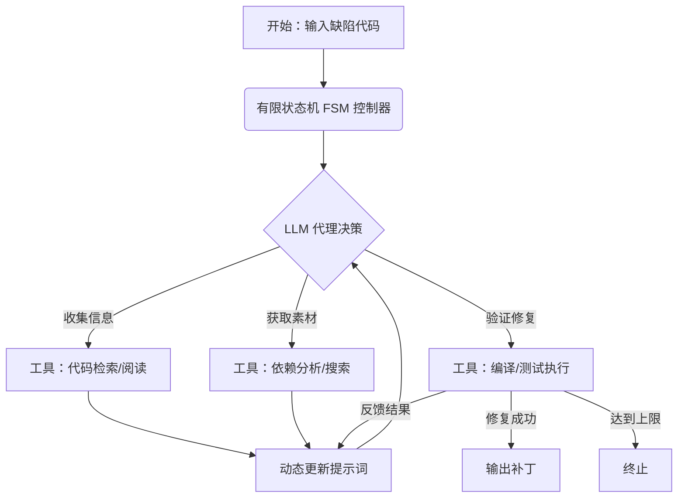

# RepairAgent：一种基于大语言模型的自主程序修复代理

## 一、论文基础元数据
- 原文标题：RepairAgent: An Autonomous, LLM-Based Agent for Program Repair
- 中文译版：RepairAgent：一种基于大语言模型的自主程序修复代理
- 发表渠道：arXiv 预印本 (计算机科学/软件工程领域主流预印本平台)
- 发表时间：2024 年 3 月 (arXiv ID: 2403.17134) / 用户标注 2025 年
- 链接：https://arxiv.org/abs/2403.17134
- 作者及核心机构：
  - Islem Bouzenia (University of Stuttgart, Germany)
  - Premkumar Devanbu (UC Davis, USA)
  - Michael Pradel (University of Stuttgart, Germany)
- 研究领域：软件工程 (一级) + 自动化程序修复/大语言模型应用 (二级)
- 关联数据集：Defects4J (规模/语言/标注：Java 缺陷数据集，含测试用例标注)

## 二、论文综合评价
### 2.1 量化评分（1-5 分，5 分为最优）
| 评价维度 | 评分 | 备注 |
| -------- | ---- | ---- |
| 📚 理论基础 | ⭐⭐⭐⭐ | 基于 Agent 范式与 APR 结合，理论扎实 |
| 🎯 问题核心性 | ⭐⭐⭐⭐⭐ | 直击当前 LLM 修复缺乏自主性的痛点 |
| 💡 方法创新性 | ⭐⭐⭐⭐⭐ | 首个自主 LLM 代理修复方案，引入 FSM 引导 |
| ⚙️ 技术壁垒 | ⭐⭐⭐⭐ | 工具链集成与状态机设计有一定复杂度 |
| 🧪 实验严谨性 | ⭐⭐⭐⭐ | 基于 Defects4J，但部分基线细节待补充 |
| 🔧 落地可行性 | ⭐⭐⭐ | 单 Bug 成本较高 (270k tokens)，需优化 |
| 🚀 应用前景 | ⭐⭐⭐⭐⭐ | 为 Agent 驱动的软件工程开辟新路径 |
| 📊 综合评分 | 4.3 | 创新性突出，成本需权衡 |

### 2.2 定性综合评价（≤300 字）
> 核心概括：研究定位、核心价值、差异化优势、关键结论
本文定位为自动化程序修复（APR）领域的突破性工作，首次提出基于大语言模型（LLM）的自主代理（Agent）方案。核心价值在于打破了现有迭代式修复方法中“固定反馈循环”的限制，模拟人类开发者“收集信息 - 搜索代码 - 验证修复”的交错行为。差异化优势在于引入了工具集、动态提示词格式及有限状态机（FSM）来引导代理自主决策。关键结论显示，该方法在 Defects4J 上自主修复了 164 个 Bug，其中 39 个为现有技术未修复的独特案例，证明了自主代理范式的有效性，但需关注代币成本问题。

## 三、领域本体论映射
| 核心维度 | 具体内容 |
| -------- | -------- |
| 核心研究对象 | 软件缺陷代码及对应的自动化修复补丁 |
| 核心技术路径 | LLM Agent + 工具调用 (Tool Use) + 有限状态机 (FSM) |
| 数据/载体形态 | 源代码、测试用例、编译/运行反馈日志 |
| 核心功能目标 | 自主规划修复步骤，生成可编译且通过测试的补丁 |
| 验证核心指标 | 修复 Bug 数量 (Fixed Bugs)、唯一修复数 (Unique Fixes)、代币成本 (Token Cost) |

## 四、核心问题与解决方案
### 4.1 待解决的核心问题
1. **领域级根本问题**：传统 APR 及早期 LLM 修复方法缺乏灵活性，无法像人类一样动态调整修复策略。
2. **现有方法痛点**：当前迭代式 LLM 修复采用硬编码的反馈循环（Hard-coded feedback loops），限制了模型收集上下文信息或搜索修复素材的能力。
3. **工程落地卡点**：如何在保证修复成功率的同时，控制 LLM 调用的上下文长度与代币成本。

### 4.2 核心解决方案
- 理论框架：将 LLM 视为自主代理（Autonomous Agent），而非单纯的代码生成器。
- 核心架构：基于有限状态机（FSM）引导代理在不同修复阶段（信息收集、素材获取、验证）间切换。
- 关键技术：动态更新的提示词格式（Dynamically updated prompt format）、专用修复工具集。
- 创新机制：允许代理根据过往修复尝试的反馈，自主决定调用哪些工具及下一步行动。

### 4.3 核心优势（量化 + 定性）
1. 性能优势：在 Defects4J 上修复 164 个 Bug，包含 39 个先前技术未修复的 Bug。
2. 效率优势：自主决策减少了无效迭代，但单次交互成本较高（平均 270,000 tokens）。
3. 工程优势：模拟人类开发者工作流，具备更强的上下文理解与工具协调能力。

## 五、方法与技术架构
### 5.1 核心架构设计
> 文字描述 + 架构图（Mermaid/图片）
RepairAgent 架构由 LLM 核心、工具集接口及状态控制器组成。LLM 接收动态提示，根据当前状态决定动作；工具集提供代码检索、编译、测试等功能；FSM 确保流程逻辑正确。

### 5.2 关键技术实现细节
| 技术模块 | 实现路径 | 工程注意事项 |
| -------- | -------- | ------------ |
| 工具集 (Tools) | 封装代码检索、编译、测试执行等 API 供 LLM 调用 | 需确保工具执行的沙箱安全性与超时控制 |
| 动态提示词 (Dynamic Prompt) | 根据 FSM 状态及工具反馈实时构建上下文 | 需管理 Context Window，避免超出令牌限制 |
| 状态机 (FSM) | 定义修复流程的状态转移逻辑 (如：理解->搜索->修复->验证) | 防止状态死循环，设置最大重试次数 |
| 依赖组件 | OpenAI GPT-3.5 (评估中使用) | 模型版本差异可能影响工具调用准确性 |

### 5.3 架构优缺点
- 优点：灵活性高，能处理复杂依赖；模拟人类思维，可解释性相对较强。
- 缺点：令牌消耗量大（平均 270k/bug）；依赖外部工具链的稳定性；推理延迟较高。

## 六、实验设计与结果分析
### 6.1 实验基础设置
| 维度 | 内容 |
| ---- | ---- |
| 数据集 | Defects4J (Java 缺陷基准数据集) |
| 基线方法 | 现有最先进 APR 技术及 LLM 修复方法 (具体名称文中未全列，统称 prior techniques) |
| 实验环境 | 调用 OpenAI GPT-3.5 API |
| 评价指标 | 修复数量、唯一修复数、代币成本 (美元/bug) |

### 6.2 核心实验结果
| 方法 | 核心指标 1 (修复数) | 核心指标 2 (唯一修复) | 工程指标（算力/耗时） |
| ---- | --------- | --------- | -------------------- |
| 基线方法 (Prior) | 待补充具体数值 | 待补充具体数值 | 待补充 |
| 本文方法 (RepairAgent) | 164 | 39 | 270,000 tokens/bug (~14 美分) |

### 6.3 消融实验/鲁棒性分析
| 实验变体 | 指标变化 | 核心结论 |
| -------- | -------- | -------- |
| 无 FSM 引导 | 待补充 | 预计修复率下降，流程混乱 |
| 无工具调用 | 待补充 | 无法获取必要上下文，修复失败 |
| 不同 LLM 模型 | 待补充 | 模型能力直接影响工具调用准确率 |

### 6.4 实验结论（工程视角）
该方法在修复能力上显著优于现有技术，特别是能解决以往技术无法处理的疑难 Bug。然而，单次修复的代币成本（14 美分）在大规模应用中需考量，适合高价值核心代码修复场景。

## 七、领域贡献与创新点
| 贡献层级 | 具体内容 |
| -------- | -------- |
| 理论贡献 | 首次将自主 Agent 范式引入程序修复领域，定义了 LLM 在 APR 中的新角色 |
| 方法/架构贡献 | 设计了结合 FSM 与动态提示词的代理架构，实现工具自主调用 |
| 数据/工具贡献 | 提供了一套适用于程序修复的 LLM 工具集 (具体列表待全文补充) |
| 实验/验证贡献 | 在 Defects4J 上验证了自主代理的有效性，提供了成本效益分析 |
| 工程落地贡献 | 证明了 LLM 代理在实际软件工程任务中的可行性，尽管成本需优化 |

## 八、局限性与风险
| 维度 | 具体描述 | 应对思路 |
| ---- | -------- | -------- |
| 学术局限性 | 仅在一个数据集 (Defects4J) 上验证，泛化性待考 | 扩展至更多语言及数据集 (如 BugsInPy) |
| 工程落地风险 | 单次修复成本较高 (270k tokens)，延迟较大 | 优化提示词策略，使用更小模型或缓存机制 |
| 伦理/合规风险 | 自动修复可能引入隐蔽漏洞或版权代码 | 引入人工审核环节，代码相似度检测 |

## 九、未来研究/落地方向
| 方向类型 | 具体内容 | 优先级 |
| -------- | -------- | ------ |
| 科研拓展 | 探索多代理协作修复 (Multi-Agent Repair) | 高 |
| 工程优化 | 降低 Token 消耗，优化上下文管理策略 | 高 |
| 跨领域适配 | 迁移至安全漏洞修复或性能优化场景 | 中 |

## 十、关键词与术语表
| 语言 | 关键词 |
| ---- | ------ |
| 中文 | 自动化程序修复，大语言模型，自主代理，有限状态机，工具调用 |
| 英文 | Automated Program Repair (APR), Large Language Model (LLM), Autonomous Agent, Finite State Machine (FSM), Tool Use |
| 领域专属术语 | **Defects4J**: 标准的 Java 缺陷数据集；**APR**: 自动化程序修复技术 |

## 十一、参考文献与关联资源
- 核心参考文献：待补充 (文中引用了 [1]-[23] 但未列出具体列表)
- 补充阅读：关于 LLM Agent 在软件工程中的其他应用 (如 SWE-agent 等)
- 开源代码/工具：待补充 (通常此类论文会在 GitHub 开源，需检索作者主页)

## 十二、阅读者批注
1. **科研启发**：将“固定循环”转变为“自主规划”是 LLM 应用深化的关键，不仅限于修复，可迁移至测试生成、代码迁移等任务。
2. **工程落地思考**：270k tokens 的成本在企业级大规模应用中是瓶颈，需探索局部上下文优化或模型蒸馏方案。
3. **待验证/存疑点**：文中未详细列出具体调用了哪些工具，以及 FSM 的具体状态定义，需查阅全文确认。
4. **个人/团队应用场景**：适用于核心业务系统的疑难 Bug 辅助修复，作为高级开发者的 Copilot 插件。

## 十三、阅读元信息
| 维度 | 内容 |
| ---- | ---- |
| 阅读日期 | 2026-04-07 09:27 |
| 阅读人 | xPaperReader AI |
| 文档编号 | arxiv-2403.17134 |
| 版本迭代 | v1.0 |