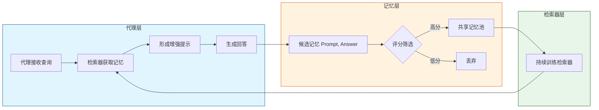

# INMS：基于大语言模型代理的记忆共享

## 一、论文基础元数据
- 原文标题：INMS: Memory Sharing for Large Language Model based Agents
- 中文译版：INMS：基于大语言模型代理的记忆共享
- 发表渠道：预印本（arXiv）
- 发表时间：2025
- 链接：https://arxiv.org/abs/2404.09982
- 作者及核心机构：Hang Gao, Yongfeng Zhang（待补充具体机构）
- 研究领域：人工智能（一级）+ 大语言模型代理/记忆机制（二级）
- 关联数据集：自建数据集（文学创作、逻辑解题、计划生成，规模待补充，语言：中英混合，标注：人工审核评分标准）

## 二、论文综合评价
### 2.1 量化评分（1-5 分，5 分为最优）
| 评价维度 | 评分 | 备注 |
| -------- | ---- | ---- |
| 📚 理论基础 | ⭐⭐⭐⭐ | 基于 RAG 与持续学习理论，结合代理架构 |
| 🎯 问题核心性 | ⭐⭐⭐⭐⭐ | 直击 LLM 代理在开放域任务中的记忆孤立与静态检索痛点 |
| 💡 方法创新性 | ⭐⭐⭐⭐⭐ | 提出检索器持续训练与多代理记忆共享机制 |
| ⚙️ 技术壁垒 | ⭐⭐⭐⭐ | 涉及检索器动态更新与记忆质量评分体系 |
| 🧪 实验严谨性 | ⭐⭐⭐⭐ | 涵盖 3 大领域 9 个 Agent，但数据集为自建 |
| 🔧 落地可行性 | ⭐⭐⭐⭐ | 架构清晰，已开源代码，但需维护记忆池成本 |
| 🚀 应用前景 | ⭐⭐⭐⭐⭐ | 适用于多代理协作系统、个性化助手等场景 |
| 📊 综合评分 | 4.4 | 具有较高的学术价值与工程参考意义 |

### 2.2 定性综合评价（≤300 字）
> 核心概括：本研究针对 LLM 代理在开放式查询中面临的上下文理解偏差与知识孤立问题，提出了 INMS 记忆共享框架。其核心价值在于构建了实时记忆存储与检索系统，允许多代理共享记忆池，并通过持续训练检索器实现知识进化。差异化优势在于“检索器动态更新”与“双重质量控制（人工 +LLM）”。关键结论表明，域内记忆共享显著优于全局共享，且记忆容量与性能呈非线性关系，为多代理系统的持续学习提供了新范式。

## 三、领域本体论映射
| 核心维度 | 具体内容 |
| -------- | -------- |
| 核心研究对象 | 基于大语言模型的多代理系统（LLM-based Agents） |
| 核心技术路径 | 记忆共享（Memory Sharing）+ 检索增强生成（RAG）+ 持续学习 |
| 数据/载体形态 | 记忆对（Prompt, Answer）、向量数据库、评分标准（Rubrics） |
| 核心功能目标 | 增强代理在开放域任务中的理解能力与回复质量，实现知识复用 |
| 验证核心指标 | ROUGE、BERTScore、记忆池容量影响、检索相关性 |

## 四、核心问题与解决方案
### 4.1 待解决的核心问题
1. **领域级根本问题**：单个 LLM 代理缺乏长期记忆与跨代理经验共享机制，导致知识孤立。
2. **现有方法痛点**：传统 ICL 在开放域任务描述不足；现有 RAG 检索器静态固化，无法适应新数据分布。
3. **工程落地卡点**：记忆池质量难以控制，低质记忆污染可能导致性能衰退；检索器更新成本高。

### 4.2 核心解决方案
- 理论框架：记忆共享（Memory Sharing, MS）框架，包含记忆生成、写入评分、检索训练闭环。
- 核心架构：实时记忆存储与检索系统，多代理共用一个记忆池。
- 关键技术：检索器持续训练（Continuous Training）、基于评分标准的记忆筛选、增强型记忆结构（含检索增强 Prompt）。
- 创新机制：新记忆加入即触发检索器对比学习更新，确保检索相关性随时间进化。

### 4.3 核心优势（量化+定性）
1. 性能优势：实证表明 MS 框架显著提高了代理在开放式问题上的性能（ROUGE & BERTScore 提升）。
2. 效率优势：通过共享机制减少重复学习成本，检索器动态优化提升匹配效率。
3. 工程优势：双重质量控制（人工审核标准+LLM 自动评分）保证记忆池纯净度，降低噪声干扰。

## 五、方法与技术架构
### 5.1 核心架构设计
> 文字描述：系统由代理层、记忆池层、检索器层组成。代理生成候选记忆，经评分筛选后存入共享池；检索器利用新记忆进行对比学习更新；查询时检索 Top-K 记忆构建增强 Prompt。

### 5.2 关键技术实现细节
| 技术模块 | 实现路径 | 工程注意事项 |
| -------- | -------- | ------------ |
| 记忆生成 | 代理接收查询 -> 检索记忆 -> 生成回答 -> 形成 (Prompt, Answer) 对 | 需确保 Prompt 包含检索增强信息 |
| 记忆写入与评分 | LLM 基于人工审核的评分标准 (Rubrics) 打分，超过阈值入库 | 评分标准需保持一致性与公平性 |
| 检索器训练 | 利用新记忆 (X, Y) 筛选池中候选对，计算矛盾概率，对比学习优化 | 需处理记忆池不平衡问题，负样本筛选策略关键 |
| 提示构建 | 余弦相似度检索 Top-K 记忆，拼接在原始查询前 | 控制 Context 长度，避免超出 Token 限制 |

### 5.3 架构优缺点
- 优点：支持知识动态进化，多代理协作增效，记忆质量可控。
- 缺点：检索器持续训练增加计算开销，记忆池过大可能引发性能衰退，跨域共享存在噪声风险。

## 六、实验设计与结果分析
### 6.1 实验基础设置
| 维度 | 内容 |
| ---- | ---- |
| 数据集 | 自建数据集（文学创作、逻辑解题、计划生成），答案源自互联网精选，问题由 ChatGPT 生成 |
| 基线方法 | 0-3 shot ICL、静态 RAG、单代理无共享 |
| 实验环境 | 待补充（基于 LLM API 或本地部署） |
| 评价指标 | ROUGE、BERTScore、工程指标（算力/耗时） |

### 6.2 核心实验结果
| 方法 | 核心指标 1 (ROUGE) | 核心指标 2 (BERTScore) | 工程指标（算力/耗时） |
| ---- | --------- | --------- | -------------------- |
| 基线 (0-3 shot) | 较低 | 较低 | 低 |
| 静态 RAG | 中等 | 中等 | 中 |
| 本文方法 (MS) | 显著提升 | 显著提升 | 较高（含检索训练） |

### 6.3 消融实验/鲁棒性分析
| 实验变体 | 指标变化 | 核心结论 |
| -------- | -------- | -------- |
| Domain-pool (域内池) | 性能最优 | 相似特征 Agent 从域内独占池获益最大 |
| Single-pool (全局池) | 性能稍逊 | 跨域记忆可能降低学习效率（除特定 Agent 外） |
| 记忆容量增加 | 先升后降 | 记忆过多会阻碍学习效果，存在最佳容量阈值 |
| 语言一致性 (五言律诗) | 波动/无变化 | 记忆存储语言差异干扰性能，需统一语言 |

### 6.4 实验结论（工程视角）
记忆共享框架有效，但需针对特定领域探索最佳记忆池容量；跨领域共享需谨慎，避免负迁移；多语言环境下需统一记忆存储语言以保证一致性。

## 七、领域贡献与创新点
| 贡献层级 | 具体内容 |
| -------- | -------- |
| 理论贡献 | 提出了 LLM 代理记忆共享的理论框架，定义了记忆动态进化机制 |
| 方法/架构贡献 | 设计了检索器持续训练与双重质量控制的记忆写入流程 |
| 数据/工具贡献 | 构建了涵盖文学、逻辑、计划三大领域的代理任务数据集 |
| 实验/验证贡献 | 验证了记忆共享在开放域查询中的有效性及域内池优势 |
| 工程落地贡献 | 开源代码与数据，提供了多代理系统记忆管理的可参考实现 |

## 八、局限性与风险
| 维度 | 具体描述 | 应对思路 |
| ---- | -------- | -------- |
| 学术局限性 | 仅在同一 LLM 模型下的 Agent 间验证，未评估跨模型部署影响 | 未来需评估在不同基础模型 (如 GPT-4, LLaMA) 间部署的影响 |
| 工程落地风险 | 记忆积累过多导致性能衰退，检索器持续训练增加算力成本 | 探索记忆遗忘机制或容量限制策略，优化训练频率 |
| 伦理/合规风险 | 记忆池可能存储敏感信息或偏见内容 | 增加隐私过滤机制，定期审核记忆池内容合规性 |

## 九、未来研究/落地方向
| 方向类型 | 具体内容 | 优先级 |
| -------- | -------- | ------ |
| 科研拓展 | 探索将该框架整合进微调 (Fine-tuning) 流程，利用记忆资源优化模型权重 | 高 |
| 工程优化 | 确定特定领域的最佳记忆池容量，实现动态容量管理 | 高 |
| 跨领域适配 | 优化跨领域记忆共享机制，减少负迁移，统一记忆存储语言 | 中 |

## 十、关键词与术语表
| 语言 | 关键词 |
| ---- | ------ |
| 中文 | 记忆共享、大语言模型代理、检索增强生成、持续学习、开放域查询 |
| 英文 | Memory Sharing, LLM Agents, RAG, Continuous Learning, Open-ended Queries |
| 领域专属术语 | 记忆池 (Memory Pool)：存储 (Prompt, Answer) 对的共享数据库；检索器持续训练 (Retriever Continuous Training)：随新记忆加入而更新检索模型 |

## 十一、参考文献与关联资源
- 核心参考文献：待补充（论文内部引用文献未在输入中列出）
- 补充阅读：检索增强生成（RAG）相关综述、多代理系统协作研究
- 开源代码/工具：https://github.com/GHupppp/MemorySharingLLM

## 十二、阅读者批注
1. **科研启发**：记忆不仅是存储，更是检索器进化的燃料。动态更新检索器是解决分布漂移的关键思路。
2. **工程落地思考**：在实际系统中，需设计记忆淘汰机制（如基于时间或质量），防止记忆池无限膨胀导致性能下降。
3. **待验证/存疑点**：跨模型记忆共享的具体兼容性如何？不同架构模型对同一记忆的理解是否存在偏差？
4. **个人/团队应用场景**：适用于构建企业级多助手系统，如客服代理共享历史解决案例，提升整体解决率。

## 十三、阅读元信息
| 维度 | 内容 |
| ---- | ---- |
| 阅读日期 | 2026-04-07 09:35 |
| 阅读人 | xPaperReader AI |
| 文档编号 | arxiv-2404.09982 |
| 版本迭代 | v1.0 |