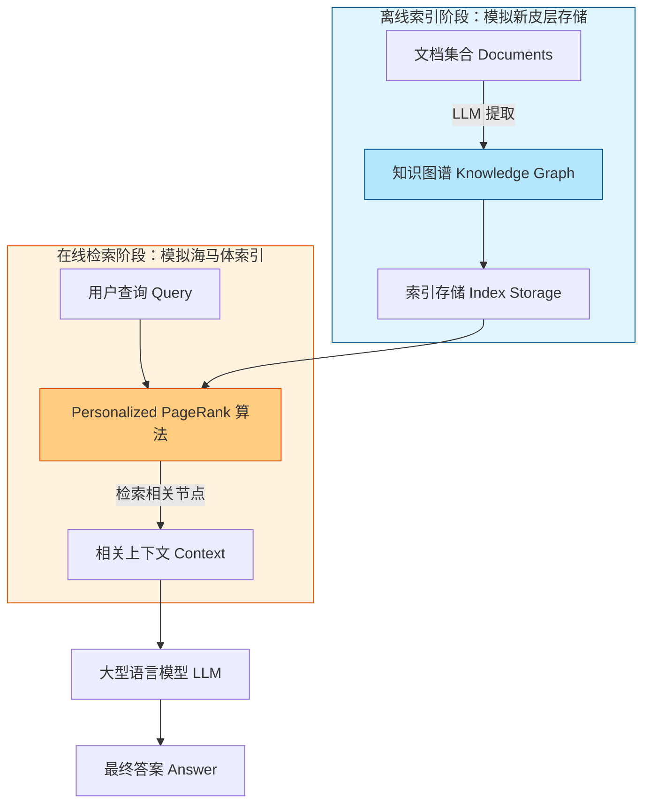

# HippoRAG：神经生物学启发的大型语言模型长期记忆

## 一、论文基础元数据
- 原文标题：HippoRAG: Neurobiologically Inspired Long-Term Memory for Large Language Models
- 中文译版：HippoRAG：神经生物学启发的大型语言模型长期记忆
- 发表渠道：38th Conference on Neural Information Processing Systems (NeurIPS 2024) / arXiv 预印本
- 发表时间：2025 年 1 月 14 日 (arXiv v3) / 2024 年 (会议)
- 链接：arXiv:2405.14831
- 作者及核心机构：
    - Bernal Jiménez Gutiérrez (The Ohio State University)
    - Yiheng Shu (The Ohio State University)
    - Yu Gu (The Ohio State University)
    - Michihiro Yasunaga (Stanford University)
    - Yu Su (The Ohio State University)
- 研究领域：自然语言处理 (NLP) + 检索增强生成 (RAG)
- 关联数据集：多跳问答数据集 (具体名称原文片段未提及，仅提及 multi-hop QA)

## 二、论文综合评价
### 2.1 量化评分（1-5 分，5 分为最优）
| 评价维度 | 评分 | 备注 |
| -------- | ---- | ---- |
| 📚 理论基础 | ⭐⭐⭐⭐⭐ | 基于海马体索引理论，生物学启发性强 |
| 🎯 问题核心性 | ⭐⭐⭐⭐⭐ | 解决 RAG 跨段落知识整合痛点 |
| 💡 方法创新性 | ⭐⭐⭐⭐⭐ | 结合 KG 与 PPR 模拟记忆机制 |
| ⚙️ 技术壁垒 | ⭐⭐⭐⭐ | 涉及图谱构建与算法协同 |
| 🧪 实验严谨性 | ⭐⭐⭐⭐ | 摘要声称显著优于 SOTA，细节待全文验证 |
| 🔧 落地可行性 | ⭐⭐⭐⭐ | 检索效率提升显著 (10-20 倍) |
| 🚀 应用前景 | ⭐⭐⭐⭐⭐ | 适用于需要长程推理的场景 |
| 📊 综合评分 | 4.7 | 神经生物学启发的长期记忆框架，单次检索高效实现多跳推理 |

### 2.2 定性综合评价（≤300 字）
> 核心概括：研究定位、核心价值、差异化优势、关键结论
本文针对当前检索增强生成（RAG）系统无法有效整合跨段落新知识的局限性，提出了一种受神经生物学启发的长期记忆框架 HippoRAG。核心价值在于模拟人脑海马体索引理论，协同大型语言模型、知识图谱和个人化 PageRank 算法。差异化优势在于实现了单次检索即可达到迭代检索的性能，同时大幅降低成本与延迟。关键结论显示，该方法在多跳问答任务上优于最先进方法达 20%，且效率提升 10-20 倍，解决了静态模型难以持续整合新经验的问题。

## 三、领域本体论映射
| 核心维度 | 具体内容 |
| -------- | -------- |
| 核心研究对象 | 大型语言模型的长期记忆机制 (Long-Term Memory for LLMs) |
| 核心技术路径 | 神经生物学启发 (海马体索引) + 知识图谱 + 检索算法 |
| 数据/载体形态 | 文本段落 (Passages)、知识图谱 (Knowledge Graphs) |
| 核心功能目标 | 跨段落知识整合 (Knowledge Integration across Passages) |
| 验证核心指标 | 多跳问答准确率、检索成本、检索耗时 |

## 四、核心问题与解决方案
### 4.1 待解决的核心问题
1. **领域级根本问题**：现有 AI 系统缺乏类似人类的持续更新长期记忆系统，难以在预训练后有效整合大量新经验。
2. **现有方法痛点**：当前 RAG 方法将每个新段落孤立编码，无法跨越段落边界整合知识（例如：无法关联“斯坦福教授”与“阿尔茨海默症研究”两个分散事实）。
3. **工程落地卡点**：迭代式检索（如 IRCoT）虽然有效但成本高昂、速度慢，难以大规模应用。

### 4.2 核心解决方案
- **理论框架**：海马体索引理论 (Hippocampal Indexing Theory)，模拟新皮层（存储）与海马体（索引）的分工。
- **核心架构**：离线索引构建知识图谱，在线检索使用 Personalized PageRank。
- **关键技术**：LLM 协同、知识图谱构建、个性化页面排名算法 (PPR)。
- **创新机制**：通过图谱结构实现关联记忆，支持单次检索完成多跳推理。

### 4.3 核心优势（量化 + 定性）
1. **性能优势**：多跳问答任务上优于最先进方法高达 20%。
2. **效率优势**：单次检索性能媲美迭代检索，成本降低 10-20 倍，速度提升 6-13 倍。
3. **工程优势**：能够处理现有方法无法触及的新场景（跨文档知识整合）。

## 五、方法与技术架构
### 5.1 核心架构设计
> 文字描述 + 架构图（Mermaid/图片）
HippoRAG 分为离线索引和在线检索两个阶段。离线阶段从文档集合构建知识图谱；在线阶段接收查询，利用 Personalized PageRank 在图谱中检索相关上下文，最后交由 LLM 生成答案。

### 5.2 关键技术实现细节
| 技术模块 | 实现路径 | 工程注意事项 |
| -------- | -------- | ------------ |
| 知识图谱构建 | 利用 LLM 从文档中提取实体与关系 (原文片段未详述具体 Prompt) | 需保证图谱构建的准确性与覆盖率 |
| 检索算法 | 使用 Personalized PageRank (PPR) 进行图谱遍历 | 需调整阻尼系数等超参数以平衡全局与局部 |
| 记忆协同 | 协同 LLM、KG 与 PPR 模拟海马体与新皮层功能 | 需确保模块间数据接口的一致性 |
| 依赖组件 | 大型语言模型、图数据库/存储、PPR 算法库 | 原文未提及具体依赖库版本 |

### 5.3 架构优缺点
- **优点**：实现了知识的关联存储，支持高效的多跳推理；显著降低检索成本与延迟。
- **缺点**：离线构建知识图谱可能带来额外的预处理开销（原文片段未详述具体开销）；依赖 LLM 提取关系的准确性。

## 六、实验设计与结果分析
### 6.1 实验基础设置
| 维度 | 内容 |
| ---- | ---- |
| 数据集 | 多跳问答数据集 (具体名称原文片段未提及) |
| 基线方法 | 现有 RAG 方法、迭代检索方法 (如 IRCoT) |
| 实验环境 | 原文片段未提及 |
| 评价指标 | 问答准确率、检索成本、检索耗时 |

### 6.2 核心实验结果
| 方法 | 核心指标 1 (准确率) | 核心指标 2 (相对提升) | 工程指标（算力/耗时） |
| ---- | --------- | --------- | -------------------- |
| 现有 SOTA 方法 | 基准 | - | 基准 |
| 迭代检索 (如 IRCoT) | 较高 | - | 高成本、高延迟 |
| 本文方法 (HippoRAG) | 优于 SOTA | 最高提升 20% | 成本低 10-20 倍，速度快 6-13 倍 |

### 6.3 消融实验/鲁棒性分析
| 实验变体 | 指标变化 | 核心结论 |
| -------- | -------- | -------- |
| 原文片段未提及 | 原文片段未提及 | 原文片段未提及 |

### 6.4 实验结论（工程视角）
HippoRAG 在保持甚至超越迭代检索性能的同时，极大地优化了推理成本和延迟，使得复杂的多跳问答任务在实际工程中更具可行性。单次检索即可获取足够上下文，减少了对 LLM 调用次数的依赖。

## 七、领域贡献与创新点
| 贡献层级 | 具体内容 |
| -------- | -------- |
| 理论贡献 | 将海马体索引理论引入 LLM 长期记忆研究 |
| 方法/架构贡献 | 提出 HippoRAG 框架，协同 KG 与 PPR 实现知识整合 |
| 数据/工具贡献 | 开源代码与数据 (https://github.com/OSU-NLP-Group/HippoRAG) |
| 实验/验证贡献 | 验证了在多跳 QA 任务上优于 SOTA 20% 的性能 |
| 工程落地贡献 | 提供了比迭代检索快 6-13 倍的高效解决方案 |

## 八、局限性与风险
| 维度 | 具体描述 | 应对思路 |
| ---- | -------- | -------- |
| 学术局限性 | 原文片段未明确提及理论边界 | 需阅读全文讨论部分 |
| 工程落地风险 | 知识图谱构建的离线开销未量化 | 需评估大规模数据下的构建时间 |
| 伦理/合规风险 | 原文片段未提及 | 遵循通用 AI 伦理规范 |

## 九、未来研究/落地方向
| 方向类型 | 具体内容 | 优先级 |
| -------- | -------- | ------ |
| 科研拓展 | 探索更多神经生物学机制启发 AI 架构 | 高 |
| 工程优化 | 优化知识图谱构建效率，减少离线成本 | 高 |
| 跨领域适配 | 应用于法律、医疗等需要跨文档推理的领域 | 中 |

## 十、关键词与术语表
| 语言 | 关键词 |
| ---- | ------ |
| 中文 | 检索增强生成、长期记忆、知识图谱、海马体索引、多跳问答 |
| 英文 | RAG, Long-Term Memory, Knowledge Graphs, Hippocampal Indexing, Multi-hop QA |
| 领域专属术语 | **Hippocampal Indexing Theory** (海马体索引理论): 人类记忆中海马体作为索引连接新皮层存储的理论 |
| 领域专属术语 | **Personalized PageRank** (个性化页面排名): 用于在图谱中根据查询节点计算相关性的算法 |

## 十一、参考文献与关联资源
- 核心参考文献：原文片段引用了 [19], [46], [36, 42, 66, 87] 等，具体列表原文片段未提供。
- 补充阅读：神经生物学记忆机制相关文献。
- 开源代码/工具：https://github.com/OSU-NLP-Group/HippoRAG

## 十二、阅读者批注
1. **科研启发**：将生物学记忆机制（海马体 - 新皮层分工）映射到 AI 架构（索引 - 存储分工）是一个极具潜力的跨学科方向。
2. **工程落地思考**：虽然检索效率提升显著，但离线构建 KG 的成本是需要评估的关键瓶颈，特别是在数据动态更新的场景下。
3. **待验证/存疑点**：具体数据集名称、图谱构建的具体 Prompt 策略、以及在不同领域（非 QA 任务）的泛化能力需在全文中进一步确认。
4. **个人/团队应用场景**：适用于企业内部知识库问答，特别是需要关联多个文档才能回答的复杂咨询场景。

## 十三、阅读元信息
| 维度 | 内容 |
| ---- | ---- |
| 阅读日期 | 2026-04-07 09:53 |
| 阅读人 | xPaperReader AI |
| 文档编号 | arxiv-2405.14831 |
| 版本迭代 | v1.0 |