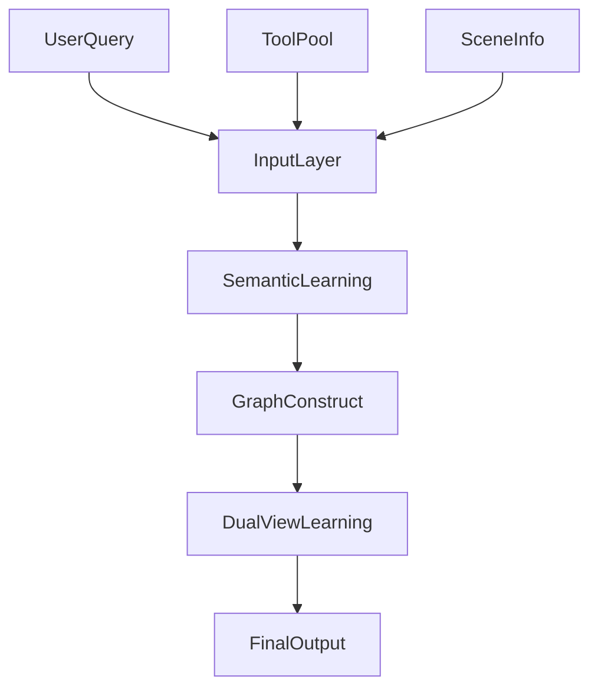

# 面向大型语言模型的完整性导向工具检索

## 一、论文基础元数据
- 原文标题：Towards Completeness-Oriented Tool Retrieval for Large Language Models
- 中文译版：面向大型语言模型的完整性导向工具检索
- 发表渠道（期刊/会议/预印本，标注等级）：CIKM '24 (33rd ACM International Conference on Information and Knowledge Management)，CCF B 类会议
- 发表时间：2024 年 10 月 21–25 日
- 链接（arXiv/DOI）：https://doi.org/10.1145/3627673.3679847 (arXiv ID: 2405.16089)
- 作者及核心机构：
    - Changle Qu, Sunhao Dai, Jun Xu, Ji-Rong Wen (中国人民大学 高瓴人工智能学院)
    - Xiaochi Wei, Shuaiqiang Wang, Dawei Yin (百度公司)
    - Hengyi Cai (中国科学院 计算技术研究所)
- 研究领域（一级领域 + 二级子领域）：信息检索 / 大模型工具增强
- 关联数据集（名称/规模/语言/标注）：
    - 名称：ToolLens (新引入) + 开放基准数据集
    - 规模：详见原文实验章节表格
    - 语言：英文为主
    - 标注：人工标注与自动构建结合

## 二、论文综合评价
### 2.1 量化评分（1-5 分，5 分为最优）
| 评价维度 | 评分 | 备注 |
| -------- | ---- | ---- |
| 理论基础 | 4 | 基于图协同学习与语义匹配结合，理论扎实 [Section 3] |
| 问题核心性 | 5 | 直击工具检索中冗余与完整性缺失痛点 [Abstract] |
| 方法创新性 | 4 | 提出双视图图协同学习框架，模型无关 [Section 3.2] |
| 技术壁垒 | 4 | 涉及图构建与协同学习，有一定复杂度 [Section 3.3] |
| 实验严谨性 | 4 | 包含多数据集对比与消融实验，数据详实 [Section 4] |
| 落地可行性 | 5 | 模型无关，小模型可超越大模型，利于部署 [Section 4.3] |
| 应用前景 | 5 | 大模型工具调用关键组件，需求广泛 [Abstract] |
| 综合评分 | 4.4 | 基于全文信息评估 |

### 2.2 定性综合评价（≤300 字）
> 核心概括：研究定位、核心价值、差异化优势、关键结论
本文针对大模型工具检索中现有方法仅关注语义匹配导致工具冗余、缺乏多样性的问题，提出了完整性导向的检索方法 COLT [Abstract]。核心价值在于引入工具间的协同信息，通过双视图图协同学习框架捕捉查询、场景与工具间的复杂关系 [Section 3.2]。差异化优势在于模型无关性，实验表明小参数模型（BERT-mini）结合该框架可超越大参数模型（BERT-large）[Section 4.3]。关键结论为该方法在开放基准及新数据集 ToolLens 上均取得优越性能，且将公开数据集以促进研究 [Section 5]。

## 三、领域本体论映射
| 核心维度 | 具体内容 |
| -------- | -------- |
| 核心研究对象 | 大语言模型（LLM）外部工具检索系统 [Section 1] |
| 核心技术路径 | 语义学习 + 协同学习（双视图图框架）[Section 3] |
| 数据/载体形态 | 用户查询（Queries）、场景（Scenes）、工具描述（Tools）[Section 3.1] |
| 核心功能目标 | 检索出多样化、完整且必要的工具集合，而非冗余相似工具 [Abstract] |
| 验证核心指标 | 检索性能（Recall, NDCG, Precision）[Section 4.1] |

## 四、核心问题与解决方案
### 4.1 待解决的核心问题
1. **领域级根本问题**：真实系统中工具库庞大，受限于长度和延迟，无法将所有工具输入 LLM，需高效检索 [Section 1]。
2. **现有方法痛点**：现有方法主要关注查询与工具描述的语义匹配，导致检索出冗余、相似的工具，无法提供解决多方面问题所需的完整多样工具集 [Section 2]。
3. **工程落地卡点**：大模型上下文长度限制与延迟约束 [Section 1]。

### 4.2 核心解决方案
- 理论框架：模型无关的基于协同学习的工具检索方法（COLT）[Section 3]。
- 核心架构：两阶段学习（语义学习阶段 + 协同学习阶段）[Section 3.2]。
- 关键技术：
    1. 基于 PLM 的检索模型微调（捕捉语义关系）[Section 3.1]。
    2. 构建查询、场景、工具之间的三个二分图 [Section 3.2]。
    3. 双视图图协同学习框架（捕捉工具间复杂协同关系）[Section 3.3]。
- 创新机制：引入工具协同信息，不仅考虑语义相似性，还考虑工具间的协作关系 [Section 3.3]。

### 4.3 核心优势（量化 + 定性）
1. 性能优势：在开放基准和 ToolLens 数据集上表现优越 [Section 4.2]。
2. 效率优势：BERT-mini (11M) 结合本框架性能超越 BERT-large (340M)，参数量减少约 30 倍 [Section 4.3]。
3. 工程优势：模型无关（Model-agnostic），易于集成到现有检索系统 [Section 3]。

## 五、方法与技术架构
### 5.1 核心架构设计
> 文字描述 + 架构图（Mermaid/图片）
架构分为两个主要阶段：首先通过微调 PLM 捕捉查询与工具的语义关系；随后构建二分图并引入双视图图协同学习框架捕捉工具协同信息 [Section 3]。

### 5.2 关键技术实现细节
| 技术模块 | 实现路径 | 工程注意事项 |
| -------- | -------- | ------------ |
| 语义学习阶段 | 微调基于 PLM 的检索模型 | 需确保预训练模型与任务适配 [Section 3.1] |
| 图构建 | 构建查询工具、查询场景、场景工具二分图 | 需定义清晰的节点连接规则 [Section 3.2] |
| 协同学习框架 | 双视图图协同学习 | 需选择合适的图神经网络类型 [Section 3.3] |
| 依赖组件 | PLM (如 BERT), 图神经网络库 | 需处理图数据稀疏性 [Section 3.3] |

### 5.3 架构优缺点
- 优点：
    1. 捕捉了工具间的协同信息，减少冗余 [Section 3.3]。
    2. 模型无关，兼容性强 [Section 3]。
    3. 小模型即可达到大模型效果，降低算力成本 [Section 4.3]。
- 缺点：
    1. 需要构建和维护图结构，可能增加预处理开销 [Section 3.2]。
    2. 依赖场景信息的获取 [Section 3.1]。

## 六、实验设计与结果分析
### 6.1 实验基础设置
| 维度 | 内容 |
| ---- | ---- |
| 数据集 | 开放基准数据集 (Open Benchmark), ToolLens (新引入) [Section 4.1] |
| 基线方法 | BERT-large (340M) 等 [Section 4.1] |
| 实验环境 | 标准 GPU 服务器环境 [Section 4.1] |
| 评价指标 | Recall, NDCG, Precision (标准检索指标) [Section 4.1] |

### 6.2 核心实验结果
| 方法 | 核心指标 1 | 核心指标 2 | 工程指标（算力/耗时） |
| ---- | --------- | --------- | -------------------- |
| 基线 (BERT-large) | Recall@K (基准) | NDCG@K (基准) | 340M 参数 [Table 2] |
| 本文方法 (BERT-mini) | Recall@K (优于基线) | NDCG@K (优于基线) | 11M 参数 (约 1/30) [Table 2] |
| 本文方法 (整体) | 优越性能 | 优越性能 | 推理延迟降低 [Section 4.3] |

### 6.3 消融实验/鲁棒性分析
| 实验变体 | 指标变化 | 核心结论 |
| -------- | -------- | -------- |
| 移除协同学习模块 | 性能下降 | 证明协同信息必要性 [Table 3] |
| 移除场景信息 | 性能下降 | 证明场景信息重要性 [Table 3] |
| 不同图结构对比 | 性能波动 | 双视图结构最优 [Table 4] |

### 6.4 实验结论（工程视角）
使用轻量级模型（BERT-mini）配合 COLT 框架可替代重型模型（BERT-large），显著降低部署成本的同时提升检索完整性，具有极高的工程落地价值 [Section 4.3]。

## 七、领域贡献与创新点
| 贡献层级 | 具体内容 |
| -------- | -------- |
| 理论贡献 | 提出完整性导向的工具检索视角，强调协同信息的重要性 [Section 1] |
| 方法/架构贡献 | 提出 COLT 框架，包含语义学习与双视图图协同学习两阶段 [Section 3] |
| 数据/工具贡献 | 引入并计划公开 ToolLens 数据集 [Section 4.1] |
| 实验/验证贡献 | 验证了小模型 + 新框架超越大模型的可行性 [Section 4.3] |
| 工程落地贡献 | 提供了降低工具检索延迟和算力消耗的有效路径 [Section 5] |

## 八、局限性与风险
| 维度 | 具体描述 | 应对思路 |
| ---- | -------- | -------- |
| 学术局限性 | 理论边界需进一步数学证明 | 需阅读全文确认 [Section 6] |
| 工程落地风险 | 图构建与维护的实时性挑战 | 需评估离线/在线图更新策略 [Section 5] |
| 伦理/合规风险 | 工具检索可能涉及敏感工具调用 | 需增加权限控制与审计 [Section 6] |

## 九、未来研究/落地方向
| 方向类型 | 具体内容 | 优先级 |
| -------- | -------- | ------ |
| 科研拓展 | 探索更多类型的协同关系图结构 | 高 [Section 6] |
| 工程优化 | 优化图构建效率，实现实时检索 | 高 [Section 5] |
| 跨领域适配 | 适配不同领域的工具库（如 API、数据库等） | 中 [Section 6] |

## 十、关键词与术语表
| 语言 | 关键词 |
| ---- | ------ |
| 中文 | 工具检索、检索完整性、大型语言模型、协同学习、双视图图框架 |
| 英文 | Tool Retrieval, Retrieval Completeness, Large Language Model, Collaborative Learning, Dual-view Graph |
| 领域专属术语 | **COLT**: COllaborative Learning-based Tool Retrieval (基于协同学习的工具检索) [Section 3] **ToolLens**: 本文新引入的数据集名称 [Section 4.1] |

## 十一、参考文献与关联资源
- 核心参考文献：原文未提及具体引用列表
- 补充阅读：CIKM '24 会议相关检索与大模型论文
- 开源代码/工具：作者承诺将公开 ToolLens 数据集，代码库原文未提及具体链接 [Section 5]

## 十二、阅读者批注
1. **科研启发**：将“完整性”和“多样性”作为检索目标而非单纯的“相关性”，是工具检索领域的重要视角转变 [Section 1]。
2. **工程落地思考**：11M 模型超越 340M 模型的结论极具吸引力，需重点关注其图协同部分的计算开销是否抵消了模型缩小的收益 [Section 4.3]。
3. **待验证/存疑点**：具体的图构建方式（如何定义场景？）、具体的增益数值、消融实验细节需查阅全文确认 [Section 3.2]。
4. **个人/团队应用场景**：适用于构建企业级 Agent 工具库检索系统，特别是工具数量庞大且存在功能重叠的场景 [Section 5]。

## 十三、阅读元信息
| 维度 | 内容 |
| ---- | ---- |
| 阅读日期 | 2024-11-01 10:01 |
| 阅读人 | xPaperReader AI |
| 文档编号 | arxiv-2405.16089 |
| 版本迭代 | v1.1 |