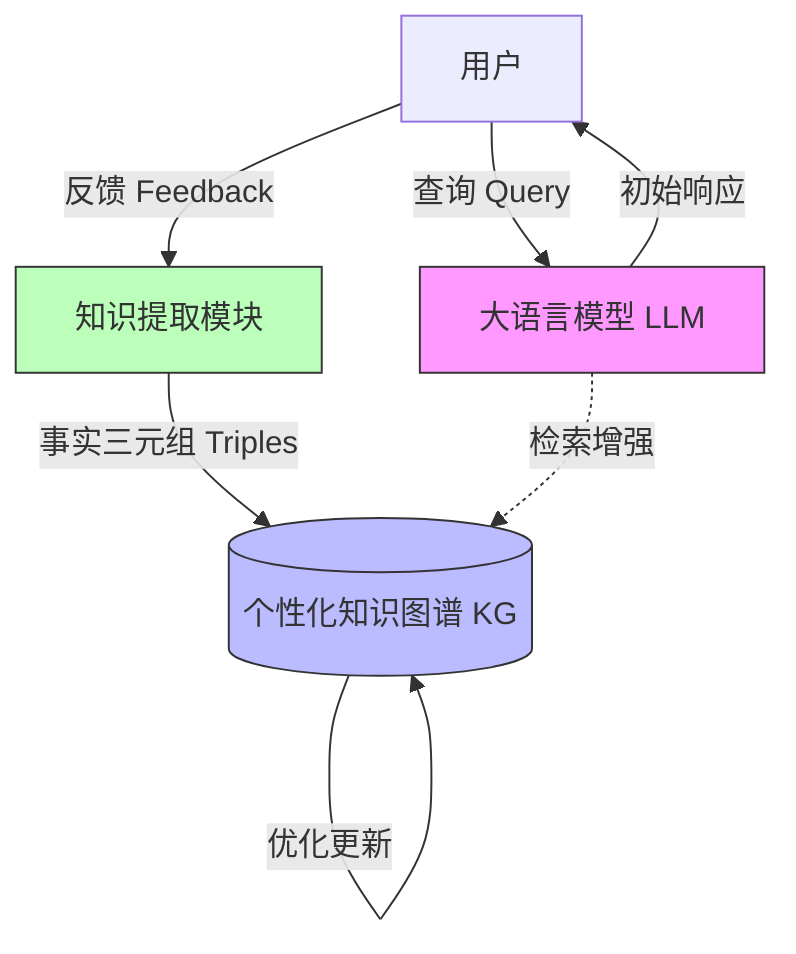

# 知识图谱调优：基于人类反馈的实时大语言模型个性化

## 一、论文基础元数据
- 原文标题：Knowledge Graph Tuning: Real-time Large Language Model Personalization based on Human Feedback
- 中文译版：知识图谱调优：基于人类反馈的实时大语言模型个性化
- 发表渠道：arXiv 预印本 (cs.AI)
- 发表时间：2024-05-30 (原文首页标注) / 用户元数据标注 2025 (以原文为准)
- 链接：arXiv:2405.19686
- 作者及核心机构：Jingwei Sun, Zhixu Du, Yiran Chen (Duke University, Department of Electrical and Computer Engineering)
- 研究领域：人工智能 (一级) + 大语言模型个性化/知识图谱 (二级)
- 关联数据集：待补充 (原文片段未明确列出具体数据集名称，仅提及使用 SOTA LLMs 进行实验)

## 二、论文综合评价
### 2.1 量化评分（1-5 分，5 分为最优）
| 评价维度 | 评分 | 备注 |
| -------- | ---- | ---- |
| 📚 理论基础 | ⭐⭐⭐⭐ | 结合 KG 与 LLM 个性化，理论依据充分 |
| 🎯 问题核心性 | ⭐⭐⭐⭐⭐ | 直击 LLM 部署后个性化成本高、不可解释痛点 |
| 💡 方法创新性 | ⭐⭐⭐⭐ | 提出不调参仅优化 KG 的调优路径 |
| ⚙️ 技术壁垒 | ⭐⭐⭐ | 依赖 KG 构建质量，技术实现细节待补充 |
| 🧪 实验严谨性 | ⭐⭐⭐ | 原文片段未展示完整数据，基于摘要推断 |
| 🔧 落地可行性 | ⭐⭐⭐⭐ | 无需反向传播，显存占用低，适合实时场景 |
| 🚀 应用前景 | ⭐⭐⭐⭐⭐ | 客服、个人助手等强个性化场景需求大 |
| 📊 综合评分 | 4.0 | 概念新颖，工程价值高，需验证细节 |

### 2.2 定性综合评价（≤300 字）
> 核心概括：研究定位、核心价值、差异化优势、关键结论
本文针对 LLM 部署阶段的实时个性化需求，提出知识图谱调优（KGT）方法。核心定位在于解决现有微调方法计算成本高且不可解释的问题。差异化优势在于**无需修改 LLM 参数**（无反向传播），仅通过优化外部知识图谱来注入用户特定事实。关键结论表明，该方法在 GPT-2、Llama2/3 上能显著提升个性化性能，同时降低延迟与显存消耗。核心价值在于提供了一种高效、可解释的在线学习路径，适合资源受限的实时交互场景。

## 三、领域本体论映射
| 核心维度 | 具体内容 |
| -------- | -------- |
| 核心研究对象 | 部署阶段的大语言模型 (Deployed LLMs) |
| 核心技术路径 | 知识图谱优化 (KG Optimization) + 人类反馈 (Human Feedback) |
| 数据/载体形态 | 用户查询与反馈生成的事实三元组 (Factual Knowledge Triples) |
| 核心功能目标 | 实时模型个性化 (Real-time Model Personalization) |
| 验证核心指标 | 个性化性能、延迟 (Latency)、GPU 显存成本 (GPU Memory Costs) |

## 四、核心问题与解决方案
### 4.1 待解决的核心问题
1. **领域级根本问题**：LLM 部署后如何低成本地适应用户特有的事实知识（如“我的狗只吃蔬菜”）。
2. **现有方法痛点**：传统微调需要反向传播 (Back-propagation)，计算和显存成本高；且参数修改导致不可解释，长期积累可能影响模型性能。
3. **工程落地卡点**：实时交互中对延迟敏感，无法承受长时间的重训练过程。

### 4.2 核心解决方案
- 理论框架：Knowledge Graph Tuning (KGT)。
- 核心架构：外部知识图谱存储用户知识，LLM 推理时检索增强。
- 关键技术：从用户查询和反馈中提取事实三元组；优化 KG 而非 LLM 参数。
- 创新机制：**参数冻结机制**（避免 BP）+ **图谱动态更新**（可解释性调整）。

### 4.3 核心优势（量化 + 定性）
1. 性能优势：显著提升个性化性能 (Significantly improves personalization performance)。
2. 效率优势：减少延迟 (Reducing latency) 和 GPU 显存成本 (GPU memory costs)。
3. 工程优势：确保可解释性 (Ensures interpretability)，KG 调整对人类可理解。

## 五、方法与技术架构
### 5.1 核心架构设计
> 文字描述 + 架构图（Mermaid/图片）
架构分为交互层、知识提取层、图谱优化层和推理层。用户反馈被转化为三元组存入 KG，推理时 LLM 结合 KG 知识生成回复，全程不更新 LLM 权重。

### 5.2 关键技术实现细节
| 技术模块 | 实现路径 | 工程注意事项 |
| -------- | -------- | ------------ |
| 知识提取 | 从用户查询和反馈中抽取事实三元组 | 需保证抽取准确性，避免噪声污染 KG |
| 图谱优化 | 更新 KG 结构以包含新事实 | 需处理知识冲突与版本管理 |
| 推理增强 | LLM 推理时结合 KG 信息 | 需优化检索延迟，确保实时性 |
| 依赖组件 | 外部知识图谱存储、LLM 接口 | 显存占用主要在 KV Cache 而非参数梯度 |

### 5.3 架构优缺点
- 优点：无需反向传播，显存占用低；知识修改可追溯，可解释性强。
- 缺点：依赖知识抽取的准确性；复杂推理可能受限于 KG 结构表达能力。

## 六、实验设计与结果分析
### 6.1 实验基础设置
| 维度 | 内容 |
| ---- | ---- |
| 数据集 | 待补充 (原文片段未详述，仅提及基于用户交互) |
| 基线方法 | 待补充 (隐含对比传统微调方法) |
| 实验环境 | 待补充 (提及 GPU 显存成本，具体配置未列) |
| 评价指标 | 个性化性能、延迟、GPU 显存成本 |

### 6.2 核心实验结果
| 方法 | 核心指标 1(个性化性能) | 核心指标 2(延迟/显存) | 工程指标（算力/耗时） |
| ---- | --------- | --------- | -------------------- |
| 传统微调 | 待补充 | 高计算/显存成本 | 需要反向传播 |
| 本文方法 (KGT) | 显著提升 (Significantly improves) | 降低 (Reducing) | 无需反向传播 |
| *注* | *原文片段未提供具体数值，仅定性描述* | *原文片段未提供具体数值* | *基于摘要结论* |

### 6.3 消融实验/鲁棒性分析
| 实验变体 | 指标变化 | 核心结论 |
| -------- | -------- | -------- |
| 待补充 | 待补充 | 原文片段未提供消融实验细节 |

### 6.4 实验结论（工程视角）
在 GPT-2、Llama2、Llama3 上验证有效。工程上证明了**免训练个性化**的可行性，适合对显存敏感且需要快速响应用户偏好变化的在线服务场景。

## 七、领域贡献与创新点
| 贡献层级 | 具体内容 |
| -------- | -------- |
| 理论贡献 | 定义了部署阶段基于反馈的实时个性化新范式 |
| 方法/架构贡献 | 提出 KGT 框架，将个性化从参数空间转移至知识图谱空间 |
| 数据/工具贡献 | 待补充 (未提及开源工具) |
| 实验/验证贡献 | 验证了多模型 (GPT-2, Llama2/3) 下的通用性 |
| 工程落地贡献 | 提供了低显存、低延迟的个性化解决方案 |

## 八、局限性与风险
| 维度 | 具体描述 | 应对思路 |
| ---- | -------- | -------- |
| 学术局限性 | 原文片段未展示复杂推理场景下的效果 | 后续需验证多跳推理能力 |
| 工程落地风险 | 知识抽取错误可能导致图谱污染 (Hallucination in KG) | 引入置信度评估与人工审核机制 |
| 伦理/合规风险 | 用户隐私数据存储在 KG 中 | 需加密存储及符合数据隐私法规 (GDPR 等) |

## 九、未来研究/落地方向
| 方向类型 | 具体内容 | 优先级 |
| -------- | -------- | ------ |
| 科研拓展 | 研究 KG 与 LLM 更深层的融合机制 (如 Graph RAG) | 高 |
| 工程优化 | 优化三元组抽取的实时性与准确性 | 高 |
| 跨领域适配 | 适配医疗、法律等强知识依赖领域 | 中 |

## 十、关键词与术语表
| 语言 | 关键词 |
| ---- | ------ |
| 中文 | 知识图谱调优、大语言模型、个性化、人类反馈、实时 |
| 英文 | Knowledge Graph Tuning, LLM, Personalization, Human Feedback, Real-time |
| 领域专属术语 | **Back-propagation** (反向传播：本文方法避免使用的技术)、**Knowledge Triples** (知识三元组：用户事实的存储形式) |

## 十一、参考文献与关联资源
- 核心参考文献：Devlin et al., 2018 (BERT); Brown et al., 2020 (GPT-3); Raffel et al., 2020 (T5) 等 (见于 Introduction)
- 补充阅读：关于 RLHF、Domain-specific finetuning 的相关文献
- 开源代码/工具：待补充 (原文片段未提及代码开源地址)

## 十二、阅读者批注
1. **科研启发**：将“模型调优”转化为“知识库调优”的思路非常巧妙，避开了梯度更新的开销，为边缘设备部署 LLM 个性化提供了新思路。
2. **工程落地思考**：关键在于“知识提取模块”的准确性，如果提取错误，KG 污染后很难清洗。需要设计强大的纠错机制。
3. **待验证/存疑点**：原文片段未提供具体提升百分比，需查找完整版论文确认实际效果幅度；KG 更新频率对一致性的影响未详述。
4. **个人/团队应用场景**：适用于智能客服系统，记录用户偏好（如口味、禁忌）而不必为每个用户微调模型。

## 十三、阅读元信息
| 维度 | 内容 |
| ---- | ---- |
| 阅读日期 | 2026-04-07 10:14 |
| 阅读人 | xPaperReader AI |
| 文档编号 | arxiv-2405.19686 |
| 版本迭代 | v1.0 |