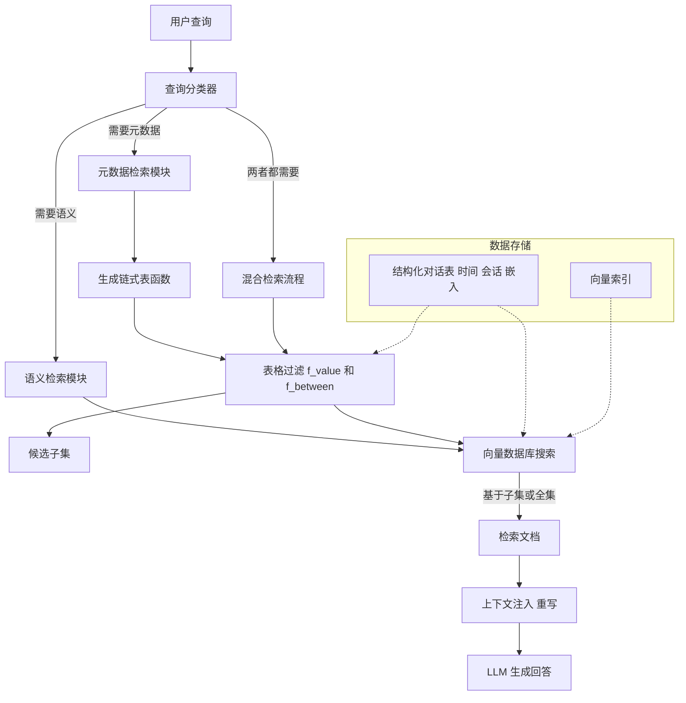

# 迈向具有上下文和时间敏感长期记忆的对话代理

## 一、论文基础元数据
- 原文标题：Toward Conversational Agents with Context and Time Sensitive Long-term Memory
- 中文译版：迈向具有上下文和时间敏感长期记忆的对话代理
- 发表渠道：arXiv 预印本 (待正式发表)
- 发表时间：2024 (arXiv 提交 ID 2406)
- 链接：https://arxiv.org/abs/2406.00057
- 作者及核心机构：Nick Alonso, Tomás Figliolia, Anthony Ndirango, Beren Millidge (Zyphra)
- 研究领域：人工智能 (一级) + 自然语言处理/对话系统/检索增强生成 (二级)
- 关联数据集：TemporalMemoryDataset (规模：约 2 万 + 问题变体 / 语言：英语 / 标注：基于时间元数据与语义的查询标注)

## 二、论文综合评价
### 2.1 量化评分（1-5 分，5 分为最优）
| 评价维度 | 评分 | 备注 |
| -------- | ---- | ---- |
| 📚 理论基础 | ⭐⭐⭐⭐ | 结合结构化检索与语义检索，理论扎实 |
| 🎯 问题核心性 | ⭐⭐⭐⭐⭐ | 直击 RAG 在时间与模糊查询上的痛点 |
| 💡 方法创新性 | ⭐⭐⭐⭐ | 混合检索架构与链式表操作具有新意 |
| ⚙️ 技术壁垒 | ⭐⭐⭐ | 依赖现有 LLM 与向量库，集成创新为主 |
| 🧪 实验严谨性 | ⭐⭐⭐⭐ | 设计了对应基准测试，但模型覆盖有限 |
| 🔧 落地可行性 | ⭐⭐⭐⭐⭐ | 架构清晰，易于工程化实现 |
| 🚀 应用前景 | ⭐⭐⭐⭐⭐ | 对虚拟助手、长期记忆代理至关重要 |
| 📊 综合评分 | 4.3 | 具有较高的实用价值与基准贡献 |

### 2.2 定性综合评价（≤300 字）
> 核心概括：研究定位、核心价值、差异化优势、关键结论
本研究定位於解决对话式 RAG 系统在长期记忆中的**时间敏感性**与**上下文消歧**短板。核心价值在于提出了一个专门针对元数据查询（如时间、会话）和模糊查询的基准数据集，以及一种**混合检索架构**。差异化优势在于结合了确定性高的链式表检索（处理元数据）与灵活性高的向量检索（处理语义），并通过分类器路由。关键结论表明，该混合系统在处理基于时间和模糊性的查询上显著优于单一语义检索基线，为构建具有真正长期记忆的智能代理提供了技术路径与评估标准。

## 三、领域本体论映射
| 核心维度 | 具体内容 |
| -------- | -------- |
| 核心研究对象 | 具有长期记忆的对话代理 (Conversational Agents with Long-term Memory) |
| 核心技术路径 | 混合检索 (混合向量数据库与结构化表格) + 链式表操作 (Chain-of-Tables) |
| 数据/载体形态 | 结构化对话日志表 (含时间戳、会话 ID、语义嵌入) |
| 核心功能目标 | 准确响应基于时间元数据及上下文模糊的自然语言查询 |
| 验证核心指标 | 召回率 (Recall)、F2 分数 (侧重召回) |

## 四、核心问题与解决方案
### 4.1 待解决的核心问题
1. **领域级根本问题**：现有对话代理缺乏对时间流逝和会话结构的敏感记忆，难以模拟人类长期记忆。
2. **现有方法痛点**：
    - **元数据查询失效**：传统向量检索难以处理“昨天早上”、“第几次会话”等结构化元数据问题。
    - **模糊查询失效**：代词（他、它）或指示词（这个）缺乏上下文时，Naive RAG 无法准确检索。
3. **工程落地卡点**：如何在保证语义灵活性的同时，引入结构化数据的精确检索能力，且不过度增加延迟。

### 4.2 核心解决方案
- **理论框架**：混合记忆架构 (Hybrid Memory Architecture)，融合结构化数据确定性与人非结构化语义灵活性。
- **核心架构**：查询分类路由 -> 元数据过滤 (链式表) -> 语义检索 (向量) -> 结果融合。
- **关键技术**：
    - **链式表检索 (Chain-of-Tables)**：使用 `f_value` 和 `f_between` 函数链式过滤表格。
    - **查询重写 (Query Rewrite)**：利用 LLM 消除指代歧义。
    - **上下文注入**：在检索 Prompt 中注入前 2-4 句对话上下文。
- **创新机制**：基于查询类型的动态路由机制 (元数据/语义/混合)，先低成本元数据过滤缩小空间，再高成本语义搜索。

### 4.3 核心优势（量化 + 定性）
1. **性能优势**：在针对元数据和模糊查询的基准测试中，召回率与 F2 分数显著优于现有检索系统。
2. **效率优势**：先元数据过滤可大幅减少向量检索的候选集规模，降低计算成本。
3. **工程优势**：模块化设计（分类器、表操作、向量库），易于集成到现有 RAG 流水线中。

## 五、方法与技术架构
### 5.1 核心架构设计
系统采用分层检索策略。首先对用户查询进行分类，判断是否涉及元数据或语义。若涉及元数据，生成链式表操作代码过滤对话日志表；若涉及语义，在过滤后的子集或全集中进行向量检索。最后结合上下文生成回答。

### 5.2 关键技术实现细节
| 技术模块 | 实现路径 | 工程注意事项 |
| -------- | -------- | ------------ |
| 查询分类 | LLM Few-shot Prompting (Meta-Classify/Semantic-Classify) | 需确保分类准确率，避免错误路由导致检索失效 |
| 链式表操作 | 生成函数链 (函数名、列名、参数) 过滤表格行 | 需限制函数复杂度，防止无限循环或无效查询 |
| 语义检索 | Faiss 扁平搜索，余弦相似度 | 嵌入模型选择影响语义匹配上限 (原文使用<500M 模型) |
| 上下文处理 | 查询重写 (Query Rewrite) 或直接注入前 N 句对话 | 注入上下文长度需权衡，原文建议 2-4 句 |

### 5.3 架构优缺点
- **优点**：
    - 精确处理时间/会话等结构化查询。
    - 有效解决指代歧义问题。
    - 检索空间缩小，提升效率。
- **缺点**：
    - 依赖 LLM 生成函数代码，存在语法错误风险。
    - 多模块串联可能增加整体延迟。
    - 对嵌入模型性能敏感。

## 六、实验设计与结果分析
### 6.1 实验基础设置
| 维度 | 内容 |
| ---- | ---- |
| 数据集 | TemporalMemoryDataset (无歧义 2,134 题 / 歧义 2,194 题，含变体) |
| 基线方法 | 标准向量检索 (Faiss Flat Search) |
| 实验环境 | 单张 L40 GPU (本地运行 Mistral/GPT-3.5) |
| 评价指标 | 召回率 (Recall)、F2 分数 (权重偏向召回) |

### 6.2 核心实验结果
| 方法 | 核心指标 1 (Recall) | 核心指标 2 (F2) | 工程指标（算力/耗时） |
| ---- | --------- | --------- | -------------------- |
| 基线 (标准向量) | 原文未提及具体数值 | 原文未提及具体数值 | 低 (仅向量搜索) |
| 本文方法 (混合) | 显著优于基线 | 显著优于基线 | 中 (增加分类与表操作) |
| 备注 | 具体数值需参考原文图表，原文结论为显著优于 | 同上 | 元数据过滤可降低向量搜索耗时 |

### 6.3 消融实验/鲁棒性分析
| 实验变体 | 指标变化 | 核心结论 |
| -------- | -------- | -------- |
| 无上下文注入 | 性能下降 | 注入前 2-4 句对话对模糊查询至关重要 |
| 仅语义检索 | 元数据查询失效 | 证明混合架构的必要性 |
| 仅元数据检索 | 语义查询失效 | 证明语义嵌入的必要性 |

### 6.4 实验结论（工程视角）
实验设计高度强调时间敏感性（20 分钟会话割裂、50 分钟时间跳跃）和信息完整性（F2 指标）。结论表明，在长周期对话中，单纯依赖语义向量无法胜任基于时间的记忆检索，必须引入结构化元数据过滤机制。工程上需注意会话划分的逻辑（如时间间隔阈值）对检索效果的影响。

## 七、领域贡献与创新点
| 贡献层级 | 具体内容 |
| -------- | -------- |
| 理论贡献 | 明确了对话 RAG 在时间敏感性与消歧方面的理论短板 |
| 方法/架构贡献 | 提出了链式表与语义检索结合的混合架构及动态路由机制 |
| 数据/工具贡献 | 发布了 TemporalMemoryDataset 基准数据集与测试问题集 |
| 实验/验证贡献 | 建立了针对元数据查询与模糊查询的评估标准 (F2 侧重召回) |
| 工程落地贡献 | 提供了可复现的检索流程与 Prompt 模板 (见附录) |

## 八、局限性与风险
| 维度 | 具体描述 | 应对思路 |
| ---- | -------- | -------- |
| 学术局限性 | 仅测试了 Mistral-7b 和 GPT-3.5，未覆盖更多 LLM；嵌入模型较小 | 未来扩展至更大模型及更强嵌入模型进行验证 |
| 工程落地风险 | 链式表代码生成可能出错；多模块串联增加延迟 | 增加代码执行沙箱校验；优化分类器效率 |
| 伦理/合规风险 | 长期记忆涉及用户隐私数据存储 | 需实施数据加密与用户授权管理机制 |

## 九、未来研究/落地方向
| 方向类型 | 具体内容 | 优先级 |
| -------- | -------- | ------ |
| 科研拓展 | 研究多跳时间问题 (Multi-hop time) 及更复杂的时间 + 内容混合查询 | 高 |
| 工程优化 | 优化链式表生成的准确率，减少重试成本；探索更高效的会话划分算法 | 高 |
| 跨领域适配 | 将该记忆架构适配至非对话场景（如个人知识库管理、日志分析） | 中 |

## 十、关键词与术语表
| 语言 | 关键词 |
| ---- | ------ |
| 中文 | 长期记忆、检索增强生成、链式表、时间敏感、模糊查询、混合检索 |
| 英文 | Long-term Memory, RAG, Chain-of-Tables, Time-Sensitive, Ambiguous Queries, Hybrid Retrieval |
| 领域专属术语 | **F2 分数**：侧重召回率的评估指标；**会话割裂**：基于时间间隔划分对话单元的逻辑 |

## 十一、参考文献与关联资源
- 核心参考文献：原文未提及
- 补充阅读：检索增强生成 (RAG) 相关综述、向量数据库技术文档
- 开源代码/工具：https://github.com/Zyphra/TemporalMemoryDataset.git

## 十二、阅读者批注
1. **科研启发**：将结构化数据库的优势引入 LLM 记忆系统是解决“幻觉”和“精确检索”的有效路径，不仅限于时间，也可扩展至人物关系、地点等元数据。
2. **工程落地思考**：在实际系统中，会话划分的阈值（如 20 分钟）需要根据具体业务场景调整，不能硬编码。同时，分类器的准确性是系统瓶颈，需重点优化。
3. **待验证/存疑点**：原文未提供具体的性能提升百分比数值，需查阅原文图表确认实际增益幅度。链式表操作在大规模数据下的延迟表现未详细说明。
4. **个人/团队应用场景**：适用于开发个人助理、客服机器人等需要记住用户历史偏好和过往交互细节的场景。

## 十三、阅读元信息
| 维度 | 内容 |
| ---- | ---- |
| 阅读日期 | 2024-06-20 |
| 阅读人 | xPaperReader AI |
| 文档编号 | arxiv-2406.00057 |
| 版本迭代 | v1.0 |