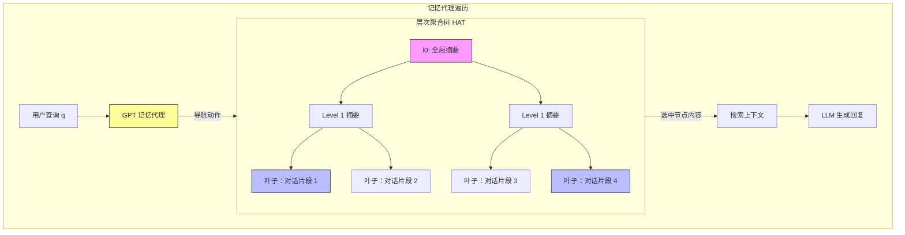

# 使用层次聚合树增强检索增强生成的长期记忆

## 一、论文基础元数据
- 原文标题：Enhancing Long-Term Memory using Hierarchical Aggregate Tree for Retrieval Augmented Generation
- 中文译版：使用层次聚合树增强检索增强生成的长期记忆
- 发表渠道：arXiv 预印本
- 发表时间：2024 年 6 月（根据 arXiv ID 2406 推断，输入标注为 2025）
- 链接：https://arxiv.org/abs/2406.06124
- 作者及核心机构：Aadharsh Aadhithya A, Sachin Kumar S, Soman K.P（机构信息待补充）
- 研究领域：人工智能 > 自然语言处理 > 大语言模型应用
- 关联数据集：Multi-session-chat (Xu et al., 2022) / 测试集 501 个剧集 / 英语 / 人工标注会话记忆

## 二、论文综合评价
### 2.1 量化评分（1-5 分，5 分为最优）
| 评价维度 | 评分 | 备注 |
| -------- | ---- | ---- |
| 📚 理论基础 | ⭐⭐⭐⭐ | 结合 MDP 与树结构，理论形式化清晰 |
| 🎯 问题核心性 | ⭐⭐⭐⭐⭐ | 直击 LLM 长上下文与记忆一致性痛点 |
| 💡 方法创新性 | ⭐⭐⭐⭐⭐ | 提出 HAT 数据结构与条件化遍历代理 |
| ⚙️ 技术壁垒 | ⭐⭐⭐⭐ | 依赖 LLM 代理进行树搜索，实现复杂度中等 |
| 🧪 实验严谨性 | ⭐⭐⭐⭐ | 多基线对比，指标全面，但数据集单一 |
| 🔧 落地可行性 | ⭐⭐⭐ | 存在延迟与内存开销问题，需优化 |
| 🚀 应用前景 | ⭐⭐⭐⭐⭐ | 适用于长周期对话代理、个人助理等场景 |
| 📊 综合评分 | 4.3 | 具有显著创新性与实用价值 |

### 2.2 定性综合评价（≤300 字）
> 核心概括：研究定位、核心价值、差异化优势、关键结论

本研究定位为解决大语言模型在长周期多轮对话中的长期记忆管理问题。核心价值在于提出了一种名为层次聚合树（HAT）的新型数据结构，结合检索增强生成（RAG）技术，实现了信息的高效存储与条件化检索。差异化优势在于将树遍历形式化为马尔可夫决策过程（MDP），利用 LLM 作为代理进行智能路径搜索，而非传统的启发式搜索。关键结论表明，该方法在对话连贯性与摘要质量上显著优于全量上下文及传统搜索基线，有效平衡了记忆的深度与广度，为长上下文场景提供了新的架构思路。

## 三、领域本体论映射
| 核心维度 | 具体内容 |
| -------- | -------- |
| 核心研究对象 | 长周期多轮对话中的历史信息记忆管理 |
| 核心技术路径 | 层次聚合树（HAT）+ 基于 LLM 的记忆代理遍历 |
| 数据/载体形态 | 树状结构化文本（节点包含聚合摘要与原始片段） |
| 核心功能目标 | 在有限上下文窗口内最大化检索信息的相关性与完整性 |
| 验证核心指标 | BLEU 分数、F1 Score、DISTINCT 多样性、对话连贯性 |

## 四、核心问题与解决方案
### 4.1 待解决的核心问题
1. **领域级根本问题**：LLM 上下文窗口有限，无法容纳无限增长的长期对话历史，导致遗忘与不一致。
2. **现有方法痛点**：微调成本高且仅限开源模型；传统 RAG 检索策略单一（如向量相似度），缺乏逻辑关联；纯摘要方法丢失细节且缺乏中间态。
3. **工程落地卡点**：如何在无需指数级参数增长的前提下，实现高效、精准的历史信息检索与整合。

### 4.2 核心解决方案
- 理论框架：将记忆检索建模为马尔可夫决策过程（MDP），代理在树结构中决策导航路径。
- 核心架构：层次聚合树（Hierarchical Aggregate Tree, HAT），根节点为全局摘要，叶子节点为原始片段。
- 关键技术：递归摘要聚合函数（使用 GPT 聚合子节点）、基于查询条件化的 GPT 代理遍历。
- 创新机制：动态树结构随记忆长度变化，支持向上传播更新；代理自主判断终止条件而非固定深度。

### 4.3 核心优势（量化+定性）
1. 性能优势：BLEU-1 得分 0.721，显著高于 BFS（0.652）和全量上下文（0.612）。
2. 效率优势：相比全量历史，精准检索减少了无关 token 消耗，优化了上下文预算。
3. 工程优势：无需模型微调，适用于闭源模型，结构灵活可扩展。

## 五、方法与技术架构
### 5.1 核心架构设计
> 文字描述 + 架构图（Mermaid/图片）

HAT 架构由树状记忆存储与记忆代理两部分组成。树结构自底向上聚合信息，叶子节点存储原始对话，父节点存储子节点的摘要。记忆代理接收用户查询，在树中执行导航动作（上/下/左/右）或终止动作，收集路径上的节点内容作为生成上下文。

### 5.2 关键技术实现细节
| 技术模块 | 实现路径 | 工程注意事项 |
| -------- | -------- | ------------ |
| 聚合函数 | 调用 GPT API 将子节点文本摘要为父节点文本 | 需控制摘要长度，防止信息过度压缩 |
| 记忆代理 | 基于 LLM 的决策器，输入为当前节点文本 + 查询 | 需设计清晰的 Prompt 以规范动作空间 |
| 树更新 | 当叶子节点变化时，递归向上更新父节点摘要 | 注意更新延迟，避免频繁调用 API 导致成本过高 |
| 依赖组件 | GPT 模型（用于聚合与代理）、向量数据库（可选辅助） | 需管理 API 调用频率与令牌消耗 |

### 5.3 架构优缺点
- 优点：结构化管理记忆，支持多粒度检索；代理遍历具有语义理解能力，优于硬规则搜索。
- 缺点：依赖外部 LLM API 导致推理延迟高；树结构扩展可能导致内存足迹过大。

## 六、实验设计与结果分析
### 6.1 实验基础设置
| 维度 | 内容 |
| ---- | ---- |
| 数据集 | Multi-session-chat (Xu et al., 2022)，测试集 501 个包含 5 个会话的剧集 |
| 基线方法 | All Context, Part Context, Gold Memory, BFS, DFS |
| 实验环境 | 基于 GPT 模型的 API 调用环境（具体版本待补充） |
| 评价指标 | BLEU-1/2, F1 Score, DISTINCT-1/2, 对话连贯性，摘要质量 |

### 6.2 核心实验结果
| 方法 | 核心指标 1 (BLEU-1) | 核心指标 2 (DISTINCT-1) | 工程指标（算力/耗时） |
| ---- | --------- | --------- | -------------------- |
| All Context | 0.612 | 待补充 | 高（上下文长） |
| Gold Memory | 0.681 | 待补充 | 低（理想情况） |
| BFS | 0.652 | 0.072 | 中 |
| 本文方法 (GPTAgent) | 0.721 | 0.092 | 高（多次 API 调用） |

### 6.3 消融实验/鲁棒性分析
| 实验变体 | 指标变化 | 核心结论 |
| -------- | -------- | -------- |
| 遍历策略对比 (GPTAgent vs BFS/DFS) | GPTAgent 显著优于启发式搜索 | 基于查询相关性的学习遍历优于手工规则 |
| 上下文策略对比 (HAT vs All Context) | HAT 在 BLEU 与多样性上均更高 | 精准记忆检索比完整历史更高效有效 |
| 记忆生成保真度 | BLEU-1 达 0.842, F1 达 0.824 | 生成的记忆与地面真值高度吻合 |

### 6.4 实验结论（工程视角）
该方法能有效提取长对话中的显著上下文信息，在保证特异性的同时实现了比全量历史检索更高的效率。但在实际工程中，需权衡 API 调用带来的延迟成本与检索质量提升之间的收益。

## 七、领域贡献与创新点
| 贡献层级 | 具体内容 |
| -------- | -------- |
| 理论贡献 | 将记忆检索遍历形式化为马尔可夫决策过程（MDP） |
| 方法/架构贡献 | 提出层次聚合树（HAT）数据结构及递归聚合机制 |
| 数据/工具贡献 | 验证了 Multi-session-chat 数据集上的长期记忆管理方案 |
| 实验/验证贡献 | 证明了条件化遍历优于传统启发式搜索及全量上下文 |
| 工程落地贡献 | 提供了无需微调即可增强闭源模型长期记忆的可行路径 |

## 八、局限性与风险
| 维度 | 具体描述 | 应对思路 |
| ---- | -------- | -------- |
| 学术局限性 | 仅在单一数据集（Multi-session-chat）上验证，泛化性待考 | 扩展至更多领域对话数据集进行验证 |
| 工程落地风险 | 依赖 GPT API 导致响应延迟高，内存足迹随叶子节点指数扩展 | 引入启发式搜索剪枝、蒙特卡洛树搜索 (MCTS)、结构优化 |
| 伦理/合规风险 | 记忆存储可能涉及用户隐私数据 | 实施数据加密、隐私脱敏及访问控制机制 |

## 九、未来研究/落地方向
| 方向类型 | 具体内容 | 优先级 |
| -------- | -------- | ------ |
| 科研拓展 | 研究 Coupled-HAT 架构（文本树 + 向量树混合检索） | 高 |
| 工程优化 | 优化树搜索算法（如 MCTS），减少 API 调用次数 | 高 |
| 跨领域适配 | 适配长文档阅读、代码库维护等非对话场景 | 中 |

## 十、关键词与术语表
| 语言 | 关键词 |
| ---- | ------ |
| 中文 | 层次聚合树、检索增强生成、长期记忆、记忆代理、多轮对话 |
| 英文 | Hierarchical Aggregate Tree, RAG, Long-Term Memory, Memory Agent, Multi-turn Dialogue |
| 领域专属术语 | HAT (层次聚合树): 树状记忆结构，节点包含聚合文本；GPT Agent: 基于 LLM 的树遍历决策器 |

## 十一、参考文献与关联资源
- 核心参考文献：Xu et al., 2022 (Multi-session-chat dataset)
- 补充阅读：检索增强生成 (RAG) 相关综述、长上下文模型研究
- 开源代码/工具：待补充（论文未明确提及开源仓库）

## 十二、阅读者批注
1. **科研启发**：将数据结构（树）与 LLM 代理决策结合是解决长上下文问题的有效范式，值得在其他记忆机制中推广。
2. **工程落地思考**：实际部署时需重点优化延迟，可考虑本地小模型代理进行路径规划，大模型仅用于关键节点摘要。
3. **待验证/存疑点**：树结构在极端长序列下的内存占用具体量化数据未详细披露；Coupled-HAT 的具体实现细节待后续研究。
4. **个人/团队应用场景**：适用于构建具备长期人格一致性的客服机器人、个人生活助理等需要记忆历史交互的产品。

## 十三、阅读元信息
| 维度 | 内容 |
| ---- | ---- |
| 阅读日期 | 2026-04-07 10:39 |
| 阅读人 | xPaperReader AI |
| 文档编号 | arxiv-2406.06124 |
| 版本迭代 | v1.0 |