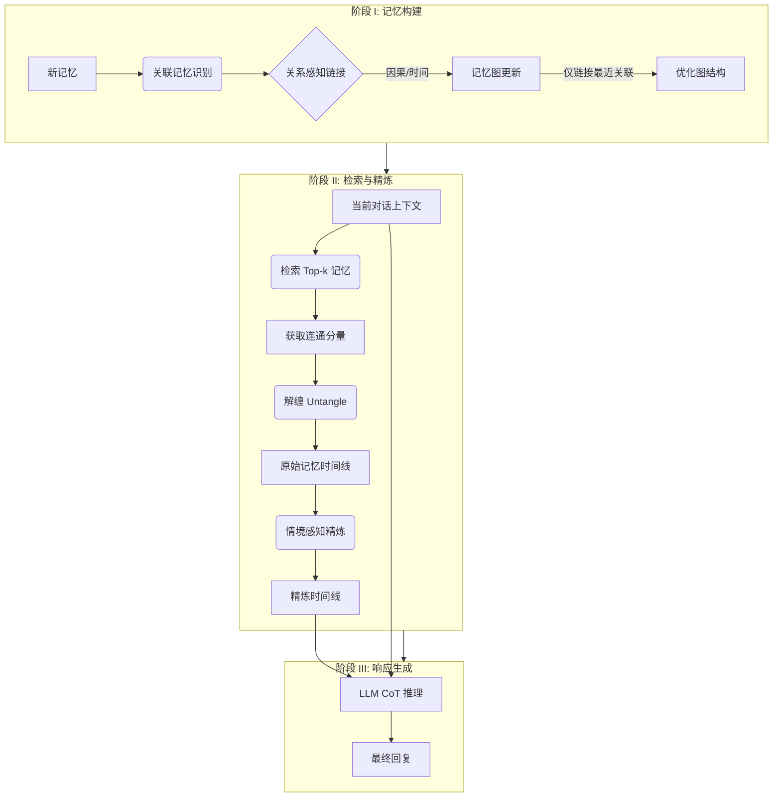

# 基于时间线记忆管理迈向终身对话代理

## 一、论文基础元数据
- 原文标题：Towards Lifelong Dialogue Agents via Timeline-based Memory Management
- 中文译版：基于时间线记忆管理迈向终身对话代理
- 发表渠道：预印本（arXiv）
- 发表时间：2024 年 6 月（基于 arXiv ID 2406.10996 推断）/ 2025 年（输入标注）
- 链接：https://arxiv.org/abs/2406.10996
- 作者及核心机构：Kai Tzu-iunn Ong, Namyoung Kim, Minju Gwak, Hyungjoo Chae, Taeyoon Kwon, Yohan Jo, Seung-won Hwang, Dongha Lee, Jinyoung Yeo（机构信息原文未明确提及，标记为待补充）
- 研究领域：人工智能（一级）+ 自然语言处理/对话系统（二级）
- 关联数据集：
    - Multi-Session Chat (MSC) / 多轮对话 / 英语 / 人工标注
    - Conversation Chronicles (CC) / 多轮对话 / 英语 / 人工标注
    - TeaBag / 100 个对话片段及反事实问答 / 英语 / 本文构建

## 二、论文综合评价
### 2.1 量化评分（1-5 分，5 分为最优）
| 评价维度 | 评分 | 备注 |
| -------- | ---- | ---- |
| 📚 理论基础 | ⭐⭐⭐⭐ | 基于人类记忆机制与图结构理论 |
| 🎯 问题核心性 | ⭐⭐⭐⭐⭐ | 直击 LLM 长对话记忆丢失与近期偏差痛点 |
| 💡 方法创新性 | ⭐⭐⭐⭐⭐ | 首创时间线增强检索与反事实评估管道 |
| ⚙️ 技术壁垒 | ⭐⭐⭐⭐ | 涉及图构建、关系推理与多阶段精炼 |
| 🧪 实验严谨性 | ⭐⭐⭐⭐ | 包含机器、人工及创新评估管道 (TeaFarm) |
| 🔧 落地可行性 | ⭐⭐⭐ | 依赖 LLM API 成本，需优化检索效率 |
| 🚀 应用前景 | ⭐⭐⭐⭐ | 适用于个人助理、陪伴型 AI 等长周期场景 |
| 📊 综合评分 | 4.3 | 在记忆管理与评估方法上均有显著贡献 |

### 2.2 定性综合评价（≤300 字）
> 核心概括：研究定位、核心价值、差异化优势、关键结论
本研究定位为解决大语言模型在长周期对话中的记忆保持与一致性问题。核心价值在于提出了**Theanine 框架**，通过构建基于因果关系和时间顺序的记忆图，并将检索结果还原为事件发展的时间线，有效克服了传统检索的碎片化和近期偏差。差异化优势在于引入了**关系感知链接**和**上下文感知时间线精炼**机制，并配套提出了**TeaFarm 评估管道**与**TeaBag 数据集**，解决了长对话记忆缺乏真值评估的难题。关键结论表明，该方法在一致性和记忆引用准确性上显著优于现有基线（如 COMEDY），且成本优化策略有效。

## 三、领域本体论映射
| 核心维度 | 具体内容 |
| -------- | -------- |
| 核心研究对象 | 长周期对话代理（Lifelong Dialogue Agents） |
| 核心技术路径 | 时间线增强记忆管理（Timeline-based Memory Management） |
| 数据/载体形态 | 多会话对话历史、记忆图结构、线性时间线 |
| 核心功能目标 | 提升对话的一致性、记忆性及具体性 |
| 验证核心指标 | 特异性 (Specificity)、记忆性 (Memorability)、一致性 (Consistency)、TeaFarm 准确率 |

## 四、核心问题与解决方案
### 4.1 待解决的核心问题
1. **领域级根本问题**：LLM 在长周期交互中难以维持长期记忆，导致角色设定和事实信息丢失。
2. **现有方法痛点**：传统记忆更新机制导致早期重要信息被覆盖（如图 1b）；注意力机制存在近期偏差（Recency Bias）；简单文本相似度检索缺乏因果上下文。
3. **工程落地卡点**：记忆图构建成本高；长周期下检索效率下降；缺乏有效的记忆真实性评估标准。

### 4.2 核心解决方案
- 理论框架：模拟人类记忆机制，将孤立记忆链接为具有因果关系的时间线。
- 核心架构：Theanine 框架（三阶段：记忆构建、时间线检索与精炼、响应生成）。
- 关键技术：关系感知链接（Relation-aware Linking）、解缠检索（Untangle Retrieval）、上下文感知精炼。
- 创新机制：仅链接每个连通分量中最近的关联记忆以降低成本；提出反事实问答评估（TeaFarm）。

### 4.3 核心优势（量化 + 定性）
1. 性能优势：在一致性指标上显著优于 COMEDY；TeaFarm 评估准确率达 0.21（优于基线 0.18）。
2. 效率优势：优化链接策略比全链接成本降低 25% 且效果更好。
3. 工程优势：91% 的回答能忠实反映或中立处理过去信息，幻觉率低。

## 五、方法与技术架构
### 5.1 核心架构设计
> 文字描述 + 架构图（Mermaid/图片）
Theanine 框架分为三个阶段：首先构建包含因果关系的记忆图；其次检索相关记忆连通分量并解缠为线性时间线，再根据当前上下文精炼；最后结合时间线利用 CoT 生成回复。

### 5.2 关键技术实现细节
| 技术模块 | 实现路径 | 工程注意事项 |
| -------- | -------- | ------------ |
| 记忆图构建 | 基于文本相似度找潜在关联，LLM 判断因果关系（Cause, React 等） | 需控制 API 调用次数，仅链接最近节点 |
| 时间线检索 | 检索 Top-k 记忆后获取整个连通分量，按时间排序解缠 | 确保时间顺序逻辑正确，避免循环依赖 |
| 时间线精炼 | 利用 LLM 根据当前上下文去除冗余，高亮相关信息 | 防止精炼过程中丢失关键事实信息 |
| 依赖组件 | ChatGPT (gpt-3.5-turbo-0125), text-embedding-3-small | 需管理 Token 成本与延迟 |

### 5.3 架构优缺点
- 优点：捕捉事件演变逻辑，增强记忆一致性；评估方法创新，能检测记忆幻觉。
- 缺点：多阶段处理增加延迟；依赖外部 LLM API 进行图构建和精炼，成本较高。

## 六、实验设计与结果分析
### 6.1 实验基础设置
| 维度 | 内容 |
| ---- | ---- |
| 数据集 | MSC, CC (评估 Session 3-5), TeaBag (新构建) |
| 基线方法 | Full History, Memory Retrieval, RSum-LLM, MemoChat, COMEDY |
| 实验环境 | ChatGPT (gpt-3.5-turbo-0125), OpenAI Embedding |
| 评价指标 | G-Eval (特异性/记忆性/一致性), 人工评估，TeaFarm 准确率 |

### 6.2 核心实验结果
| 方法 | 核心指标 1 (一致性) | 核心指标 2 (TeaFarm Acc) | 工程指标（算力/耗时） |
| ---- | --------- | --------- | -------------------- |
| COMEDY | 较高 (但易冲突) | 待补充 | 待补充 |
| Memory Retrieval | 一般 | 0.18 | 较低 |
| 本文方法 (Theanine) | 显著优于基线 | 0.21 (MSC 0.17, CC 0.24) | 链接策略成本降低 25% |

### 6.3 消融实验/鲁棒性分析
| 实验变体 | 指标变化 | 核心结论 |
| -------- | -------- | -------- |
| 移除关系感知链接 | 性能显著下降 | 因果关系优于单纯文本相似度 |
| 移除时间线精炼 | 记忆引用效果下降 | 离线记忆细化能有效提取上下文线索 |
| 全链接策略 (Theanine-All) | 成本增加 25%，性能更低 | 证明优化链接策略的有效性 |

### 6.4 实验结论（工程视角）
1. 结构化记忆管理（时间线）优于纯生成式记忆总结。
2. 检索器结合结构化记忆在反事实任务中表现优于纯 LLM 总结。
3. 需平衡检索粒度与成本，全量链接并非最优解。

## 七、领域贡献与创新点
| 贡献层级 | 具体内容 |
| -------- | -------- |
| 理论贡献 | 提出基于时间线增强的记忆管理范式，模拟人类记忆演变 |
| 方法/架构贡献 | 设计 Theanine 框架，包含关系感知链接与上下文感知精炼 |
| 数据/工具贡献 | 发布 TeaBag 数据集及 TeaFarm 反事实评估管道 |
| 实验/验证贡献 | 验证了时间线检索在长对话一致性上的优势 |
| 工程落地贡献 | 提供了成本优化的记忆链接策略（仅链接最近关联） |

## 八、局限性与风险
| 维度 | 具体描述 | 应对思路 |
| ---- | -------- | -------- |
| 学术局限性 | 仅验证 5 个会话以内，更长周期表现未验证；仅限英语开放域 | 未来扩展至数百会话及多语言场景 |
| 工程落地风险 | 时间线检索与精炼比传统检索更耗时；依赖 API 成本 | 增加检索选择模块，判断是否需要时间线；知识蒸馏训练链接器 |
| 伦理/合规风险 | 记忆存储涉及用户隐私数据 | 需实施数据加密与用户授权机制 |

## 九、未来研究/落地方向
| 方向类型 | 具体内容 | 优先级 |
| -------- | -------- | ------ |
| 科研拓展 | 探索更长周期（数百会话）下的记忆检索效率 | 高 |
| 工程优化 | 利用知识蒸馏训练本地记忆链接器，降低 API 依赖 | 高 |
| 跨领域适配 | 适配临床对话、多语言场景及垂直领域知识库 | 中 |

## 十、关键词与术语表
| 语言 | 关键词 |
| ---- | ------ |
| 中文 | 终身对话代理、时间线记忆管理、关系感知链接、反事实评估 |
| 英文 | Lifelong Dialogue Agents, Timeline-based Memory Management, Relation-aware Linking, Counterfactual Evaluation |
| 领域专属术语 | **Theanine**: 本文提出的框架名称；**TeaFarm**: 基于反事实问答的评估流水线；**TeaBag**: 为 TeaFarm 构建的数据集；**Recency Bias**: 近期偏差，模型倾向于关注最新输入 |

## 十一、参考文献与关联资源
- 核心参考文献：COMEDY, MemoChat, RSum-LLM 等相关对话记忆管理论文（原文未列具体 bibliography，基于基线提及）
- 补充阅读：关于 Long-term Conversations 及 Memory Bank 的相关研究
- 开源代码/工具：待补充（原文未明确提供代码链接，通常 arXiv 论文会有后续开源）

## 十二、阅读者批注
1. **科研启发**：评估方法的创新（TeaFarm）比模型本身更具普适参考价值，解决了长对话记忆难以量化的问题。
2. **工程落地思考**：在实际系统中，全量构建记忆图成本过高，可考虑仅在关键节点触发关系链接。
3. **待验证/存疑点**：在会话数量极大（如 100+）时，连通分量的解缠效率是否会成为瓶颈。
4. **个人/团队应用场景**：适用于构建具有长期个人记忆的智能助手或情感陪伴机器人。

## 十三、阅读元信息
| 维度 | 内容 |
| ---- | ---- |
| 阅读日期 | 2026-04-07 10:50 |
| 阅读人 | xPaperReader AI |
| 文档编号 | arxiv-2406.10996 |
| 版本迭代 | v1.0 |