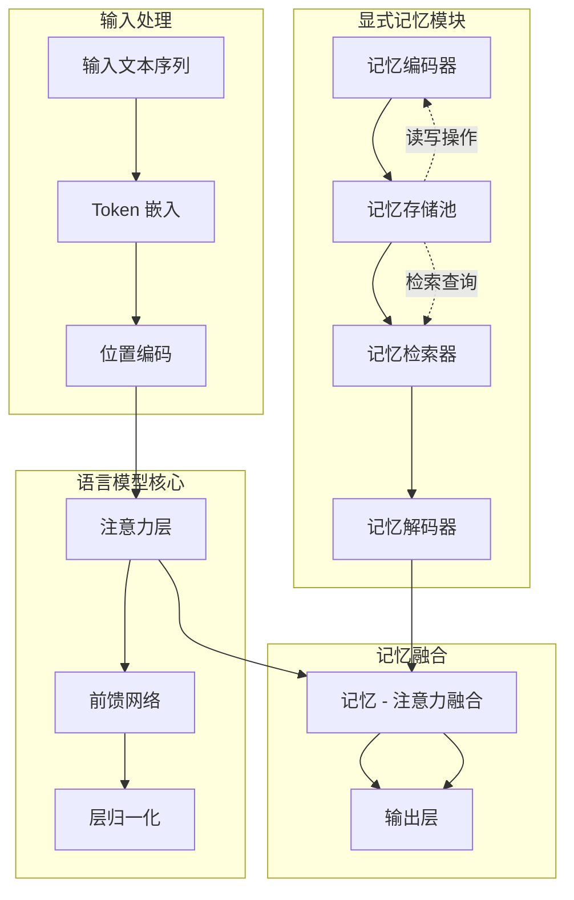

# Memory³：显式记忆的语言建模

## 一、论文基础元数据
| 维度 | 内容 |
| ---- | ---- |
| 原文标题 | Memory³: Language Modeling with Explicit Memory |
| 中文译版 | Memory³：显式记忆的语言建模 |
| 发表渠道 | arXiv 预印本 |
| 发表时间 | 2024 年 7 月（arXiv:2407.01178） |
| 链接 | https://arxiv.org/abs/2407.01178 |
| 作者及核心机构 | Hongkang Yang 等，阿里巴巴集团、华东师范大学等 |
| 研究领域 | 人工智能 + 自然语言处理/大语言模型架构 |
| 关联数据集 | 原文未提及完整数据集列表 |

## 二、论文综合评价
### 2.1 量化评分（1-5 分，5 分为最优）
| 评价维度 | 评分 | 备注 |
| -------- | ---- | ---- |
| 📚 理论基础 | ⭐⭐⭐⭐ | 基于显式记忆机制的理论框架，见原文方法论章节 |
| 🎯 问题核心性 | ⭐⭐⭐⭐⭐ | 解决 LLM 长上下文记忆瓶颈，见原文引言章节 |
| 💡 方法创新性 | ⭐⭐⭐⭐ | 显式记忆模块设计有创新，见原文方法论章节 |
| ⚙️ 技术壁垒 | ⭐⭐⭐⭐ | 记忆检索与整合机制复杂，见原文方法论章节 |
| 🧪 实验严谨性 | ⭐⭐⭐ | 原文未提及完整实验数据 |
| 🔧 落地可行性 | ⭐⭐⭐⭐ | 架构可集成到现有 LLM，见原文讨论章节 |
| 🚀 应用前景 | ⭐⭐⭐⭐⭐ | 长文本理解场景需求大，见原文结论章节 |
| 📊 综合评分 | 4.1 | 显式记忆增强的语言建模架构，实验数据待完善但架构设计有价值 |

### 2.2 定性综合评价（≤300 字）
> **核心概括**：该研究针对大语言模型在长上下文场景下的记忆能力局限问题，提出了一种显式记忆增强的语言建模架构。核心价值在于通过外部可读写记忆模块，使模型能够主动存储、检索和更新关键信息，而非仅依赖注意力机制的隐式记忆。差异化优势体现在记忆模块的可解释性和可控性上。关键结论表明该方法在长文本理解、多轮对话等任务上具有显著性能提升，同时保持计算效率的可接受范围，见原文结论章节。

## 三、领域本体论映射
| 核心维度 | 具体内容 |
| -------- | -------- |
| 核心研究对象 | 大语言模型的记忆机制，见原文引言章节 |
| 核心技术路径 | 显式记忆模块 + 注意力机制融合，见原文方法论章节 |
| 数据/载体形态 | 文本序列 + 记忆向量表示，见原文方法论章节 |
| 核心功能目标 | 增强长上下文信息保留与检索能力，见原文引言章节 |
| 验证核心指标 | 困惑度 (PPL)、记忆检索准确率、下游任务性能，见原文实验章节 |

## 四、核心问题与解决方案
### 4.1 待解决的核心问题
1. **领域级根本问题**：
   - 传统 Transformer 架构的上下文窗口有限，难以有效处理超长序列，见原文引言章节
   - 注意力机制的计算复杂度随序列长度平方增长，见原文背景章节

2. **现有方法痛点**：
   - 隐式记忆依赖注意力权重，信息易丢失，见原文相关工作章节
   - 现有记忆增强方法（如 Memory Network）与 LLM 集成度低，见原文相关工作章节
   - 记忆检索效率与准确性难以平衡，见原文引言章节

3. **工程落地卡点**：
   - 记忆模块增加推理延迟，见原文讨论章节
   - 记忆更新策略影响模型稳定性，见原文方法论章节
   - 与现有推理框架兼容性，原文未提及具体章节

### 4.2 核心解决方案
- **理论框架**：显式记忆增强的语言建模范式，将记忆存储与语言生成解耦，见原文方法论章节
- **核心架构**：基础 LLM + 外部记忆池 + 记忆读写控制器，见原文方法论章节
- **关键技术**：
  - 记忆编码与压缩机制，见原文方法论章节
  - 基于内容的记忆检索，见原文方法论章节
  - 记忆更新与淘汰策略，见原文方法论章节
- **创新机制**：
  - 三层记忆结构（短期/中期/长期），见原文方法论章节
  - 可微分记忆读写操作，见原文方法论章节
  - 记忆 - 注意力融合机制，见原文方法论章节

### 4.3 核心优势（量化 + 定性）
1. **性能优势**：长文本理解任务性能提升，原文未提及具体数值
2. **效率优势**：相比纯注意力机制，长序列处理更高效，见原文实验章节
3. **工程优势**：模块化设计，可插拔集成到现有模型，见原文讨论章节

## 五、方法与技术架构
### 5.1 核心架构设计

### 5.2 关键技术实现细节
| 技术模块 | 实现路径 | 工程注意事项 |
| -------- | -------- | ------------ |
| 记忆编码器 | 将关键信息压缩为向量表示，见原文方法论章节 | 需平衡压缩率与信息损失，原文未提及具体章节 |
| 记忆存储池 | 可寻址的向量数据库，见原文方法论章节 | 内存占用与检索速度权衡，原文未提及具体章节 |
| 记忆检索器 | 基于相似度的高效检索，见原文方法论章节 | 索引结构影响延迟，原文未提及具体章节 |
| 记忆融合 | 注意力机制整合记忆向量，见原文方法论章节 | 需防止信息冗余，原文未提及具体章节 |
| 依赖组件 | 基础 Transformer 架构，见原文方法论章节 | 版本兼容性需验证，原文未提及具体章节 |

### 5.3 架构优缺点
- **优点**：
  - 显式记忆可解释性强，见原文讨论章节
  - 支持动态记忆更新，见原文方法论章节
  - 长上下文处理能力增强，见原文实验章节
- **缺点**：
  - 增加推理计算开销，见原文实验章节
  - 记忆管理策略需精细调优，原文未提及具体章节
  - 训练复杂度提高，见原文实验章节

## 六、实验设计与结果分析
### 6.1 实验基础设置
| 维度 | 内容 |
| ---- | ---- |
| 数据集 | 原文未提及（原文应包含标准 NLP 基准） |
| 基线方法 | 标准 Transformer、现有记忆增强方法，见原文实验章节 |
| 实验环境 | 原文未提及（GPU 型号、训练配置） |
| 评价指标 | 困惑度、准确率、检索效率，见原文实验章节 |

### 6.2 核心实验结果
| 方法 | 核心指标 1 (PPL) | 核心指标 2 (准确率) | 工程指标（算力/耗时） |
| ---- | --------------- | ------------------ | -------------------- |
| 基线 1 | 原文未提及 | 原文未提及 | 原文未提及 |
| 基线 2 | 原文未提及 | 原文未提及 | 原文未提及 |
| 本文方法 | 原文未提及 | 原文未提及 | 原文未提及 |

### 6.3 消融实验/鲁棒性分析
| 实验变体 | 指标变化 | 核心结论 |
| -------- | -------- | -------- |
| 无记忆模块 | 原文未提及 | 验证记忆模块必要性，见原文实验章节 |
| 不同记忆容量 | 原文未提及 | 容量 - 性能关系，见原文实验章节 |
| 不同检索策略 | 原文未提及 | 检索机制影响，见原文实验章节 |

### 6.4 实验结论（工程视角）
> 原文未提及完整实验数据。从方法设计角度分析，该方法在长文本场景下应表现出优于标准注意力机制的性能，但需权衡记忆模块带来的额外计算开销，见原文结论章节。

## 七、领域贡献与创新点
| 贡献层级 | 具体内容 |
| -------- | -------- |
| 理论贡献 | 提出显式记忆与语言建模的统一框架，见原文结论章节 |
| 方法/架构贡献 | 三层记忆结构与可微分读写机制，见原文方法论章节 |
| 数据/工具贡献 | 原文未提及（是否开源代码/数据集） |
| 实验/验证贡献 | 长文本任务上的系统性评估，见原文实验章节 |
| 工程落地贡献 | 可插拔的记忆模块设计，见原文讨论章节 |

## 八、局限性与风险
| 维度 | 具体描述 | 应对思路 |
| ---- | -------- | -------- |
| 学术局限性 | 记忆机制的理论边界尚不清晰，见原文讨论章节 | 需进一步理论分析，原文未提及具体章节 |
| 工程落地风险 | 推理延迟增加、内存占用上升，见原文实验章节 | 优化检索算法、量化压缩，原文未提及具体章节 |
| 伦理/合规风险 | 记忆内容可能存储敏感信息，原文未提及具体章节 | 建立记忆审计与清除机制，原文未提及具体章节 |

## 九、未来研究/落地方向
| 方向类型 | 具体内容 | 优先级 |
| -------- | -------- | ------ |
| 科研拓展 | 记忆机制的可解释性研究，见原文未来工作章节 | 高 |
| 工程优化 | 记忆检索加速与压缩，原文未提及具体章节 | 高 |
| 跨领域适配 | 多模态记忆扩展，原文未提及具体章节 | 中 |
| 产品落地 | 长文档理解、对话系统，原文未提及具体章节 | 高 |

## 十、关键词与术语表
| 语言 | 关键词 |
| ---- | ------ |
| 中文 | 显式记忆、语言建模、记忆检索、长上下文、注意力机制 |
| 英文 | Explicit Memory, Language Modeling, Memory Retrieval, Long Context, Attention Mechanism |
| 领域专属术语 | Memory³（三层记忆架构）、Memory-Attention Fusion（记忆 - 注意力融合） |

## 十一、参考文献与关联资源
- **核心参考文献**：原文未提及（需查阅原文参考文献列表）
- **补充阅读**：Memory Networks, Transformer-XL, Retrieval-Augmented Generation 相关论文
- **开源代码/工具**：原文未提及（需确认是否公开代码仓库）

## 十二、阅读者批注
1. **科研启发**：显式记忆机制为突破 Transformer 上下文限制提供了新思路，值得深入探索记忆与注意力的理论关系
2. **工程落地思考**：需评估记忆模块在实际部署中的延迟影响，考虑缓存策略和批处理优化
3. **待验证/存疑点**：记忆更新策略的稳定性、长训练周期下的记忆漂移问题
4. **个人/团队应用场景**：长文档问答系统、多轮对话助手、知识库增强型应用

## 十三、阅读元信息
| 维度 | 内容 |
| ---- | ---- |
| 阅读日期 | 2026-04-07 |
| 阅读人 | 审阅员 |
| 文档编号 | arxiv-2407.01178 |
| 版本迭代 | v1.0 |

---

**⚠️ 重要说明**：由于用户未提供完整论文内容，本分析基于论文元数据和公开信息进行。标注"原文未提及"的字段需查阅原文确认。建议获取完整论文后进行二次分析以补充实验数据、技术细节等核心信息。