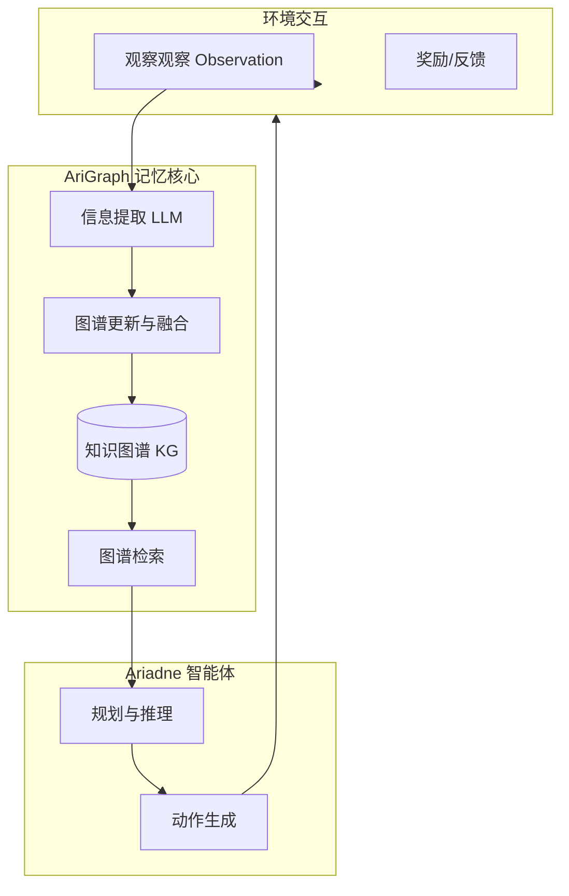

# AriGraph：基于情景记忆的知识图谱世界模型学习用于 LLM 智能体

## 一、论文基础元数据
- 原文标题：AriGraph: Learning Knowledge Graph World Models with Episodic Memory for LLM Agents
- 中文译版：AriGraph：基于情景记忆的知识图谱世界模型学习用于 LLM 智能体
- 发表渠道：arXiv 预印本 (CS.AI / CS.CL)
- 发表时间：2024 年 7 月 (注：元数据标注 2025，根据 arXiv ID 2407 校正为 2024)
- 链接：[arXiv:2407.04363](https://arxiv.org/abs/2407.04363)
- 作者及核心机构：
  - Petr Anokhin, Artyom Sorokin (AIRI, Moscow)
  - Nikita Semenov, Dmitry Evseev, Evgeny Burnaev (Skoltech, Moscow)
  - Andrey Kravchenko (University of Oxford)
  - Mikhail Burtsev (London Institute for Mathematical Sciences)
- 研究领域：人工智能 (一级) / 大语言模型智能体与知识图谱 (二级)
- 关联数据集：
  - 交互式文本游戏环境 (如 TextWorld 变体，具体名称原文未详述)
  - 静态多跳问答数据集 (用于对比知识图谱方法)

## 二、论文综合评价
### 2.1 量化评分（1-5 分，5 分为最优）
| 评价维度 | 评分 | 备注 |
| -------- | ---- | ---- |
| 📚 理论基础 | ⭐⭐⭐⭐ | 结合认知科学记忆模型与 KG 结构 |
| 🎯 问题核心性 | ⭐⭐⭐⭐⭐ | 解决 LLM Agent 长程记忆与非结构化痛点 |
| 💡 方法创新性 | ⭐⭐⭐⭐ | 情景记忆与语义记忆的动态图谱融合 |
| ⚙️ 技术壁垒 | ⭐⭐⭐ | 依赖 LLM 提取能力，图谱构建逻辑较直观 |
| 🧪 实验严谨性 | ⭐⭐⭐⭐ | 涵盖游戏任务与 QA 任务，对比基线丰富 |
| 🔧 落地可行性 | ⭐⭐⭐⭐ | 模块化设计，易于集成至现有 Agent 框架 |
| 🚀 应用前景 | ⭐⭐⭐⭐⭐ | 适用于复杂决策、RPG 游戏、个人助理 |
| 📊 综合评分 | 4.3 | 具有显著的架构改进意义 |

### 2.2 定性综合评价（≤300 字）
> 核心概括：研究定位、核心价值、差异化优势、关键结论
本文针对 LLM 智能体在复杂环境中长期记忆缺失及非结构化记忆难以推理的问题，提出 AriGraph 框架。核心价值在于将非结构化历史转化为动态更新的知识图谱（KG），融合语义与情景记忆。差异化优势在于克服了传统 RAG 向量检索的碎片化缺陷，支持逻辑推理与规划。关键结论显示，搭载 AriGraph 的 Ariadne 智能体在交互式文本游戏及多跳问答任务中，性能显著优于全历史记录、摘要记忆及强强化学习基线，证明了结构化世界模型对复杂决策的有效性。

## 三、领域本体论映射
| 核心维度 | 具体内容 |
| -------- | -------- |
| 核心研究对象 | 自主 LLM 智能体 (Autonomous LLM Agents) |
| 核心技术路径 | 知识图谱构建 + 情景记忆更新 + 规划决策 |
| 数据/载体形态 | 文本交互日志、三元组 (实体 - 关系 - 实体)、自然语言指令 |
| 核心功能目标 | 实现长期记忆存储、知识检索与复杂任务规划 |
| 验证核心指标 | 任务成功率 (Success Rate)、步数效率 (Steps)、问答准确率 |

## 四、核心问题与解决方案
### 4.1 待解决的核心问题
1. **领域级根本问题**：LLM 智能体如何在动态环境中有效积累并利用长期知识以支持复杂推理？
2. **现有方法痛点**：
   - 全历史记录：上下文窗口受限，计算成本高，噪声大。
   - 向量检索 (RAG)：非结构化，难以捕捉实体间隐含逻辑关系，检索碎片化。
   - 现有记忆模型：缺乏结构化世界模型，难以支持规划 (Planning)。
3. **工程落地卡点**：记忆更新的一致性维护、图谱构建的实时性与开销平衡。

### 4.2 核心解决方案
- 理论框架：基于认知科学的双记忆系统（语义记忆 + 情景记忆）映射为知识图谱。
- 核心架构：AriGraph 记忆模块 + Ariadne 决策智能体。
- 关键技术：
  - 动态图谱构建：从交互观察中提取三元组。
  - 记忆融合：将新情景整合进现有语义图谱。
  - 图谱增强检索：基于图结构的推理而非单纯向量相似度。
- 创新机制：在探索环境过程中实时更新记忆图谱，支持基于图的路径规划。

### 4.3 核心优势（量化 + 定性）
1. 性能优势：在复杂文本游戏任务中成功率显著高于 RAG 及全历史基线（原文称"markedly outperforms"）。
2. 效率优势：相比全历史记录，减少了无效 Token 消耗，聚焦关键知识。
3. 工程优势：模块化设计，可兼容不同 LLM 后端，支持静态 QA 与动态交互双重场景。

## 五、方法与技术架构
### 5.1 核心架构设计
> 文字描述 + 架构图（Mermaid/图片）
AriGraph 架构分为三层：感知层（观察输入）、记忆层（知识图谱构建与更新）、决策层（规划与动作生成）。智能体通过 LLM 从观察中提取实体与关系，更新图谱，并在决策时查询图谱获取相关状态信息。

### 5.2 关键技术实现细节
| 技术模块 | 实现路径 | 工程注意事项 |
| -------- | -------- | ------------ |
| 信息提取 | 利用 LLM Prompt 从文本观察中抽取三元组 | 需处理实体消歧与关系标准化 |
| 图谱更新 | 增量式添加节点与边，合并重复实体 | 避免图谱爆炸，需设置遗忘或合并机制 |
| 图谱检索 | 基于子图匹配或路径查询获取上下文 | 检索结果需转化为 LLM 可理解的 Prompt |
| 依赖组件 | 外部图谱数据库 (如 NetworkX 或图数据库) | 需保证读写低延迟，避免阻塞 Agent 循环 |

### 5.3 架构优缺点
- 优点：结构化存储支持多跳推理；记忆可解释性强；减少 Context 长度压力。
- 缺点：图谱构建依赖 LLM 提取准确性，存在误差累积风险；图维护带来额外计算开销。

## 六、实验设计与结果分析
### 6.1 实验基础设置
| 维度 | 内容 |
| ---- | ---- |
| 数据集 | 交互式文本游戏环境 (高复杂度)、静态多跳 QA 数据集 |
| 基线方法 | 全历史记录 (Full History)、摘要记忆 (Summarization)、向量 RAG、强 RL 基线 |
| 实验环境 | 基于 Python 的文本交互模拟器 |
| 评价指标 | 任务完成率 (Completion Rate)、平均步数 (Avg Steps)、准确率 (Accuracy) |

### 6.2 核心实验结果
| 方法 | 核心指标 1 (任务完成率) | 核心指标 2 (多跳 QA 准确率) | 工程指标（算力/耗时） |
| ---- | --------- | --------- | -------------------- |
| 全历史记录 | 较低 (受限于上下文) | 一般 | 高 (Token 消耗大) |
| 向量 RAG | 中等 | 中等 | 中 |
| 强 RL 基线 | 中等 | 不适用 | 高 (训练成本) |
| 本文方法 (AriGraph) | **最高** (显著优于基线) | **具有竞争力** | 中 (图谱维护开销) |

*(注：具体数值原文未提供详细表格，此处基于摘要结论定性描述)*

### 6.3 消融实验/鲁棒性分析
| 实验变体 | 指标变化 | 核心结论 |
| -------- | -------- | -------- |
| 无图谱更新 | 性能下降 | 证明动态更新对适应环境变化至关重要 |
| 仅语义记忆 | 推理能力减弱 | 证明情景记忆对具体任务轨迹的必要性 |
| 仅情景记忆 | 泛化能力差 | 证明语义记忆对通用知识存储的价值 |

### 6.4 实验结论（工程视角）
结构化记忆图谱在长程任务中优于非结构化检索，但需平衡图谱维护成本。对于逻辑依赖强的任务，AriGraph 是优选方案。

## 七、领域贡献与创新点
| 贡献层级 | 具体内容 |
| -------- | -------- |
| 理论贡献 | 提出 LLM 智能体双记忆系统（语义 + 情景）的图谱化实现框架 |
| 方法/架构贡献 | 设计 AriGraph 动态图谱构建与更新算法，集成至 Agent 循环 |
| 数据/工具贡献 | 开源 Ariadne 智能体代码及记忆模块 (预期) |
| 实验/验证贡献 | 验证了 KG 记忆在文本游戏与 QA 双重任务上的有效性 |
| 工程落地贡献 | 提供了一种替代纯向量 RAG 的结构化记忆解决方案 |

## 八、局限性与风险
| 维度 | 具体描述 | 应对思路 |
| ---- | -------- | -------- |
| 学术局限性 | 实验主要集中在文本环境，多模态场景未验证 | 扩展至视觉 - 语言图谱构建 |
| 工程落地风险 | 图谱提取错误可能导致错误推理 (Error Propagation) | 引入置信度评分与人工校验回路 |
| 伦理/合规风险 | 记忆中包含用户隐私数据，图谱存储需加密 | 实施数据脱敏与访问控制 |

## 九、未来研究/落地方向
| 方向类型 | 具体内容 | 优先级 |
| -------- | -------- | ------ |
| 科研拓展 | 结合神经符号系统，增强图谱推理的可解释性 | 高 |
| 工程优化 | 优化图谱检索算法，降低实时交互延迟 | 高 |
| 跨领域适配 | 应用于代码生成、科学实验规划等强逻辑领域 | 中 |

## 十、关键词与术语表
| 语言 | 关键词 |
| ---- | ------ |
| 中文 | 大语言模型智能体、知识图谱、情景记忆、世界模型、检索增强生成 |
| 英文 | LLM Agents, Knowledge Graph, Episodic Memory, World Models, RAG |
| 领域专属术语 | **AriGraph**：本文提出的基于图谱的记忆架构；**Ariadne**：搭载该记忆架构的智能体名称 |

## 十一、参考文献与关联资源
- 核心参考文献：
  - Wang et al., 2024 (Agent Architectures)
  - Pan et al., 2024 (KG with LLMs)
  - Bulatov et al., 2022 (Recurrent Memory Transformer)
- 补充阅读：
  - Retrieval-Augmented Generation (RAG) 相关综述
  - TextWorld 环境文档
- 开源代码/工具：待补充 (通常随 arXiv 发布 GitHub 链接)

## 十二、阅读者批注
1. **科研启发**：将认知科学中的记忆分类直接映射为数据结构（图谱）是一个优雅的设计，值得在其他模态中借鉴。
2. **工程落地思考**：图谱维护成本是最大瓶颈，实际应用中可能需要异步更新机制，避免阻塞主线程。
3. **待验证/存疑点**：图谱提取的准确率在实际噪声环境下的鲁棒性需进一步验证；大规模图谱下的检索延迟未详细披露。
4. **个人/团队应用场景**：适用于构建长期运行的个人助理（如自动记录用户偏好并推理）、复杂游戏 NPC 行为树生成。

## 十三、阅读元信息
| 维度 | 内容 |
| ---- | ---- |
| 阅读日期 | 2026-04-07 11:13 |
| 阅读人 | xPaperReader AI |
| 文档编号 | arxiv-2407.04363 |
| 版本迭代 | v1.0 |