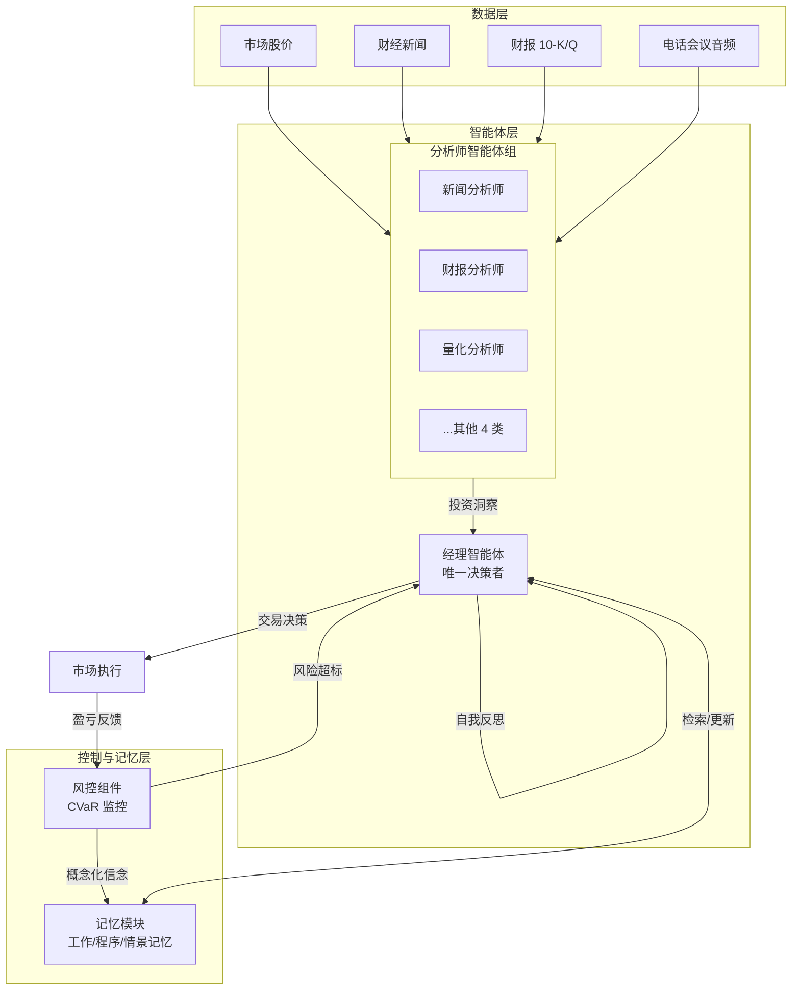

# FinCon：一种具有概念性言语强化功能的合成 LLM 多智能体系统，用于增强金融决策

## 一、论文基础元数据
- 原文标题：FinCon: A Synthesized LLM Multi-Agent System with Conceptual Verbal Reinforcement for Enhanced Financial Decision Making
- 中文译版：FinCon：一种具有概念性言语强化功能的合成 LLM 多智能体系统，用于增强金融决策
- 发表渠道：arXiv 预印本
- 发表时间：2024 (arXiv ID: 2407.06567)
- 链接：https://arxiv.org/abs/2407.06567
- 作者及核心机构：Yangyang Yu, Zhiyuan Yao, Haohang Li 等（具体机构待补充）
- 研究领域：人工智能 + 金融量化交易（多智能体系统/大语言模型应用）
- 关联数据集：自建金融多模态数据集（42 只股票，2020.08-2023.08，包含股价、新闻、财报 10-K/Q、Earnings Call 音频）

## 二、论文综合评价
### 2.1 量化评分（1-5 分，5 分为最优）
| 评价维度 | 评分 | 备注 |
| -------- | ---- | ---- |
| 📚 理论基础 | ⭐⭐⭐⭐ | 基于 POMDP 框架，结合 LLM 与强化学习思想 |
| 🎯 问题核心性 | ⭐⭐⭐⭐⭐ | 解决金融决策中高波动环境下的信息合成与风险管理难题 |
| 💡 方法创新性 | ⭐⭐⭐⭐⭐ | 提出概念性言语强化与层级化多智能体协作架构 |
| ⚙️ 技术壁垒 | ⭐⭐⭐⭐ | 涉及多模态数据处理与复杂的 Prompt 优化机制 |
| 🧪 实验严谨性 | ⭐⭐⭐⭐⭐ | 对比基线全面，包含统计显著性检验与多任务验证 |
| 🔧 落地可行性 | ⭐⭐⭐⭐ | 架构清晰，但依赖高性能 LLM  API，成本较高 |
| 🚀 应用前景 | ⭐⭐⭐⭐⭐ | 智能投顾、自动化交易系统设计具有极高参考价值 |
| 📊 综合评分 | 4.7 | 在 LLM 金融应用领域具有里程碑意义 |

### 2.2 定性综合评价（≤300 字）
> 核心概括：研究定位、核心价值、差异化优势、关键结论
本研究定位为基于大语言模型的多智能体金融决策系统。核心价值在于模仿真实投资公司的“经理 - 分析师”层级结构，通过概念性言语强化（Conceptual Verbal Reinforcement）替代传统梯度更新，实现了策略的动态优化。差异化优势在于引入了基于 CVaR 的风控组件触发自我反思机制，显著降低了最大回撤。关键结论表明，FinCon 在累计收益和风险控制上均优于传统 DRL 方法及现有 LLM 代理，证明了 LLM 多智能体协作在复杂金融任务中的有效性与鲁棒性。

## 三、领域本体论映射
| 核心维度 | 具体内容 |
| -------- | -------- |
| 核心研究对象 | 金融市场的多模态数据流与交易决策过程 |
| 核心技术路径 | 多智能体协作 + 概念性言语强化 + 层级化记忆管理 |
| 数据/载体形态 | 文本（新闻/财报）、音频（电话会议）、表格（股价/指标） |
| 核心功能目标 | 最大化累积收益的同时控制条件风险价值（CVaR） |
| 验证核心指标 | 累计收益 (CR)、夏普比率 (SR)、最大回撤 (MDD) |

## 四、核心问题与解决方案
### 4.1 待解决的核心问题
1. **领域级根本问题**：金融环境高波动、信息噪声大，单一模型难以兼顾收益与风险。
2. **现有方法痛点**：传统 DRL 仅依赖数值特征忽视文本信息；现有 LLM 代理缺乏层级协作与显式风控，易产生幻觉且忽视风险。
3. **工程落地卡点**：多智能体沟通成本高，Prompt 优化缺乏稳定机制，长上下文记忆检索效率低。

### 4.2 核心解决方案
- 理论框架：将交易任务形式化为无限视野部分可观测马尔可夫决策过程 (POMDP)。
- 核心架构：Manager-Analyst（经理 - 分析师）层级化多智能体结构。
- 关键技术：概念性言语强化（文本梯度下降）、基于 CVaR 的风控触发机制、程序记忆衰减。
- 创新机制：利用风控组件生成的“概念化投资信念”作为言语强化信号更新 Prompt，而非参数权重。

### 4.3 核心优势（量化 + 定性）
1. 性能优势：投资组合累计收益达 121.02%（FinRL 为 33.48%），夏普比率 3.435。
2. 效率优势：层级化沟通降低了多智能体间的冗余交互，记忆衰减机制提升了检索相关性。
3. 工程优势：显式风控模块显著降低最大回撤（16.29%），在熊市中避免巨额亏损。

## 五、方法与技术架构
### 5.1 核心架构设计
系统采用层级化多智能体架构，包含分析师组、经理智能体、风控组件及记忆模块。分析师处理多模态数据，经理整合信息并决策，风控模块监控风险并触发反思。

### 5.2 关键技术实现细节
| 技术模块 | 实现路径 | 工程注意事项 |
| -------- | -------- | ------------ |
| 概念性言语强化 | 通过 Meta-prompt 和交易决策序列重叠率模拟学习率，更新 Prompt | 需避免提示词震荡，保持稳定性 |
| 风控组件 | 实时监控 CVaR，若超标触发经理自我反思机制 | 阈值设定需根据市场波动动态调整 |
| 记忆模块 | 包含工作记忆、程序记忆（带衰减）、情景记忆，基于相关性检索 | 需处理长上下文窗口限制，定期清理过期记忆 |
| 多模态处理 | 不同分析师处理不同模态数据（文本/音频/表格） | 音频需转为文本，需保证转录准确性 |

### 5.3 架构优缺点
- 优点：层级结构降低沟通成本；显式风控增强安全性；言语强化无需反向传播即可优化策略。
- 缺点：依赖高性能 LLM API，推理成本较高；多智能体协调复杂度随数量增加而上升。

## 六、实验设计与结果分析
### 6.1 实验基础设置
| 维度 | 内容 |
| ---- | ---- |
| 数据集 | 42 只股票，2020.08-2023.08，多模态金融数据 |
| 基线方法 | B&H, PPO, DQN, GA, FinGPT, FinMem, FinAgent, Markowitz MV, FinRL-A2C |
| 实验环境 | GPT-4-Turbo，温度 0.3，5 次重复实验 |
| 评价指标 | 累计收益 (CR)、夏普比率 (SR)、最大回撤 (MDD)、VaR、CVaR |

### 6.2 核心实验结果
| 方法 | 核心指标 1 (CR%) | 核心指标 2 (SR) | 工程指标（算力/耗时） |
| ---- | --------- | --------- | -------------------- |
| FinRL-A2C | 33.48 | 待补充 | 低 |
| FinMem | 待补充 | 待补充 | 中 |
| 本文方法 (FinCon) | 121.02 | 3.435 | 高 (依赖 LLM API) |

### 6.3 消融实验/鲁棒性分析
| 实验变体 | 指标变化 | 核心结论 |
| -------- | -------- | -------- |
| 无风控组件 | CR 从 121.02% 降至 16.99% | 风控组件对收益提升至关重要 |
| 单股票熊市测试 | 避免对比模型 -70% 亏损 | 系统在极端市场下具有鲁棒性 |
| 不同记忆机制 | 引入衰减机制后检索相关性提升 | 时间衰减符合金融信息时效性特征 |

### 6.4 实验结论（工程视角）
FinCon 在真实市场数据上验证了有效性，尤其在风险控制方面表现卓越。虽然推理成本高于传统 DRL，但其收益风险比（夏普比率）显著更优，适合对风险敏感的资金管理场景。统计显著性检验（Wilcoxon 符号秩检验）支持了性能提升的可靠性。

## 七、领域贡献与创新点
| 贡献层级 | 具体内容 |
| -------- | -------- |
| 理论贡献 | 将 LLM 多智能体交易建模为 POMDP，提出言语强化学习范式 |
| 方法/架构贡献 | 设计 Manager-Analyst 层级架构与概念性言语强化机制 |
| 数据/工具贡献 | 构建了包含多模态金融数据的实验环境与评估基准 |
| 实验/验证贡献 | 提供了与 DRL 及现有 LLM 代理的全方位对比与显著性检验 |
| 工程落地贡献 | 实现了基于 CVaR 的实时风控与自我反思闭环系统 |

## 八、局限性与风险
| 维度 | 具体描述 | 应对思路 |
| ---- | -------- | -------- |
| 学术局限性 | 未深入探讨智能体数量增加后的通信复杂度爆炸问题 | 未来研究可引入通信压缩或稀疏连接机制 |
| 工程落地风险 | 依赖 GPT-4 等闭源模型，成本高且存在数据隐私风险 | 可尝试微调开源小模型或搭建私有化部署 |
| 伦理/合规风险 | 自动化交易可能引发市场波动或合规问题 | 需加入人工审核环节，符合金融监管要求 |

## 九、未来研究/落地方向
| 方向类型 | 具体内容 | 优先级 |
| -------- | -------- | ------ |
| 科研拓展 | 扩展至数十种资产的大型投资组合管理 | 高 |
| 工程优化 | 解决 LLM 输入长度限制，平衡信息简洁性与上下文窗口 | 高 |
| 跨领域适配 | 将层级化风控架构迁移至供应链管理等其他决策领域 | 中 |

## 十、关键词与术语表
| 语言 | 关键词 |
| ---- | ------ |
| 中文 | 多智能体系统、概念性言语强化、金融决策、风险控制、大语言模型 |
| 英文 | Multi-Agent System, Conceptual Verbal Reinforcement, Financial Decision Making, Risk Control, LLM |
| 领域专属术语 | **CVaR (条件风险价值)**：衡量极端风险的价值指标；**POMDP (部分可观测马尔可夫决策过程)**：建模不确定环境下的决策框架；**文本梯度下降**：通过 Prompt 优化模拟梯度更新的过程 |

## 十一、参考文献与关联资源
- 核心参考文献：FinRL, FinMem, FinAgent, Generative Agents 相关论文
- 补充阅读：深度强化学习在金融中的应用综述、LLM Agent 架构设计指南
- 开源代码/工具：待补充（论文未明确提供公开仓库链接）

## 十二、阅读者批注
1. **科研启发**：言语强化（Verbal Reinforcement）为 LLM 优化提供了一种无需反向传播的新思路，值得在非金融决策领域推广。
2. **工程落地思考**：层级化架构有效降低了多智能体通信开销，但需关注 API 调用成本与延迟，实际部署需考虑缓存机制。
3. **待验证/存疑点**：记忆衰减机制的具体参数（如艾宾浩斯曲线系数）对结果敏感度未详细披露，需复现验证。
4. **个人/团队应用场景**：可参考其风控组件设计，优化现有的量化交易策略系统中的风险预警模块。

## 十三、阅读元信息
| 维度 | 内容 |
| ---- | ---- |
| 阅读日期 | 2026-04-07 11:24 |
| 阅读人 | xPaperReader AI |
| 文档编号 | arxiv-2407.06567 |
| 版本迭代 | v1.0 |