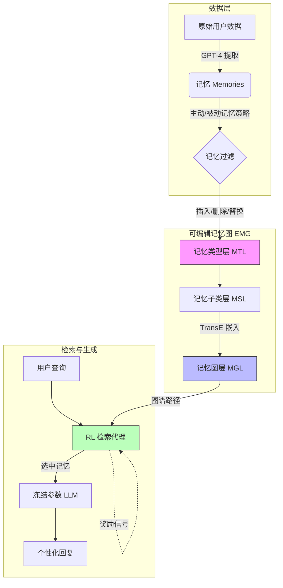

# 基于可编辑记忆图上的检索增强生成构建个性化智能体

## 一、论文基础元数据
- 原文标题：Crafting Personalized Agents through Retrieval-Augmented Generation on Editable Memory Graphs
- 中文译版：基于可编辑记忆图上的检索增强生成构建个性化智能体
- 发表渠道：预印本 (arXiv)
- 发表时间：2025 (arXiv ID 表明 2024 年 9 月提交)
- 链接：arXiv:2409.19401
- 作者及核心机构：Zheng Wang, Zhongyang Li, Zeren Jiang, Dandan Tu, Wei Shi (机构信息待补充)
- 研究领域：人工智能 (一级) + 检索增强生成/个性化智能体 (二级)
- 关联数据集：私有智能手机助手数据集 (原始文本 113.5 亿条，清洗后记忆 3.5 亿条，中文/多语言，人工 + 模型标注)

## 二、论文综合评价
### 2.1 量化评分（1-5 分，5 分为最优）
| 评价维度 | 评分 | 备注 |
| -------- | ---- | ---- |
| 📚 理论基础 | ⭐⭐⭐⭐ | 结合图谱与 RAG，理论扎实 |
| 🎯 问题核心性 | ⭐⭐⭐⭐⭐ | 直击个性化助手记忆管理痛点 |
| 💡 方法创新性 | ⭐⭐⭐⭐⭐ | 提出可编辑记忆图 (EMG) 结构 |
| ⚙️ 技术壁垒 | ⭐⭐⭐⭐ | 涉及 RL 优化与图谱构建，有一定门槛 |
| 🧪 实验严谨性 | ⭐⭐⭐⭐⭐ | 真实商业数据，规模大，对比充分 |
| 🔧 落地可行性 | ⭐⭐⭐⭐⭐ | 已迁移至真实手机助手平台 |
| 🚀 应用前景 | ⭐⭐⭐⭐⭐ | 移动端个性化服务需求巨大 |
| 📊 综合评分 | 4.8 | 兼具学术创新与工程价值 |

### 2.2 定性综合评价（≤300 字）
> 核心概括：研究定位、核心价值、差异化优势、关键结论
本研究定位於移动端个性化智能体的记忆管理问题。核心价值在于提出了**EMG-RAG 框架**，通过**可编辑记忆图 (EMG)** 解决了传统 RAG 在动态记忆更新（可编辑性）和精准检索（可选择性）上的不足。差异化优势在于采用三层分层图谱结构管理记忆，并引入**强化学习 (RL)** 优化检索路径，而非仅依赖静态索引。关键结论显示，该方法在真实商业数据集上相比最佳基线提升约 10%，且在连续编辑场景下保持高鲁棒性，已成功落地于智能手机 AI 助手，具有极高的工程应用价值。

## 三、领域本体论映射
| 核心维度 | 具体内容 |
| -------- | -------- |
| 核心研究对象 | 智能手机用户记忆数据 (对话、截图、事件) |
| 核心技术路径 | 可编辑记忆图 (EMG) + 检索增强生成 (RAG) + 强化学习 (RL) |
| 数据/载体形态 | 结构化图谱节点 (实体/关系) + 非结构化文本记忆 |
| 核心功能目标 | 构建可动态更新、精准检索的个性化智能体 |
| 验证核心指标 | ROUGE (R-1/2/L), BLEU, Exact Match (EM) |

## 四、核心问题与解决方案
### 4.1 待解决的核心问题
1. **领域级根本问题**：如何在资源受限的移动端设备上，管理海量且动态变化的用户个人记忆？
2. **现有方法痛点**：传统 RAG 缺乏记忆的可编辑性（难以删除/更新过期信息），且检索缺乏语义关联性，导致回复不准确。
3. **工程落地卡点**：大规模记忆数据的实时检索效率与隐私保护之间的平衡。

### 4.2 核心解决方案
- 理论框架：基于图谱的记忆管理理论，将非结构化记忆转化为结构化可编辑节点。
- 核心架构：EMG-RAG (Editable Memory Graph - Retrieval Augmented Generation)。
- 关键技术：三层分层记忆图结构 (MTL/MSL/MGL)、TransE 实体嵌入、强化学习检索策略优化。
- 创新机制：利用 RL 代理动态选择图谱上的记忆路径，替代传统的静态向量检索。

### 4.3 核心优势（量化+定性）
1. 性能优势：在 GPT-4 架构下，问答任务 ROUGE-1 得分达 93.46，优于次优方法 (88.71) 约 10%。
2. 效率优势：用户端独立构建 EMG，计算存储不受总用户数影响，支持本地化部署。
3. 工程优势：支持记忆的插入、删除、替换操作，在 4 周连续编辑场景下性能稳定保持在 93%-97%。

## 五、方法与技术架构
### 5.1 核心架构设计
> 文字描述 + 架构图（Mermaid/图片）
系统分为数据构建、记忆图管理、检索优化、生成响应四个阶段。原始用户数据经 GPT-4 提取记忆后，存入三层 EMG 结构。检索时，RL 代理在图谱上游走选择关键节点，最后由冻结参数的 LLM 生成回复。

### 5.2 关键技术实现细节
| 技术模块 | 实现路径 | 工程注意事项 |
| -------- | -------- | ------------ |
| 记忆图构建 | 三层结构 (MTL/MSL/MGL)，利用实体识别与关系抽取 | 需定期清理失效节点，防止图谱膨胀 |
| 检索优化 | 强化学习 (2 层神经网络代理)，策略梯度 (PG) 优化 | 需平衡探索与利用，避免陷入局部最优 |
| 生成模型 | 冻结参数的 LLM (GPT-4/ChatGLM/PanGu) | 确保 LLM 不记忆用户隐私数据，仅作为推理引擎 |
| 依赖组件 | Faiss (索引), TransE (嵌入), CPT-Text (编码) | 嵌入模型需与图谱结构适配，保证语义对齐 |

### 5.3 架构优缺点
- 优点：支持动态编辑，语义检索能力强，隐私保护性好 (数据隔离)。
- 缺点：训练过程中需频繁查询 LLM 获取优化答案，初期训练效率低于 Naive RAG。

## 六、实验设计与结果分析
### 6.1 实验基础设置
| 维度 | 内容 |
| ---- | ---- |
| 数据集 | 真实商业 AI 助手数据 (2024.03-06)，2000 用户训练，500 用户测试 |
| 基线方法 | NiaH (全量), Naive RAG, M-RAG, Keqing |
| 实验环境 | Python 3.7, Faiss, TransE, 多模型架构 (GPT-4, ChatGLM3-6B, PanGu-38B) |
| 评价指标 | ROUGE (R-1/2/L), BLEU, Exact Match (EM) |

### 6.2 核心实验结果
| 方法 | 核心指标 1 (QA ROUGE-1) | 核心指标 2 (Service EM) | 工程指标（算力/耗时） |
| ---- | --------- | --------- | -------------------- |
| 基线 1 (Naive) | 待补充 | 待补充 | 低 |
| 基线 2 (M-RAG) | 88.71 | 待补充 | 中 |
| 本文方法 (EMG-RAG) | 93.46 | 显著优于基线 | 中偏高 (RL 训练开销) |

### 6.3 消融实验/鲁棒性分析
| 实验变体 | 指标变化 | 核心结论 |
| -------- | -------- | -------- |
| 移除激活节点 (Act. Nodes) | 性能下降 | 验证了关键节点选择的重要性 |
| 移除暖启动 (WS) | 性能下降 | 证明预训练策略对收敛有帮助 |
| 移除策略梯度 (PG) | 性能下降 | 确认 RL 优化机制的有效性 |
| 4 周连续编辑 | 性能稳定 93%-97% | 证明对记忆动态更新的鲁棒性 |

### 6.4 实验结论（工程视角）
EMG-RAG 在大规模真实数据上验证了优越性，不仅在静态任务上超越现有 RAG 方法，且在动态记忆编辑场景下表现出更强的稳定性。虽然训练开销略高，但推理阶段效率可接受，适合移动端部署。

## 七、领域贡献与创新点
| 贡献层级 | 具体内容 |
| -------- | -------- |
| 理论贡献 | 定义了个性化代理记忆的可编辑性与可选择性属性 |
| 方法/架构贡献 | 提出 EMG 三层分层结构及 RL 优化的检索路径 |
| 数据/工具贡献 | 构建了基于真实手机交互的大规模记忆数据集 (3.5 亿记忆) |
| 实验/验证贡献 | 在多种 LLM 架构上验证了泛化性，进行了显著性检验 (p<0.05) |
| 工程落地贡献 | 已迁移至真实智能手机 AI 助手平台，支持在线学习 |

## 八、局限性与风险
| 维度 | 具体描述 | 应对思路 |
| ---- | -------- | -------- |
| 学术局限性 | 训练效率未高于 Naive RAG，因需频繁查询 LLM 获取奖励 | 优化奖励模型，减少 LLM 调用频率 |
| 工程落地风险 | 移动端存储压力，随时间增长图谱可能过大 | 采用子图同构算法挖掘通用模式，减少冗余 |
| 伦理/合规风险 | 用户隐私数据泄露风险 | 数据隔离 (用户独立 EMG)，数据脱敏，模型冻结 |

## 九、未来研究/落地方向
| 方向类型 | 具体内容 | 优先级 |
| -------- | -------- | ------ |
| 科研拓展 | 探索更高效的图谱嵌入算法，减少存储占用 | 高 |
| 工程优化 | 优化 RL 训练流程，降低冷启动成本 | 高 |
| 跨领域适配 | 适配 IoT 设备、智能家居等多模态记忆场景 | 中 |

## 十、关键词与术语表
| 语言 | 关键词 |
| ---- | ------ |
| 中文 | 个性化智能体，检索增强生成，可编辑记忆图，强化学习 |
| 英文 | Personalized Agents, RAG, Editable Memory Graph (EMG), Reinforcement Learning |
| 领域专属术语 | **EMG**: 可编辑记忆图，三层结构管理记忆；**MTL/MSL/MGL**: 记忆类型/子类/图层；**在线学习**: 利用新记录持续微调代理策略 |

## 十一、参考文献与关联资源
- 核心参考文献：待补充 (原文未在输入中列出具体参考文献列表)
- 补充阅读：TransE 嵌入技术，RAG 相关综述
- 开源代码/工具：待补充 (输入未提及开源地址)

## 十二、阅读者批注
1. **科研启发**：将图谱结构引入 RAG 记忆管理是一个很好的方向，特别是针对动态变化的个人数据。
2. **工程落地思考**：隐私保护设计（用户端独立图谱）非常关键，是移动端 AI 落地的前提。
3. **待验证/存疑点**：训练效率的具体量化数据未详细给出，仅提到“未高于 Naive RAG"，需关注实际耗时。
4. **个人/团队应用场景**：可应用于构建企业内部的个性化知识库助手，或智能客服的记忆模块。

## 十三、阅读元信息
| 维度 | 内容 |
| ---- | ---- |
| 阅读日期 | 2026-04-07 11:34 |
| 阅读人 | xPaperReader AI |
| 文档编号 | arxiv-2409.19401 |
| 版本迭代 | v1.0 |