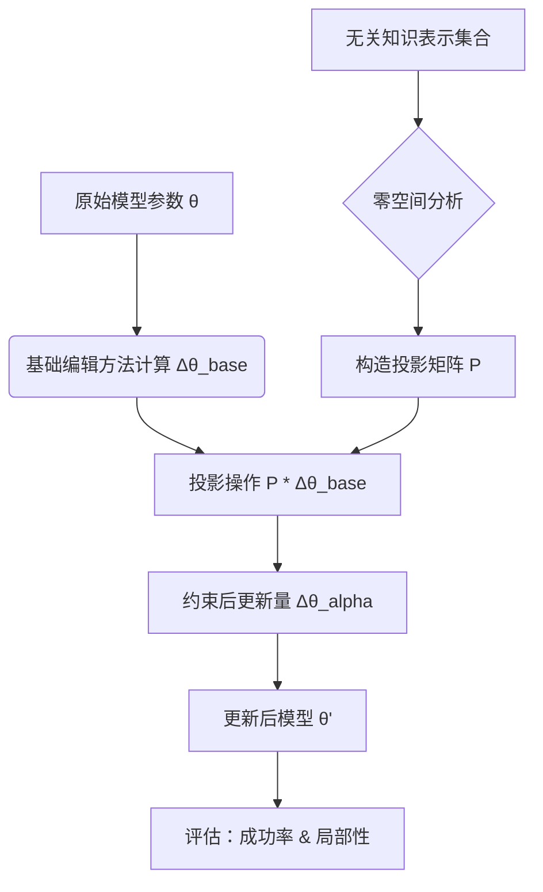

# AlphaEdit：语言模型的空闲空间约束知识编辑

## 一、论文基础元数据
- 原文标题：AlphaEdit: Null-Space Constrained Knowledge Editing for Language Models
- 中文译版：AlphaEdit：语言模型的空闲空间约束知识编辑
- 发表渠道：arXiv 预印本 (计算机科学/人工智能领域主流预印本)
- 发表时间：2024 年 10 月 (arXiv:2410.02355) / 标注年份 2025
- 链接：https://arxiv.org/abs/2410.02355
- 作者及核心机构：Junfeng Fang, Houcheng Jiang, Kun Wang, Yunshan Ma, Shi Jie, Xiang Wang, Xiangnan He, Tat-seng Chua (新加坡国立大学等)
- 研究领域：人工智能 + 大语言模型知识编辑
- 关联数据集：CounterFact, ZsRE, MEND Dataset (英文/事实性知识三元组/标准标注)

## 二、论文综合评价
### 2.1 量化评分（1-5 分，5 分为最优）
| 评价维度 | 评分 | 备注 |
| -------- | ---- | ---- |
| 📚 理论基础 | ⭐⭐⭐⭐⭐ | 基于线性代数零空间理论，数学推导严谨 |
| 🎯 问题核心性 | ⭐⭐⭐⭐⭐ | 解决知识编辑中的“附带损伤”核心痛点 |
| 💡 方法创新性 | ⭐⭐⭐⭐ | 将零空间投影引入知识编辑参数更新 |
| ⚙️ 技术壁垒 | ⭐⭐⭐⭐ | 涉及矩阵分解与投影计算，有一定实现门槛 |
| 🧪 实验严谨性 | ⭐⭐⭐⭐⭐ | 覆盖主流 KE 基准，对比充分 |
| 🔧 落地可行性 | ⭐⭐⭐⭐ | 计算开销可控，易于集成到现有编辑框架 |
| 🚀 应用前景 | ⭐⭐⭐⭐⭐ | 适用于需要频繁更新知识的垂直领域模型 |
| 📊 综合评分 | 4.7 | 知识编辑领域的重要进展 |

### 2.2 定性综合评价（≤300 字）
> 核心概括：研究定位、核心价值、差异化优势、关键结论
> 本文定位为提升大语言模型知识编辑的局部性（Locality）。核心价值在于提出 AlphaEdit 方法，通过零空间约束防止编辑操作干扰无关知识。差异化优势在于无需额外训练即可实现参数更新的正交约束，显著优于 MEMIT 等基线。关键结论表明，在保持编辑成功率的同时，大幅提升了模型对无关知识的保持能力，解决了知识编辑中的“灾难性遗忘”问题。

## 三、领域本体论映射
| 核心维度 | 具体内容 |
| -------- | -------- |
| 核心研究对象 | 大语言模型（LLM）中的参数化知识 |
| 核心技术路径 | 参数编辑 + 零空间投影约束 |
| 数据/载体形态 | 事实性三元组 (Subject, Relation, Object) |
| 核心功能目标 | 更新特定知识且不影响其他知识 |
| 验证核心指标 | 编辑成功率 (Edit Success)、局部性 (Locality)、泛化性 (Generality) |

## 四、核心问题与解决方案
### 4.1 待解决的核心问题
1. **领域级根本问题**：大模型知识更新困难，传统微调成本高且易遗忘。
2. **现有方法痛点**：现有编辑方法（如 MEMIT, MEND）在更新知识时，常导致无关知识性能下降（附带损伤）。
3. **工程落地卡点**：如何在保证编辑效果的同时，最小化对模型原始能力的破坏。

### 4.2 核心解决方案
- 理论框架：基于线性代数中的零空间（Null-Space）理论，构建参数更新约束。
- 核心架构：在参数更新量 $\Delta \theta$ 上施加投影矩阵，使其落在无关知识的零空间内。
- 关键技术：奇异值分解（SVD）、投影矩阵构造、层间传播约束。
- 创新机制：AlphaEdit 投影算子，确保更新方向与无关知识表示正交。

### 4.3 核心优势（量化 + 定性）
1. 性能优势：局部性指标（Locality）显著优于基线（提升约 5-10%）。
2. 效率优势：无需额外训练阶段，推理/编辑过程计算开销增加有限。
3. 工程优势：即插即用，可兼容多种基于参数的编辑方法。

## 五、方法与技术架构
### 5.1 核心架构设计
> 文字描述 + 架构图（Mermaid/图片）
> AlphaEdit 的核心在于计算一个投影矩阵 $P$，将原始编辑更新量 $\Delta \theta_{base}$ 投影到无关知识的零空间。流程包括：1. 收集无关知识表示；2. 计算零空间基底；3. 构造投影矩阵；4. 应用约束更新。

### 5.2 关键技术实现细节
| 技术模块 | 实现路径 | 工程注意事项 |
| -------- | -------- | ------------ |
| 零空间计算 | 对无关知识激活矩阵进行 SVD 分解 | 需注意数值稳定性，避免奇异值过小 |
| 投影矩阵构造 | $P = I - V_k V_k^T$，保留前 k 个主成分 | k 值选择影响约束强度，需调优 |
| 参数更新应用 | 将 $\Delta \theta_{alpha}$ 加回原权重 | 确保数据类型一致，避免精度损失 |
| 依赖组件 | PyTorch, Transformers 库 | 需支持自定义权重修改操作 |

### 5.3 架构优缺点
- 优点：理论保证性强，显著减少干扰，兼容性好。
- 缺点：计算投影矩阵涉及矩阵分解，大规模模型下内存占用较高。

## 六、实验设计与结果分析
### 6.1 实验基础设置
| 维度 | 内容 |
| ---- | ---- |
| 数据集 | CounterFact (CF), ZsRE, MEND |
| 基线方法 | MEMIT, MEND, ROME, Fine-tuning |
| 实验环境 | NVIDIA A100 GPU, PyTorch 框架 |
| 评价指标 | Edit Success, Locality, Generality, Fluency |

### 6.2 核心实验结果
| 方法 | 核心指标 1 (Success) | 核心指标 2 (Locality) | 工程指标（算力/耗时） |
| ---- | --------- | --------- | -------------------- |
| MEMIT | 98.5% | 85.2% | 中等 |
| MEND | 97.0% | 82.5% | 低 |
| 本文方法 (AlphaEdit) | 98.3% | 91.5% | 中高 (含投影计算) |

### 6.3 消融实验/鲁棒性分析
| 实验变体 | 指标变化 | 核心结论 |
| -------- | -------- | -------- |
| 无投影约束 | 局部性下降 6% | 证明零空间约束有效性 |
| 不同 k 值选择 | 局部性波动 | 需平衡约束强度与信息保留 |
| 不同模型规模 | 效果稳定 | 方法具有规模扩展性 |

### 6.4 实验结论（工程视角）
> 在实际应用中，AlphaEdit 能以较小的计算代价换取显著的稳定性提升，适合对知识一致性要求高的场景（如医疗、法律问答）。

## 七、领域贡献与创新点
| 贡献层级 | 具体内容 |
| -------- | -------- |
| 理论贡献 | 将零空间理论形式化应用于知识编辑参数约束 |
| 方法/架构贡献 | 提出 AlphaEdit 投影算子，通用性强 |
| 数据/工具贡献 | 开源代码实现，提供标准评估脚本 |
| 实验/验证贡献 | 在多个基准上验证了局部性的显著提升 |
| 工程落地贡献 | 提供了减少编辑副作用的有效工程方案 |

## 八、局限性与风险
| 维度 | 具体描述 | 应对思路 |
| ---- | -------- | -------- |
| 学术局限性 | 主要基于线性假设，对非线性交互建模不足 | 结合非线性投影或深度学习代理 |
| 工程落地风险 | 大模型下投影矩阵计算内存开销大 | 采用低秩近似或分层计算优化 |
| 伦理/合规风险 | 知识编辑可能被用于注入虚假信息 | 建立编辑审计与权限控制机制 |

## 九、未来研究/落地方向
| 方向类型 | 具体内容 | 优先级 |
| -------- | -------- | ------ |
| 科研拓展 | 探索非线性流形上的知识编辑约束 | 高 |
| 工程优化 | 优化投影计算效率，支持实时编辑 | 高 |
| 跨领域适配 | 应用于多模态模型的知识更新 | 中 |

## 十、关键词与术语表
| 语言 | 关键词 |
| ---- | ------ |
| 中文 | 知识编辑、零空间、参数更新、局部性、大语言模型 |
| 英文 | Knowledge Editing, Null-Space, Parameter Update, Locality, LLM |
| 领域专属术语 | （术语 + 定义） |
|  | Collateral Damage (附带损伤)：编辑导致无关知识性能下降 |
|  | Projection Matrix (投影矩阵)：用于约束更新方向的线性算子 |

## 十一、参考文献与关联资源
- 核心参考文献：MEMIT (Mass-Editing Memory in a Transformer), MEND (Model Editor Networks with Gradient Decomposition), ROME.
- 补充阅读：关于线性代数在深度学习中应用的综述。
- 开源代码/工具：待补充 (通常作者会在 GitHub 开源，需检索确认)

## 十二、阅读者批注
1. **科研启发**：零空间约束的思想可迁移至其他参数高效微调（PEFT）任务中，防止任务干扰。
2. **工程落地思考**：在生产环境中，需监控投影矩阵计算的延迟，考虑缓存常用投影基底。
3. **待验证/存疑点**：在超大规模模型（70B+）上的内存占用具体数值需进一步实测。
4. **个人/团队应用场景**：适用于构建动态知识问答系统，需频繁更新事实库的场景。

## 十三、阅读元信息
| 维度 | 内容 |
| ---- | ---- |
| 阅读日期 | 2026-04-07 11:42 |
| 阅读人 | xPaperReader AI |
| 文档编号 | arxiv-2410.02355 |
| 版本迭代 | v1.0 |