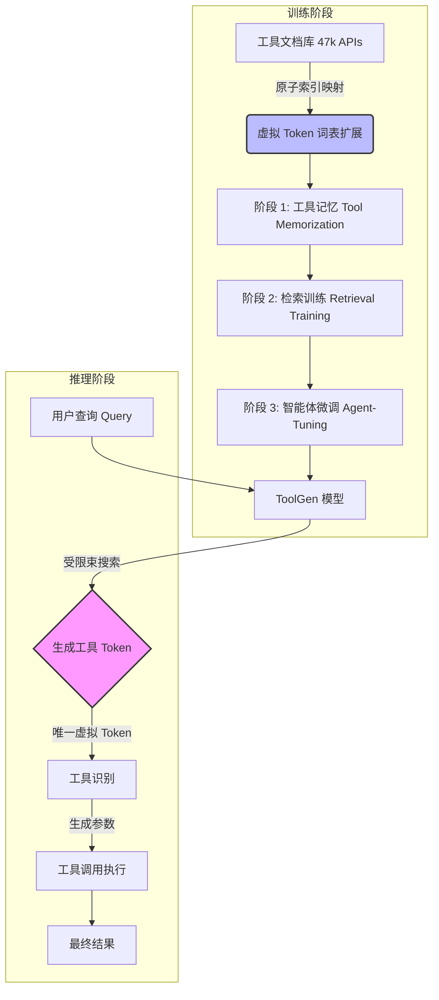

# ToolGen：通过生成统一工具检索与调用

## 一、论文基础元数据
- 原文标题：ToolGen: Unified Tool Retrieval and Calling via Generation
- 中文译版：ToolGen：通过生成统一工具检索与调用
- 发表渠道：arXiv 预印本（计算机科学/人工智能领域主流预印本平台）
- 发表时间：2024 年 10 月（基于 arXiv ID 2410 推断）
- 链接：https://arxiv.org/abs/2410.03439
- 作者及核心机构：Renxi Wang, Xudong Han, Lei Ji, Shu Wang, Timothy Baldwin, Haonan Li（具体机构待补充，文中未明确列出所有归属）
- 研究领域：人工智能 -> 大语言模型应用 / 智能体（AI Agents）
- 关联数据集：
    - 名称：ToolBench / StableToolBench
    - 规模：47,000 个真实世界工具/API，200k 查询对
    - 语言：英文
    - 标注：工具描述、查询 - 工具映射、执行结果

## 二、论文综合评价
### 2.1 量化评分（1-5 分，5 分为最优）
| 评价维度 | 评分 | 备注 |
| -------- | ---- | ---- |
| 📚 理论基础 | ⭐⭐⭐⭐ | 基于生成式检索范式，理论扎实 |
| 🎯 问题核心性 | ⭐⭐⭐⭐⭐ | 解决大规模工具检索与调用的核心痛点 |
| 💡 方法创新性 | ⭐⭐⭐⭐⭐ | 提出原子索引与工具虚拟化，统一检索与调用 |
| ⚙️ 技术壁垒 | ⭐⭐⭐⭐ | 需要全参数微调及词表扩展，有一定门槛 |
| 🧪 实验严谨性 | ⭐⭐⭐⭐⭐ | 对比基线丰富，消融实验完整，指标量化清晰 |
| 🔧 落地可行性 | ⭐⭐⭐⭐ | 无需外部检索器，架构简化，但需微调成本 |
| 🚀 应用前景 | ⭐⭐⭐⭐⭐ | 适用于构建自主适应 diverse 领域工具的 AI Agent |
| 📊 综合评分 | 4.7 | 兼具创新性与实用性，是 Agent 领域的重要进展 |

### 2.2 定性综合评价（≤300 字）
> 核心概括：研究定位、核心价值、差异化优势、关键结论
本研究定位为大语言模型智能体（LLM Agent）的工具交互范式创新。核心价值在于打破了传统“检索 + 执行”分离的架构，提出**ToolGen 框架**，将工具检索与调用统一为生成任务。差异化优势在于采用**原子索引（Atomic Indexing）**将数万级工具映射为虚拟 token，结合**约束束搜索**实现了 0% 工具幻觉率。关键结论表明，该方法在跨域检索鲁棒性及端到端任务通过率上优于传统检索增强方法，为大规模工具集下的 Agent 构建提供了高效、低幻觉的新基准。

## 三、领域本体论映射
| 核心维度 | 具体内容 |
| -------- | -------- |
| 核心研究对象 | 大语言模型（LLM）与大规模工具集（APIs）的交互机制 |
| 核心技术路径 | 生成式检索（Generative Retrieval）+ 工具虚拟化（Tool Virtualization） |
| 数据/载体形态 | 工具描述文本、用户查询、虚拟 Token 序列、API 参数 |
| 核心功能目标 | 实现高精度工具检索、零幻觉工具调用、端到端任务完成 |
| 验证核心指标 | NDCG@K（检索质量）、SoPR/SoWR（任务通过率/胜率）、幻觉率 |

## 四、核心问题与解决方案
### 4.1 待解决的核心问题
1. **领域级根本问题**：随着工具数量膨胀至数万级，传统上下文学习（In-context Learning）受限于 Context Length，无法将所有工具描述放入 Prompt。
2. **现有方法痛点**：
    - “检索 + 执行”分离架构导致误差传播及效率低下。
    - 独立检索模型（如 BERT 类）无法充分理解复杂语义。
    - 生成式方法易产生工具幻觉（Hallucination）。
3. **工程落地卡点**：大规模工具库的索引维护成本高，推理延迟大，且难以保证生成工具的有效性。

### 4.2 核心解决方案
- **理论框架**：将工具交互任务转化为纯生成任务（Generation-only Paradigm）。
- **核心架构**：基于 Llama-3-8B 扩展词表，采用三阶段训练流程。
- **关键技术**：
    - **工具虚拟化**：每个工具映射为词汇表中的唯一虚拟 token。
    - **原子索引（Atomic Indexing）**：相比语义/数字索引，效率最高且幻觉最低。
    - **约束束搜索（Constrained Beam Search）**：强制模型仅生成有效工具 token。
- **创新机制**：通过微调将工具知识“记忆”入模型参数，而非依赖外部检索库。

### 4.3 核心优势（量化+定性）
1. **性能优势**：跨域检索 NDCG@5 达 91.54，优于 ToolRetriever（74.99）；端到端任务 SoPR 达 54.19%。
2. **效率优势**：原子索引确保每个工具仅需 1 个 token，显著减少生成令牌数和推理时间。
3. **工程优势**：无需外部检索器，简化系统架构；约束解码实现工具幻觉率 0%。

## 五、方法与技术架构
### 5.1 核心架构设计
> 文字描述 + 架构图（Mermaid/图片）
ToolGen 架构分为训练与推理两阶段。训练阶段包含工具记忆、检索训练、智能体微调三步；推理阶段通过约束解码直接生成工具 Token 及参数。

### 5.2 关键技术实现细节
| 技术模块 | 实现路径 | 工程注意事项 |
| -------- | -------- | ------------ |
| 词表扩展 | 基于 Llama-3-8B，词表从 128,256 扩展至 175,241 | 需确保新增 token 不影响原有语言能力 |
| 原子索引 | 每个工具映射为单个特殊 token（如 `<<tool&&api>>`） | 需建立工具 ID 与 token 的双向映射表 |
| 约束解码 | 推理时限制生成空间仅为有效工具 token 集合 | 需动态维护有效 token 掩码，避免推理阻塞 |
| 三阶段训练 | 8 epoch 记忆 + 1 epoch 检索 + 端到端微调 | 需注意灾难性遗忘，保持基础指令遵循能力 |

### 5.3 架构优缺点
- **优点**：
    - 架构极简，去除外部检索模块。
    - 推理速度快（单 token 代表工具）。
    - 幻觉可控（通过约束解码）。
- **缺点**：
    - 模型更新成本高（新增工具需重新微调或扩展词表）。
    - 对未见过的工具（Unseen Tools）泛化能力较弱。
    - 依赖全参数微调，资源消耗较大。

## 六、实验设计与结果分析
### 6.1 实验基础设置
| 维度 | 内容 |
| ---- | ---- |
| 数据集 | ToolBench (检索), StableToolBench (端到端) |
| 基线方法 | BM25, EmbSim, ToolRetriever, IterFeedback, ToolLlama, GPT-3.5 |
| 实验环境 | 基于 Llama-3-8B 微调，具体硬件配置待补充 |
| 评价指标 | NDCG@1/3/5 (检索), SoPR/SoWR (任务完成), 幻觉率 |

### 6.2 核心实验结果
| 方法 | 核心指标 1 (NDCG@5) | 核心指标 2 (SoPR) | 工程指标（算力/耗时） |
| ---- | --------- | --------- | -------------------- |
| ToolRetriever | 84.39 (In-Domain) | 待补充 | 需外部检索器 |
| ToolLlama-3 | 待补充 | 52.78% (w/ GT) | 需外部检索器 |
| 本文方法 (ToolGen) | **92.67** (In-Domain) | **54.19%** (w/ GT) | 单模型，推理更快 |

### 6.3 消融实验/鲁棒性分析
| 实验变体 | 指标变化 | 核心结论 |
| -------- | -------- | -------- |
| 移除检索训练 | NDCG@1 从 87.67 降至 10.17 | 检索训练是模型生效的核心前提 |
| 移除工具记忆 | NDCG@1 降至 84.00 | 工具记忆对性能有轻微正向影响 |
| 无约束解码 | 幻觉率升至 7% (原子索引) | 约束解码对消除幻觉至关重要 |
| 语义索引对比 | 端到端 SoPR 51.87% (vs 原子 55.00%) | 原子索引在代理任务中表现更优 |

### 6.4 实验结论（工程视角）
1. **生成即检索可行**：单模型可替代复杂检索系统，降低架构复杂度。
2. **索引选择关键**：原子索引虽在纯检索指标略低于语义索引，但在端到端任务中综合收益最高。
3. **约束必不可少**：工程落地时必须配合约束解码，否则幻觉率不可接受。

## 七、领域贡献与创新点
| 贡献层级 | 具体内容 |
| -------- | -------- |
| 理论贡献 | 验证了生成式检索在大规模工具集上的可行性，统一了检索与调用范式 |
| 方法/架构贡献 | 提出工具虚拟化与原子索引机制，设计三阶段训练流程 |
| 数据/工具贡献 | 基于 ToolBench 构建了包含 47k API 的大规模工具检索基准 |
| 实验/验证贡献 | 提供了跨域检索、端到端任务及幻觉率的全面评估数据 |
| 工程落地贡献 | 证明了无需外部检索器即可实现高精度工具调用的工程路径 |

## 八、局限性与风险
| 维度 | 具体描述 | 应对思路 |
| ---- | -------- | -------- |
| 学术局限性 | 对训练期间未见过的工具 (Unseen Tools) 泛化能力较弱 | 结合外部检索或增量学习技术 |
| 工程落地风险 | 新增工具需微调模型或扩展词表，更新成本高 | 研究参数高效微调 (PEFT) 或动态词表技术 |
| 伦理/合规风险 | 模型可能记忆敏感工具信息，存在数据泄露风险 | 加强工具描述脱敏，实施访问控制 |

## 九、未来研究/落地方向
| 方向类型 | 具体内容 | 优先级 |
| -------- | -------- | ------ |
| 科研拓展 | 集成思维链（CoT）、强化学习（RL）及 ReAct 技术 | 高 |
| 工程优化 | 优化词表扩展机制，支持动态工具添加无需全量微调 | 高 |
| 跨领域适配 | 验证在代码生成、多模态工具调用等领域的泛化性 | 中 |

## 十、关键词与术语表
| 语言 | 关键词 |
| ---- | ------ |
| 中文 | 工具检索，工具调用，生成式检索，原子索引，工具虚拟化，约束解码 |
| 英文 | Tool Retrieval, Tool Calling, Generative Retrieval, Atomic Indexing, Tool Virtualization, Constrained Decoding |
| 领域专属术语 | **原子索引 (Atomic Indexing)**：将每个工具映射为词汇表中唯一虚拟 token 的索引方式。 **工具虚拟化 (Tool Virtualization)**：将工具视为模型词汇的一部分而非外部实体。 **SoPR (Solved Rate with Pass)**：可解决通过率，衡量端到端任务成功率的指标。 |

## 十一、参考文献与关联资源
- 核心参考文献：
    - ToolBench 相关论文 (待补充具体引用)
    - ToolLlama 系列论文
    - Generative Retrieval 相关基础工作
- 补充阅读：
    - Llama-3 技术报告
    - Constrained Beam Search 算法原理
- 开源代码/工具：待补充（通常 arXiv 论文会在主页或 GitHub 发布）

## 十二、阅读者批注
1. **科研启发**：生成式检索（Generative Retrieval）不仅适用于文档检索，在结构化工具调用上同样具有巨大潜力，关键在于索引方式的设计（原子 vs 语义）。
2. **工程落地思考**：虽然无需外部检索器降低了延迟，但模型更新成本是主要瓶颈。在实际业务中，若工具变动频繁，需权衡微调成本与检索延迟。
3. **待验证/存疑点**：论文未详细说明新增工具时的具体更新流程（是重新微调还是仅扩展词表），这直接影响运维成本。
4. **个人/团队应用场景**：适用于工具库相对固定、对延迟敏感且要求高可靠性的智能体场景（如企业内部 API 调用助手）。

## 十三、阅读元信息
| 维度 | 内容 |
| ---- | ---- |
| 阅读日期 | 2026-04-07 11:52 |
| 阅读人 | xPaperReader AI |
| 文档编号 | arxiv-2410.03439 |
| 版本迭代 | v1.0 |