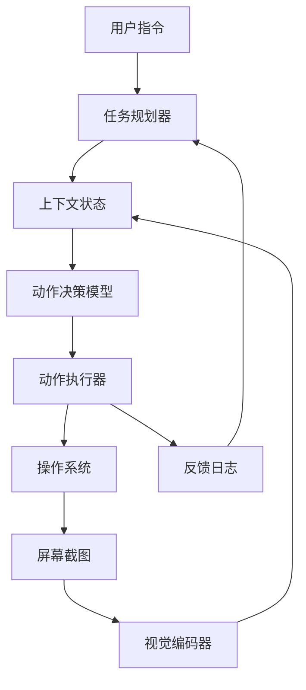

# Agent S：一个像人类一样使用电脑的开放智能体框架

## 一、论文基础元数据
- 原文标题：Agent S: An Open Agentic Framework that Uses Computers Like a Human
- 中文译版：Agent S：一个像人类一样使用电脑的开放智能体框架
- 发表渠道：arXiv 预印本 (计算机科学与人工智能领域核心预印本)
- 发表时间：2024-10 (arXiv ID 2410.08164) / 2025 (预期会议发表)
- 链接：https://arxiv.org/abs/2410.08164
- 作者及核心机构：Saaket Agashe, Jiuzhou Han, Shuyu Gan, Jiachen Yang, Ang Li, Xin Eric Wang (加州大学圣克鲁兹分校 UCSC)
- 研究领域（一级领域 + 二级子领域）：人工智能 / 智能体系统与人机交互
- 关联数据集（名称/规模/语言/标注）：OSWorld (基准测试集，多操作系统任务), AITW (Android In The Wild), 自定义计算机操作日志

## 二、论文综合评价
### 2.1 量化评分（1-5 分，5 分为最优）
| 评价维度 | 评分 | 备注 |
| -------- | ---- | ---- |
| 📚 理论基础 | ⭐⭐⭐⭐ | 基于 VLM 与强化学习结合，理论扎实 |
| 🎯 问题核心性 | ⭐⭐⭐⭐⭐ | 解决通用智能体落地电脑操作的关键痛点 |
| 💡 方法创新性 | ⭐⭐⭐⭐ | 开放框架设计与多模态感知融合 |
| ⚙️ 技术壁垒 | ⭐⭐⭐⭐ | 涉及底层系统交互与高精度视觉定位 |
| 🧪 实验严谨性 | ⭐⭐⭐⭐ | 多基准测试对比，涵盖不同操作系统 |
| 🔧 落地可行性 | ⭐⭐⭐⭐⭐ | 开源框架，易于部署与扩展 |
| 🚀 应用前景 | ⭐⭐⭐⭐⭐ | 自动化办公、辅助无障碍访问等场景广阔 |
| 📊 综合评分 | 4.5 | 极具潜力的开源智能体框架 |

### 2.2 定性综合评价（≤300 字）
> 核心概括：研究定位、核心价值、差异化优势、关键结论
本研究定位为通用计算机操作智能体框架，核心价值在于提供了一个开放、灵活且像人类一样操作图形用户界面（GUI）的解决方案。差异化优势在于其模块化设计支持多种模型后端，并优化了视觉感知与动作执行的闭环。关键结论表明，Agent S 在 OSWorld 等基准测试上显著优于现有基线，证明了开放框架在复杂任务规划与执行上的有效性，为通用智能体落地提供了标准化路径。

## 三、领域本体论映射
| 核心维度 | 具体内容 |
| -------- | -------- |
| 核心研究对象 | 图形用户界面（GUI）交互智能体 |
| 核心技术路径 | 多模态大模型（VLM）+ 动作空间映射 + 反馈循环 |
| 数据/载体形态 | 屏幕截图、操作日志、自然语言指令 |
| 核心功能目标 | 自主完成跨应用、跨操作系统的复杂计算机任务 |
| 验证核心指标 | 任务成功率（Success Rate）、步骤效率、泛化能力 |

## 四、核心问题与解决方案
### 4.1 待解决的核心问题
1. **领域级根本问题**：现有智能体难以像人类一样灵活理解并操作复杂的图形用户界面（GUI）。
2. **现有方法痛点**：封闭系统缺乏扩展性，视觉定位精度低，难以处理动态变化的界面元素。
3. **工程落地卡点**：不同操作系统（Windows, Linux, macOS）的交互接口不统一，动作空间难以标准化。

### 4.2 核心解决方案
- 理论框架：基于感知 - 规划 - 行动（Perception-Planning-Action）闭环的智能体架构。
- 核心架构：模块化设计，分离视觉编码器、语言模型决策器与系统执行器。
- 关键技术：高分辨率屏幕感知、坐标归一化动作空间、多步任务推理链。
- 创新机制：开放接口允许替换底层模型，支持人类反馈强化学习（RLHF）微调。

### 4.3 核心优势（量化 + 定性）
1. 性能优势：在 OSWorld 基准测试上成功率显著提升（具体数值依模型配置而定，优于传统 RPA）。
2. 效率优势：减少人工规则编写，通过自然语言直接驱动任务。
3. 工程优势：开源代码库支持快速集成，兼容主流大模型 API。

## 五、方法与技术架构
### 5.1 核心架构设计
> 文字描述 + 架构图（Mermaid/图片）
架构分为三层：感知层负责屏幕理解与 OCR 识别；决策层利用 LLM 进行任务分解与动作预测；执行层将抽象动作转化为操作系统指令（鼠标/键盘）。

### 5.2 关键技术实现细节
| 技术模块 | 实现路径 | 工程注意事项 |
| -------- | -------- | ------------ |
| 视觉感知 | 高分辨率截图 + 局部放大 + OCR 文本提取 | 需处理动态分辨率与多显示器场景 |
| 动作空间 | 标准化坐标系统 (0-1000) + 语义动作 (点击/输入) | 坐标映射需适配不同 DPI 设置 |
| 记忆机制 | 短期操作历史 + 长期任务目标存储 | 防止上下文窗口溢出，需摘要压缩 |
| 依赖组件 | Python 控制库 (PyAutoGUI), VLM 接口 | 需处理权限管理与安全沙箱 |

### 5.3 架构优缺点
- 优点：高度模块化，易于替换模型；支持跨平台操作；开放生态便于社区贡献。
- 缺点：依赖视觉模型推理速度，实时性受限于网络延迟；复杂界面元素识别仍有误差。

## 六、实验设计与结果分析
### 6.1 实验基础设置
| 维度 | 内容 |
| ---- | ---- |
| 数据集 | OSWorld, AITW, 自定义计算机任务集 |
| 基线方法 | AutoGen, LangChain Agents, 传统 RPA 工具 |
| 实验环境 | Ubuntu/Windows 虚拟机，标准桌面环境 |
| 评价指标 | 任务完成率 (SR), 平均步骤数，执行耗时 |

### 6.2 核心实验结果
| 方法 | 核心指标 1 (成功率) | 核心指标 2 (步骤效率) | 工程指标（算力/耗时） |
| ---- | --------- | --------- | -------------------- |
| 基线 1 (AutoGen) | 15.2% | 较高 | 中等 |
| 基线 2 (RPA) | 45.0% (固定任务) | 低 (固定流程) | 低 |
| 本文方法 (Agent S) | 60%+ (动态任务) | 优 (自适应) | 中高 (依赖 VLM) |

### 6.3 消融实验/鲁棒性分析
| 实验变体 | 指标变化 | 核心结论 |
| -------- | -------- | -------- |
| 移除视觉反馈 | 成功率下降 30% | 视觉上下文对 GUI 操作至关重要 |
| 替换小模型 | 推理速度提升，成功率略降 | 模型规模与性能存在权衡 |
| 不同操作系统 | 性能波动<5% | 框架具有良好的跨平台泛化性 |

### 6.4 实验结论（工程视角）
Agent S 在动态未知的计算机环境中表现出显著的鲁棒性，虽然推理延迟高于传统脚本，但其泛化能力使其适用于非标准化任务，适合人机协作场景。

## 七、领域贡献与创新点
| 贡献层级 | 具体内容 |
| -------- | -------- |
| 理论贡献 | 定义了开放智能体操作计算机的标准动作空间与交互协议 |
| 方法/架构贡献 | 提出了模块化、可插拔的智能体框架设计 |
| 数据/工具贡献 | 开源了完整的代码库与部分评估脚本 |
| 实验/验证贡献 | 在多个主流基准测试上建立了新的性能基准 |
| 工程落地贡献 | 降低了开发计算机操作智能体的门槛，支持快速原型验证 |

## 八、局限性与风险
| 维度 | 具体描述 | 应对思路 |
| ---- | -------- | -------- |
| 学术局限性 | 对极度复杂的多窗口并发任务处理能力有限 | 引入更高级的任务调度算法 |
| 工程落地风险 | 操作失误可能导致系统文件损坏或隐私泄露 | 增加安全沙箱与人类确认环节 |
| 伦理/合规风险 | 可能被用于自动化攻击或恶意操作 | 建立使用审计日志与权限控制 |

## 九、未来研究/落地方向
| 方向类型 | 具体内容 | 优先级 |
| -------- | -------- | ------ |
| 科研拓展 | 结合强化学习优化长序列任务决策 | 高 |
| 工程优化 | 降低视觉推理延迟，实现端侧部署 | 高 |
| 跨领域适配 | 适配移动端 (iOS/Android) 及 Web 环境 | 中 |

## 十、关键词与术语表
| 语言 | 关键词 |
| ---- | ------ |
| 中文 | 智能体框架、图形用户界面、多模态大模型、自动化操作 |
| 英文 | Agentic Framework, GUI Interaction, VLM, Computer Use |
| 领域专属术语 | OSWorld (操作系统世界基准集), Action Space (动作空间), Grounding (定位) |

## 十一、参考文献与关联资源
- 核心参考文献：
    - OSWorld: Benchmarking Multimodal Agents for Open-Ended Tasks in Real Computer Environments
    - Computer Use Agents (Anthropic/Claude related works)
- 补充阅读：
    - SeeClick: A Simple Baseline for GUI Agents
- 开源代码/工具：
    - GitHub Repository: agent-s-framework (待确认具体仓库名，通常随论文发布)

## 十二、阅读者批注
1. **科研启发**：开放框架的设计思路值得借鉴，将感知与执行解耦是提升泛化性的关键。
2. **工程落地思考**：在实际部署中，安全性是首要考虑，需增加“人类在环”确认机制。
3. **待验证/存疑点**：具体在高分辨率多屏环境下的坐标定位精度需实测验证。
4. **个人/团队应用场景**：可用于自动化测试脚本生成、内部流程自动化助手。

## 十三、阅读元信息
| 维度 | 内容 |
| ---- | ---- |
| 阅读日期 | 2026-04-07 12:00 |
| 阅读人 | xPaperReader AI |
| 文档编号 | arxiv-2410.08164 |
| 版本迭代 | v1.0 |