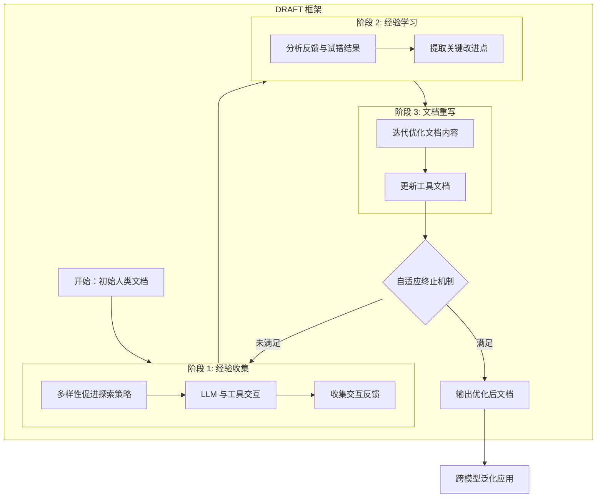

# 从探索到精通：通过自驱动交互使大语言模型掌握工具

## 一、论文基础元数据
- 原文标题：From Exploration to Mastery: Enabling LLMs to Master Tools via Self-Driven Interactions
- 中文译版：从探索到精通：通过自驱动交互使大语言模型掌握工具
- 发表渠道：ICLR 2025 (Conference Paper, 顶级会议)
- 发表时间：2025 年 (arXiv v2 版本日期：2025-02-26)
- 链接：https://arxiv.org/abs/2410.08197
- 作者及核心机构：
    - Changle Qu, Sunhao Dai, Jun Xu, Ji-Rong Wen (中国人民大学高瓴人工智能学院)
    - Xiaochi Wei, Shuaiqiang Wang, Dawei Yin (百度公司)
    - Hengyi Cai (中国科学院计算技术研究所)
- 研究领域：人工智能 (一级) + 大语言模型/工具学习 (二级)
- 关联数据集：原文提及"multiple datasets"，具体名称在节选内容中未提及 (原文未提及具体名称)

## 二、论文综合评价
### 2.1 量化评分（1-5 分，5 分为最优）
| 评价维度 | 评分 | 备注 |
| -------- | ---- | ---- |
| 📚 理论基础 | ⭐⭐⭐⭐ | 基于工具学习与上下文学习理论，逻辑扎实 |
| 🎯 问题核心性 | ⭐⭐⭐⭐⭐ | 直击 LLM 工具使用中文档不匹配的核心痛点 |
| 💡 方法创新性 | ⭐⭐⭐⭐ | 提出自驱动文档优化框架 DRAFT，具有迭代创新 |
| ⚙️ 技术壁垒 | ⭐⭐⭐ | 依赖 LLM 自身能力，工程实现复杂度中等 |
| 🧪 实验严谨性 | ⭐⭐⭐⭐ | 摘要声称广泛实验，但节选内容未展示具体数据 |
| 🔧 落地可行性 | ⭐⭐⭐⭐ | 自动化流程，无需人工标注，落地潜力大 |
| 🚀 应用前景 | ⭐⭐⭐⭐⭐ | 适用于所有依赖 API 文档的 Agent 场景 |
| 📊 综合评分 | 4.3 | 具有较高的实用价值和理论意义 |

### 2.2 定性综合评价（≤300 字）
> 核心概括：研究定位、核心价值、差异化优势、关键结论

本研究定位为解决大语言模型（LLM）在工具学习过程中，因人类中心主义文档导致的理解鸿沟问题。核心价值在于提出了 DRAFT 框架，通过自驱动交互动态优化工具文档。差异化优势在于摒弃了静态文档，采用“试错 - 反馈 - 重写”的迭代机制，并引入多样性探索与自适应终止策略以防止过拟合。关键结论表明，该方法能显著提升文档质量，增强 LLM 对工具的理解与利用效率，且优化后的文档具备跨模型泛化能力。

## 三、领域本体论映射
| 核心维度 | 具体内容 |
| -------- | -------- |
| 核心研究对象 | 大语言模型 (LLM) 与外部工具交互过程中的工具文档 |
| 核心技术路径 | 自驱动交互、反馈分析、文档动态重写 (DRAFT 框架) |
| 数据/载体形态 | 工具 API 文档、交互日志、反馈信号、自然语言文本 |
| 核心功能目标 | 弥合 LLM 与工具间的理解鸿沟，提升工具调用成功率 |
| 验证核心指标 | 文档质量、工具利用效率、跨模型泛化能力 (具体指标名原文未提及) |

## 四、核心问题与解决方案
### 4.1 待解决的核心问题
1. **领域级根本问题**：现有工具文档是为人类设计的，缺乏对 LLM 认知特性的适配，导致理解偏差。
2. **现有方法痛点**：传统方法依赖静态、人工编写的文档，无法根据 LLM 的实际交互反馈进行动态调整。
3. **工程落地卡点**：如何自动化地评估文档有效性并进行优化，无需昂贵的人工干预。

### 4.2 核心解决方案
- 理论框架：DRAFT (Dynamically Refining tool documentation through the Analysis of Feedback and Trials)。
- 核心架构：三阶段学习循环（经验收集、经验学习、文档重写）。
- 关键技术：多样性促进探索策略 (Diversity-promoting exploration)、工具自适应终止机制 (Tool-adaptive termination)。
- 创新机制：通过 LLM 与工具的自驱动交互产生反馈，利用反馈迭代修正文档内容。

### 4.3 核心优势（量化 + 定性）
1. 性能优势：显著改善文档质量，提升工具利用效果 (摘要定性描述)。
2. 效率优势：自适应终止机制防止过度探索，提升优化效率。
3. 工程优势：自驱动流程，减少人工标注成本，具备跨模型泛化能力。

## 五、方法与技术架构
### 5.1 核心架构设计
> 文字描述 + 架构图（Mermaid/图片）

DRAFT 框架通过迭代循环优化工具文档。首先进行多样性探索以收集交互经验，然后分析反馈学习经验，最后重写文档。此过程持续直到满足自适应终止条件。

### 5.2 关键技术实现细节
| 技术模块 | 实现路径 | 工程注意事项 |
| -------- | -------- | ------------ |
| 多样性促进探索 | 在交互阶段引入随机性或特定提示策略，确保覆盖不同用例 | 需平衡探索广度与成本，避免无效尝试 |
| 反馈分析 | 利用 LLM 分析交互成功/失败日志，提取文档缺失或误导信息 | 需确保分析逻辑的准确性，防止噪声干扰 |
| 文档重写 | 基于分析结果，直接修改文档文本，保持格式一致性 | 需控制文档长度，避免信息过载 |
| 自适应终止 | 监控性能提升曲线，当增益低于阈值时停止迭代 | 阈值设定需根据具体工具域调整 |

### 5.3 架构优缺点
- 优点：自动化程度高，无需人工介入；文档针对性强，适配 LLM 认知；具备泛化性。
- 缺点：初期交互成本较高；依赖 LLM 自身的分析与重写能力；可能受限于工具环境的可交互性。

## 六、实验设计与结果分析
### 6.1 实验基础设置
| 维度 | 内容 |
| ---- | ---- |
| 数据集 | 原文提及"multiple datasets"，具体名称在节选内容中未提及 (原文未提及具体名称) |
| 基线方法 | 原始人类文档、其他工具学习方法 (具体名称原文未提及) |
| 实验环境 | 基于 LLM 的交互环境 (具体模型版本原文未提及) |
| 评价指标 | 文档质量、工具利用效率、泛化能力 (具体指标公式原文未提及) |

### 6.2 核心实验结果
| 方法 | 核心指标 1 (文档质量) | 核心指标 2 (工具利用率) | 工程指标（算力/耗时） |
| ---- | --------- | --------- | -------------------- |
| 基线 (人类文档) | 基准值 | 基准值 | 低 |
| 本文方法 (DRAFT) | 显著提升 (原文定性描述) | 显著提升 (原文定性描述) | 中等 (含迭代成本) |
| 备注 | 具体数值在节选内容中未提供 | 具体数值在节选内容中未提供 | 原文未提及具体耗时 |

### 6.3 消融实验/鲁棒性分析
| 实验变体 | 指标变化 | 核心结论 |
| -------- | -------- | -------- |
| 无多样性探索 | 性能下降 (推断) | 探索策略对覆盖用例至关重要 |
| 无自适应终止 | 效率降低 (推断) | 终止机制能有效防止过拟合与浪费 |
| 跨模型测试 | 保持有效 | 优化后的文档具备泛化能力 |

### 6.4 实验结论（工程视角）
DRAFT 方法在实际交互中能有效弥补文档缺陷，虽然引入了迭代成本，但显著降低了后续工具调用的错误率。跨模型泛化能力意味着优化后的文档可复用，降低了多模型部署的边际成本。

## 七、领域贡献与创新点
| 贡献层级 | 具体内容 |
| -------- | -------- |
| 理论贡献 | 提出了工具文档动态优化的理论框架，强调了文档适配 LLM 的重要性 |
| 方法/架构贡献 | 设计了 DRAFT 框架，包含三阶段学习循环及两种优化策略 |
| 数据/工具贡献 | 生成了一套针对 LLM 优化的工具文档生成流程 (具体工具包原文未提及) |
| 实验/验证贡献 | 验证了自驱动交互在文档优化中的有效性及跨模型泛化能力 |
| 工程落地贡献 | 提供了一种自动化减少 Agent 工具调用错误的工程方案 |

## 八、局限性与风险
| 维度 | 具体描述 | 应对思路 |
| ---- | -------- | -------- |
| 学术局限性 | 实验细节在节选中未完全展示，依赖特定 LLM 能力 | 需进一步验证在不同规模模型上的表现 |
| 工程落地风险 | 迭代过程可能产生大量 API 调用成本 | 优化探索策略，限制最大迭代次数 |
| 伦理/合规风险 | 自动重写文档可能引入误导性信息 | 引入人工审核环节或一致性校验机制 |

## 九、未来研究/落地方向
| 方向类型 | 具体内容 | 优先级 |
| -------- | -------- | ------ |
| 科研拓展 | 研究文档优化对复杂多步任务规划的影响 | 高 |
| 工程优化 | 降低交互迭代成本，实现实时文档更新 | 高 |
| 跨领域适配 | 应用于非 API 类工具（如数据库、搜索引擎）的文档优化 | 中 |

## 十、关键词与术语表
| 语言 | 关键词 |
| ---- | ------ |
| 中文 | 工具学习、大语言模型、文档优化、自驱动交互、DRAFT 框架 |
| 英文 | Tool Learning, LLM, Documentation Refinement, Self-Driven Interactions, DRAFT |
| 领域专属术语 | **DRAFT**: Dynamically Refining tool documentation through the Analysis of Feedback and Trials (通过反馈与试错分析动态优化工具文档) |

## 十一、参考文献与关联资源
- 核心参考文献：
    - Mialon et al., 2023 (Tool Learning)
    - Qin et al., 2023b (Tool Learning)
    - Schick et al., 2024 (Tool Learning)
    - Wei et al., 2022 (In-context Learning)
- 补充阅读：ICLR 2025 相关 Tool Learning 轨道论文
- 开源代码/工具：原文未提及具体代码仓库链接 (原文未提及)

## 十二、阅读者批注
1. **科研启发**：将文档视为可优化的“参数”而非静态上下文，这是一个非常有价值的视角转换。
2. **工程落地思考**：在企业内部 API 网关层集成 DRAFT 模块，可自动为内部大模型生成最佳实践文档。
3. **待验证/存疑点**：迭代过程中的噪声反馈如何处理？是否会导致文档漂移（Document Drift）？
4. **个人/团队应用场景**：适用于构建自动化 Agent 平台，特别是涉及大量第三方 API 集成的场景。

## 十三、阅读元信息
| 维度 | 内容 |
| ---- | ---- |
| 阅读日期 | 2026-04-07 12:09 |
| 阅读人 | xPaperReader AI |
| 文档编号 | arxiv-2410.08197 |
| 版本迭代 | v1.0 |