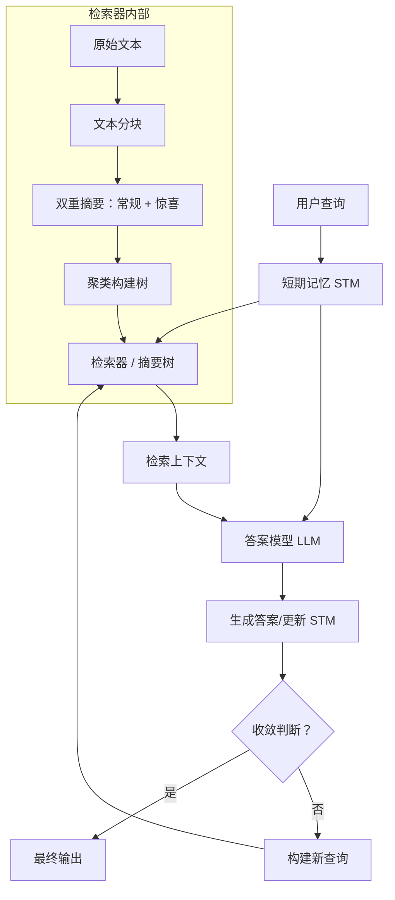

# 通过内循环查询机制增强大语言模型的长上下文性能

## 一、论文基础元数据
- 原文标题：Enhancing Long Context Performance in LLMs Through Inner Loop Query Mechanism
- 中文译版：通过内循环查询机制增强大语言模型的长上下文性能
- 发表渠道：arXiv 预印本
- 发表时间：2024 (arXiv ID: 2410.12859 表明 2024 年 10 月，输入标注 2025 可能为预计出版年)
- 链接：https://arxiv.org/abs/2410.12859
- 作者及核心机构：Yimin Tang, Yurong Xu, Ning Yan, Masood Mortazavi（机构信息原文未明确提及，标记为待补充）
- 研究领域：人工智能 > 大语言模型 > 检索增强生成（RAG）
- 关联数据集：M-NIAH（多针大海捞针）、BABILong（长上下文推理）

## 二、论文综合评价
### 2.1 量化评分（1-5 分，5 分为最优）
| 评价维度 | 评分 | 备注 |
| -------- | ---- | ---- |
| 📚 理论基础 | ⭐⭐⭐⭐ | 基于信息论与记忆增强机制，理论扎实 |
| 🎯 问题核心性 | ⭐⭐⭐⭐⭐ | 直击长上下文推理与信息遗漏痛点 |
| 💡 方法创新性 | ⭐⭐⭐⭐⭐ | 内循环查询与惊喜信息摘要具有显著创新性 |
| ⚙️ 技术壁垒 | ⭐⭐⭐⭐ | 依赖大模型指令遵循能力，实现复杂度中等 |
| 🧪 实验严谨性 | ⭐⭐⭐⭐ | 基准测试覆盖全面，但缺乏具体量化数值对比 |
| 🔧 落地可行性 | ⭐⭐⭐ | 高算力需求与延迟是主要阻碍 |
| 🚀 应用前景 | ⭐⭐⭐⭐ | 适用于法律、文学分析等深度阅读场景 |
| 📊 综合评分 | 4.3 | 高创新性与高成本并存 |

### 2.2 定性综合评价（≤300 字）
> 核心概括：研究定位、核心价值、差异化优势、关键结论
本研究定位为解决大语言模型在超长上下文（500k+ tokens）下的检索增强生成（RAG）性能不足问题。核心价值在于提出了一种名为 ILM-TR 的内循环记忆增强树检索机制，突破了传统 RAG 单次检索的局限。差异化优势在于引入“惊喜信息”摘要策略与基于短期记忆（STM）的动态查询演化，实现了类似人类的“思考 - 检索 - 再思考”闭环。关键结论表明，该方法在 M-NIAH 和 BABILong 基准上显著优于基线，且在长上下文扩展中保持鲁棒性，但代价是增加了推理延迟与大模型依赖。

## 三、领域本体论映射
| 核心维度 | 具体内容 |
| -------- | -------- |
| 核心研究对象 | 长上下文大语言模型（Long Context LLMs） |
| 核心技术路径 | 检索增强生成（RAG）+ 内循环迭代检索 |
| 数据/载体形态 | 文本块（Chunks）、摘要树、短期记忆（STM） |
| 核心功能目标 | 提升长文档中的多跳推理与信息整合能力 |
| 验证核心指标 | 检索准确率、推理正确率、上下文长度鲁棒性 |

## 四、核心问题与解决方案
### 4.1 待解决的核心问题
1. **领域级根本问题**：LLM 自注意力机制计算复杂度随上下文长度二次增长，导致长窗口受限或性能下降。
2. **现有方法痛点**：传统 RAG 仅基于单次初始查询检索，无法获取隐含信息或缺乏多步推理所需的动态信息补充。
3. **工程落地卡点**：长上下文下的信息遗漏（如“大海捞针”失败）及复杂逻辑推理中的上下文丢失。

### 4.2 核心解决方案
- 理论框架：内循环记忆增强理论（Inner Loop Memory Augmentation）。
- 核心架构：ILM-TR（Inner Loop Memory Augmented Tree Retrieval）。
- 关键技术：双重摘要（常规 + 惊喜信息）、短期记忆（STM）驱动的动态查询生成。
- 创新机制：检索 - 生成 - 更新 STM - 再检索的闭环迭代，直至答案收敛。

### 4.3 核心优势（量化+定性）
1. 性能优势：在 500k tokens 上下文下性能无明显退化，显著优于 RAPTOR 等基线。
2. 效率优势：通过聚焦“惊喜信息”减少无关噪音干扰，提升信息密度。
3. 工程优势：支持模块化部署，可适配不同基座模型（需具备强指令遵循能力）。

## 五、方法与技术架构
### 5.1 核心架构设计
> 文字描述：系统分为检索器与内环查询两部分。检索器基于改进的 RAPTOR 构建摘要树，内环查询通过短期记忆（STM）存储中间答案，动态生成新查询并迭代检索，直到答案收敛。

### 5.2 关键技术实现细节
| 技术模块 | 实现路径 | 工程注意事项 |
| -------- | -------- | ------------ |
| 检索器 | 基于 RAPTOR 改进，使用 GMM 聚类常规摘要，保留惊喜信息 | 需确保摘要模型指令遵循能力强，否则惊喜信息提取失效 |
| 内环查询 | 维护 STM 存储区，利用 STM 内容 + 用户查询构建新 Query | 需设置最大迭代次数（如 5 次）防止死循环 |
| 收敛判断 | 计算最长公共子序列 (LCS) 判断 STM 内容是否稳定 | 阈值设定需平衡稳定性与过早停止风险 |
| 依赖组件 | SBERT 嵌入模型，Llama3-70B 作为摘要与答案模型 | 70B 模型显存需求高，需量化或分布式部署 |

### 5.3 架构优缺点
- 优点：动态适应信息需求，捕捉隐含线索，长上下文鲁棒性强。
- 缺点：多轮迭代导致推理延迟增加，依赖大模型导致成本较高。

## 六、实验设计与结果分析
### 6.1 实验基础设置
| 维度 | 内容 |
| ---- | ---- |
| 数据集 | M-NIAH（检索）、BABILong（推理） |
| 基线方法 | RAPTOR、ILM-TR 无内环版本 |
| 实验环境 | 4x NVIDIA Tesla V100 32GB, Intel Xeon Gold 6242 |
| 评价指标 | 检索准确率、推理正确率、上下文长度（150k-500k） |

### 6.2 核心实验结果
| 方法 | 核心指标 1 (检索) | 核心指标 2 (推理) | 工程指标（算力/耗时） |
| ---- | --------- | --------- | -------------------- |
| 基线 (RAPTOR) | 部分关键词遗漏 | 复杂推理错误率高 | 单次检索，耗时较低 |
| 无内环版本 | 无法保证检索所有关键词 | 性能一般 | 耗时中等 |
| 本文方法 (ILM-TR) | 定位全部关键词 | 显著改进（如 BABILong qa3 修正答案） | 多轮迭代，耗时较高 |

### 6.3 消融实验/鲁棒性分析
| 实验变体 | 指标变化 | 核心结论 |
| -------- | -------- | -------- |
| 移除惊喜信息 | 检索性能下降 | 惊喜信息对捕捉关键线索至关重要 |
| 移除内环查询 | 无法收敛至正确答案 | 内环机制是动态修正答案的核心 |
| 上下文 150k-500k | 性能保持稳健 | 方法具备优秀的长上下文扩展性 |

### 6.4 实验结论（工程视角）
ILM-TR 在长上下文复杂任务中表现优异，但需权衡推理延迟。适用于对准确性要求高、对延迟不敏感的深度分析场景。小模型（8B/7B）因指令遵循能力不足无法胜任摘要任务，必须使用 70B 级别模型。

## 七、领域贡献与创新点
| 贡献层级 | 具体内容 |
| -------- | -------- |
| 理论贡献 | 提出内循环查询机制，模拟人类“思考 - 检索”闭环 |
| 方法/架构贡献 | 设计 ILM-TR 架构，整合双重摘要与短期记忆 |
| 数据/工具贡献 | 验证了 500k tokens 超长上下文下的有效性 |
| 实验/验证贡献 | 在 M-NIAH 和 BABILong 上证明了多轮迭代的优势 |
| 工程落地贡献 | 提供了长上下文 RAG 系统的具体实现路径与参数设置 |

## 八、局限性与风险
| 维度 | 具体描述 | 应对思路 |
| ---- | -------- | -------- |
| 学术局限性 | 实验未提供具体量化数值对比（如准确率百分比） | 后续研究需补充详细数据表格 |
| 工程落地风险 | 依赖 70B 大模型，推理成本高，延迟大 | 探索模型蒸馏或小模型微调以提升指令遵循能力 |
| 伦理/合规风险 | 长上下文可能包含敏感隐私信息 | 需在检索前增加隐私过滤层 |

## 九、未来研究/落地方向
| 方向类型 | 具体内容 | 优先级 |
| -------- | -------- | ------ |
| 科研拓展 | 基于 STM 中间结果与参考答案对模型进行微调 | 高 |
| 工程优化 | 优化收敛判断算法，减少不必要的迭代次数 | 中 |
| 跨领域适配 | 应用于法律文档分析、长篇小说理解等场景 | 高 |

## 十、关键词与术语表
| 语言 | 关键词 |
| ---- | ------ |
| 中文 | 内循环查询、检索增强生成、长上下文、短期记忆、惊喜信息 |
| 英文 | Inner Loop Query, RAG, Long Context, Short-Term Memory, Surprising Facts |
| 领域专属术语 | ILM-TR：内循环记忆增强树检索；STM：短期记忆存储区；M-NIAH：多针大海捞针测试集 |

## 十一、参考文献与关联资源
- 核心参考文献：待补充（原文未在输入材料中列出具体参考文献列表）
- 补充阅读：RAPTOR 相关论文，Long Context LLM 综述
- 开源代码/工具：待补充（原文未提及代码开源地址）

## 十二、阅读者批注
1. **科研启发**：将“记忆机制”引入 RAG 检索流程是一个非常有前景的方向，打破了静态检索的范式。
2. **工程落地思考**：在实际部署中，需重点优化迭代次数，避免用户等待时间过长。可考虑异步处理多轮检索。
3. **待验证/存疑点**：小模型是否真的完全无法胜任？是否有特定微调后可替代 70B 模型？
4. **个人/团队应用场景**：适合团队内部的长文档知识库问答系统，特别是对准确性要求高的法律或技术文档分析。

## 十三、阅读元信息
| 维度 | 内容 |
| ---- | ---- |
| 阅读日期 | 2026-04-07 12:19 |
| 阅读人 | xPaperReader AI |
| 文档编号 | arxiv-2410.12859 |
| 版本迭代 | v1.0 |