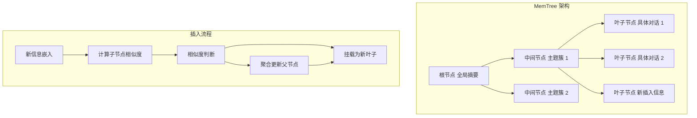

# 从孤立对话到层次化图式：大语言模型的动态树记忆表示

## 一、论文基础元数据
- 原文标题：From Isolated Conversations to Hierarchical Schemas: Dynamic Tree Memory Representation for LLMs
- 中文译版：从孤立对话到层次化图式：大语言模型的动态树记忆表示
- 发表渠道：arXiv 预印本 (计算机科学与人工智能领域)
- 发表时间：2024 年 10 月 (基于 arXiv ID 2410)
- 链接：https://arxiv.org/abs/2410.14052
- 作者及核心机构：Alireza Rezazadeh, Zichao Li, Wei Wei, Yujia Bao (Accenture)
- 研究领域：人工智能 (一级) + 大语言模型记忆机制/检索增强生成 (二级)
- 关联数据集：MSC / MSC-E (多轮对话), QuALITY (单文档问答), MultiHop RAG (多文档推理)

## 二、论文综合评价
### 2.1 量化评分（1-5 分，5 分为最优）
| 评价维度 | 评分 | 备注 |
| -------- | ---- | ---- |
| 理论基础 | 5 | 基于在线自顶向下聚类 (OTD) 及 Moseley-Wang 收益函数，有数学保证 |
| 问题核心性 | 5 | 直击 LLM 长上下文记忆丢失与静态 RAG 无法更新的核心痛点 |
| 方法创新性 | 5 | 提出动态树状记忆 (MemTree)，结合层次化与在线更新 |
| 技术壁垒 | 4 | 深度自适应阈值与聚合更新机制具有一定实现复杂度 |
| 实验严谨性 | 4 | 覆盖对话、问答、推理多任务，对比基线充分 |
| 落地可行性 | 4 | 支持实时更新，但累积计算成本略高于离线批处理 |
| 应用前景 | 5 | 适用于长周期对话助手、动态知识库等场景 |
| 综合评分 | 4.7 | 兼具理论深度与工程实用性的优秀工作 |

### 2.2 定性综合评价（≤300 字）
> 核心概括：研究定位、核心价值、差异化优势、关键结论
本研究定位为大语言模型长期记忆管理，核心价值在于提出了 **MemTree**，一种支持在线增量更新的动态树状记忆表示方法。差异化优势在于克服了现有静态结构化 RAG（如 RAPTOR、GraphRAG）无法实时更新的局限，同时避免了扁平向量检索的结构缺失问题。关键结论显示，MemTree 在长对话（MSC-E 82.1%）和长文档问答（QuALITY 59.8%）任务中显著优于现有在线方法，并接近离线最优方法性能，且具备聚类质量的理论近似保证，实现了结构化语义组织与实时性的平衡。

## 三、领域本体论映射
| 核心维度 | 具体内容 |
| -------- | -------- |
| 核心研究对象 | 大语言模型 (LLM) 的长期记忆系统与上下文管理 |
| 核心技术路径 | 动态树状结构 + 在线层次聚类 + 语义嵌入检索 |
| 数据/载体形态 | 文本对话流、文档片段、语义嵌入向量 (Embeddings) |
| 核心功能目标 | 实现记忆的层次化组织、在线实时更新、高效检索 |
| 验证核心指标 | 准确率 (Accuracy)、ROUGE-L 召回率、插入耗时、更新成本 |

## 四、核心问题与解决方案
### 4.1 待解决的核心问题
1. **领域级根本问题**：LLM 上下文窗口有限，难以维持长周期对话或动态知识库的长期记忆一致性。
2. **现有方法痛点**：扁平向量检索缺乏结构关联；静态知识图谱/树（如 RAPTOR）不支持在线增量更新，需全量重构。
3. **工程落地卡点**：实时记忆更新带来的计算延迟与内存增长瓶颈。

### 4.2 核心解决方案
- **理论框架**：基于在线自顶向下 (OTD) 聚类算法，继承 Moseley-Wang 收益函数的近似保证。
- **核心架构**：层次化树状记忆结构，顶层抽象概括，底层存储细节。
- **关键技术**：深度自适应阈值插入算法、父节点内容聚合更新、折叠树检索机制。
- **创新机制**：引入随深度增加的相似度阈值，确保深层聚类紧密性。

### 4.3 核心优势（量化 + 定性）
1. **性能优势**：在 200 轮长对话中准确率达成 82.1%，显著优于 MemoryStream (78.5%)。
2. **效率优势**：支持实时插入 (平均 10 秒/次)，无需像 RAPTOR 那样耗时 1 小时以上重建。
3. **工程优势**：父节点更新可并行化，缓解内存增长瓶颈，支持动态知识流。

## 五、方法与技术架构
### 5.1 核心架构设计
MemTree 采用树状结构组织记忆。新信息进入时，从根节点开始遍历，根据语义相似度决定是进入子节点还是作为新叶子挂载。检索时将树折叠为节点集合进行相似度匹配。

### 5.2 关键技术实现细节
| 技术模块 | 实现路径 | 工程注意事项 |
| -------- | -------- | ------------ |
| 动态插入算法 | 自顶向下遍历，计算余弦相似度，对比深度自适应阈值 | 阈值参数需根据数据分布调优，避免树过深或过浅 |
| 内容聚合更新 | 插入路径上的父节点通过 LLM 摘要聚合子节点内容 | 需控制 LLM 调用频率，可异步更新以减少插入延迟 |
| 折叠树检索 | 将所有节点扁平化为集合，计算查询与所有节点相似度 | 节点数量大时需结合向量索引 (如 FAISS) 加速相似度计算 |
| 依赖组件 | 嵌入模型 (text-embedding-3-large), LLM (GPT-4o/Llama-3.1) | 嵌入模型需与检索任务匹配，确保语义空间一致性 |

### 5.3 架构优缺点
- **优点**：结构可解释性强，支持实时增量更新，长上下文检索鲁棒性高，有理论聚类保证。
- **缺点**：在线更新累积计算成本高于离线批处理 (约 1.4 倍)，树结构维护需消耗额外内存。

## 六、实验设计与结果分析
### 6.1 实验基础设置
| 维度 | 内容 |
| ---- | ---- |
| 数据集 | MSC / MSC-E (对话), QuALITY (问答), MultiHop RAG (推理) |
| 基线方法 | Naive Baseline, MemoryStream, MemGPT, RAPTOR, GraphRAG |
| 实验环境 | GPT-4o, Llama-3.1-70B, text-embedding-3-large |
| 评价指标 | 二元准确率 (Binary Accuracy), ROUGE-L 召回率，插入耗时 |

### 6.2 核心实验结果
| 方法 | 核心指标 1 (MSC-E Acc) | 核心指标 2 (QuALITY Acc) | 工程指标（算力/耗时） |
| ---- | --------- | --------- | -------------------- |
| MemoryStream | 78.5% | 43.8% | 低延迟，无结构 |
| RAPTOR (离线) | 未测试 | 59.0% | 构建>1 小时，不支持更新 |
| GraphRAG (离线) | 未测试 | 62.8% | 构建成本高，不支持更新 |
| 本文方法 (MemTree) | 82.1% | 59.8% | 插入 10 秒，支持实时更新 |

### 6.3 消融实验/鲁棒性分析
| 实验变体 | 指标变化 | 核心结论 |
| -------- | -------- | -------- |
| 固定阈值 vs 自适应阈值 | 自适应阈值性能更优 | 深度自适应机制确保了层级结构的紧密性与分离性 |
| 有无父节点更新 | 有更新则长程检索更好 | 聚合更新保持了上层节点的语义概括能力，提升检索召回 |
| 不同对话长度 (15-200 轮) | 长对话下优势更明显 | 证明了对长上下文位置偏差的缓解能力 |

### 6.4 实验结论（工程视角）
MemTree 在保持接近离线方法性能的同时，成功实现了在线实时更新能力。虽然单次插入成本略高，但避免了全量重构的巨大开销，特别适合动态交互场景。在长上下文任务中，其结构化记忆有效解决了信息分散问题。

## 七、领域贡献与创新点
| 贡献层级 | 具体内容 |
| -------- | -------- |
| 理论贡献 | 将在线自顶向下聚类 (OTD) 理论引入 LLM 记忆，提供 Moseley-Wang 收益近似保证 |
| 方法/架构贡献 | 提出 MemTree 动态树状记忆表示，设计深度自适应阈值插入与折叠检索机制 |
| 数据/工具贡献 | 在多个标准长上下文基准上验证，代码计划开源 |
| 实验/验证贡献 | 证明了在线结构化记忆在长对话与多跳推理中优于扁平记忆与静态结构 |
| 工程落地贡献 | 提供了支持实时知识更新的记忆系统架构，解决了静态 RAG 的时效性痛点 |

## 八、局限性与风险
| 维度 | 具体描述 | 应对思路 |
| ---- | -------- | -------- |
| 学术局限性 | 理论保证依赖数据满足 well-separated 假设，实际数据可能不完全符合 | 后续研究可探索更宽松假设下的理论边界或自适应调整机制 |
| 工程落地风险 | 在线更新累积成本高于离线批处理 (约 1.4 倍)，高并发下可能有延迟 | 优化父节点更新策略，采用异步更新或批量合并插入 |
| 伦理/合规风险 | 未显式解决记忆中的偏见缓解与用户隐私保护问题 | 集成负责任 AI 实践，增加记忆过滤与隐私脱敏模块 |

## 九、未来研究/落地方向
| 方向类型 | 具体内容 | 优先级 |
| -------- | -------- | ------ |
| 科研拓展 | 探索更复杂的图结构记忆，融合时间衰减机制 | 中 |
| 工程优化 | 优化插入算法复杂度，引入向量索引加速检索 | 高 |
| 跨领域适配 | 适配多模态记忆 (图像/音频)，应用于智能体长期规划 | 高 |

## 十、关键词与术语表
| 语言 | 关键词 |
| ---- | ------ |
| 中文 | 动态树记忆，在线增量更新，层次化聚类，检索增强生成，长上下文 |
| 英文 | Dynamic Tree Memory, Online Incremental Update, Hierarchical Clustering, RAG, Long Context |
| 领域专属术语 | MemTree：本文提出的动态树状记忆系统；OTD 聚类：在线自顶向下聚类算法；Moseley-Wang 收益函数：衡量层次聚类质量的理论指标 |

## 十一、参考文献与关联资源
- 核心参考文献：RAPTOR (Recursive Abstractive Processing for Tree-Organized Retrieval), GraphRAG, MemoryStream.
- 补充阅读：Online Clustering literature, Moseley-Wang Revenue Function papers.
- 开源代码/工具：论文接收后计划公开 (目前待发布具体链接).

## 十二、阅读者批注
1. **科研启发**：将传统聚类理论 (OTD) 与大模型记忆结合是一个非常好的切入点，为黑盒记忆提供了可解释的理论支撑。
2. **工程落地思考**：在实际系统中，父节点的 LLM 聚合更新可能是性能瓶颈，需要考虑缓存策略或轻量级模型进行摘要。
3. **待验证/存疑点**：well-separated 假设在真实嘈杂对话数据中的满足程度需要进一步实证检验。
4. **个人/团队应用场景**：适用于构建具有长期记忆的个人助手、客服对话系统，以及需要动态更新知识库的企业 RAG 系统。

## 十三、阅读元信息
| 维度 | 内容 |
| ---- | ---- |
| 阅读日期 | 2024-11-01 12:30 |
| 阅读人 | xPaperReader AI |
| 文档编号 | arxiv-2410.14052 |
| 版本迭代 | v1.0 |