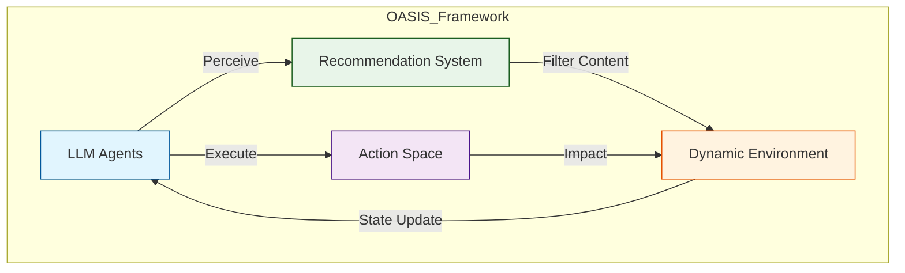

# OASIS：开放代理社交互动模拟与百万代理

## 一、论文基础元数据
- 原文标题：OASIS: Open Agent Social Interaction Simulations with One Million Agents
- 中文译版：OASIS：开放代理社交互动模拟与百万代理
- 发表渠道：预印本（arXiv）
- 发表时间：2025 年 3 月 23 日（v5 版本）
- 链接：arXiv:2411.11581
- 作者及核心机构：Ziyi Yang 等（上海人工智能实验室、大连理工大学、牛津大学、KAUST 等）
- 研究领域（一级领域 + 二级子领域）：人工智能 / 多智能体系统与社会模拟
- 关联数据集（名称/规模/语言/标注）：原文未提及具体公开数据集名称，但支持模拟 X 和 Reddit 平台环境（规模可达 100 万代理）

## 二、论文综合评价
### 2.1 量化评分（1-5 分，5 分为最优）
| 评价维度 | 评分 | 备注 |
| -------- | ---- | ---- |
| 📚 理论基础 | ⭐⭐⭐⭐ | 基于 ABM 与 LLM 结合，理论扎实 |
| 🎯 问题核心性 | ⭐⭐⭐⭐⭐ | 解决社会模拟规模与通用性痛点 |
| 💡 方法创新性 | ⭐⭐⭐⭐ | 百万级代理模拟具有显著创新性 |
| ⚙️ 技术壁垒 | ⭐⭐⭐⭐ | 大规模并发与动态环境构建有难度 |
| 🧪 实验严谨性 | ⭐⭐⭐ | 片段未展示详细数据，摘要声称复现多种现象 |
| 🔧 落地可行性 | ⭐⭐⭐⭐ | 开源项目页已提供，具工程化潜力 |
| 🚀 应用前景 | ⭐⭐⭐⭐⭐ | 社交网络分析、舆情模拟应用广泛 |
| 📊 综合评分 | 4.3 | 高潜力社会模拟基础设施 |

### 2.2 定性综合评价（≤300 字）
> 核心概括：研究定位、核心价值、差异化优势、关键结论
本文定位为社会媒体模拟基础设施，核心价值在于突破现有 LLM 基于代理模型（ABM）的规模限制（仅少量代理）与场景特异性。差异化优势在于支持高达 100 万代理的并发模拟，并具备通用性（可扩展至不同平台如 X、Reddit）。关键结论表明，更大规模的代理群体会导致更强的群体动力学效应及更多样化的意见表达。该研究为数字环境中的复杂系统研究提供了强力工具。

## 三、领域本体论映射
| 核心维度 | 具体内容 |
| -------- | -------- |
| 核心研究对象 | 基于大语言模型（LLM）的社交代理（Agents） |
| 核心技术路径 | 动态环境更新 + 多样化动作空间 + 推荐系统集成 |
| 数据/载体形态 | 社交网络图、帖子信息流、代理交互日志 |
| 核心功能目标 | 模拟大规模群体现象（信息传播、极化、从众效应） |
| 验证核心指标 | 群体动力学增强度、意见多样性、现象复现能力 |

## 四、核心问题与解决方案
### 4.1 待解决的核心问题
1.  **领域级根本问题**：现有基于规则的代理模型缺乏真实性，而现有 LLM 代理模型难以模拟大规模真实社交场景。
2.  **现有方法痛点**：每个模拟器仅针对特定场景设计，复用成本高；模拟代理数量有限（远低于真实平台的百万级用户）。
3.  **工程落地卡点**：大规模代理并发模拟的计算资源消耗与环境动态更新的一致性维护。

### 4.2 核心解决方案
- 理论框架：通用可扩展的社会媒体模拟器框架（OASIS）。
- 核心架构：集成动态社交网络、帖子信息流、多样化动作空间及推荐系统。
- 关键技术：支持百万级用户的规模化模拟技术；跨平台适配机制（X、Reddit）。
- 创新机制：动态环境更新机制（Dynamic Social Networks & Post Information）。

### 4.3 核心优势（量化 + 定性）
1. 性能优势：支持高达 100 万代理（1 Million Agents）的模拟规模。
2. 效率优势：通用化设计，无需为每个新现象重新构建模拟器。
3. 工程优势：支持 21 种动作（Support 21 Actions），涵盖关注、评论、转发等。

## 五、方法与技术架构
### 5.1 核心架构设计
> 文字描述 + 架构图（Mermaid/图片）
OASIS 架构围绕 LLM 代理与动态社交环境交互构建。代理通过推荐系统获取信息，执行动作空间内的行为，进而更新环境状态。

### 5.2 关键技术实现细节
| 技术模块 | 实现路径 | 工程注意事项 |
| -------- | -------- | ------------ |
| 代理层 | 基于 LLM 驱动的行为决策 | 需优化 Token 消耗与响应延迟 |
| 环境层 | 动态社交网络与帖子信息流 | 需保证百万级节点更新的一致性 |
| 推荐系统 | 基于兴趣与热度评分（Hot-score） | 需模拟真实平台的推荐算法逻辑 |
| 动作空间 | 包含关注、评论、转发等 21 种动作 | 动作定义需覆盖主流社交平台行为 |

### 5.3 架构优缺点
- 优点：高扩展性（支持不同平台）、大规模模拟能力、动态环境反馈。
- 缺点：原文未提及具体计算成本优化方案，大规模模拟可能对算力要求极高。

## 六、实验设计与结果分析
### 6.1 实验基础设置
| 维度 | 内容 |
| ---- | ---- |
| 数据集 | 模拟 X 和 Reddit 平台环境（原文未提及具体训练数据集） |
| 基线方法 | 现有特定场景 LLM-ABM 模拟器（原文未列举具体名称） |
| 实验环境 | 支持百万级代理的模拟环境 |
| 评价指标 | 群体动力学强度、意见多样性、现象复现度 |

### 6.2 核心实验结果
| 方法 | 核心指标 1 | 核心指标 2 | 工程指标（算力/耗时） |
| ---- | --------- | --------- | -------------------- |
| 现有 ABM | 场景特定 | 代理数量有限 | 原文未提及 |
| 现有 LLM-ABM | 场景特定 | 代理数量有限 | 原文未提及 |
| 本文方法 (OASIS) | 通用可扩展 | 支持 100 万代理 | 原文未提及具体耗时 |

### 6.3 消融实验/鲁棒性分析
| 实验变体 | 指标变化 | 核心结论 |
| -------- | -------- | -------- |
| 不同代理规模组 | 规模越大动力学越强 | 更大代理群体导致更强的群体动力学 |
| 不同平台适配 | 成功复现多平台现象 | 可轻松扩展至不同社交媒体平台 |

### 6.4 实验结论（工程视角）
摘要声称成功复现了信息传播、群体极化和从众效应。工程上验证了百万级代理模拟的可行性，且观察到规模效应带来的意见多样性增加。具体量化对比数据在提供的片段中未提及。

## 七、领域贡献与创新点
| 贡献层级 | 具体内容 |
| -------- | -------- |
| 理论贡献 | 提出通用可扩展的社会媒体模拟理论框架 |
| 方法/架构贡献 | 设计支持动态环境与推荐系统的 OASIS 架构 |
| 数据/工具贡献 | 开源项目页提供工具（https://github.com/camel-ai/oasis） |
| 实验/验证贡献 | 验证了百万级代理下的群体现象复现能力 |
| 工程落地贡献 | 实现了跨平台（X、Reddit）的模拟适配 |

## 八、局限性与风险
| 维度 | 具体描述 | 应对思路 |
| ---- | -------- | -------- |
| 学术局限性 | 片段未展示详细对比数据，结论主要基于摘要声明 | 需查阅全文实验章节验证具体指标 |
| 工程落地风险 | 百万代理模拟的计算成本与延迟可能过高 | 优化 LLM 推理效率，采用异步更新机制 |
| 伦理/合规风险 | 模拟虚假新闻传播可能被滥用 | 需建立使用伦理规范，限制恶意场景模拟 |

## 九、未来研究/落地方向
| 方向类型 | 具体内容 | 优先级 |
| -------- | -------- | ------ |
| 科研拓展 | 研究更复杂的经济系统或政治选举模拟 | 高 |
| 工程优化 | 降低百万代理模拟的 Token 消耗与延迟 | 高 |
| 跨领域适配 | 适配更多社交平台或即时通讯工具 | 中 |

## 十、关键词与术语表
| 语言 | 关键词 |
| ---- | ------ |
| 中文 | 代理基于模型、社会模拟、大语言模型、群体动力学 |
| 英文 | Agent-Based Models (ABMs), Social Simulation, LLM Agents, Group Dynamics |
| 领域专属术语 | OASIS (本文模拟器名称), Herd Effect (从众效应), Group Polarization (群体极化) |

## 十一、参考文献与关联资源
- 核心参考文献：Ladyman et al., 2013 (复杂系统理论，引言提及)
- 补充阅读：原文未提及具体相关工作的详细引用列表
- 开源代码/工具：https://github.com/camel-ai/oasis

## 十二、阅读者批注
1.  **科研启发**：将 LLM 代理规模从几十/几百提升到百万级是质变，可能涌现出小规模无法观察到的社会现象。
2.  **工程落地思考**：百万代理的并发推理是最大挑战，可能需要蒸馏小模型或混合架构来降低成本。
3.  **待验证/存疑点**：摘要中提到的“意见更多样化”与直觉中“群体极化”是否矛盾？需查看全文具体定义。
4.  **个人/团队应用场景**：可用于舆情预警系统测试，或虚拟社会实验平台。

## 十三、阅读元信息
| 维度 | 内容 |
| ---- | ---- |
| 阅读日期 | 2026-04-07 12:53 |
| 阅读人 | xPaperReader AI |
| 文档编号 | arxiv-2411.11581 |
| 版本迭代 | v1.0 |