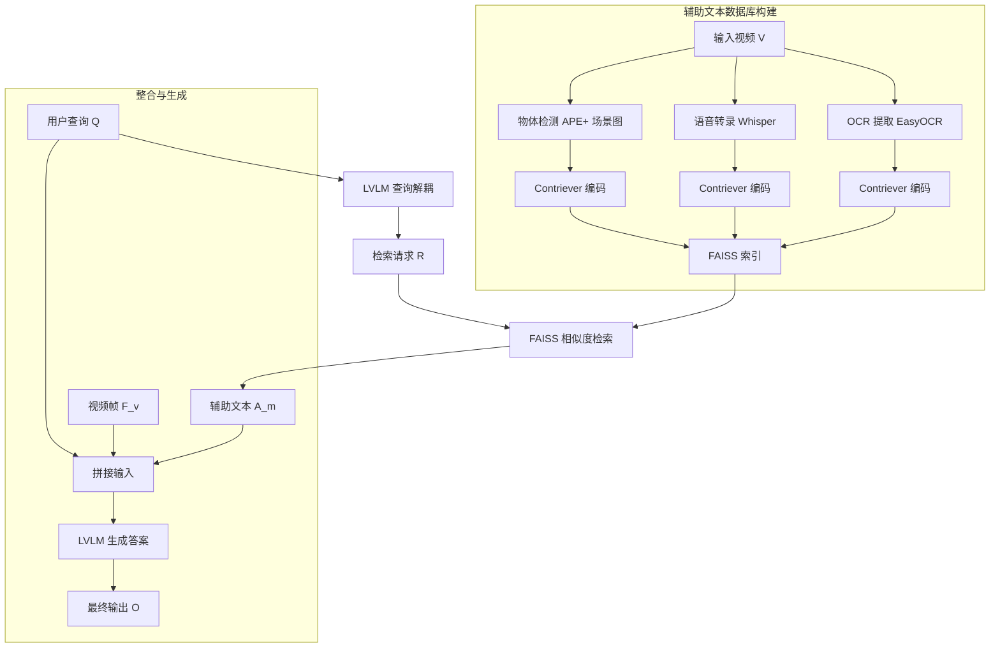

# Video-RAG：视觉对齐的检索增强长视频理解

## 一、论文基础元数据
- 原文标题：Video-RAG: Visually-aligned Retrieval-Augmented Long Video Comprehension
- 中文译版：Video-RAG：视觉对齐的检索增强长视频理解
- 发表渠道：arXiv 预印本（计算机视觉与人工智能领域主流预印本平台）
- 发表时间：2024 年 11 月（根据 arXiv ID 2411 推断，输入元数据标注 2025）
- 链接：https://arxiv.org/abs/2411.13093
- 作者及核心机构：Yongdong Luo, Xiawu Zheng, Guilin Li 等（具体机构信息待补充）
- 研究领域：人工智能 + 多模态理解（视频语言模型/长视频理解）
- 关联数据集：Video-MME（多模态评估）、MLVU（长视频理解）、LongVideoBench（长视频基准）

## 二、论文综合评价
### 2.1 量化评分（1-5 分，5 分为最优）
| 评价维度 | 评分 | 备注 |
| -------- | ---- | ---- |
| 📚 理论基础 | ⭐⭐⭐⭐⭐ | 基于成熟的 RAG 范式迁移至视频领域，理论扎实 |
| 🎯 问题核心性 | ⭐⭐⭐⭐⭐ | 直击长视频上下文限制与幻觉痛点 |
| 💡 方法创新性 | ⭐⭐⭐⭐⭐ | 无需训练、即插即用的视觉对齐 RAG 管道 |
| ⚙️ 技术壁垒 | ⭐⭐⭐⭐ | 主要依赖现有开源工具链集成，创新在架构设计 |
| 🧪 实验严谨性 | ⭐⭐⭐⭐⭐ | 多基准测试、消融实验充分、对比 SOTA 模型 |
| 🔧 落地可行性 | ⭐⭐⭐⭐⭐ | 无需微调，兼容开源 LVLM，成本可控 |
| 🚀 应用前景 | ⭐⭐⭐⭐⭐ | 长视频分析、监控、内容检索等场景潜力巨大 |
| 📊 综合评分 | 4.9 | 无需训练的即插即用视频RAG方案，长视频分析场景极具实用价值 |

### 2.2 定性综合评价（≤300 字）
> 核心概括：研究定位、核心价值、差异化优势、关键结论
本文针对大型视频语言模型（LVLM）在长视频理解中面临的上下文窗口限制、信息丢失及幻觉问题，提出了一种无需训练、即插即用的检索增强生成（RAG）框架——Video-RAG。其核心价值在于通过外部工具链（OCR、ASR、物体检测）构建视觉对齐的辅助文本库，利用检索机制仅引入相关信息，显著降低计算成本的同时提升理解精度。差异化优势在于完全开源、不依赖专有 API 且兼容性强。关键结论显示，该方法在 Video-MME 等基准上超越 Gemini-1.5-Pro 等专有模型，证明了检索增强在长视频领域的有效性。

## 三、领域本体论映射
| 核心维度 | 具体内容 |
| -------- | -------- |
| 核心研究对象 | 长视频内容、大型视觉语言模型（LVLM） |
| 核心技术路径 | 检索增强生成（RAG）、多模态特征对齐、外部工具链集成 |
| 数据/载体形态 | 视频帧、辅助文本（OCR/ASR/检测标签）、向量索引 |
| 核心功能目标 | 提升长视频理解能力、减少幻觉、降低推理成本 |
| 验证核心指标 | 准确率（Accuracy）、基准测试得分（Video-MME 等）、Token 消耗量 |

## 四、核心问题与解决方案
### 4.1 待解决的核心问题
1. **领域级根本问题**：长视频内容冗余与 LVLM 上下文窗口有限之间的矛盾。
2. **现有方法痛点**：均匀帧采样导致关键信息丢失；全量输入导致计算成本过高且性能退化；模型易产生视觉幻觉（如计数错误、字符识别错误）。
3. **工程落地卡点**：专有模型 API 成本高；微调长上下文模型资源消耗大；现有 Agent 方法推理延迟高。

### 4.2 核心解决方案
- **理论框架**：将视频理解问题转化为基于辅助文本检索的增强生成问题。
- **核心架构**：三阶段管道（查询解耦 -> 辅助文本生成与检索 -> 整合生成）。
- **关键技术**：视觉对齐的辅助文本提取（OCR/ASR/DET）、Contriever 语义检索、FAISS 向量索引。
- **创新机制**：无需训练 LVLM，通过外部知识库动态补充视觉语义缺失，实现“视觉 - 文本”对齐增强。

### 4.3 核心优势（量化+定性）
1. **性能优势**：72B 模型在 Video-MME 上得分 75.7%，超越 Gemini-1.5-Pro；7B 模型平均性能提升 8.0%。
2. **效率优势**：每个视频仅增加约 2.0K tokens 辅助文本，推理时间优于 GPT-based Agent 方法。
3. **工程优势**：完全开源工具链（Whisper, EasyOCR 等），无需微调，即插即用，兼容任意开源 LVLM。

## 五、方法与技术架构
### 5.1 核心架构设计
> 文字描述：Video-RAG 分为三个主要阶段。首先，利用 LVLM 对文本查询进行解耦，生成检索请求；其次，并行构建 OCR、ASR 和物体检测（DET）三个辅助文本数据库，并通过向量检索匹配相关信息；最后，将检索到的辅助文本与原视频帧、查询拼接，输入 LVLM 生成最终答案。

### 5.2 关键技术实现细节
| 技术模块 | 实现路径 | 工程注意事项 |
| -------- | -------- | ------------ |
| 查询解耦 | LVLM 基于文本生成 JSON 格式检索请求（ASR/OCR/DET 类型） | 需确保 LVLM 能准确理解请求格式，避免无效检索 |
| 辅助文本生成 | OCR( EasyOCR)、ASR(Whisper)、DET(APE+ 场景图预处理) | 检测仅限关键帧（CLIP 相似度筛选），需平衡覆盖率与成本 |
| 检索机制 | Contriever 编码查询与文本块，FAISS (IndexFlatIP) 基于阈值 t=0.3 检索 | 阈值 t 需根据场景微调，过高导致信息不足，过低引入噪声 |
| 依赖组件 | Long-LLaVA-7B (基座), FAISS, Contriever, Whisper, EasyOCR | 需管理外部工具链的推理延迟，建议异步处理数据库构建 |

### 5.3 架构优缺点
- **优点**：
    1. 模块化设计，各组件可独立替换升级。
    2. 显著减少 LVLM 输入 Token 数，降低显存占用。
    3. 有效弥补 LVLM 在字符识别、物体计数上的短板。
- **缺点**：
    1. 依赖多个外部模型推理，预处理耗时较高。
    2. 物体检测仅覆盖关键帧，可能遗漏非关键帧细微信息。
    3. 检索阈值需人工调优，自适应能力有待加强。

## 六、实验设计与结果分析
### 6.1 实验基础设置
| 维度 | 内容 |
| ---- | ---- |
| 数据集 | Video-MME, MLVU, LongVideoBench |
| 基线方法 | Long-LLaVA-7B, LLaVA-Video, Gemini-1.5-Pro, GPT-4o, VideoAgent |
| 实验环境 | 开源工具链（Whisper, EasyOCR, APE, FAISS） |
| 评价指标 | 准确率（Accuracy）、基准测试得分、Token 消耗量、推理时间 |

### 6.2 核心实验结果
| 方法 | 核心指标 1 (Video-MME) | 核心指标 2 (LongVideoBench) | 工程指标（算力/耗时） |
| ---- | --------- | --------- | -------------------- |
| 基线 1 (Long-LLaVA-7B) | 52.0% (基础) | 待补充 | 低 |
| 基线 2 (Gemini-1.5-Pro) | 75.0% | 64.0% (约) | 高 (专有 API) |
| 本文方法 (Video-RAG+72B) | **75.7%** | **65.4%** | 中 (开源工具链) |

### 6.3 消融实验/鲁棒性分析
| 实验变体 | 指标变化 | 核心结论 |
| -------- | -------- | -------- |
| 基础性能 | 52.0% | 无辅助文本基线 |
| + ASR | 52.9% | 音频信息对理解至关重要 |
| + OCR | 54.3% | 文本信息补充有效 |
| + DET | 62.1% | 物体检测与场景图贡献最大 |
| 随机采样同等 Token | -3.0% | 证明检索机制优于随机采样 |

### 6.4 实验结论（工程视角）
Video-RAG 以极小的 Token 开销（约 2.0K tokens/视频）换取了显著的性能提升（平均 8.0%）。在 72B 模型上甚至超越了专有 SOTA 模型，证明了开源模型配合高效检索架构可达到商用级别性能。ASR 组件贡献显著，表明多模态输入中音频通道不可忽视。

## 七、领域贡献与创新点
| 贡献层级 | 具体内容 |
| -------- | -------- |
| 理论贡献 | 验证了检索增强生成（RAG）在长视频理解领域的有效性，提出视觉对齐辅助文本概念 |
| 方法/架构贡献 | 设计了无需训练的三阶段 Video-RAG 管道，实现查询解耦与多源文本检索 |
| 数据/工具贡献 | 构建了基于 OCR/ASR/DET 的视觉辅助文本数据库构建流程 |
| 实验/验证贡献 | 在多个主流长视频基准上验证了方法优越性，提供了详细的消融与对比数据 |
| 工程落地贡献 | 提供了完全开源、即插即用的解决方案，降低了长视频理解的应用门槛 |

## 八、局限性与风险
| 维度 | 具体描述 | 应对思路 |
| ---- | -------- | -------- |
| 学术局限性 | 物体检测仅限关键帧，可能遗漏非关键帧中的细微物体信息 | 未来可探索自适应帧选择策略，增加动态帧采样 |
| 工程落地风险 | 依赖外部工具链（OCR/ASR/DET）的推理时间，整体延迟较高 | 优化工具链并行处理，或使用更轻量级的检测模型 |
| 伦理/合规风险 | 使用开源模型可能涉及数据隐私，视频内容可能包含敏感信息 | 需建立数据过滤机制，确保符合隐私保护法规 |

## 九、未来研究/落地方向
| 方向类型 | 具体内容 | 优先级 |
| -------- | -------- | ------ |
| 科研拓展 | 探索更高效地整合辅助文本的方法，研究多模态嵌入空间的显式对齐 | 高 |
| 工程优化 | 为 LVLM 提供自适应帧选择策略，优化检索阈值 t 的自动调优 | 高 |
| 跨领域适配 | 将该架构适配至监控视频分析、长视频内容检索、教育视频理解等场景 | 中 |

## 十、关键词与术语表
| 语言 | 关键词 |
| ---- | ------ |
| 中文 | 视频理解、检索增强生成、大型视觉语言模型、长视频、视觉对齐 |
| 英文 | Video Comprehension, RAG, LVLM, Long Video, Visually-aligned |
| 领域专属术语 | **Query Decouple**：将用户查询分解为具体的检索请求；**Auxiliary Text**：通过外部工具提取的辅助语义文本（OCR/ASR/DET） |

## 十一、参考文献与关联资源
- 核心参考文献：Video-ChatGPT, Video-LLaVA, LongVA, Contriever, FAISS
- 补充阅读：关于长上下文模型局限性分析、多模态 RAG 相关研究
- 开源代码/工具：待补充（通常随 arXiv 论文发布，需关注作者主页）

## 十二、阅读者批注
1. **科研启发**：RAG 在视频领域的潜力巨大，不仅限于文本，视觉特征的检索与对齐是关键突破口。
2. **工程落地思考**：对于资源受限场景，7B 模型 + Video-RAG 是性价比极高的选择，可替代部分专有大模型任务。
3. **待验证/存疑点**：极端长视频（如小时级）下的检索效率与准确率变化；多语言视频的支持情况。
4. **个人/团队应用场景**：适用于构建企业内部的视频知识库、智能监控摘要生成、在线教育视频问答系统。

## 十三、阅读元信息
| 维度 | 内容 |
| ---- | ---- |
| 阅读日期 | 2026-04-07 13:39 |
| 阅读人 | xPaperReader AI |
| 文档编号 | arxiv-2411.13093 |
| 版本迭代 | v1.0 |