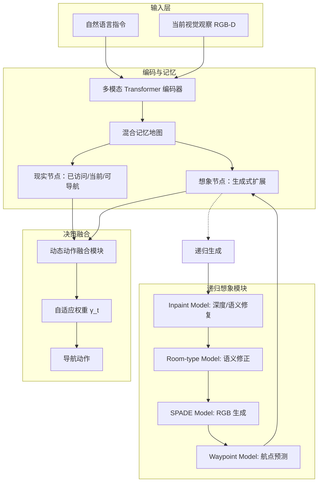

# 基于想象的规划：视觉语言导航中的情景模拟与情景记忆

## 一、论文基础元数据
- 原文标题：Planning from Imagination: Episodic Simulation and Episodic Memory for Vision-and-Language Navigation
- 中文译版：基于想象的规划：视觉语言导航中的情景模拟与情景记忆
- 发表渠道：预印本（arXiv），待确认会议/期刊等级
- 发表时间：2025 年（arXiv 提交时间：2024-12）
- 链接：arXiv:2412.01857
- 作者及核心机构：Yiyuan Pan, Yunzhe Xu, Zhe Liu, Hesheng Wang（机构信息待补充）
- 研究领域：人工智能 + 视觉语言导航（VLN）/ 具身智能
- 关联数据集：R2R（Room-to-Room，细粒度指令）、REVERIE（粗粒度指令/物体定位）、Matterport3D（仿真环境）

## 二、论文综合评价
### 2.1 量化评分（1-5 分，5 分为最优）
| 评价维度 | 评分 | 备注 |
| -------- | ---- | ---- |
| 📚 理论基础 | ⭐⭐⭐⭐⭐ | 引入人类神经科学的情景模拟与记忆机制，理论根基扎实 |
| 🎯 问题核心性 | ⭐⭐⭐⭐⭐ | 直击 VLN 在未见环境中泛化能力弱的核心痛点 |
| 💡 方法创新性 | ⭐⭐⭐⭐⭐ | 首个明确模拟人类情景模拟与记忆的导航智能体（SALI） |
| ⚙️ 技术壁垒 | ⭐⭐⭐⭐ | 涉及多模块生成模型（GAN, Inpainting）与记忆系统整合，复杂度较高 |
| 🧪 实验严谨性 | ⭐⭐⭐⭐⭐ | 在 R2R 和 REVERIE 双基准测试，包含详尽的消融与定性分析 |
| 🔧 落地可行性 | ⭐⭐⭐ | 生成式想象模块计算开销大，实时性面临挑战 |
| 🚀 应用前景 | ⭐⭐⭐⭐ | 为具身智能在未知环境中的推理提供新范式 |
| 📊 综合评分 | 4.4 | 模拟人类情景规划能力的导航智能体，为具身智能推理提供新范式 |

### 2.2 定性综合评价（≤300 字）
> 核心概括：研究定位、核心价值、差异化优势、关键结论
本研究定位为解决视觉语言导航（VLN）在未见环境中的泛化难题。核心价值在于首次将人类“情景模拟”与“情景记忆”认知机制引入智能体架构，提出 SALI 模型。差异化优势在于构建了“现实 - 想象混合记忆系统”，将瞬态预测转化为持久的拓扑记忆节点，并通过动态权重融合现实与想象信息。关键结论表明，该机制显著提升了复杂指令下的推理能力，在 R2R 和 REVERIE 基准上取得 SOTA 性能，证明了混合记忆系统在复杂未知环境中的有效性，但计算效率仍是落地瓶颈。

## 三、领域本体论映射
| 核心维度 | 具体内容 |
| -------- | -------- |
| 核心研究对象 | 视觉语言导航智能体（VLN Agent） |
| 核心技术路径 | 情景模拟（Episodic Simulation）+ 情景记忆（Episodic Memory） |
| 数据/载体形态 | 拓扑地图节点（RGB-D、语义特征、空间位置） |
| 核心功能目标 | 在未见环境中根据自然语言指令导航至目标位置 |
| 验证核心指标 | SPL（路径长度加权成功率）、SR（成功率）、RGS（远程目标成功率） |

## 四、核心问题与解决方案
### 4.1 待解决的核心问题
1. **领域级根本问题**：智能体在未见环境（Unseen Environments）中难以将熟悉的视觉观察与指令有效关联，泛化性能显著下降。
2. **现有方法痛点**：现有的“想象”机制通常是瞬态的（每一步被覆盖），缺乏长期情景记忆的整合能力，无法利用记忆进行持续的情景模拟和推理。
3. **工程落地卡点**：如何在有限的计算资源下，实现高保真场景生成的实时性与导航决策的准确性平衡。

### 4.2 核心解决方案
- 理论框架：基于人类神经科学的情景模拟与情景记忆理论。
- 核心架构：SALI（Space-Aware Long-term Imaginer）智能体，包含现实 - 想象混合记忆系统。
- 关键技术：递归想象模块（端到端生成想象树）、动态决策融合（自适应权重）。
- 创新机制：将想象生成的高保真场景表示融合进长期拓扑记忆，支持动态推理；随着导航进行，逐渐降低对想象的依赖。

### 4.3 核心优势（量化+定性）
1. 性能优势：R2R 未见环境 SPL 提升 8%（达到 78），REVERIE SPL 提升 4%，多项指标 SOTA。
2. 效率优势：通过记忆剪枝操作（基于特征余弦相似度和位置 MSE）管理记忆效率。
3. 工程优势：增强了复杂指令下的常识推理能力，特别是在多房间与物体组合术语的解析上。

## 五、方法与技术架构
### 5.1 核心架构设计
> 文字描述 + 架构图（Mermaid/图片）
SALI 架构主要由混合记忆地图、递归想象模块和动态决策融合组成。智能体通过编码器处理指令与观察，更新混合记忆地图（包含已访问、当前、可导航、想象四类节点）。递归想象模块负责生成未访问区域的高保真场景表示（RGB、深度、语义），动态融合模块则根据导航进度自适应调整现实与想象节点的权重。

### 5.2 关键技术实现细节
| 技术模块 | 实现路径 | 工程注意事项 |
| -------- | -------- | ------------ |
| 混合记忆地图 | 拓扑地图结构，节点包含空间位置、RGB-D 及语义特征；采用剪枝操作管理记忆 | 需平衡记忆容量与检索速度，避免内存溢出 |
| 递归想象模块 | 端到端生成想象树，包含 Inpaint、Room-type、SPADE、Waypoint 四个子模型 | 生成模型推理耗时较高，需优化并行计算 |
| 动态决策融合 | 多模态 Transformer 编码节点与指令，使用动态权重因子γ_t 融合得分 | 权重衰减策略需根据导航步数精细调节 |
| 依赖组件 | ResNet-50（特征编码）、VGG-19（感知特征）、PatchGAN（判别器） | 预训练权重需对齐，避免域偏移 |

### 5.3 架构优缺点
- 优点：
    1.  显著增强未见环境下的泛化能力。
    2.  具备类人认知机制，可解释性强。
    3.  混合记忆结构支持长期推理。
- 缺点：
    1.  生成式模块导致计算开销大，推理速度慢。
    2.  想象内容可能存在幻觉，误导导航决策。
    3.  系统复杂度高，训练难度大。

## 六、实验设计与结果分析
### 6.1 实验基础设置
| 维度 | 内容 |
| ---- | ---- |
| 数据集 | R2R（细粒度）、REVERIE（粗粒度/物体定位） |
| 基线方法 | BEVBert（空间感知最佳模型）、其他 VLN SOTA 模型 |
| 实验环境 | Matterport3D Simulator |
| 评价指标 | SR（成功率）、SPL（路径长度加权成功率）、RGS、RGSPL |

### 6.2 核心实验结果
| 方法 | 核心指标 1 (R2R SPL) | 核心指标 2 (REVERIE SPL) | 工程指标（算力/耗时） |
| ---- | --------- | --------- | -------------------- |
| 基线 1 (BEVBert) | 70 (约数) | 待补充 | 待补充 |
| 基线 2 (其他 SOTA) | 待补充 | 待补充 | 待补充 |
| 本文方法 (SALI) | 78 (+8%) | 提升 4% | 较高（含生成模块） |

### 6.3 消融实验/鲁棒性分析
| 实验变体 | 指标变化 | 核心结论 |
| -------- | -------- | -------- |
| 仅现实记忆 | 性能下降 | 证明想象节点对未见环境至关重要 |
| 仅想象记忆 | 性能下降 | 证明现实观察不可替代，需混合 |
| 固定权重融合 | 性能下降 | 动态权重策略优于固定权重 |
| 移除房间类型模型 | 性能下降 | 语义修正对减少模糊性关键 |

### 6.4 实验结论（工程视角）
SALI 在复杂指令集（多房间与物体组合）上表现提升最显著，证明想象空间关系的能力有效解析了复杂关联。但在工程部署时，需重点关注生成模块的延迟优化，可能需蒸馏或轻量化处理才能满足实时导航需求。

## 七、领域贡献与创新点
| 贡献层级 | 具体内容 |
| -------- | -------- |
| 理论贡献 | 首次将人类的情景模拟与记忆机制引入 VLN，赋予智能体预期知识学习能力 |
| 方法/架构贡献 | 建立了端到端的递归想象模块，提出现实 - 想象混合记忆地图架构 |
| 数据/工具贡献 | 待补充（未提及新数据集发布） |
| 实验/验证贡献 | 在 R2R 和 REVERIE 基准测试中取得 SOTA，验证了混合记忆系统的有效性 |
| 工程落地贡献 | 提供了处理未见环境泛化问题的新工程范式，但需优化效率 |

## 八、局限性与风险
| 维度 | 具体描述 | 应对思路 |
| ---- | -------- | -------- |
| 学术局限性 | 想象内容的准确性依赖生成模型能力，可能存在语义幻觉 | 引入验证机制或不确定性估计 |
| 工程落地风险 | 递归生成模块计算成本高，影响实时性 | 模型蒸馏、缓存机制、异步生成 |
| 伦理/合规风险 | 生成内容可能包含偏见或不实信息 | 加强内容过滤与对齐训练 |

## 九、未来研究/落地方向
| 方向类型 | 具体内容 | 优先级 |
| -------- | -------- | ------ |
| 科研拓展 | 探索更高效的想象生成机制，结合世界模型（World Model） | 高 |
| 工程优化 | 优化想象过程的计算效率，保持细粒度结果质量 | 高 |
| 跨领域适配 | 适配到真实机器人平台，验证 Sim2Real 效果 | 中 |

## 十、关键词与术语表
| 语言 | 关键词 |
| ---- | ------ |
| 中文 | 视觉语言导航、情景模拟、情景记忆、混合记忆系统、递归想象 |
| 英文 | Vision-and-Language Navigation, Episodic Simulation, Episodic Memory, Hybrid Memory System, Recurrent Imagination |
| 领域专属术语 | **SALI**: Space-Aware Long-term Imaginer，本文提出的智能体架构 **SPL**: Success weighted by Path Length，路径长度加权成功率 **Topological Map**: 拓扑地图，节点表示位置及连接关系 |

## 十一、参考文献与关联资源
- 核心参考文献：BEVBert (An et al. 2023), Matterport3D Simulator
- 补充阅读：人类神经科学关于情景模拟的相关文献
- 开源代码/工具：待补充（通常 arXiv 论文后续会开源代码）

## 十二、阅读者批注
1. **科研启发**：将认知科学理论（情景记忆）转化为具体的深度学习架构模块是一个非常有价值的方向，值得在其他具身任务中推广。
2. **工程落地思考**：生成式模块的延迟是最大障碍，实际部署时可能需要牺牲部分生成质量换取速度，或仅在关键决策点触发想象。
3. **待验证/存疑点**：想象节点错误累积对长期导航的影响未在摘要中详细量化，需查看原文错误分析章节。
4. **个人/团队应用场景**：适用于家庭服务机器人在未知户型中的探索与任务执行，特别是需要理解复杂语言指令的场景。

## 十三、阅读元信息
| 维度 | 内容 |
| ---- | ---- |
| 阅读日期 | 2026-04-07 13:48 |
| 阅读人 | xPaperReader AI |
| 文档编号 | arxiv-2412.01857 |
| 版本迭代 | v1.0 |