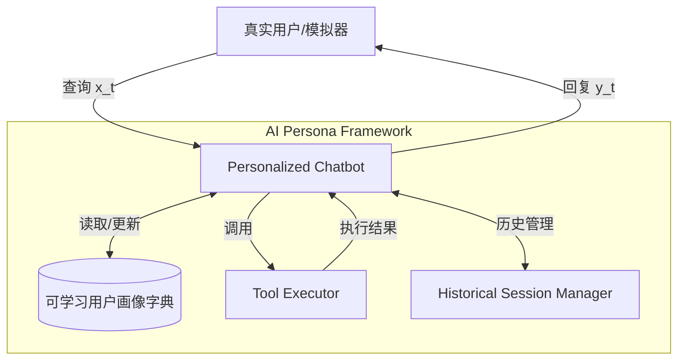

# AI PERSONA：迈向大语言模型的终身个性化

## 一、论文基础元数据
- 原文标题：AI PERSONA: Towards Life-long Personalization of LLMs
- 中文译版：AI PERSONA：迈向大语言模型的终身个性化
- 发表渠道：arXiv 预印本（顶级会议投稿中/待确认）
- 发表时间：2024 年 12 月（arXiv ID 2412），2025 年（预计发表）
- 链接：https://arxiv.org/abs/2412.13103
- 作者及核心机构：Tiannan Wang, Meiling Tao, Ruoyu Fang, Huilin Wang, Shuai Wang, Yuchen Eleanor Jiang, Wangchunshu Zhou（具体机构待补充）
- 研究领域：人工智能（一级）+ 大语言模型/个性化代理（二级）
- 关联数据集：PersonaBench（200 个画像/6000+ 数据点/中文为主/合成标注）

## 二、论文综合评价
### 2.1 量化评分（1-5 分，5 分为最优）
| 评价维度 | 评分 | 备注 |
| -------- | ---- | ---- |
| 📚 理论基础 | ⭐⭐⭐⭐☆ | 定义了终身个性化任务，理论框架清晰 |
| 🎯 问题核心性 | ⭐⭐⭐⭐⭐ | 直击 LLM 长期交互中用户一致性缺失的痛点 |
| 💡 方法创新性 | ⭐⭐⭐⭐⭐ | 提出可学习字典动态更新画像，而非微调或静态 RAG |
| ⚙️ 技术壁垒 | ⭐⭐⭐⭐☆ | 依赖 LLM 自身推理能力，工程实现难度适中 |
| 🧪 实验严谨性 | ⭐⭐⭐⭐☆ | 多模型对比、消融实验充分，但数据为合成 |
| 🔧 落地可行性 | ⭐⭐⭐⭐☆ | 无需重训练，成本低，易于集成到现有 Agent 框架 |
| 🚀 应用前景 | ⭐⭐⭐⭐⭐ | 个人助理、情感陪伴、长期客服等场景广阔 |
| 📊 综合评分 | 4.6 | 无需重训练的终身个性化方案，个人助理与情感陪伴场景适用 |

### 2.2 定性综合评价（≤300 字）
> 核心概括：研究定位、核心价值、差异化优势、关键结论
本研究首次明确定义了大语言模型的“终身个性化”任务，旨在解决模型随用户动态变化而持续适应的难题。核心价值在于提出了**AI Persona 框架**，通过可学习字典动态更新用户画像，避免了高昂的微调成本和静态 RAG 的上下文限制。差异化优势在于构建了**PersonaBench 基准**，填补了长期个性化评估的空白。关键结论表明，适度的画像更新频率（每 3 次对话）能使模型在无需真值的情况下，达到接近理想状态的个性化效果，且显著优于传统基线。

## 三、领域本体论映射
| 核心维度 | 具体内容 |
| -------- | -------- |
| 核心研究对象 | 大语言模型（LLM）与用户之间的长期交互关系 |
| 核心技术路径 | 动态用户画像更新（可学习字典）+ 会话历史管理 |
| 数据/载体形态 | 合成的高保真用户画像、场景及函数调用数据（PersonaBench） |
| 核心功能目标 | 实现低成本、动态演进的终身个性化服务 |
| 验证核心指标 | 用户满意度（Persona Satisfaction）、档案相似度、对话效率 |

## 四、核心问题与解决方案
### 4.1 待解决的核心问题
1. **领域级根本问题**：LLM 如何在长期交互中保持对用户动态变化特征的一致性与适应性。
2. **现有方法痛点**：微调需频繁重训练且成本高；RAG 受输入长度限制，难以处理漫长历史；现有基准依赖静态数据。
3. **工程落地卡点**：缺乏反映真实用户行为演变的长期交互数据，难以评估动态个性化效果。

### 4.2 核心解决方案
- 理论框架：终身个性化（Life-long Personalization）任务定义。
- 核心架构：AI Persona 框架（包含 Personalized Chatbot, User Simulator, Tool Executor, Historical Session Manager）。
- 关键技术：将用户画像定义为可学习字典，利用 LLM 提示能力而非参数更新来实现适应。
- 创新机制：动态更新机制 $v_{ui}^{(t)}=f_{\theta}(v_{ui}^{(t-1)},(x_{t},y_{t}))$，随交互时间步演进。

### 4.3 核心优势（量化 + 定性）
1. 性能优势：Persona Learning 模式仅需约 10 次更新即可接近 Golden Persona 效果（帮助度 8.29 vs 8.34）。
2. 效率优势：无需模型重训练，显著降低计算成本；对话效率显著优于 No Persona 基线。
3. 工程优势：框架通用，适用于 GPT、Gemini、Claude 等多家主流模型，易于集成。

## 五、方法与技术架构
### 5.1 核心架构设计
> 文字描述 + 架构图（Mermaid/图片）
AI Persona 框架由四个核心组件构成：**个性化聊天机器人**基于画像生成回复；**用户模拟器**基于画像扮演用户生成查询；**工具执行器**模拟外部 API 增强现实感；**历史会话管理器**管理多会话历史确保持续性。用户画像作为可学习字典在交互中动态更新。

### 5.2 关键技术实现细节
| 技术模块 | 实现路径 | 工程注意事项 |
| -------- | -------- | ------------ |
| 动态用户画像 | 定义为包含人口统计、性格、模式、偏好的字典，随交互更新 | 需设计合理的更新提示词，避免灾难性遗忘 |
| 历史会话管理 | 管理多会话历史，确保长期一致性 | 需平衡上下文长度与信息保留，避免溢出 |
| 依赖组件 | 主流闭源 LLM API (GPT-4o, Gemini, Claude) | 需处理 API 速率限制及成本控制在可接受范围 |

### 5.3 架构优缺点
- 优点：无需微调，成本低；动态适应性强；通用性好，不依赖特定模型架构。
- 缺点：依赖 LLM 自身的指令遵循能力；合成数据与真实场景可能存在分布差异。

## 六、实验设计与结果分析
### 6.1 实验基础设置
| 维度 | 内容 |
| ---- | ---- |
| 数据集 | PersonaBench（200 画像，6000+ 数据点） |
| 基线方法 | No Persona, Golden Persona, Conversations RAG |
| 实验环境 | 主流专有模型 (GPT-4o, Gemini-1.5, Claude-3.5) |
| 评价指标 | 满意度 (Satisfaction), 档案相似度 (Similarity), 对话效率 (Efficiency) |

### 6.2 核心实验结果
| 方法 | 核心指标 1 (帮助度) | 核心指标 2 (个性化) | 工程指标（算力/耗时） |
| ---- | --------- | --------- | -------------------- |
| 基线 1 (No Persona) | 待补充 | 待补充 | 低 |
| 基线 2 (Golden Persona) | 8.34 | 7.78 | 低 (无需学习) |
| 本文方法 (Persona Learning k=3) | 8.29 | 7.63 | 中 (需更新画像) |

### 6.3 消融实验/鲁棒性分析
| 实验变体 | 指标变化 | 核心结论 |
| -------- | -------- | -------- |
| 更新频率 k=1 | 性能略降 | 更新太频繁可能导致不稳定 |
| 更新频率 k=5 | 性能略降 | 信息过多可能导致滞后 |
| 更新频率 k=3 | 性能最优 | 学习频率的选择至关重要，适度更新最佳 |
| 不同基座模型 | 均优于 No Persona | 框架具有跨模型鲁棒性 |

### 6.4 实验结论（工程视角）
在实际工程部署中，建议采用**每 3 次对话更新一次画像**的策略，能在性能与成本之间取得最佳平衡。无需追求实时更新，也无需等待过长周期。框架对主流模型均有效，可快速迁移。

## 七、领域贡献与创新点
| 贡献层级 | 具体内容 |
| -------- | -------- |
| 理论贡献 | 首次明确定义 LLM 终身个性化任务，强调动态适应性 |
| 方法/架构贡献 | 提出 AI Persona 框架，利用可学习字典实现免微调个性化 |
| 数据/工具贡献 | 发布 PersonaBench 基准，填补长期个性化评估空白 |
| 实验/验证贡献 | 在多主流模型上验证了方法的有效性与鲁棒性 |
| 工程落地贡献 | 提供了低成本、易集成的长期记忆解决方案 |

## 八、局限性与风险
| 维度 | 具体描述 | 应对思路 |
| ---- | -------- | -------- |
| 学术局限性 | 种子数据主要由中文母语者完成，跨语言/文化泛化能力待验证 | 收集多语言种子数据，进行跨文化适配测试 |
| 工程落地风险 | 合成数据与真实世界部署效果可能存在差异 | 在小规模真实用户场景中进行 A/B 测试验证 |
| 伦理/合规风险 | 用户画像涉及隐私数据，动态存储需符合合规要求 | 实施数据加密、用户授权及隐私保护机制 |

## 九、未来研究/落地方向
| 方向类型 | 具体内容 | 优先级 |
| -------- | -------- | ------ |
| 科研拓展 | 研究更高效的画像压缩与更新算法，减少 Token 消耗 | 高 |
| 工程优化 | 优化历史会话管理器，支持更长周期的记忆检索 | 高 |
| 跨领域适配 | 将框架适配到医疗、教育等垂直领域的长期陪伴场景 | 中 |

## 十、关键词与术语表
| 语言 | 关键词 |
| ---- | ------ |
| 中文 | 终身个性化、用户画像、动态更新、大语言模型、基准测试 |
| 英文 | Life-long Personalization, User Persona, Dynamic Update, LLM, Benchmark |
| 领域专属术语 | **PersonaBench**：终身个性化评估基准数据集；**Golden Persona**： ground truth 角色配置（理论上限） |

## 十一、参考文献与关联资源
- 核心参考文献：待补充（论文内部引用的相关个性化、RAG、Agent 文献）
- 补充阅读：关于 LLM 记忆机制、用户建模的相关综述
- 开源代码/工具：待补充（通常 arXiv 论文会附带 GitHub 链接，此处未提供）

## 十二、阅读者批注
1. **科研启发**：将用户画像定义为“可学习字典”而非固定 Prompt 或微调参数，是一个非常有启发性的视角，平衡了灵活性与稳定性。
2. **工程落地思考**：更新频率 $k=3$ 是一个重要的工程参数，在实际产品中可作为默认配置，并根据用户反馈动态调整。
3. **待验证/存疑点**：合成数据在多大程度上能代表真实用户的复杂情感变化？需要真实用户日志进行验证。
4. **个人/团队应用场景**：可应用于团队内部的 AI 助手个性化配置，或面向 C 端用户的长期陪伴型产品。

## 十三、阅读元信息
| 维度 | 内容 |
| ---- | ---- |
| 阅读日期 | 2026-04-07 13:57 |
| 阅读人 | xPaperReader AI |
| 文档编号 | arxiv-2412.13103 |
| 版本迭代 | v1.0 |