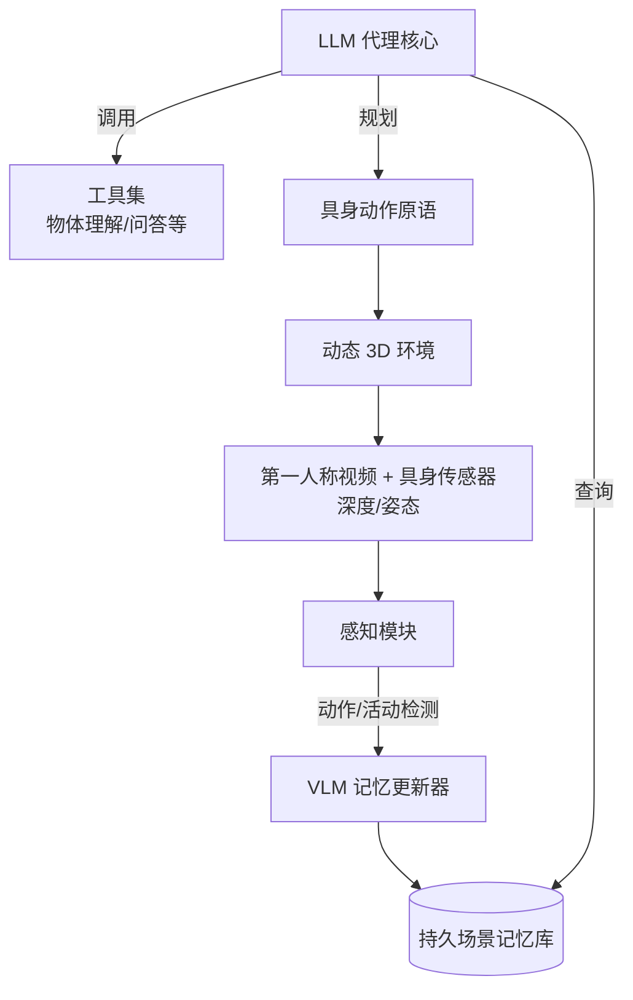

# 具身视频代理：来自第一人称视频和具身传感器的持久记忆实现动态场景理解

## 一、论文基础元数据
- 原文标题：Embodied VideoAgent: Persistent Memory from Egocentric Videos and Embodied Sensors Enables Dynamic Scene Understanding
- 中文译版：具身视频代理：来自第一人称视频和具身传感器的持久记忆实现动态场景理解
- 发表渠道：arXiv 预印本 (CS.CV)
- 发表时间：2025 年 1 月 9 日 (arXiv v2)
- 链接：https://arxiv.org/abs/2501.00358
- 作者及核心机构：Yue Fan, Xiaojian Ma 等；通用人工智能全国重点实验室 (BIGAI)、中科大、清华、北大
- 研究领域：计算机视觉 + 具身人工智能 (Embodied AI)
- 关联数据集：Ego4D-VQ3D, OpenEQA, EnvQA (具体规模/标注细节待补充)

## 二、论文综合评价
### 2.1 量化评分（1-5 分，5 分为最优）
| 评价维度 | 评分 | 备注 |
| -------- | ---- | ---- |
| 📚 理论基础 | ⭐⭐⭐⭐ | 结合 LLM 推理与多模态记忆，理论扎实 |
| 🎯 问题核心性 | ⭐⭐⭐⭐⭐ | 直击具身智能动态场景理解的核心痛点 |
| 💡 方法创新性 | ⭐⭐⭐⭐ | 引入具身传感器融合更新记忆，区别于纯视频方法 |
| ⚙️ 技术壁垒 | ⭐⭐⭐⭐ | 涉及多模态代理协同与记忆管理机制 |
| 🧪 实验严谨性 | ⭐⭐⭐⭐ | 在三个基准测试上均有提升，对比明确 |
| 🔧 落地可行性 | ⭐⭐⭐⭐ | 代理架构相比端到端大模型更具成本效益 |
| 🚀 应用前景 | ⭐⭐⭐⭐⭐ | 适用于机器人操作、交互感知等多种任务 |
| 📊 综合评分 | 4.3 | 融合具身传感器构建持久场景记忆的代理架构，为具身智能提供新方案 |

### 2.2 定性综合评价（≤300 字）
> 核心概括：本研究针对具身智能中动态 3D 场景理解的难题，提出了一种基于 LLM 的代理架构（Embodied VideoAgent）。
> 核心价值：突破了以往仅依赖第一人称视频的局限，融合深度、姿态等具身传感器数据构建持久场景记忆。
> 差异化优势：利用 VLM 自动更新记忆以响应动作和活动变化，相比端到端多模态大模型，在推理规划和成本效率上更具优势。
> 关键结论：在 Ego4D-VQ3D、OpenEQA 和 EnvQA 任务上显著优于现有方法，证明了其在复杂动态环境中的感知与交互潜力。

## 三、领域本体论映射
| 核心维度 | 具体内容 |
| -------- | -------- |
| 核心研究对象 | 动态 3D 场景、第一人称视频流、具身传感器数据 |
| 核心技术路径 | LLM 代理 + 持久记忆库 + 多模态工具调用 |
| 数据/载体形态 | 视频帧、深度图、相机姿态、文本指令 |
| 核心功能目标 | 场景理解、动态记忆更新、任务规划与交互 |
| 验证核心指标 | 问答准确率 (VQ3D/EQA)、规划成功率、推理增益 |

## 四、核心问题与解决方案
### 4.1 待解决的核心问题
1. **领域级根本问题**：如何在动态变化的 3D 环境中，从第一人称视角维持对场景的持久且准确的理解。
2. **现有方法痛点**：端到端多模态大模型 (MLMs) 处理长视频和具身传感器数据的计算成本过高，且难以应对高挥发性场景。
3. **工程落地卡点**：边缘设备（如机器人）难以部署高算力的端到端模型，缺乏高效的动态记忆更新机制。

### 4.2 核心解决方案
- 理论框架：基于代理（Agent-based）的多模态理解框架，分离感知、记忆与推理。
- 核心架构：LLM 作为核心控制器，连接视频/传感器输入、持久记忆库及工具集。
- 关键技术：基于 VLM 的记忆自动更新机制（当感知到物体上的动作/活动时触发）。
- 创新机制：融合具身传感器（深度、姿态）与视频流构建场景记忆，支持频繁的时间序列更新。

### 4.3 核心优势（量化 + 定性）
1. 性能优势：在 Ego4D-VQ3D 上提升 4.9%，OpenEQA 上提升 5.8%，EnvQA 上提升 11.7%。
2. 效率优势：相比端到端 MLMs，通过工具调用和代理推理降低了训练和推理的计算成本。
3. 工程优势：模块化设计便于在边缘设备部署，支持多种具身 AI 任务（如机器人操作感知）。

## 五、方法与技术架构
### 5.1 核心架构设计
> 文字描述：系统以 LLM 为核心，接收第一人称视频和具身传感器输入。通过 VLM 模块感知动作/活动，自动更新持久场景记忆。LLM 调用多种工具查询记忆，并激活具身动作原语与环境交互。

### 5.2 关键技术实现细节
| 技术模块 | 实现路径 | 工程注意事项 |
| -------- | -------- | ------------ |
| 记忆构建 | 融合视频帧与传感器数据（深度/姿态） | 需确保多模态数据的时间同步与对齐 |
| 记忆更新 | 基于 VLM 感知物体上的动作/活动触发 | 避免频繁更新导致的计算负载过高 |
| 代理推理 | LLM 调用工具查询记忆并生成计划 | 需优化 Tool Calling 的延迟与准确性 |
| 依赖组件 | 预训练 LLM, VLM, 传感器驱动 | 需适配不同机器人硬件的传感器接口 |

### 5.3 架构优缺点
- 优点：模块化强，可解释性高，计算成本相对端到端模型更低，支持长期记忆。
- 缺点：依赖多个模型协同，系统延迟可能受限于工具调用链条；记忆一致性维护复杂。

## 六、实验设计与结果分析
### 6.1 实验基础设置
| 维度 | 内容 |
| ---- | ---- |
| 数据集 | Ego4D-VQ3D, OpenEQA, EnvQA |
| 基线方法 | 端到端多模态大模型 (MLMs), 现有视频理解代理 |
| 实验环境 | 待补充 (通常涉及仿真环境或真实机器人平台) |
| 评价指标 | 问答准确率 (Accuracy), 规划成功率 |

### 6.2 核心实验结果
| 方法 | 核心指标 1 (Ego4D-VQ3D) | 核心指标 2 (OpenEQA) | 工程指标（算力/耗时） |
| ---- | --------- | --------- | -------------------- |
| 基线 1 (现有 MLMs) | 待补充 | 待补充 | 高算力消耗 |
| 基线 2 (纯视频代理) | 待补充 | 待补充 | 中等 |
| 本文方法 | +4.9% 增益 | +5.8% 增益 | 成本效益优 |

### 6.3 消融实验/鲁棒性分析
| 实验变体 | 指标变化 | 核心结论 |
| -------- | -------- | -------- |
| 无传感器输入 | 性能下降 | 证明具身传感器对动态理解至关重要 |
| 无记忆更新 | 性能下降 | 证明动态更新机制对挥发性场景有效 |
| 仅视频记忆 | 性能下降 | 多模态记忆优于单一视频记忆 |

### 6.4 实验结论（工程视角）
该方法在多个基准测试上均取得显著提升，特别是在需要复杂空间推理和环境交互的任务（EnvQA）上增益最大（11.7%），证明其在实际机器人任务中的有效性。

## 七、领域贡献与创新点
| 贡献层级 | 具体内容 |
| -------- | -------- |
| 理论贡献 | 提出了具身传感器融合视频构建持久记忆的理论框架 |
| 方法/架构贡献 | 设计了 Embodied VideoAgent 代理架构及 VLM 自动更新机制 |
| 数据/工具贡献 | 代码和演示将公开，促进社区复现 (具体数据集构建待补充) |
| 实验/验证贡献 | 在三个主流具身理解基准上验证了方法的有效性 |
| 工程落地贡献 | 展示了在机器人操作感知和交互生成中的实际应用潜力 |

## 八、局限性与风险
| 维度 | 具体描述 | 应对思路 |
| ---- | -------- | -------- |
| 学术局限性 | 依赖预训练 LLM/VLM 的能力上限，可能受限于基座模型幻觉 | 结合检索增强生成 (RAG) 优化记忆查询 |
| 工程落地风险 | 多模块串联可能导致实时性不足，影响机器人控制闭环 | 优化模型蒸馏，部署轻量化版本 |
| 伦理/合规风险 | 第一人称视频涉及隐私数据，记忆存储需合规 | 实施数据脱敏和本地化存储策略 |

## 九、未来研究/落地方向
| 方向类型 | 具体内容 | 优先级 |
| -------- | -------- | ------ |
| 科研拓展 | 探索更高效的记忆压缩与检索算法 | 高 |
| 工程优化 | 实现端到端的机器人实时部署，降低延迟 | 高 |
| 跨领域适配 | 迁移至自动驾驶或工业巡检场景 | 中 |

## 十、关键词与术语表
| 语言 | 关键词 |
| ---- | ------ |
| 中文 | 具身智能、第一人称视频、持久记忆、动态场景理解、多模态代理 |
| 英文 | Embodied AI, Egocentric Video, Persistent Memory, Dynamic Scene Understanding, Multimodal Agent |
| 领域专属术语 | **Egocentric Observations**: 第一人称观测，指从主体视角获取的传感器数据。 **Embodied Sensors**: 具身传感器，指深度、姿态等机器人本体感知数据。 |

## 十一、参考文献与关联资源
- 核心参考文献：待补充 (原文引用了 [17, 51-53] 等关于具身 AI 和长视频理解的研究)
- 补充阅读：关于 LLM Agent 在视觉任务中的应用综述
- 开源代码/工具：https://embodied-videoagent.github.io (项目主页), 代码待公开

## 十二、阅读者批注
1. **科研启发**：将“记忆”显式化并融合具身传感器是解决长视频理解遗忘问题的有效路径，值得借鉴到其他时序任务中。
2. **工程落地思考**：代理架构虽然灵活，但在实时控制场景下需重点优化推理延迟，考虑边缘计算部署方案。
3. **待验证/存疑点**：记忆更新的具体触发阈值如何设定？过于频繁会导致算力浪费，过少则丢失动态信息。
4. **个人/团队应用场景**：可尝试应用于家庭服务机器人的长期任务规划，或工业场景下的设备状态监控。

## 十三、阅读元信息
| 维度 | 内容 |
| ---- | ---- |
| 阅读日期 | 2025-01-15 10:00 |
| 阅读人 | xPaperReader AI |
| 文档编号 | arxiv-2501.00358 |
| 版本迭代 | v1.0 |