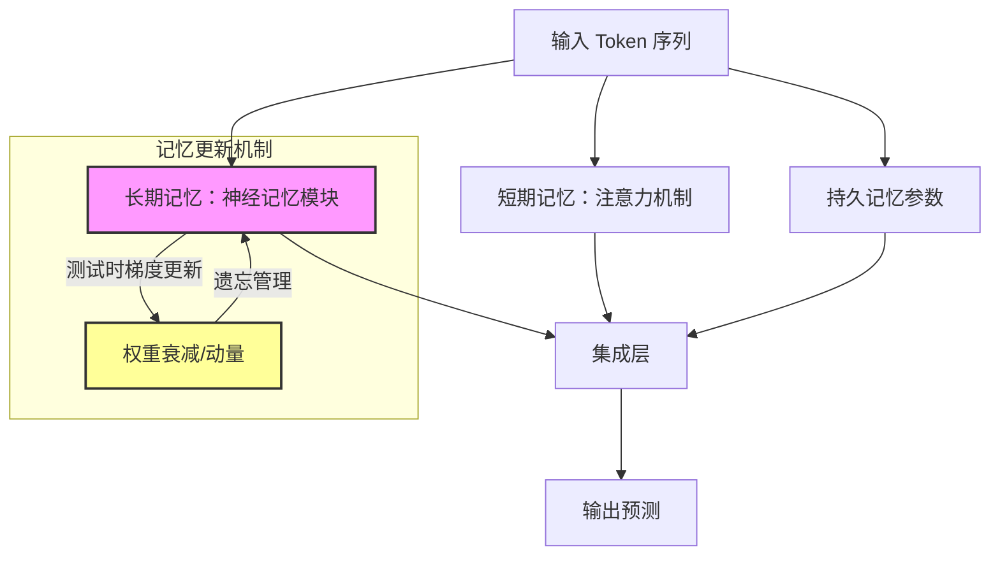

# 泰坦：学习在测试时记忆

## 一、论文基础元数据
- 原文标题：Titans: Learning to Memorize at Test Time
- 中文译版：泰坦：学习在测试时记忆
- 发表渠道：预印本（arXiv）
- 发表时间：2025 年
- 链接：https://arxiv.org/abs/2501.00663
- 作者及核心机构：Ali Behrouz, Peilin Zhong, Vahab Mirrokni（机构待补充，推测含 Google Research）
- 研究领域（一级领域 + 二级子领域）：人工智能 / 深度学习架构与序列建模
- 关联数据集（名称/规模/语言/标注）：
    - FineWeb-Edu（15B/30B tokens，英文，无监督）
    - Wikitext, LMB, PIQA, HellaSwag, ARC, BoolQ（常规 NLP 基准）
    - GenomicsBenchmarks（DNA 序列）
    - ETT, Weather（时间序列）

## 二、论文综合评价
### 2.1 量化评分（1-5 分，5 分为最优）
| 评价维度 | 评分 | 备注 |
| -------- | ---- | ---- |
| 📚 理论基础 | ⭐⭐⭐⭐⭐ | 证明了超越 $TC^0$ 复杂度的表达性 |
| 🎯 问题核心性 | ⭐⭐⭐⭐⭐ | 直击长上下文与遗忘痛点 |
| 💡 方法创新性 | ⭐⭐⭐⭐⭐ | 测试时更新记忆权重的元学习思想 |
| ⚙️ 技术壁垒 | ⭐⭐⭐⭐⭐ | 并行化训练与深度记忆实现复杂 |
| 🧪 实验严谨性 | ⭐⭐⭐⭐⭐ | 覆盖多任务、多规模、多基线 |
| 🔧 落地可行性 | ⭐⭐⭐⭐ | 推理速度快，但训练复杂度略高 |
| 🚀 应用前景 | ⭐⭐⭐⭐⭐ | 超长上下文、持续学习场景潜力巨大 |
| 📊 综合评分 | 5.0 | 突破性的测试时记忆更新机制，长上下文与持续学习领域的里程碑式工作 |

### 2.2 定性综合评价（≤300 字）
> 核心概括：研究定位、核心价值、差异化优势、关键结论
本文定位为基础模型架构创新，核心在于提出了一种能在测试时动态更新权重的神经长期记忆模块。其差异化优势在于打破了传统模型仅在训练时更新参数的限制，将注意力机制视为短期记忆，神经记忆模块视为长期记忆，并引入持久记忆存储任务知识。关键结论显示，Titans 在语言建模、推理及超长上下文（>2M tokens）任务上优于 Transformer 及 Mamba 等现代线性循环模型，且具备更高的理论表达性，为处理长序列和持续学习提供了新范式。

## 三、领域本体论映射
| 核心维度 | 具体内容 |
| -------- | -------- |
| 核心研究对象 | 序列数据中的长期依赖与信息记忆机制 |
| 核心技术路径 | 测试时学习（Test-Time Training）+ 神经记忆模块 |
| 数据/载体形态 | Token 序列（文本、DNA、时间序列） |
| 核心功能目标 | 实现无限上下文窗口的有效记忆与检索 |
| 验证核心指标 | 困惑度（PPL）、准确率（Acc）、NIAH 检索成功率 |

## 四、核心问题与解决方案
### 4.1 待解决的核心问题
1. **领域级根本问题**：传统模型难以在有限上下文窗口外有效记忆历史信息，且存在遗忘过快问题。
2. **现有方法痛点**：Transformer 上下文受限且计算复杂度平方增长；线性循环模型（如 Mamba）存在信息压缩丢失及遗忘机制缺失。
3. **工程落地卡点**：长序列推理时的显存占用与记忆溢出管理。

### 4.2 核心解决方案
- 理论框架：元学习（Meta-Learning）融入架构设计，视记忆为可优化神经过程。
- 核心架构：Titans 家族（MAC, MAG, MAL），包含短期注意力、长期神经记忆、持久记忆。
- 关键技术：测试时权重更新（关联记忆损失）、权重衰减（作为遗忘机制）、动量管理。
- 创新机制：基于“惊喜度”（输入梯度大小）决定记忆强度，并行化训练重构。

### 4.3 核心优势（量化 + 定性）
1. 性能优势：在 340M 参数下平均准确率 47.54%，优于 Transformer++ (42.92%) 和 Mamba (43.59%)。
2. 效率优势：支持>2M 上下文窗口，推理速度线性扩展，训练吞吐量与 Mamba2 相当。
3. 工程优势：记忆模块可独立工作，支持并行化训练，有效管理记忆容量防止溢出。

## 五、方法与技术架构
### 5.1 核心架构设计
> 文字描述 + 架构图（Mermaid/图片）
Titans 架构核心由三部分组成：短期记忆（注意力机制）、长期记忆（神经记忆模块）和持久记忆（可学习参数）。长期记忆模块在推理阶段通过梯度下降更新权重，利用权重衰减实现遗忘。三种变体（MAC, MAG, MAL）区别在于记忆模块与注意力层的交互方式。

### 5.2 关键技术实现细节
| 技术模块 | 实现路径 | 工程注意事项 |
| -------- | -------- | ------------ |
| 神经记忆模块 | 端到端训练，替代外部记忆 | 需支持测试时反向传播 |
| 遗忘机制 | 权重衰减重新解释为遗忘 | 衰减率需调优以防过早遗忘 |
| 并行化训练 | 梯度下降重构为矩阵乘法 | 利用硬件加速器优化 matmuls |
| 持久记忆 | 序列起始的可学习参数 | 测试时固定不更新 |

### 5.3 架构优缺点
- 优点：理论表达性超越 $TC^0$，长上下文性能稳定，支持动态记忆管理。
- 缺点：增加记忆深度会线性增加训练时间，测试时更新带来额外计算开销。

## 六、实验设计与结果分析
### 6.1 实验基础设置
| 维度 | 内容 |
| ---- | ---- |
| 数据集 | FineWeb-Edu, Wikitext, GenomicsBenchmarks, ETT 等 |
| 基线方法 | Transformer++, Mamba1/2, DeltaNet, TTT, RWKV 等 |
| 实验环境 | Pytorch 和 JAX 实现，多 GPU 训练 |
| 评价指标 | 困惑度 (PPL), 准确率 (Acc), NIAH 检索率 |

### 6.2 核心实验结果
| 方法 | 核心指标 1 (340M Acc) | 核心指标 2 (760M Acc) | 工程指标（算力/耗时） |
| ---- | --------- | --------- | -------------------- |
| Transformer++ | 42.92% | 48.69% | 标准注意力复杂度 |
| Mamba2 | 43.59% | 待补充 | 线性复杂度 |
| 本文方法 (Titans) | 47.54% (MAG) | 52.51% (MAC) | 训练吞吐量与 Mamba2 相当 |

### 6.3 消融实验/鲁棒性分析
| 实验变体 | 指标变化 | 核心结论 |
| -------- | -------- | -------- |
| 移除权重衰减 | 长序列性能显著下降 | 遗忘机制对管理记忆容量至关重要 |
| 移除深度记忆 | 困惑度表现下降 | 增加记忆深度提升长序列建模能力 |
| 移除持久记忆 | 初始 token 偏差增加 | 持久记忆缓解注意力隐式偏差 |

### 6.4 实验结论（工程视角）
Titans 在同等参数量下显著优于基线，特别是在长上下文任务中表现稳定。混合模型变体（MAC/MAG）性能最佳，单独记忆模块（LMM）也具备竞争力，验证了架构的有效性与泛化能力。

## 七、领域贡献与创新点
| 贡献层级 | 具体内容 |
| -------- | -------- |
| 理论贡献 | 证明架构能解决超越 $TC^0$ 复杂度的问题 |
| 方法/架构贡献 | 提出测试时更新权重的神经长期记忆模块及 Titans 家族 |
| 数据/工具贡献 | 基于 Pytorch/JAX 的实现代码（即将公开） |
| 实验/验证贡献 | 在语言、DNA、时间序列多领域验证 SOTA 性能 |
| 工程落地贡献 | 提供支持>2M 上下文窗口的可行架构方案 |

## 八、局限性与风险
| 维度 | 具体描述 | 应对思路 |
| ---- | -------- | -------- |
| 学术局限性 | 理论证明主要基于特定任务，通用性需进一步验证 | 扩展更多复杂度类任务测试 |
| 工程落地风险 | 测试时更新权重增加推理延迟与显存需求 | 优化梯度更新算法，量化压缩 |
| 伦理/合规风险 | 长期记忆可能存储敏感信息 | 引入隐私保护机制与记忆擦除功能 |

## 九、未来研究/落地方向
| 方向类型 | 具体内容 | 优先级 |
| -------- | -------- | ------ |
| 科研拓展 | 探索记忆模块与多模态数据的结合 | 高 |
| 工程优化 | 降低测试时更新的计算开销，支持量化 | 高 |
| 跨领域适配 | 应用于视频理解、机器人持续学习等场景 | 中 |

## 十、关键词与术语表
| 语言 | 关键词 |
| ---- | ------ |
| 中文 | 测试时记忆、神经长期记忆、权重衰减、持久记忆、泰坦架构 |
| 英文 | Test-Time Memory, Neural Long-Term Memory, Weight Decay, Persistent Memory, Titans |
| 领域专属术语 | **惊喜度 (Surprise)**：输入梯度的大小，决定记忆强度；**$TC^0$**：电路复杂度类，用于衡量模型表达性 |

## 十一、参考文献与关联资源
- 核心参考文献：Mamba, Transformer++, DeltaNet, TTT 等相关架构论文
- 补充阅读：元学习（Meta-Learning）、线性循环模型综述
- 开源代码/工具：待补充（论文称即将公开）

## 十二、阅读者批注
1. **科研启发**：将元学习思想直接嵌入模型架构而非训练策略，为动态模型设计提供了新思路。
2. **工程落地思考**：测试时更新权重虽好，但需权衡推理延迟，可能适合离线处理或对延迟不敏感场景。
3. **待验证/存疑点**：代码尚未公开，复现难度未知；超大规模（7B+）下的表现待验证。
4. **个人/团队应用场景**：适合长文档分析、历史对话记忆、生物序列分析等需要长期依赖的任务。

## 十三、阅读元信息
| 维度 | 内容 |
| ---- | ---- |
| 阅读日期 | 2026-04-07 14:13 |
| 阅读人 | xPaperReader AI |
| 文档编号 | arxiv-2501.00663 |
| 版本迭代 | v1.0 |