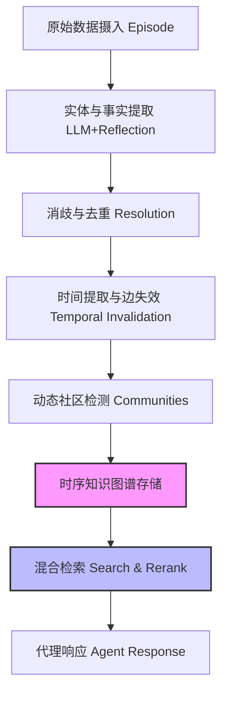

# Zep：一种用于代理记忆的时序知识图谱架构

## 一、论文基础元数据
- 原文标题：Zep: A Temporal Knowledge Graph Architecture for Agent Memory
- 中文译版：Zep：一种用于代理记忆的时序知识图谱架构
- 发表渠道：预印本（arXiv）
- 发表时间：2025 年
- 链接：arXiv:2501.13956
- 作者及核心机构：Preston Rasmussen, Pavlo Paliychuk, Travis Beauvais, Jack Ryan, Daniel Chalef（机构信息待补充，推测与 Zep AI 相关）
- 研究领域：人工智能（一级）+ 大语言模型代理/知识图谱（二级）
- 关联数据集：
    - Deep Memory Retrieval (DMR)：60 消息/对话，用于基准对比
    - LongMemEval (LME)：平均 115k tokens/对话，企业级长对话场景

## 二、论文综合评价
### 2.1 量化评分（1-5 分，5 分为最优）
| 评价维度 | 评分 | 备注 |
| -------- | ---- | ---- |
| 📚 理论基础 | ⭐⭐⭐⭐⭐ | 双时间线模型理论扎实，结合 KG 与记忆理论 |
| 🎯 问题核心性 | ⭐⭐⭐⭐⭐ | 直击 LLM 代理长上下文与动态记忆痛点 |
| 💡 方法创新性 | ⭐⭐⭐⭐⭐ | 时序知识图谱应用于代理记忆层，动态更新机制新颖 |
| ⚙️ 技术壁垒 | ⭐⭐⭐⭐ | 涉及图谱构建、消歧、时间推理及混合检索，工程复杂度高 |
| 🧪 实验严谨性 | ⭐⭐⭐⭐ | 使用 DMR 及 LME 基准，但在特定任务上表现有波动 |
| 🔧 落地可行性 | ⭐⭐⭐⭐⭐ | 显著降低延迟与 Token 成本，架构清晰，易于集成 |
| 🚀 应用前景 | ⭐⭐⭐⭐⭐ | 企业级代理、客户服务、个性化助手场景广阔 |
| 📊 综合评分 | 4.7 | 时序知识图谱应用于代理记忆的创新架构，企业级应用前景广阔 |

### 2.2 定性综合评价（≤300 字）
> 核心概括：研究定位、核心价值、差异化优势、关键结论
本研究定位为 AI 代理的记忆层基础设施，核心在于解决传统 RAG 无法处理动态演化数据及长上下文窗口限制的问题。其差异化优势在于引入了**时序知识图谱（Temporal Knowledge Graph）**引擎 Graphiti，采用双时间线模型（事件时间 + 交易时间）维护事实时效性。关键结论表明，Zep 在长上下文复杂任务中准确率显著优于全上下文基线（提升 15-18%），同时将延迟降低约 90%，证明了其在企业级应用中的高效性与可行性，尽管在单会话助手类任务上仍有优化空间。

## 三、领域本体论映射
| 核心维度 | 具体内容 |
| -------- | -------- |
| 核心研究对象 | AI 代理的长期记忆（Long-term Memory） |
| 核心技术路径 | 时序知识图谱（Temporal Knowledge Graph）+ 混合检索 |
| 数据/载体形态 | 动态演化的对话日志、业务数据、实体关系网络 |
| 核心功能目标 | 非损耗性动态更新、事实时效性维护、低延迟高精度检索 |
| 验证核心指标 | 准确率（Accuracy）、响应延迟（Latency）、上下文 Token 用量 |

## 四、核心问题与解决方案
### 4.1 待解决的核心问题
1. **领域级根本问题**：LLM 代理受限于上下文窗口，难以维持长期、动态演化的世界模型。
2. **现有方法痛点**：传统 RAG 主要针对静态文档，无法有效处理用户交互产生的动态数据（如对话记忆、状态变化）；全上下文方法成本高昂且存在噪声。
3. **工程落地卡点**：动态数据的版本控制、事实矛盾处理及检索延迟过高。

### 4.2 核心解决方案
- 理论框架：双时间线模型（Bi-temporal Model），区分事件有效时间与系统交易时间。
- 核心架构：Zep 记忆层服务，底层引擎为 Graphiti。
- 关键技术：实体/事实提取（LLM+Reflection）、消歧去重、时间提取与边失效机制、动态社区检测。
- 创新机制：当新事实与旧事实矛盾时，自动将旧边的 `invalid_at` 设置为新边的 `valid_at`，确保知识库时效性。

### 4.3 核心优势（量化+定性）
1. 性能优势：LongMemEval 基准上准确率提升 15.2% (gpt-4o-mini) 至 18.5% (gpt-4o)。
2. 效率优势：响应延迟降低约 90%，检索上下文从 115k tokens 缩减至 1.6k tokens。
3. 工程优势：支持非损耗性动态更新，维护事实及其有效性的时间线，解决静态 RAG 缺陷。

## 五、方法与技术架构
### 5.1 核心架构设计
> 文字描述 + 架构图（Mermaid/图片）
Zep 架构核心为 Graphiti 引擎，流程包括数据摄入、图谱构建（提取、消歧、时间处理）、社区检测及检索重排序。数据流从原始 Episode 进入，经过 LLM 处理转化为时序图谱，检索时结合语义、全文及图结构信息。

### 5.2 关键技术实现细节
| 技术模块 | 实现路径 | 工程注意事项 |
| -------- | -------- | ------------ |
| 图谱构建 | LLM 提取实体关系，采用 Reflection 技术减少幻觉 | 需严格遵循 ISO 8601 时间格式规范 |
| 消歧去重 | 向量相似度 + 全文检索候选节点，LLM 判断合并 | 需平衡召回率与准确率，避免错误合并 |
| 时间处理 | 提取绝对/相对时间戳，矛盾事实自动失效旧边 | 确保时间逻辑一致性，避免时间线冲突 |
| 检索重排序 | 混合搜索（余弦+BM25+BFS）+ RRR/MMR/Cross-encoder | 预定义 Cypher 查询而非 LLM 生成，确保 Schema 一致性 |

### 5.3 架构优缺点
- 优点：支持动态更新，时效性强，显著降低 Token 成本与延迟，检索精度高。
- 缺点：架构复杂度较高，依赖 LLM 进行图谱构建可能引入提取错误，特定任务（单会话助手）性能有下降。

## 六、实验设计与结果分析
### 6.1 实验基础设置
| 维度 | 内容 |
| ---- | ---- |
| 数据集 | DMR (60 消息/对话), LongMemEval (平均 115k tokens) |
| 基线方法 | 全上下文基线 (Full-context), MemGPT |
| 实验环境 | gpt-4o-mini, gpt-4o, gpt-4-turbo (DMR 对比) |
| 评价指标 | 准确率 (Accuracy), 延迟 (Latency), Token 用量 |

### 6.2 核心实验结果
| 方法 | 核心指标 1 (准确率) | 核心指标 2 (延迟) | 工程指标（算力/耗时） |
| ---- | --------- | --------- | -------------------- |
| 基线 1 (Full-context gpt-4o-mini) | 55.4% | 31.3 s | 115k Tokens |
| 基线 2 (Full-context gpt-4o) | 60.2% | 28.9 s | 115k Tokens |
| 本文方法 (Zep gpt-4o-mini) | 63.8% (+15.2%) | 3.20 s (↓90%) | 1.6k Tokens |
| 本文方法 (Zep gpt-4o) | 71.2% (+18.5%) | 2.58 s (↓90%) | 1.6k Tokens |

### 6.3 消融实验/鲁棒性分析
| 实验变体 | 指标变化 | 核心结论 |
| -------- | -------- | -------- |
| 单会话助手任务 (Single-session-assistant) | 准确率下降 (gpt-4o ↓17.7%) | 架构在此类场景存在理解偏差，需优化 |
| 弱模型知识更新 (gpt-4o-mini) | 准确率微降 3.36% | 较弱模型对时序数据理解能力有限 |
| 多会话/时序推理任务 | 准确率显著提升 | 强项领域，体现时序图谱优势 |

### 6.4 实验结论（工程视角）
Zep 通过大幅压缩上下文（115k→1.6k）实现了效率与效果的双赢。虽然在特定助手记忆检索场景仍需改进，但在跨会话信息合成、时间推理等复杂任务上表现最佳，适合企业级长对话场景。

## 七、领域贡献与创新点
| 贡献层级 | 具体内容 |
| -------- | -------- |
| 理论贡献 | 提出双时间线模型应用于代理记忆，区分事件时间与交易时间 |
| 方法/架构贡献 | 设计 Zep 架构及 Graphiti 引擎，实现动态时序知识图谱构建与检索 |
| 数据/工具贡献 | 提供详细的图谱构建 Prompt 及时间处理规范（ISO 8601） |
| 实验/验证贡献 | 在 LongMemEval 基准上验证了时序图谱优于全上下文及 MemGPT |
| 工程落地贡献 | 显著降低延迟与成本，填补了生产系统可扩展性评估的空白 |

## 八、局限性与风险
| 维度 | 具体描述 | 应对思路 |
| ---- | -------- | -------- |
| 学术局限性 | 现有记忆基准测试缺乏鲁棒性和复杂性，不足以评估复杂记忆系统 | 开发更贴近商业场景及结构化业务数据合成的评估基准 |
| 工程落地风险 | 特定任务（单会话助手）性能下降，弱模型理解能力有限 | 针对特定场景优化检索策略，微调模型提升提取准确率 |
| 伦理/合规风险 | 记忆数据包含用户隐私，时序图谱可能记录敏感历史 | 实施严格的数据访问控制与隐私脱敏机制 |

## 九、未来研究/落地方向
| 方向类型 | 具体内容 | 优先级 |
| -------- | -------- | ------ |
| 科研拓展 | 探索领域特定本体论（Domain-specific ontologies）在 Graphiti 框架中的应用 | 高 |
| 工程优化 | 利用微调模型优化实体和边的提取，提升准确率并降低成本/延迟 | 高 |
| 跨领域适配 | 将其他 GraphRAG 方法集成到 Zep 范式中，适配更多业务场景 | 中 |

## 十、关键词与术语表
| 语言 | 关键词 |
| ---- | ------ |
| 中文 | 时序知识图谱，代理记忆，动态更新，双时间线模型，混合检索 |
| 英文 | Temporal Knowledge Graph, Agent Memory, Dynamic Update, Bi-temporal Model, Hybrid Search |
| 领域专属术语 | **Graphiti**：Zep 的核心动态时序知识图谱引擎；**Episode**：原始数据单元（消息、文本、JSON）；**Invalidation**：当新事实矛盾时自动使旧边失效的机制 |

## 十一、参考文献与关联资源
- 核心参考文献：
    - Zep: A Temporal Knowledge Graph Architecture for Agent Memory (arXiv:2501.13956)
- 补充阅读：
    - MemGPT 相关论文
    - LongMemEval 基准测试论文
- 开源代码/工具：
    - Zep GitHub 仓库（实验笔记将公开）
    - Graphiti 引擎

## 十二、阅读者批注
1. **科研启发**：双时间线模型为处理动态数据提供了很好的理论框架，不仅限于代理记忆，也可应用于其他动态知识管理场景。
2. **工程落地思考**：显著的成本降低（90% 延迟）是企业级应用的关键卖点，但需注意特定任务性能下降的问题，可能需要在检索策略上做分层处理。
3. **待验证/存疑点**：单会话助手任务性能下降的具体原因需进一步分析，是检索召回问题还是生成理解问题？
4. **个人/团队应用场景**：适用于需要长期记忆的客户支持机器人、个性化教育助手及复杂业务流程代理。

## 十三、阅读元信息
| 维度 | 内容 |
| ---- | ---- |
| 阅读日期 | 2026-04-07 14:22 |
| 阅读人 | xPaperReader AI |
| 文档编号 | arxiv-2501.13956 |
| 版本迭代 | v1.0 |