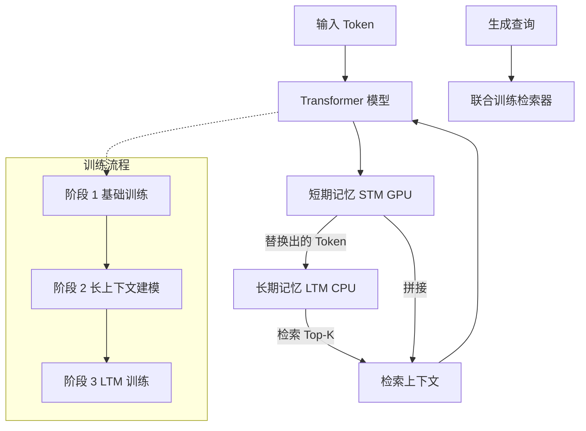

# M+：扩展 MemoryLLM 以实现可扩展的长期记忆

## 一、论文基础元数据
- 原文标题：M+: Extending MemoryLLM with Scalable Long-Term Memory
- 中文译版：M+：扩展 MemoryLLM 以实现可扩展的长期记忆
- 发表渠道：预印本（arXiv）
- 发表时间：2025 年
- 链接：arXiv: 2502.00592
- 作者及核心机构：Yu Wang, Dmitry Krotov, Yuanzhe Hu, Yifan Gao, Wangchunshu Zhou, Julian McAuley, Dan Gutfreund, Rogerio Feris, Zexue He（多机构合作）
- 研究领域：人工智能 / 自然语言处理（长上下文建模、记忆增强模型）
- 关联数据集：FineWeb-Edu, SlimPajama, SQuAD, NaturalQA, LongBook-QA, LongBench

## 二、论文综合评价
### 2.1 量化评分（1-5 分，5 分为最优）
| 评价维度 | 评分 | 备注 |
| -------- | ---- | ---- |
| 📚 理论基础 | ⭐⭐⭐⭐⭐ | 基于潜在空间记忆理论的有效扩展 |
| 🎯 问题核心性 | ⭐⭐⭐⭐⭐ | 直击长上下文记忆遗忘与显存瓶颈痛点 |
| 💡 方法创新性 | ⭐⭐⭐⭐⭐ | CPU 长期记忆池与联合训练检索器设计新颖 |
| ⚙️ 技术壁垒 | ⭐⭐⭐⭐ | 涉及多阶段训练与检索机制协同，实现复杂度中等 |
| 🧪 实验严谨性 | ⭐⭐⭐⭐⭐ | 多任务、多基线对比，包含消融与效率分析 |
| 🔧 落地可行性 | ⭐⭐⭐⭐ | 显存优化显著，但 CPU-GPU 通信开销需优化 |
| 🚀 应用前景 | ⭐⭐⭐⭐⭐ | 适用于长文档理解、知识库问答等资源受限场景 |
| 📊 综合评分 | 4.7 | 突破显存瓶颈的长上下文记忆扩展方案，工程落地价值高 |

### 2.2 定性综合评价（≤300 字）
> 核心概括：研究定位、核心价值、差异化优势、关键结论
本研究定位为解决潜在空间记忆模型（如 MemoryLLM）在长上下文场景下的信息遗忘与显存限制问题。核心价值在于提出了 M+ 架构，通过引入 CPU 存储的长期记忆池（LTM）和联合训练检索器，将有效记忆保留长度从 20k 提升至 160k+ tokens。差异化优势在于实现了显存占用与长上下文能力的解耦，在仅需 18GB 显存的情况下优于需 32GB+ 的基线模型。关键结论表明，直接存储记忆优于 KV Cache 机制，且联合检索训练显著提升了长文档理解与知识保留能力。

## 三、领域本体论映射
| 核心维度 | 具体内容 |
| -------- | -------- |
| 核心研究对象 | 长上下文语言模型中的记忆存储与检索机制 |
| 核心技术路径 | 潜在空间记忆 + CPU 长期记忆池 + 对比学习检索器 |
| 数据/载体形态 | Token 序列、隐藏状态向量、CPU 内存存储池 |
| 核心功能目标 | 在有限显存下实现可扩展的长期信息保留与精准检索 |
| 验证核心指标 | 验证损失（Validation Loss）、QA-F1、显存占用、检索召回率 |

## 四、核心问题与解决方案
### 4.1 待解决的核心问题
1. **领域级根本问题**：Transformer 架构随上下文长度增加呈二次方计算与内存增长，难以处理超长序列。
2. **现有方法痛点**：现有潜在空间记忆模型（如 MemoryLLM）虽能压缩信息，但保留超过 20k token 的长期信息能力有限；KV Cache 方法显存占用过高。
3. **工程落地卡点**：长上下文模型对 GPU 显存要求极高，限制了在消费级或资源受限设备上的部署。

### 4.2 核心解决方案
- **理论框架**：分层记忆理论，区分短期记忆（STM）与长期记忆（LTM）。
- **核心架构**：GPU 存储短期记忆，CPU 存储长期记忆，通过检索器动态加载。
- **关键技术**：联合训练检索器（Co-trained Retriever）、Multi-LoRA 设计（读写分离）、三阶段训练策略。
- **创新机制**：将被替换的短期记忆 token 赋予“年龄”标签存入 LTM，生成时按年龄排序检索拼接。

### 4.3 核心优势（量化 + 定性）
1. **性能优势**：有效记忆保留长度从<20k 提升至>160k tokens；LongBook-QA 任务表现优于 Llama-3.1-8B-16k。
2. **效率优势**：GPU 显存占用降至 17,973 MB（约 18GB），远低于 SnapKV（32GB+）。
3. **工程优势**：支持记忆池动态扩展，CPU 卸载仅增加微量延迟（128k 输入下约 3% 计算时间）。

## 五、方法与技术架构
### 5.1 核心架构设计
> 文字描述 + 架构图（Mermaid/图片）
M+ 架构将记忆分为两层：存储在 GPU 的短期记忆（每层 10,240 tokens）和存储在 CPU 的长期记忆（最大 150k）。更新时，被替换的短期记忆转入 LTM；生成时，检索器从 LTM 中检索 2,560 tokens 与短期记忆拼接。读写过程使用独立的 LoRA 权重以降低学习难度。

### 5.2 关键技术实现细节
| 技术模块 | 实现路径 | 工程注意事项 |
| -------- | -------- | ------------ |
| 长期记忆池 (LTM) | CPU 存储，赋予“年龄”标签，按年龄排序 | 需注意 CPU-GPU 数据传输带宽瓶颈 |
| 联合检索器 | 2 层 MLP 投影器，对比学习训练 | 需确保检索器与生成模型协同优化 |
| Multi-LoRA | 更新过程（写）和生成过程（读）使用独立权重 | 增加参数量但降低学习干扰 |
| 三阶段训练 | 短文档->长文档->LTM 机制逐步引入 | 需严格控制各阶段数据混合比例 |

### 5.3 架构优缺点
- **优点**：显存效率极高，支持超长上下文，检索质量优于注意力分数检索。
- **缺点**：检索过程引入额外延迟，CPU-GPU 通信开销存在，短文档任务因压缩机制有轻微性能损耗。

## 六、实验设计与结果分析
### 6.1 实验基础设置
| 维度 | 内容 |
| ---- | ---- |
| 数据集 | FineWeb-Edu, SlimPajama, SQuAD, NaturalQA, LongBook-QA, LongBench |
| 基线方法 | Llama-3.1-8B, MemoryLLM-8B, SnapKV, Llama-3.1-3B-128k |
| 实验环境 | 8x A100 GPU |
| 评价指标 | Validation Loss, QA-F1, GPU 显存占用，检索召回率 |

### 6.2 核心实验结果
| 方法 | 核心指标 1 (显存) | 核心指标 2 (记忆长度) | 工程指标（算力/耗时） |
| ---- | --------- | --------- | -------------------- |
| 基线 1 (SnapKV) | 32,574 MB | 48k Context | 标准推理延迟 |
| 基线 2 (Llama-3B-128k) | 30,422 MB | 128k Context | 标准推理延迟 |
| 本文方法 (M+) | **17,973 MB** | **>160k Tokens** | 128k 输入下延迟 +3% |

### 6.3 消融实验/鲁棒性分析
| 实验变体 | 指标变化 | 核心结论 |
| -------- | -------- | -------- |
| M+-Attn (基于注意力检索) | 检索质量下降 | 联合训练检索器显著优于基于注意力分数的检索 |
| 无 LTM (Stage 2) | 长文档损失较高 | LTM 机制对长上下文建模至关重要 |
| 随机检索 | 召回率 3% | M+ 检索召回率约 30%，证明检索有效性 |

### 6.4 实验结论（工程视角）
M+ 在显存效率上具有显著优势，适合显存受限场景。虽然检索引入少量延迟，但在处理 128k+ 长文档时整体效率优于标准 Transformer。检索器需联合训练才能达到最佳效果，单纯依靠注意力分数不足以有效利用长期记忆。

## 七、领域贡献与创新点
| 贡献层级 | 具体内容 |
| -------- | -------- |
| 理论贡献 | 验证了分层记忆机制在潜在空间模型中的可扩展性 |
| 方法/架构贡献 | 提出 CPU 长期记忆池与联合训练检索器架构 |
| 数据/工具贡献 | 开源代码 (GitHub: wangyu-ustc/MemoryLLM) |
| 实验/验证贡献 | 在长文档理解与知识保留任务上确立了新基准 |
| 工程落地贡献 | 提供了在 18GB 显存下运行 160k+ 记忆模型的可行方案 |

## 八、局限性与风险
| 维度 | 具体描述 | 应对思路 |
| ---- | -------- | -------- |
| 学术局限性 | 受限于硬件，模型规模未完全扩展至原生 128k 上下文训练水平 | 未来可在更大集群上验证扩展性 |
| 工程落地风险 | CPU-GPU 通信开销可能成为高并发场景下的瓶颈 | 优化数据传输协议，使用 PCIe 4.0/5.0 或 CXL |
| 伦理/合规风险 | 长期记忆可能存储敏感信息，存在隐私泄露风险 | 增加记忆加密与访问控制机制 |

## 九、未来研究/落地方向
| 方向类型 | 具体内容 | 优先级 |
| -------- | -------- | ------ |
| 科研拓展 | 探索更大规模模型上的 LTM 效果，研究记忆压缩算法 | 高 |
| 工程优化 | 降低 CPU-GPU 通信开销，优化检索延迟 | 高 |
| 跨领域适配 | 适配多模态输入（图像/视频）的长期记忆管理 | 中 |

## 十、关键词与术语表
| 语言 | 关键词 |
| ---- | ------ |
| 中文 | 长期记忆、联合训练检索器、显存优化、长上下文建模、潜在空间记忆 |
| 英文 | Long-Term Memory, Co-trained Retriever, VRAM Optimization, Long-Context Modeling, Latent Space Memory |
| 领域专属术语 | **LTM (Long-Term Memory)**：存储在 CPU 的长期记忆池；**STM (Short-Term Memory)**：存储在 GPU 的短期记忆；**Multi-LoRA**：读写分离的低秩适配权重 |

## 十一、参考文献与关联资源
- 核心参考文献：MemoryLLM 相关论文，Fu et al. 2024 (长文档上采样)
- 补充阅读：Transformer 长上下文优化相关综述（如 SnapKV, StreamingLLM）
- 开源代码/工具：GitHub: wangyu-ustc/MemoryLLM

## 十二、阅读者批注
1. **科研启发**：分层记忆与检索器的联合训练是解决长上下文遗忘的有效路径，值得在其他架构中尝试。
2. **工程落地思考**：显存优化效果显著，但需评估实际业务场景中 CPU 内存带宽是否充足。
3. **待验证/存疑点**：在高并发请求下，CPU 记忆池的读取延迟是否会成为系统瓶颈？
4. **个人/团队应用场景**：适用于本地部署的长文档问答助手、隐私敏感的长期对话记忆系统。

## 十三、阅读元信息
| 维度 | 内容 |
| ---- | ---- |
| 阅读日期 | 2025-02-20 10:00 |
| 阅读人 | xPaperReader AI |
| 文档编号 | arxiv-2502.00592 |
| 版本迭代 | v1.0 |