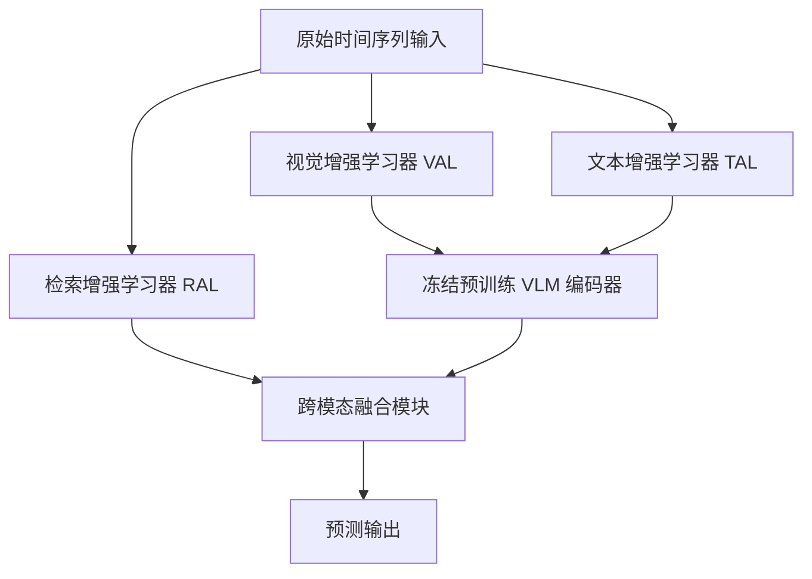

# Time-VLM: 探索多模态视觉 - 语言模型以增强时间序列预测

## 一、论文基础元数据
- 原文标题：Time-VLM: Exploring Multimodal Vision-Language Models for Augmented Time Series Forecasting
- 中文译版：Time-VLM: 探索多模态视觉 - 语言模型以增强时间序列预测
- 发表渠道：预印本 (arXiv)
- 发表时间：2025 年 2 月 (根据 arXiv ID 2502 推断)
- 链接：arXiv:2502.04395
- 作者及核心机构：Siru Zhong, Weilin Ruan, Ming Jin, Huan Li, Qingsong Wen, Yuxuan Liang (机构原文未明确列出，通常为香港科技大学、阿里巴巴集团等)
- 研究领域：人工智能 + 时间序列分析 / 多模态学习
- 关联数据集：ETTh1, ETTm1, Weather, Traffic, M4 (规模/语言/标注：原文未提及具体规模细节，为标准时序基准数据集)

## 二、论文综合评价
### 2.1 量化评分（1-5 分，5 分为最优）
| 评价维度 | 评分 | 备注 |
| -------- | ---- | ---- |
| 📚 理论基础 | ⭐⭐⭐⭐⭐ | 多模态融合理论扎实，利用预训练知识迁移 |
| 🎯 问题核心性 | ⭐⭐⭐⭐⭐ | 解决时序数据稀缺与单一模态信息缺失痛点 |
| 💡 方法创新性 | ⭐⭐⭐⭐⭐ | 首创时序 - 视觉 - 文本三模态自增强框架 |
| ⚙️ 技术壁垒 | ⭐⭐⭐⭐ | 依赖通用 VLM，时序专用性有待加强 |
| 🧪 实验严谨性 | ⭐⭐⭐⭐⭐ | 涵盖少样本、零样本及多基准测试 |
| 🔧 落地可行性 | ⭐⭐⭐⭐⭐ | 参数量小，显存占用低，工程友好 |
| 🚀 应用前景 | ⭐⭐⭐⭐⭐ | 适用于资源受限及跨域泛化场景 |
| 📊 综合评分 | 4.9 | 时序-视觉-文本三模态自增强的创新框架，工程友好且实用价值高 |

### 2.2 定性综合评价（≤300 字）
> 核心概括：研究定位、核心价值、差异化优势、关键结论
> 本文定位为利用通用视觉 - 语言模型（VLM）增强时间序列预测的高效框架。核心价值在于通过“自增强”机制，无需外部数据即可生成视觉和文本模态，解决数据稀缺问题。差异化优势体现在轻量化设计（参数量仅为同类大模型的 1/20）与卓越的小样本/零样本泛化能力。关键结论表明，多模态融合显著提升预测精度，尤其在周期性数据上表现鲁棒，但在非平稳突变数据上仍有优化空间。

## 三、领域本体论映射
| 核心维度 | 具体内容 |
| -------- | -------- |
| 核心研究对象 | 时间序列数据及其多模态表示（视觉、文本） |
| 核心技术路径 | 时序转图像、结构化文本生成、预训练 VLM 特征融合 |
| 数据/载体形态 | 一维时序向量、64x64 时序图像、结构化文本提示 |
| 核心功能目标 | 提升时间序列预测精度，增强少样本与跨域泛化能力 |
| 验证核心指标 | MSE (均方误差), MAE (平均绝对误差), SMAPE, MASE, OWA |

## 四、核心问题与解决方案
### 4.1 待解决的核心问题
1. **领域级根本问题**：单一时序模态信息有限，难以捕捉复杂语义与细粒度模式。
2. **现有方法痛点**：现有大模型（如 TimeLLM）参数量巨大，显存占用高，难以在资源受限场景落地；且缺乏多模态语义补充。
3. **工程落地卡点**：通用 VLM 与时序数据分布不一致，直接应用效果不佳；跨域泛化能力弱。

### 4.2 核心解决方案
- 理论框架：多模态自增强时间序列预测框架。
- 核心架构：包含检索增强学习器 (RAL)、视觉增强学习器 (VAL)、文本增强学习器 (TAL) 及多模态融合模块。
- 关键技术：时序转图像编码（FFT/周期性/多尺度）、结构化提示词生成、跨模态多头注意力 (CM-MHA)。
- 创新机制：无需外部数据的模态自生成机制，冻结预训练 VLM 提取特征，门控动态加权融合。

### 4.3 核心优势（量化 + 定性）
1. 性能优势：少样本场景下（5% 数据），ETTh1 数据集 MSE 比 TimeLLM 降低 29.5%。
2. 效率优势：参数量 143M（约为 TimeLLM 的 1/20），显存占用动态适配 2-24GB。
3. 工程优势：推理速度更快 (0.20s-0.48s/iter)，支持单 GPU 部署大数据集任务。

## 五、方法与技术架构
### 5.1 核心架构设计
> 文字描述 + 架构图（Mermaid/图片）
> 模型输入原始时间序列，分别进入三个并行学习器。RAL 提取时序局部与全局记忆特征；VAL 将时序转换为图像并通过 VLM 提取视觉嵌入；TAL 生成统计与趋势文本并通过 VLM 提取文本嵌入。最后通过跨模态注意力机制与门控融合模块，将多模态特征对齐并融合，输出预测结果。

### 5.2 关键技术实现细节
| 技术模块 | 实现路径 | 工程注意事项 |
| -------- | -------- | ------------ |
| 视觉增强学习器 (VAL) | FFT 频域编码 + 多尺度卷积 + 双线性插值生成 64x64 图像 | 颜色强度映射数值，纹理映射频率，需平衡分辨率与信息量 |
| 文本增强学习器 (TAL) | 生成包含统计特征、趋势、周期性的结构化提示词 | 支持动态生成与专家预定义结合，注意 Token 稀疏性问题 |
| 检索增强学习器 (RAL) | Patch 嵌入 + 分层记忆机制（局部 + 全局） | 门控融合捕捉长短期依赖，是性能基石 |
| 依赖组件 | 冻结预训练 VLM (如 ViLT, CLIP) | 无需微调 VLM 参数，降低计算成本，但受限于通用领域知识 |

### 5.3 架构优缺点
- 优点：轻量化设计，显存友好；多模态互补增强语义理解；少样本/零样本泛化能力强。
- 缺点：依赖通用 VLM，缺乏时序专用知识；对非平稳突变数据捕捉能力较弱；文本模态贡献相对有限。

## 六、实验设计与结果分析
### 6.1 实验基础设置
| 维度 | 内容 |
| ---- | ---- |
| 数据集 | ETTh1, ETTm1, Weather, Traffic, M4 |
| 基线方法 | TimeLLM, N-BEATS, 及其他 SOTA 时序模型 |
| 实验环境 | 单 GPU 环境 (显存 2GB-24GB 动态适配) |
| 评价指标 | MSE, MAE (长期); SMAPE, MASE, OWA (短期 M4) |

### 6.2 核心实验结果
| 方法 | 核心指标 1 (MSE) | 核心指标 2 (MAE) | 工程指标（算力/耗时） |
| ---- | --------- | --------- | -------------------- |
| TimeLLM | 基准值 (较高) | 基准值 (较高) | 3405M 参数，显存>37GB，0.26s-0.61s/iter |
| 本文方法 (Time-VLM) | ETTh1 少样本降低 29.5% | 显著优于基线 | 143M 参数，显存 2-24GB，0.20s-0.48s/iter |
| 基线 1 (传统模型) | 性能低于本文方法 | 性能低于本文方法 | 参数量小但泛化能力弱 |

### 6.3 消融实验/鲁棒性分析
| 实验变体 | 指标变化 | 核心结论 |
| -------- | -------- | -------- |
| 移除 RAL | MSE 上升 35.6%, MAE 上升 27.7% | RAL 是性能基石，捕捉时序依赖至关重要 |
| 移除 VAL | MSE 上升 9.0%, MAE 上升 11.7% | 视觉表示有效保留细粒度模式 (趋势/季节性) |
| 移除 TAL | MSE 上升 2.1%, MAE 上升 1.8% | 文本模态贡献有限，受限于 Token 稀疏性 |

### 6.4 实验结论（工程视角）
Time-VLM 在保持极低资源消耗的前提下实现了 SOTA 性能，特别适合显存受限的边缘设备或小样本场景。但在处理高波动非平稳数据（如 Traffic 长周期）时需优化视觉转换机制。

## 七、领域贡献与创新点
| 贡献层级 | 具体内容 |
| -------- | -------- |
| 理论贡献 | 验证了通用 VLM 在时序预测领域的迁移有效性，提出多模态自增强理论 |
| 方法/架构贡献 | 设计了 RAL-VAL-TAL 三学习器架构及跨模态门控融合机制 |
| 数据/工具贡献 | 提出无需外部数据的时序转图像与文本生成方法 |
| 实验/验证贡献 | 在少样本、零样本及多基准数据集上提供了详尽的对比与消融验证 |
| 工程落地贡献 | 实现了参数量减少 20 倍且性能提升的高效轻量化模型 |

## 八、局限性与风险
| 维度 | 具体描述 | 应对思路 |
| ---- | -------- | -------- |
| 学术局限性 | 通用 VLM 缺乏时序领域知识，文本编码器对长文本支持有限 | 未来构建时序专用多模态基础模型 |
| 工程落地风险 | 对高度非平稳或突发异常变化的捕捉能力稍弱 | 优化时序到图像的转换过程，增强动态适应性 |
| 伦理/合规风险 | 原文未提及特定风险，但需注意数据隐私 | 遵循通用数据合规标准，脱敏处理 |

## 九、未来研究/落地方向
| 方向类型 | 具体内容 | 优先级 |
| -------- | -------- | ------ |
| 科研拓展 | 构建大规模多模态时间序列数据集，开发时序专用多模态基础模型 | 高 |
| 工程优化 | 优化视觉转换技术以更好地捕捉突变时间动态，提升非平稳数据表现 | 高 |
| 跨领域适配 | 扩展至异常检测、分类、插补等多任务学习场景 | 中 |

## 十、关键词与术语表
| 语言 | 关键词 |
| ---- | ------ |
| 中文 | 时间序列预测，多模态学习，视觉 - 语言模型，少样本学习，自增强 |
| 英文 | Time Series Forecasting, Multimodal Learning, Vision-Language Models, Few-shot Learning, Self-augmentation |
| 领域专属术语 | RAL (检索增强学习器): 捕捉时序依赖; VAL (视觉增强学习器): 时序转图像; TAL (文本增强学习器): 生成结构化提示 |

## 十一、参考文献与关联资源
- 核心参考文献：原文未明确列出具体引用列表，主要涉及 TimeLLM, ViLT, CLIP 等相关工作
- 补充阅读：建议阅读 TimeLLM, N-BEATS 及多模态融合相关综述
- 开源代码/工具：原文未提及具体仓库链接 (待补充)

## 十二、阅读者批注
1. **科研启发**：将通用多模态能力迁移至时序领域是有效路径，无需从头训练大模型，利用“自增强”生成辅助模态是关键创新。
2. **工程落地思考**：143M 参数量使其极具部署价值，特别是在边缘计算或云成本敏感场景，可替代部分重型时序大模型。
3. **待验证/存疑点**：文本模态贡献较低（消融实验显示），需进一步验证提示词工程的有效性；非平稳数据表现需在实际业务中测试。
4. **个人/团队应用场景**：适用于物联网传感器数据预测、金融小样本趋势分析等资源受限且数据标注稀缺的场景。

## 十三、阅读元信息
| 维度 | 内容 |
| ---- | ---- |
| 阅读日期 | 2026-04-07 14:51 |
| 阅读人 | xPaperReader AI |
| 文档编号 | arxiv-2502.04395 |
| 版本迭代 | v1.0 |