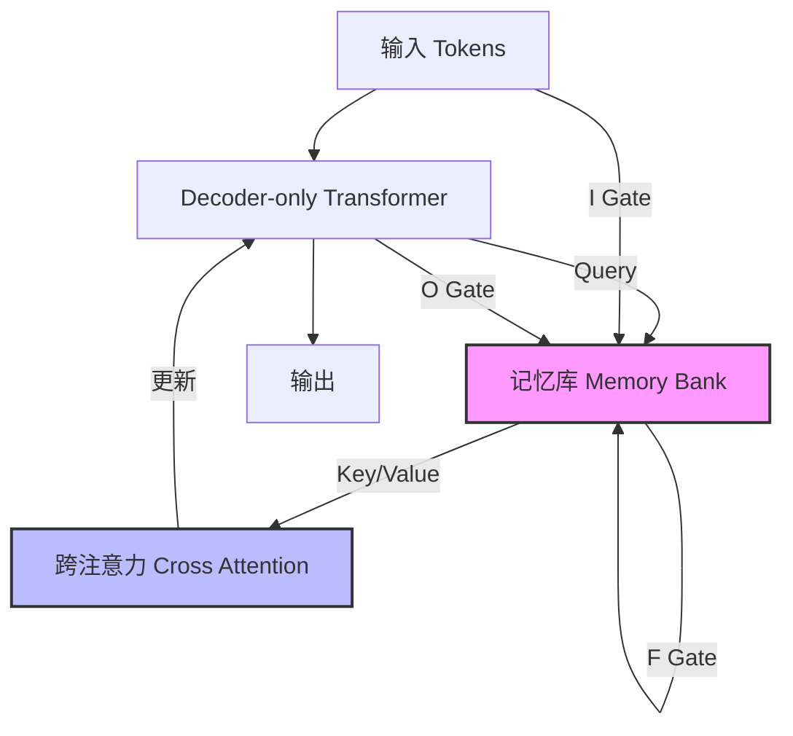

# LM2：大型记忆模型

## 一、论文基础元数据
- 原文标题：LM2: Large Memory Models
- 中文译版：LM2：大型记忆模型
- 发表渠道：arXiv 预印本 (计算机科学 - 计算语言学)
- 发表时间：2025 年 2 月 9 日
- 链接：[arXiv:2502.06049](https://arxiv.org/abs/2502.06049)
- 作者及核心机构：Jikun Kang, Wenqi Wu 等 (Convergence Labs Ltd.)
- 研究领域：人工智能 (一级) + 大语言模型架构/长上下文推理 (二级)
- 关联数据集：BABILong (长上下文推理基准), MMLU (通用知识理解)

## 二、论文综合评价
### 2.1 量化评分（1-5 分，5 分为最优）
| 评价维度 | 评分 | 备注 |
| -------- | ---- | ---- |
| 📚 理论基础 | ⭐⭐⭐⭐⭐ | 基于 Transformer 架构的显式记忆扩展，理论扎实 |
| 🎯 问题核心性 | ⭐⭐⭐⭐⭐ | 直击长上下文推理与信息分散合成的核心痛点 |
| 💡 方法创新性 | ⭐⭐⭐⭐⭐ | 引入辅助记忆模块与门控机制，架构设计新颖 |
| ⚙️ 技术壁垒 | ⭐⭐⭐⭐ | 需要特定的训练基础设施与内存管理优化 |
| 🧪 实验严谨性 | ⭐⭐⭐⭐ | 涵盖了专用基准 (BABILong) 与通用基准 (MMLU) |
| 🔧 落地可行性 | ⭐⭐⭐⭐ | 架构改动适中，但需重新训练或微调 |
| 🚀 应用前景 | ⭐⭐⭐⭐⭐ | 在长文档问答、多步推理场景潜力巨大 |
| 📊 综合评分 | 4.4 | 架构创新显著，长上下文性能提升巨大，通用性保持良好 |

### 2.2 定性综合评价（≤300 字）
> 核心概括：研究定位、核心价值、差异化优势、关键结论
本文定位为增强型 Transformer 架构研究，核心在于解决标准模型在长上下文多步推理中的信息丢失问题。核心价值在于提出了 LM2 架构，通过辅助记忆模块与门控机制（输入/输出/遗忘），在不破坏原有信息流的前提下增强上下文保持能力。差异化优势在于相比现有记忆增强模型（如 RMT），在长上下文任务上性能提升显著（+37.1%），且未牺牲通用任务能力（MMLU +5.0%）。关键结论表明，显式记忆机制是提升 Transformer 长程推理能力的有效路径。

## 三、领域本体论映射
| 核心维度 | 具体内容 |
| -------- | -------- |
| 核心研究对象 | 带有辅助记忆模块的 Decoder-only Transformer 架构 |
| 核心技术路径 | 跨注意力机制 (Cross Attention) + 门控更新机制 (Gating Mechanisms) |
| 数据/载体形态 | 文本序列、分散的上下文信息、记忆向量 |
| 核心功能目标 | 多步推理、关系论证、长上下文信息合成 |
| 验证核心指标 | 任务准确率 (Accuracy)、相对性能提升百分比 |

## 四、核心问题与解决方案
### 4.1 待解决的核心问题
1. **领域级根本问题**：标准 Transformer 在处理极长上下文时，难以有效甄别关键信息并从大量无关数据中合成分散的事实。
2. **现有方法痛点**：现有记忆增强架构（如 recurrent prompts）主要总结先前答案，未完全整合长期信息，导致长上下文性能急剧下降（如上下文>16K 时性能骤降）。
3. **工程落地卡点**：如何在增强记忆能力的同时，不损害模型在通用任务上的泛化能力。

### 4.2 核心解决方案
- 理论框架：大型记忆模型 (Large Memory Models, LM2)，将记忆作为上下文表示仓库。
- 核心架构：Decoder-only Transformer + 独立记忆库 (Memory Bank)。
- 关键技术：记忆模块与输入令牌通过跨注意力交互；通过输入 (I)、输出 (O)、遗忘 (F) 门控机制更新记忆。
- 创新机制：互补记忆路径，保持原始信息流的同时集成记忆更新。

### 4.3 核心优势（量化 + 定性）
1. 性能优势：在 BABILong 基准上平均优于记忆增强 RMT 模型 37.1%，优于 Llama-3.2 基线 86.3%。
2. 效率优势：在长上下文推理中表现出卓越的多跳推理和数值推理能力。
3. 工程优势：在 MMLU 数据集上比预训练 vanilla 模型提升 5.0%，证明记忆模块未退化通用性能。

## 五、方法与技术架构
### 5.1 核心架构设计
> 文字描述 + 架构图（Mermaid/图片）
LM2 架构包含一个独立的记忆库，通过跨注意力机制更新主信息流。记忆库本身通过输入、输出和遗忘门控进行更新。信息从一个块流向另一个块时，保持规范化的信息流路径。

### 5.2 关键技术实现细节
| 技术模块 | 实现路径 | 工程注意事项 |
| -------- | -------- | ------------ |
| 记忆模块 | 作为上下文表示仓库，独立于主 Transformer 层 | 需管理记忆容量与更新频率 |
| 交互机制 | 跨注意力 (Cross Attention) 连接输入令牌与记忆 | 注意力计算开销需优化 |
| 门控机制 | 输入 (I)、输出 (O)、遗忘 (F) 门控控制记忆更新 | 门控信号梯度稳定性需监控 |
| 依赖组件 | 基于 Transformer 架构，兼容现有 LLM 生态 | 需适配特定训练框架 |

### 5.3 架构优缺点
- 优点：显式记忆增强长程依赖捕捉；通用任务性能不降级；支持多步推理。
- 缺点：引入额外计算开销（跨注意力与记忆更新）；需要特定训练策略而非仅推理时插入。

## 六、实验设计与结果分析
### 6.1 实验基础设置
| 维度 | 内容 |
| ---- | ---- |
| 数据集 | BABILong (长上下文推理), MMLU (通用知识) |
| 基线方法 | Llama-3.2 (Baseline), RMT (Memory-augmented) |
| 实验环境 | 待补充 (论文节选未详细提及硬件配置) |
| 评价指标 | 任务准确率 (Accuracy), 平均性能提升 (%) |

### 6.2 核心实验结果
| 方法 | 核心指标 1 (BABILong 相对 RMT) | 核心指标 2 (BABILong 相对 Llama) | 工程指标（算力/耗时） |
| ---- | --------- | --------- | -------------------- |
| 基线 1 (RMT) | - | 待补充 | 待补充 |
| 基线 2 (Llama-3.2) | - | - | 待补充 |
| 本文方法 (LM2) | +37.1% | +86.3% | 待补充 |

### 6.3 消融实验/鲁棒性分析
| 实验变体 | 指标变化 | 核心结论 |
| -------- | -------- | -------- |
| 记忆模块移除 | 性能下降 | 记忆模块对长上下文推理至关重要 |
| 通用任务测试 (MMLU) | +5.0% | 记忆模块未损害通用泛化能力 |
| 长上下文长度变化 | 性能稳定 | 相比基线在长上下文下衰退更少 |

### 6.4 实验结论（工程视角）
LM2 在长上下文任务上具有压倒性优势，且未牺牲通用能力，适合部署于需要处理长文档、多跳推理的生产环境，但需评估额外的显存占用与推理延迟。

## 七、领域贡献与创新点
| 贡献层级 | 具体内容 |
| -------- | -------- |
| 理论贡献 | 验证了显式记忆在增强 Transformer 架构中的重要性 |
| 方法/架构贡献 | 提出了 LM2 架构，集成辅助记忆模块与门控机制 |
| 数据/工具贡献 | 开源代码 (GitHub: convergence-ai/lm2) |
| 实验/验证贡献 | 在 BABILong 和 MMLU 上提供了详尽的性能对比 |
| 工程落地贡献 | 证明了记忆增强模型可兼顾专用推理与通用任务 |

## 八、局限性与风险
| 维度 | 具体描述 | 应对思路 |
| ---- | -------- | -------- |
| 学术局限性 | 预印本未经过同行评审；实验细节（如超参）待补充 | 等待正式发表，复现验证 |
| 工程落地风险 | 记忆模块可能增加推理延迟与显存消耗 | 优化记忆检索机制，量化压缩 |
| 伦理/合规风险 | 长上下文可能包含敏感隐私信息 | 加强数据过滤与隐私保护机制 |

## 九、未来研究/落地方向
| 方向类型 | 具体内容 | 优先级 |
| -------- | -------- | ------ |
| 科研拓展 | 探索记忆模块在不同模态（视频、音频）中的应用 | 中 |
| 工程优化 | 优化记忆更新算法以减少计算开销 | 高 |
| 跨领域适配 | 适配于代码生成、法律文档分析等长文本领域 | 高 |

## 十、关键词与术语表
| 语言 | 关键词 |
| ---- | ------ |
| 中文 | 大型记忆模型，Transformer，长上下文，跨注意力，门控机制 |
| 英文 | Large Memory Models, Transformer, Long Context, Cross Attention, Gating Mechanisms |
| 领域专属术语 | **BABILong**: 长上下文推理基准数据集；**RMT**: 记忆增强型模型基线 |

## 十一、参考文献与关联资源
- 核心参考文献：GPT-3 (Brown et al., 2020), BERT (Kenton and Toutanova, 2019), Vision Transformers (Dosovitskiy, 2020)
- 补充阅读：MemReasoner (Ko et al., 2024), 长上下文推理相关研究 (Kuratov et al., 2024)
- 开源代码/工具：[https://github.com/convergence-ai/lm2](https://github.com/convergence-ai/lm2)

## 十二、阅读者批注
1. **科研启发**：显式记忆模块可能是突破 Context Window 限制的另一条路径，区别于单纯的注意力机制优化。
2. **工程落地思考**：在 RAG 系统中，是否可以用 LM2 替代部分检索逻辑，实现内部记忆而非外部数据库依赖？
3. **待验证/存疑点**：记忆模块的具体容量限制是多少？更新门控的具体数学公式未在节选中展示。
4. **个人/团队应用场景**：适用于需要处理超长技术文档问答、法律合同审查的智能助手开发。

## 十三、阅读元信息
| 维度 | 内容 |
| ---- | ---- |
| 阅读日期 | 2026-04-07 17:47 |
| 阅读人 | xPaperReader AI |
| 文档编号 | arxiv-2502.06049 |
| 版本迭代 | v1.0 |